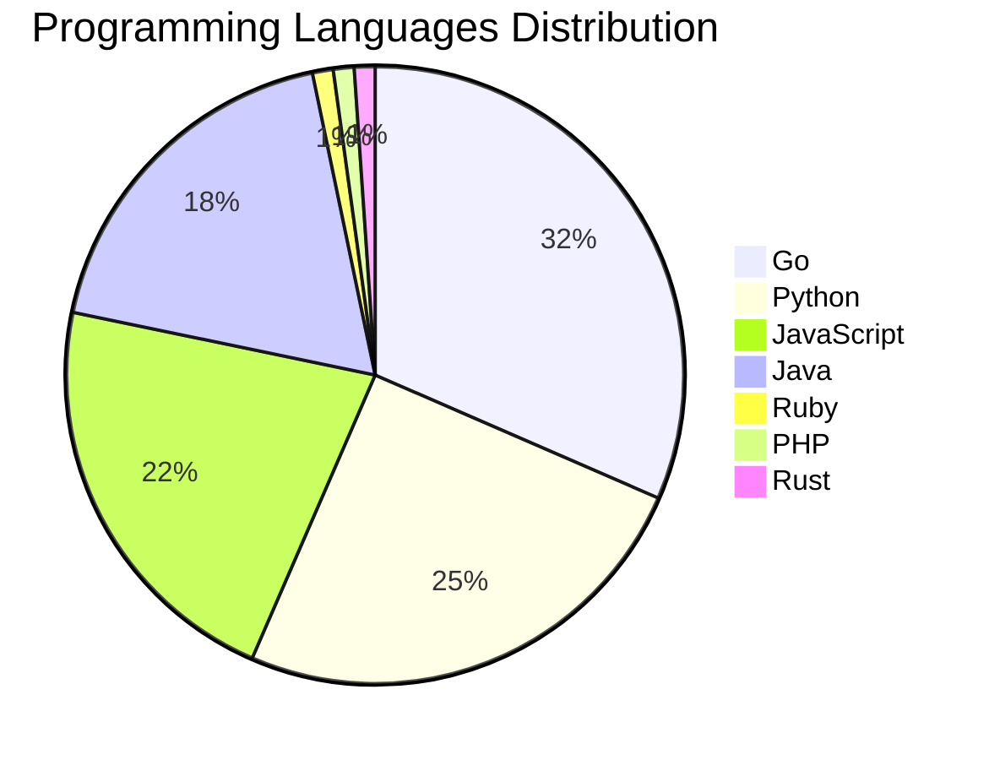

# 🚀 DevTech Auto News - Enhanced Edition


**DevTech Auto News Enhanced** is an advanced automated bot that aggregates trending topics in **AI**, **Web Development**, **Mobile**, **Cloud**, **DevOps**, and more from multiple sources including:

- 📰 [Dev.to](https://dev.to) - Developer community articles
- 🔥 [HackerNews](https://news.ycombinator.com) - Tech news discussions  
- 💻 [GitHub Trending](https://github.com/trending) - Trending repositories
- 🎯 Curated Interview Questions from multiple languages

## ✨ Features

✅ **Multi-Source Aggregation**: Combines articles from Dev.to, HackerNews, and GitHub  
✅ **Smart Categorization**: Automatically categorizes content into 10+ topics  
✅ **Image Support**: Displays cover images for visual appeal  
✅ **Pagination**: Fetches 50+ articles per update with deduplication  
✅ **Language Statistics**: Tracks programming language trends with charts  
✅ **Interview Questions**: Daily coding interview questions in multiple languages  
✅ **GitHub Actions**: Runs every 15 minutes automatically  

---

## 📊 Statistics Dashboard

### 📊 Articles by Category

**AI**: 🟦🟦🟦🟦🟦🟦🟦🟦🟦🟦🟦🟦🟦🟦🟦🟦🟦🟦🟦🟦 54 (51.4%)

**Python**: 🟦🟦🟦🟦🟦🟦🟦🟦🟦 23 (21.9%)

**Tools**: 🟦🟦🟦🟦🟦🟦🟦🟦 21 (20.0%)

**JavaScript**: 🟦🟦🟦🟦🟦🟦🟦 20 (19.0%)

**Cloud**: 🟦🟦🟦🟦🟦 14 (13.3%)

**Security**: 🟦🟦🟦 9 (8.6%)

**DevOps**: 🟦 3 (2.9%)

**WebDev**:  1 (1.0%)

**Database**:  1 (1.0%)


### 📡 Sources

- **Dev.to**: 60 articles
- **HackerNews**: 30 articles
- **GitHub**: 15 articles


### 💻 Programming Language Trends

```
Go              ██████████████████████████████ 31.5 (31.5%)
Python          ████████████████████████ 25.0 (25.0%)
JavaScript      █████████████████████ 21.7 (21.7%)
Java            ██████████████████ 18.5 (18.5%)
Ruby            █ 1.1 (1.1%)
PHP             █ 1.1 (1.1%)
Rust            █ 1.1 (1.1%)

```




### 🏷️ Trending Tags

               


---

## 🛠️ How It Works

1. **Multi-Source Fetch**: Pulls from Dev.to (2 pages), HackerNews (3 topics), GitHub (3 languages)
2. **Smart Filter**: Uses keyword matching across 10+ categories  
3. **Deduplication**: Removes duplicate URLs  
4. **Image Extraction**: Captures cover images when available  
5. **Statistics**: Generates language trends and category breakdowns  
6. **Update Files**: Regenerates README and appends to comprehensive log  

---

## 📦 Installation & Usage

```bash
# Clone the repository
git clone https://github.com/Derrick-MUGISHA/github-activity-bot.git
cd github-activity-bot

# Install dependencies  
npm install

# Run manually
npm start

# Test mode
npm run test
```

---


# 🚀 DevTech Auto News - Enhanced Edition

## 📅 Latest Updates (2026-04-14 21:00 CAT)


### 🖼️ Featured Articles

<table>
<tr>
  <td align="center" width="33%">
    <a href="https://dev.to/devteam/top-7-featured-dev-posts-of-the-week-5e38">
      
      <br/>
      <b>Top 7 Featured DEV Posts of the Week</b>
    </a>
    <br/>
    <sub>Dev.to</sub>
  </td>
  <td align="center" width="33%">
    <a href="https://dev.to/googleai/build-a-talking-robot-with-gemini-live-and-reachy-mini-20e2">
      
      <br/>
      <b>Build a Talking Robot with Gemini Live and Reachy ...</b>
    </a>
    <br/>
    <sub>Dev.to</sub>
  </td>
  <td align="center" width="33%">
    <a href="https://dev.to/ceohitchcock/from-software-engineer-to-developer-advocate-the-silent-transition-ive-been-making-for-years-4jc6">
      
      <br/>
      <b>From Software Engineer to Developer Advocate: The ...</b>
    </a>
    <br/>
    <sub>Dev.to</sub>
  </td>
</tr>
<tr>
  <td align="center" width="33%">
    <a href="https://dev.to/penfieldlabs/what-karpathys-llm-wiki-is-missing-and-how-to-fix-it-1988">
      
      <br/>
      <b>What Karpathy's LLM Wiki Is Missing (And How to Fi...</b>
    </a>
    <br/>
    <sub>Dev.to</sub>
  </td>
  <td align="center" width="33%">
    <a href="https://dev.to/deep_bartaria/building-a-privacy-first-voice-controlled-ai-agent-with-local-llms--15j0">
      🤖" />
      <br/>
      <b>Building a Privacy-First Voice-Controlled AI Agent...</b>
    </a>
    <br/>
    <sub>Dev.to</sub>
  </td>
  <td align="center" width="33%">
    <a href="https://dev.to/gde/multi-agent-a2a-with-the-agent-development-kitadk-cloud-run-agent-skills-and-gemini-cli-4n1h">
      
      <br/>
      <b>Multi-Agent A2A with the Agent Development Kit(ADK...</b>
    </a>
    <br/>
    <sub>Dev.to</sub>
  </td>
</tr>
</table>


### 📰 Top Headlines

- [Top 7 Featured DEV Posts of the Week](https://dev.to/devteam/top-7-featured-dev-posts-of-the-week-5e38) _[Dev.to]_
- [Build a Talking Robot with Gemini Live and Reachy Mini](https://dev.to/googleai/build-a-talking-robot-with-gemini-live-and-reachy-mini-20e2) _[Dev.to]_
- [From Software Engineer to Developer Advocate: The Silent Transition I've Been Making for Years Without Knowing It](https://dev.to/ceohitchcock/from-software-engineer-to-developer-advocate-the-silent-transition-ive-been-making-for-years-4jc6) _[Dev.to]_
- [What Karpathy's LLM Wiki Is Missing (And How to Fix It)](https://dev.to/penfieldlabs/what-karpathys-llm-wiki-is-missing-and-how-to-fix-it-1988) _[Dev.to]_
- [Building a Privacy-First Voice-Controlled AI Agent with Local LLMs 🎙️->🤖](https://dev.to/deep_bartaria/building-a-privacy-first-voice-controlled-ai-agent-with-local-llms--15j0) _[Dev.to]_
- [Multi-Agent A2A with the Agent Development Kit(ADK), Cloud Run, Agent Skills, and Gemini CLI](https://dev.to/gde/multi-agent-a2a-with-the-agent-development-kitadk-cloud-run-agent-skills-and-gemini-cli-4n1h) _[Dev.to]_
- [How do AI video generation models work?](https://dev.to/googleai/how-do-ai-video-generation-models-work-a82) _[Dev.to]_
- [Schrödinger's Backup: If You Haven't Tested a Restore, You Don't Have a Backup](https://dev.to/hugovalters/schrodingers-backup-if-you-havent-tested-a-restore-you-dont-have-a-backup-1d53) _[Dev.to]_
- [🚀 I’m Building “SafeMap” – A Tinder-Style Travel App That Prioritizes Safety (Brutal Feedback Needed)](https://dev.to/nish2005karsh/im-building-safemap-a-tinder-style-travel-app-that-prioritizes-safety-brutal-feedback-4cdf) _[Dev.to]_
- [The Final 1% of Every GitHub Project: Sealing It Properly](https://dev.to/georgekobaidze/the-final-1-of-every-github-project-sealing-it-properly-2app) _[Dev.to]_
- [Building a Multimodal Cross Cloud Live Agent with ADK, Azure Fabric, and Gemini CLI](https://dev.to/gde/building-a-multimodal-cross-cloud-live-agent-with-adk-azure-fabric-and-gemini-cli-3k4a) _[Dev.to]_
- [Multi-Agent A2A with the Agent Development Kit(ADK), Amazon EKS, and Gemini CLI](https://dev.to/gde/multi-agent-a2a-with-the-agent-development-kitadk-amazon-eks-and-gemini-cli-5b6h) _[Dev.to]_
- [Claude Mythos Is the First AI to Complete a Full Corporate Cyberattack End-to-End](https://dev.to/monkfromearth/claude-mythos-is-the-first-ai-to-complete-a-full-corporate-cyberattack-end-to-end-3mk5) _[Dev.to]_
- [Adding Persistent Memory to Claude Code with claude-mem — Plus a DIY Lightweight Alternative](https://dev.to/kanta13jp1/adding-persistent-memory-to-claude-code-with-claude-mem-plus-a-diy-lightweight-alternative-4gha) _[Dev.to]_
- [You’re a Real Software Developer Only If…](https://dev.to/sylwia-lask/youre-a-real-software-developer-only-if-2mo8) _[Dev.to]_
- [I Built a Platformer That Gaslights You — Coins Steal, Spikes Heal, and The Exit Door Kills You 🫖](https://dev.to/anik2812/i-built-a-platformer-that-gaslights-you-coins-steal-spikes-heal-and-the-exit-door-kills-you-2a5h) _[Dev.to]_
- [Cross Cloud Multi Agent Comic Builder with ADK, Amazon EKS, and Gemini CLI](https://dev.to/gde/cross-cloud-multi-agent-comic-builder-with-adk-amazon-eks-and-gemini-cli-4o10) _[Dev.to]_
- [Cross Cloud Multi Agent Comic Builder with ADK, Amazon ECS Express, and Gemini CLI](https://dev.to/gde/cross-cloud-multi-agent-comic-builder-with-adk-amazon-ecs-express-and-gemini-cli-41me) _[Dev.to]_
- [A Go + React monorepo starter with auth and multi-tenancy](https://dev.to/calebeaires/a-go-react-monorepo-starter-with-auth-and-multi-tenancy-57f7) _[Dev.to]_
- [Building a Multimodal Cross Cloud Live Agent with ADK, Azure AKS, and Gemini CLI](https://dev.to/gde/building-a-multimodal-cross-cloud-live-agent-with-adk-azure-aks-and-gemini-cli-5g9j) _[Dev.to]_

_Last automated update: Tue, 14 Apr 2026 21:40:47 CAT_


## 💡 Daily Interview Questions

_Sharpen your skills with these curated questions_

### 1. React: Explain the difference between state and props

**Difficulty**: Easy | **Topics**: data flow, components

<details>
<summary>💡 Hint</summary>

Ownership, mutability, data flow direction

</details>

### 2. JavaScript: Implement a debounce function from scratch

**Difficulty**: Hard | **Topics**: functions, timing

<details>
<summary>💡 Hint</summary>

setTimeout, clearTimeout, wrapper function

</details>

### 3. NodeJS: What is the difference between process.nextTick() and setImmediate()?

**Difficulty**: Medium | **Topics**: event loop, async

<details>
<summary>💡 Hint</summary>

Execution timing, event loop phases

</details>


---

## 📚 Resources

- [Full News Archive](./data/news_log.md) - Complete history of all fetched articles
- [Statistics JSON](./data/stats.json) - Raw statistics data
- [Categorized Data](./data/categorized.json) - Articles organized by category
- [Interview Questions](./data/interview_questions.json) - Complete question bank

---

## 🤝 Contributing

Want to add more sources, categories, or interview questions? Feel free to:

1. Fork this repository
2. Add your improvements
3. Submit a pull request

---

## 📄 License

MIT License - Feel free to use and modify!

---

<p align="center">
  <b>Last automated update: Tue, 14 Apr 2026 19:40:47 GMT</b><br/>
  <sub>Powered by GitHub Actions | Made with ❤️ for developers</sub>
</p>

---

## 🔗 Quick Links

- [View Workflow](https://github.com/Derrick-MUGISHA/github-activity-bot/actions)
- [Report Issue](https://github.com/Derrick-MUGISHA/github-activity-bot/issues)
- [Suggest Feature](https://github.com/Derrick-MUGISHA/github-activity-bot/issues/new)
