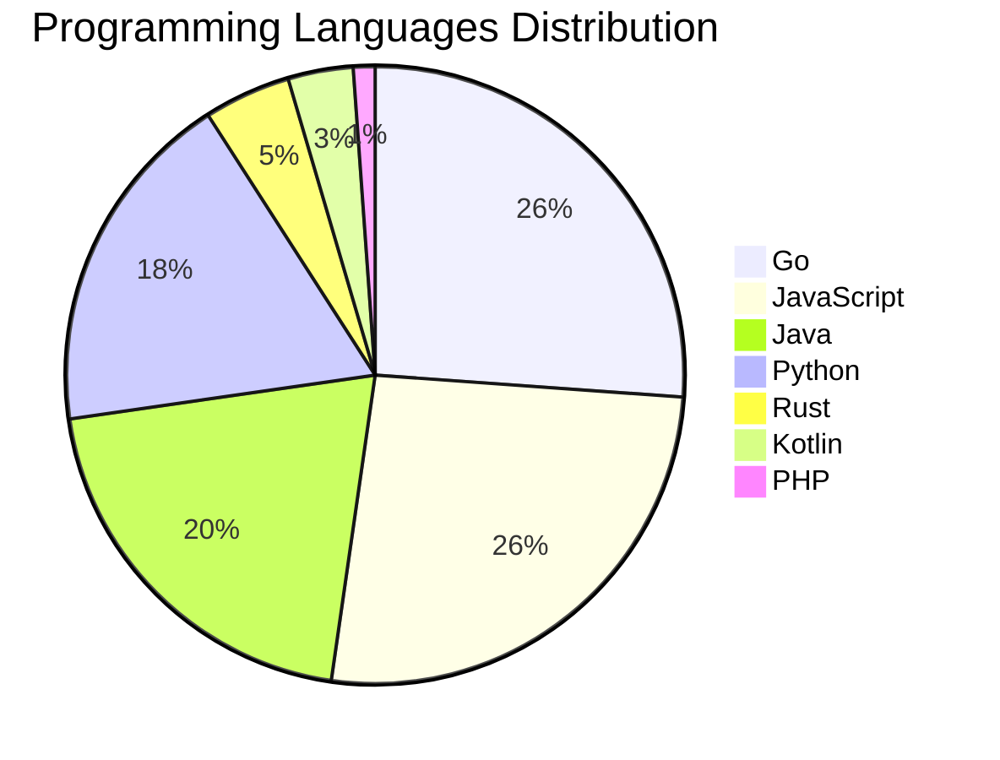

# 🚀 DevTech Auto News - Enhanced Edition


**DevTech Auto News Enhanced** is an advanced automated bot that aggregates trending topics in **AI**, **Web Development**, **Mobile**, **Cloud**, **DevOps**, and more from multiple sources including:

- 📰 [Dev.to](https://dev.to) - Developer community articles
- 🔥 [HackerNews](https://news.ycombinator.com) - Tech news discussions  
- 💻 [GitHub Trending](https://github.com/trending) - Trending repositories
- 🎯 Curated Interview Questions from multiple languages

## ✨ Features

✅ **Multi-Source Aggregation**: Combines articles from Dev.to, HackerNews, and GitHub  
✅ **Smart Categorization**: Automatically categorizes content into 10+ topics  
✅ **Image Support**: Displays cover images for visual appeal  
✅ **Pagination**: Fetches 50+ articles per update with deduplication  
✅ **Language Statistics**: Tracks programming language trends with charts  
✅ **Interview Questions**: Daily coding interview questions in multiple languages  
✅ **GitHub Actions**: Runs every 15 minutes automatically  

---

## 📊 Statistics Dashboard

### 📊 Articles by Category

**AI**: 🟦🟦🟦🟦🟦🟦🟦🟦🟦🟦🟦🟦🟦🟦🟦🟦🟦🟦🟦🟦 49 (46.7%)

**Tools**: 🟦🟦🟦🟦🟦🟦🟦🟦🟦🟦🟦 27 (25.7%)

**JavaScript**: 🟦🟦🟦🟦🟦🟦🟦🟦🟦 23 (21.9%)

**Python**: 🟦🟦🟦🟦🟦🟦🟦 16 (15.2%)

**Cloud**: 🟦🟦🟦🟦🟦🟦🟦 16 (15.2%)

**DevOps**: 🟦🟦 6 (5.7%)

**WebDev**: 🟦🟦 4 (3.8%)

**Mobile**: 🟦 3 (2.9%)

**Security**: 🟦 2 (1.9%)

**Database**:  1 (1.0%)


### 📡 Sources

- **Dev.to**: 60 articles
- **HackerNews**: 30 articles
- **GitHub**: 15 articles


### 💻 Programming Language Trends

```
Go              ██████████████████████████████ 26.1 (26.1%)
JavaScript      ██████████████████████████████ 26.1 (26.1%)
Java            ████████████████████████ 20.5 (20.5%)
Python          █████████████████████ 18.2 (18.2%)
Rust            █████ 4.5 (4.5%)
Kotlin          ████ 3.4 (3.4%)
PHP             █ 1.1 (1.1%)

```




### 🏷️ Trending Tags

               


---

## 🛠️ How It Works

1. **Multi-Source Fetch**: Pulls from Dev.to (2 pages), HackerNews (3 topics), GitHub (3 languages)
2. **Smart Filter**: Uses keyword matching across 10+ categories  
3. **Deduplication**: Removes duplicate URLs  
4. **Image Extraction**: Captures cover images when available  
5. **Statistics**: Generates language trends and category breakdowns  
6. **Update Files**: Regenerates README and appends to comprehensive log  

---

## 📦 Installation & Usage

```bash
# Clone the repository
git clone https://github.com/Derrick-MUGISHA/github-activity-bot.git
cd github-activity-bot

# Install dependencies  
npm install

# Run manually
npm start

# Test mode
npm run test
```

---


# 🚀 DevTech Auto News - Enhanced Edition

## 📅 Latest Updates (2026-06-02 20:00 CAT)


### 🖼️ Featured Articles

<table>
<tr>
  <td align="center" width="33%">
    <a href="https://dev.to/devteam/top-7-featured-dev-posts-of-the-week-62k">
      
      <br/>
      <b>Top 7 Featured DEV Posts of the Week</b>
    </a>
    <br/>
    <sub>Dev.to</sub>
  </td>
  <td align="center" width="33%">
    <a href="https://dev.to/backboardio/send-your-first-ai-message-in-one-api-call-4179">
      
      <br/>
      <b>Send your first AI message in one API call</b>
    </a>
    <br/>
    <sub>Dev.to</sub>
  </td>
  <td align="center" width="33%">
    <a href="https://dev.to/temporalio/how-we-turned-the-replay-keynote-surprise-into-an-open-source-embedded-playground-49hm">
      
      <br/>
      <b>How we turned the Replay keynote surprise into an ...</b>
    </a>
    <br/>
    <sub>Dev.to</sub>
  </td>
</tr>
<tr>
  <td align="center" width="33%">
    <a href="https://dev.to/ingosteinke/learning-lessons-from-gaming-1jgm">
      
      <br/>
      <b>Learning Lessons from Gaming</b>
    </a>
    <br/>
    <sub>Dev.to</sub>
  </td>
  <td align="center" width="33%">
    <a href="https://dev.to/maximsaplin/debloating-the-ai-grown-codebase-2om">
      
      <br/>
      <b>Debloating The AI-Grown Codebase</b>
    </a>
    <br/>
    <sub>Dev.to</sub>
  </td>
  <td align="center" width="33%">
    <a href="https://dev.to/ben/meme-monday-25la">
      
      <br/>
      <b>Meme Monday</b>
    </a>
    <br/>
    <sub>Dev.to</sub>
  </td>
</tr>
</table>


### 📰 Top Headlines

- [Top 7 Featured DEV Posts of the Week](https://dev.to/devteam/top-7-featured-dev-posts-of-the-week-62k) _[Dev.to]_
- [Send your first AI message in one API call](https://dev.to/backboardio/send-your-first-ai-message-in-one-api-call-4179) _[Dev.to]_
- [How we turned the Replay keynote surprise into an open-source embedded playground](https://dev.to/temporalio/how-we-turned-the-replay-keynote-surprise-into-an-open-source-embedded-playground-49hm) _[Dev.to]_
- [Learning Lessons from Gaming](https://dev.to/ingosteinke/learning-lessons-from-gaming-1jgm) _[Dev.to]_
- [Debloating The AI-Grown Codebase](https://dev.to/maximsaplin/debloating-the-ai-grown-codebase-2om) _[Dev.to]_
- [Meme Monday](https://dev.to/ben/meme-monday-25la) _[Dev.to]_
- [Strategies for running AI workloads on GKE without committed quota](https://dev.to/googlecloud/strategies-for-running-ai-workloads-on-gke-without-committed-quota-484l) _[Dev.to]_
- [How Are Developers Actually Using AI At Work?](https://dev.to/sylwia-lask/how-are-developers-actually-using-ai-at-work-4g9c) _[Dev.to]_
- [🦄 Modernizing Wild Rydes with modern technologies](https://dev.to/cferreirasuazo/modernizing-wild-rydes-with-modern-technologies-5g2p) _[Dev.to]_
- [The Software Developer's Guide to AEO](https://dev.to/karllhughes/the-software-developers-guide-to-aeo-1h5h) _[Dev.to]_
- [Broken Software](https://dev.to/alex27/broken-software-b54) _[Dev.to]_
- [Azure Cloud Shell with Antigravity CLI](https://dev.to/gde/azure-cloud-shell-with-antigravity-cli-mn6) _[Dev.to]_
- [An LLM API call, in 4 GIFs](https://dev.to/jasmin/an-llm-api-call-in-4-gifs-33b1) _[Dev.to]_
- [I Made My AI Models Argue, Then Let Hermes Be the Judge](https://dev.to/arqamwd/i-made-my-ai-models-argue-then-let-hermes-be-the-judge-5e6c) _[Dev.to]_
- [The Ultimate Cloud Run Guide 2026](https://dev.to/googleai/the-ultimate-cloud-run-guide-2026-54f8) _[Dev.to]_
- [Morning Security Report with Antigravity Agent](https://dev.to/gdg/morning-security-report-with-antigravity-agent-3592) _[Dev.to]_
- [Top 7 Featured DEV Posts of the Week](https://dev.to/devteam/top-7-featured-dev-posts-of-the-week-45na) _[Dev.to]_
- [What was your win this week?](https://dev.to/devteam/what-was-your-win-this-week-i1) _[Dev.to]_
- [Mix and Match: Running Kiro on Google Cloud Shell](https://dev.to/gde/mix-and-match-running-kiro-on-google-cloud-shell-5hco) _[Dev.to]_
- [GCP: Upgrading a LINE Bot with Vertex AI ADK Tools for Smart Business Cards and Backup Search](https://dev.to/gde/gcp-upgrading-a-line-bot-with-vertex-ai-adk-tools-for-smart-business-cards-and-backup-search-3dpe) _[Dev.to]_

_Last automated update: Tue, 02 Jun 2026 20:53:58 CAT_


## 💡 Daily Interview Questions

_Sharpen your skills with these curated questions_

### 1. Python: Explain decorators in Python with an example

**Difficulty**: Medium | **Topics**: functions, metaprogramming

<details>
<summary>💡 Hint</summary>

Function wrappers, @syntax, practical uses

</details>

### 2. Database: What is the difference between SQL and NoSQL databases?

**Difficulty**: Easy | **Topics**: databases, design

<details>
<summary>💡 Hint</summary>

Schema, scalability, ACID vs BASE

</details>

### 3. Java: What is the difference between abstract class and interface?

**Difficulty**: Easy | **Topics**: OOP, design

<details>
<summary>💡 Hint</summary>

Multiple inheritance, method implementation, use cases

</details>


---

## 📚 Resources

- [Full News Archive](./data/news_log.md) - Complete history of all fetched articles
- [Statistics JSON](./data/stats.json) - Raw statistics data
- [Categorized Data](./data/categorized.json) - Articles organized by category
- [Interview Questions](./data/interview_questions.json) - Complete question bank

---

## 🤝 Contributing

Want to add more sources, categories, or interview questions? Feel free to:

1. Fork this repository
2. Add your improvements
3. Submit a pull request

---

## 📄 License

MIT License - Feel free to use and modify!

---

<p align="center">
  <b>Last automated update: Tue, 02 Jun 2026 18:53:58 GMT</b><br/>
  <sub>Powered by GitHub Actions | Made with ❤️ for developers</sub>
</p>

---

## 🔗 Quick Links

- [View Workflow](https://github.com/Derrick-MUGISHA/github-activity-bot/actions)
- [Report Issue](https://github.com/Derrick-MUGISHA/github-activity-bot/issues)
- [Suggest Feature](https://github.com/Derrick-MUGISHA/github-activity-bot/issues/new)
