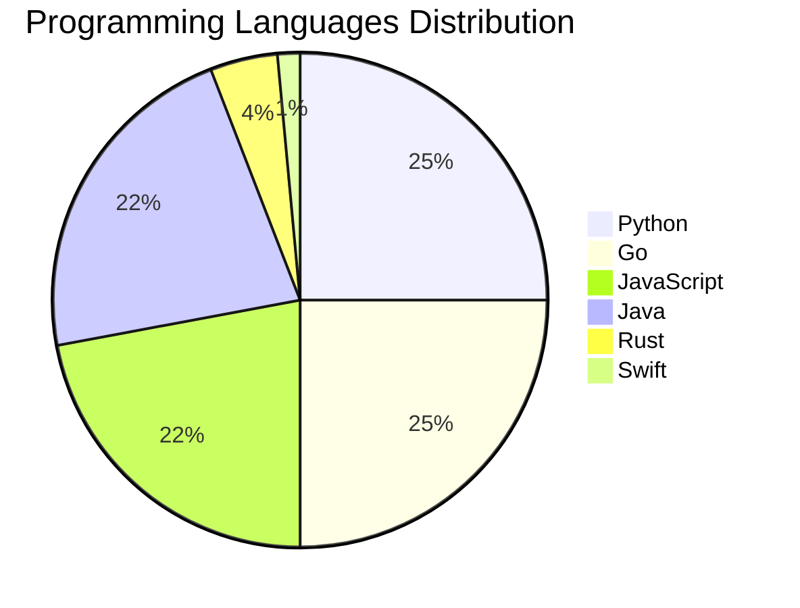

# 🚀 DevTech Auto News - Enhanced Edition


**DevTech Auto News Enhanced** is an advanced automated bot that aggregates trending topics in **AI**, **Web Development**, **Mobile**, **Cloud**, **DevOps**, and more from multiple sources including:

- 📰 [Dev.to](https://dev.to) - Developer community articles
- 🔥 [HackerNews](https://news.ycombinator.com) - Tech news discussions  
- 💻 [GitHub Trending](https://github.com/trending) - Trending repositories
- 🎯 Curated Interview Questions from multiple languages

## ✨ Features

✅ **Multi-Source Aggregation**: Combines articles from Dev.to, HackerNews, and GitHub  
✅ **Smart Categorization**: Automatically categorizes content into 10+ topics  
✅ **Image Support**: Displays cover images for visual appeal  
✅ **Pagination**: Fetches 50+ articles per update with deduplication  
✅ **Language Statistics**: Tracks programming language trends with charts  
✅ **Interview Questions**: Daily coding interview questions in multiple languages  
✅ **GitHub Actions**: Runs every 15 minutes automatically  

---

## 📊 Statistics Dashboard

### 📊 Articles by Category

**AI**: 🟦🟦🟦🟦🟦🟦🟦🟦🟦🟦🟦🟦🟦🟦🟦🟦🟦🟦🟦🟦 62 (59.6%)

**Tools**: 🟦🟦🟦🟦🟦🟦🟦🟦 24 (23.1%)

**Python**: 🟦🟦🟦🟦🟦 17 (16.3%)

**JavaScript**: 🟦🟦🟦🟦🟦 15 (14.4%)

**Cloud**: 🟦🟦🟦 8 (7.7%)

**DevOps**: 🟦🟦 5 (4.8%)

**Database**: 🟦 3 (2.9%)

**Security**: 🟦 2 (1.9%)

**WebDev**:  1 (1.0%)

**Mobile**:  1 (1.0%)


### 📡 Sources

- **Dev.to**: 59 articles
- **HackerNews**: 30 articles
- **GitHub**: 15 articles


### 💻 Programming Language Trends

```
Python          ██████████████████████████████ 25.0 (25.0%)
Go              ██████████████████████████████ 25.0 (25.0%)
JavaScript      ███████████████████████████ 22.1 (22.1%)
Java            ███████████████████████████ 22.1 (22.1%)
Rust            █████ 4.4 (4.4%)
Swift           ██ 1.5 (1.5%)

```




### 🏷️ Trending Tags

               


---

## 🛠️ How It Works

1. **Multi-Source Fetch**: Pulls from Dev.to (2 pages), HackerNews (3 topics), GitHub (3 languages)
2. **Smart Filter**: Uses keyword matching across 10+ categories  
3. **Deduplication**: Removes duplicate URLs  
4. **Image Extraction**: Captures cover images when available  
5. **Statistics**: Generates language trends and category breakdowns  
6. **Update Files**: Regenerates README and appends to comprehensive log  

---

## 📦 Installation & Usage

```bash
# Clone the repository
git clone https://github.com/Derrick-MUGISHA/github-activity-bot.git
cd github-activity-bot

# Install dependencies  
npm install

# Run manually
npm start

# Test mode
npm run test
```

---


# 🚀 DevTech Auto News - Enhanced Edition

## 📅 Latest Updates (2026-07-04 19:00 CAT)


### 🖼️ Featured Articles

<table>
<tr>
  <td align="center" width="33%">
    <a href="https://dev.to/dailycontext/letting-the-dev-community-weigh-in-on-the-topics-of-aie-439l">
      
      <br/>
      <b>Letting the DEV Community Weigh in on the Topics o...</b>
    </a>
    <br/>
    <sub>Dev.to</sub>
  </td>
  <td align="center" width="33%">
    <a href="https://dev.to/dailycontext/gemma-the-epstein-files-and-sandboxing-cause-a-stir-at-the-worlds-fair-2a7p">
      
      <br/>
      <b>Gemma and sandboxing cause a stir at the World's F...</b>
    </a>
    <br/>
    <sub>Dev.to</sub>
  </td>
  <td align="center" width="33%">
    <a href="https://dev.to/devteam/congrats-to-the-github-finish-up-a-thon-challenge-winners-1k0h">
      
      <br/>
      <b>Congrats to the GitHub Finish-Up-A-Thon Challenge ...</b>
    </a>
    <br/>
    <sub>Dev.to</sub>
  </td>
</tr>
<tr>
  <td align="center" width="33%">
    <a href="https://dev.to/dailycontext/the-conspiracy-big-software-engineering-doesnt-want-you-to-know-5299">
      
      <br/>
      <b>The Conspiracy Big Software Engineering Doesn't Wa...</b>
    </a>
    <br/>
    <sub>Dev.to</sub>
  </td>
  <td align="center" width="33%">
    <a href="https://dev.to/dailycontext/you-dont-always-need-the-frontier-1k8o">
      
      <br/>
      <b>You Don’t Always Need The Frontier</b>
    </a>
    <br/>
    <sub>Dev.to</sub>
  </td>
  <td align="center" width="33%">
    <a href="https://dev.to/dailycontext/choosing-the-right-tooling-layer-for-your-agent-1eg2">
      
      <br/>
      <b>Choosing the Right Tooling Layer for Your Agent</b>
    </a>
    <br/>
    <sub>Dev.to</sub>
  </td>
</tr>
</table>


### 📰 Top Headlines

- [Letting the DEV Community Weigh in on the Topics of AIE](https://dev.to/dailycontext/letting-the-dev-community-weigh-in-on-the-topics-of-aie-439l) _[Dev.to]_
- [Gemma and sandboxing cause a stir at the World's Fair](https://dev.to/dailycontext/gemma-the-epstein-files-and-sandboxing-cause-a-stir-at-the-worlds-fair-2a7p) _[Dev.to]_
- [Congrats to the GitHub Finish-Up-A-Thon Challenge Winners!](https://dev.to/devteam/congrats-to-the-github-finish-up-a-thon-challenge-winners-1k0h) _[Dev.to]_
- [The Conspiracy Big Software Engineering Doesn't Want You to Know](https://dev.to/dailycontext/the-conspiracy-big-software-engineering-doesnt-want-you-to-know-5299) _[Dev.to]_
- [You Don’t Always Need The Frontier](https://dev.to/dailycontext/you-dont-always-need-the-frontier-1k8o) _[Dev.to]_
- [Choosing the Right Tooling Layer for Your Agent](https://dev.to/dailycontext/choosing-the-right-tooling-layer-for-your-agent-1eg2) _[Dev.to]_
- [A Third Brain for your Second Brain](https://dev.to/dailycontext/a-third-brain-for-your-second-brain-38b4) _[Dev.to]_
- [Warp CEO Zach Lloyd on why software factories are the next phase of coding](https://dev.to/dailycontext/warp-ceo-zach-lloyd-on-why-software-factories-are-the-next-phase-of-coding-17k6) _[Dev.to]_
- [Forward Deployed Engineers and the future of software engineering](https://dev.to/dailycontext/forward-deployed-engineers-and-the-future-of-software-engineering-jll) _[Dev.to]_
- [Debugging Deployments with Gemma 2B, TPU v6e-4, MCP, and Antigravity CLI](https://dev.to/gde/debugging-deployments-with-gemma-2b-tpu-v6e-4-mcp-and-antigravity-cli-539h) _[Dev.to]_
- [AIEWF Daily Dispatch: Loops, Software Factories & Forward Deployed Engineers](https://dev.to/dailycontext/aiewf-daily-dispatch-loops-software-factories-forward-deployed-engineers-365h) _[Dev.to]_
- [Midsommer Madness with WASM, Rust, and Azure Container Apps](https://dev.to/gde/midsommer-madness-with-wasm-rust-and-azure-container-apps-113b) _[Dev.to]_
- [Without Structure](https://dev.to/dailycontext/without-structure-22d1) _[Dev.to]_
- [These Founders Skipped Graduation To Be Here](https://dev.to/dailycontext/these-founders-skipped-graduation-to-be-here-1o3d) _[Dev.to]_
- [Protect Yourself, Mesh Yourself](https://dev.to/eschmechel/protect-yourself-mesh-yourself-3fkn) _[Dev.to]_
- [Top 7 Featured DEV Posts of the Week](https://dev.to/devteam/top-7-featured-dev-posts-of-the-week-18mk) _[Dev.to]_
- [Hackathon Winners Scoop $35,000 In Cash And Credits](https://dev.to/dailycontext/hackathon-winners-scoop-35000-in-cash-and-credits-2ddl) _[Dev.to]_
- [Is looping ready to roll? Experts split on the future of coding](https://dev.to/dailycontext/is-looping-ready-to-roll-experts-split-on-the-future-of-coding-2g7p) _[Dev.to]_
- [Developers Urged To Reach Out And Touch Someone](https://dev.to/dailycontext/developers-urged-to-reach-out-and-touch-someone-4943) _[Dev.to]_
- [The biggest World’s Fair yet powers down for the moment](https://dev.to/dailycontext/the-biggest-worlds-fair-yet-powers-down-for-the-moment-1jca) _[Dev.to]_

_Last automated update: Sat, 04 Jul 2026 19:58:51 CAT_


## 💡 Daily Interview Questions

_Sharpen your skills with these curated questions_

### 1. JavaScript: Implement a debounce function from scratch

**Difficulty**: Hard | **Topics**: functions, timing

<details>
<summary>💡 Hint</summary>

setTimeout, clearTimeout, wrapper function

</details>

### 2. SystemDesign: Design a URL shortening service like bit.ly

**Difficulty**: Medium | **Topics**: system design, scalability

<details>
<summary>💡 Hint</summary>

Hash function, database design, caching, analytics

</details>

### 3. Database: What is database normalization and denormalization?

**Difficulty**: Medium | **Topics**: design, optimization

<details>
<summary>💡 Hint</summary>

Normal forms, redundancy, performance trade-offs

</details>


---

## 📚 Resources

- [Full News Archive](./data/news_log.md) - Complete history of all fetched articles
- [Statistics JSON](./data/stats.json) - Raw statistics data
- [Categorized Data](./data/categorized.json) - Articles organized by category
- [Interview Questions](./data/interview_questions.json) - Complete question bank

---

## 🤝 Contributing

Want to add more sources, categories, or interview questions? Feel free to:

1. Fork this repository
2. Add your improvements
3. Submit a pull request

---

## 📄 License

MIT License - Feel free to use and modify!

---

<p align="center">
  <b>Last automated update: Sat, 04 Jul 2026 17:58:51 GMT</b><br/>
  <sub>Powered by GitHub Actions | Made with ❤️ for developers</sub>
</p>

---

## 🔗 Quick Links

- [View Workflow](https://github.com/Derrick-MUGISHA/github-activity-bot/actions)
- [Report Issue](https://github.com/Derrick-MUGISHA/github-activity-bot/issues)
- [Suggest Feature](https://github.com/Derrick-MUGISHA/github-activity-bot/issues/new)
