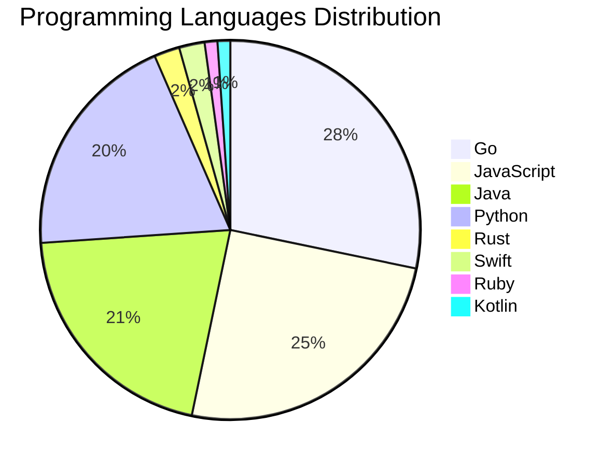

# 🚀 DevTech Auto News - Enhanced Edition


**DevTech Auto News Enhanced** is an advanced automated bot that aggregates trending topics in **AI**, **Web Development**, **Mobile**, **Cloud**, **DevOps**, and more from multiple sources including:

- 📰 [Dev.to](https://dev.to) - Developer community articles
- 🔥 [HackerNews](https://news.ycombinator.com) - Tech news discussions  
- 💻 [GitHub Trending](https://github.com/trending) - Trending repositories
- 🎯 Curated Interview Questions from multiple languages

## ✨ Features

✅ **Multi-Source Aggregation**: Combines articles from Dev.to, HackerNews, and GitHub  
✅ **Smart Categorization**: Automatically categorizes content into 10+ topics  
✅ **Image Support**: Displays cover images for visual appeal  
✅ **Pagination**: Fetches 50+ articles per update with deduplication  
✅ **Language Statistics**: Tracks programming language trends with charts  
✅ **Interview Questions**: Daily coding interview questions in multiple languages  
✅ **GitHub Actions**: Runs every 15 minutes automatically  

---

## 📊 Statistics Dashboard

### 📊 Articles by Category

**AI**: 🟦🟦🟦🟦🟦🟦🟦🟦🟦🟦🟦🟦🟦🟦🟦🟦🟦🟦🟦🟦 47 (44.8%)

**Tools**: 🟦🟦🟦🟦🟦🟦🟦🟦🟦🟦🟦 25 (23.8%)

**JavaScript**: 🟦🟦🟦🟦🟦🟦🟦🟦🟦🟦 23 (21.9%)

**Python**: 🟦🟦🟦🟦🟦🟦🟦🟦 18 (17.1%)

**Cloud**: 🟦🟦🟦🟦🟦🟦 14 (13.3%)

**Security**: 🟦🟦 5 (4.8%)

**WebDev**: 🟦🟦 4 (3.8%)

**Mobile**: 🟦 3 (2.9%)

**Database**: 🟦 2 (1.9%)

**DevOps**:  1 (1.0%)


### 📡 Sources

- **Dev.to**: 60 articles
- **HackerNews**: 30 articles
- **GitHub**: 15 articles


### 💻 Programming Language Trends

```
Go              ██████████████████████████████ 28.3 (28.3%)
JavaScript      ███████████████████████████ 25.0 (25.0%)
Java            ██████████████████████ 20.7 (20.7%)
Python          █████████████████████ 19.6 (19.6%)
Rust            ██ 2.2 (2.2%)
Swift           ██ 2.2 (2.2%)
Ruby            █ 1.1 (1.1%)
Kotlin          █ 1.1 (1.1%)

```




### 🏷️ Trending Tags

               


---

## 🛠️ How It Works

1. **Multi-Source Fetch**: Pulls from Dev.to (2 pages), HackerNews (3 topics), GitHub (3 languages)
2. **Smart Filter**: Uses keyword matching across 10+ categories  
3. **Deduplication**: Removes duplicate URLs  
4. **Image Extraction**: Captures cover images when available  
5. **Statistics**: Generates language trends and category breakdowns  
6. **Update Files**: Regenerates README and appends to comprehensive log  

---

## 📦 Installation & Usage

```bash
# Clone the repository
git clone https://github.com/Derrick-MUGISHA/github-activity-bot.git
cd github-activity-bot

# Install dependencies  
npm install

# Run manually
npm start

# Test mode
npm run test
```

---


# 🚀 DevTech Auto News - Enhanced Edition

## 📅 Latest Updates (2026-06-24 1:00 CAT)


### 🖼️ Featured Articles

<table>
<tr>
  <td align="center" width="33%">
    <a href="https://dev.to/gdg/how-my-ai-agent-hacked-its-own-permissions-and-what-it-taught-me-34bm">
      
      <br/>
      <b>How My AI Agent Hacked Its Own Permissions (And Wh...</b>
    </a>
    <br/>
    <sub>Dev.to</sub>
  </td>
  <td align="center" width="33%">
    <a href="https://dev.to/devteam/top-7-featured-dev-posts-of-the-week-55d8">
      
      <br/>
      <b>Top 7 Featured DEV Posts of the Week</b>
    </a>
    <br/>
    <sub>Dev.to</sub>
  </td>
  <td align="center" width="33%">
    <a href="https://dev.to/rapls/ai-found-300-wordpress-plugin-zero-days-in-72-hours-i-build-plugins-heres-what-changed-for-me-43na">
      
      <br/>
      <b>AI found 300 WordPress plugin zero-days in 72 hour...</b>
    </a>
    <br/>
    <sub>Dev.to</sub>
  </td>
</tr>
<tr>
  <td align="center" width="33%">
    <a href="https://dev.to/jenueldev/i-am-fired-up-again-377i">
      
      <br/>
      <b>I Am Fired Up Again</b>
    </a>
    <br/>
    <sub>Dev.to</sub>
  </td>
  <td align="center" width="33%">
    <a href="https://dev.to/gde/12b-gemma-4-deployment-with-nvidia-blackwell-6000-qat-mtp-and-antigravity-cli-3gn6">
      
      <br/>
      <b>12B Gemma 4 Deployment with NVIDIA Blackwell 6000,...</b>
    </a>
    <br/>
    <sub>Dev.to</sub>
  </td>
  <td align="center" width="33%">
    <a href="https://dev.to/karuppiah7890/debian-packages-51gj">
      
      <br/>
      <b>Debian Packages</b>
    </a>
    <br/>
    <sub>Dev.to</sub>
  </td>
</tr>
</table>


### 📰 Top Headlines

- [How My AI Agent Hacked Its Own Permissions (And What It Taught Me)](https://dev.to/gdg/how-my-ai-agent-hacked-its-own-permissions-and-what-it-taught-me-34bm) _[Dev.to]_
- [Top 7 Featured DEV Posts of the Week](https://dev.to/devteam/top-7-featured-dev-posts-of-the-week-55d8) _[Dev.to]_
- [AI found 300 WordPress plugin zero-days in 72 hours. I build plugins. Here's what changed for me.](https://dev.to/rapls/ai-found-300-wordpress-plugin-zero-days-in-72-hours-i-build-plugins-heres-what-changed-for-me-43na) _[Dev.to]_
- [I Am Fired Up Again](https://dev.to/jenueldev/i-am-fired-up-again-377i) _[Dev.to]_
- [12B Gemma 4 Deployment with NVIDIA Blackwell 6000, QAT, MTP, and Antigravity CLI](https://dev.to/gde/12b-gemma-4-deployment-with-nvidia-blackwell-6000-qat-mtp-and-antigravity-cli-3gn6) _[Dev.to]_
- [Debian Packages](https://dev.to/karuppiah7890/debian-packages-51gj) _[Dev.to]_
- [Building a Custom Status Line for Claude Code](https://dev.to/ndrone/building-a-custom-status-line-for-claude-code-5822) _[Dev.to]_
- [Serverless Gemma 12B with NVIDIA A100 on Azure Container Apps](https://dev.to/gde/serverless-gemma-12b-with-nvidia-a100-on-azure-container-apps-1ff4) _[Dev.to]_
- [What it takes to build docs worth reading](https://dev.to/devsofmidnight/what-it-takes-to-build-docs-worth-reading-2290) _[Dev.to]_
- [12B Gemma 4 Deployment with NVIDIA Blackwell 6000, MCP, Cloud Run, and Antigravity CLI](https://dev.to/gde/12b-gemma-4-deployment-with-nvidia-blackwell-6000-mcp-cloud-run-and-antigravity-cli-3ckn) _[Dev.to]_
- [Coding an Extension that Summarises Web Pages with HTML, CSS, and JS](https://dev.to/hr21don/coding-an-extension-that-summarises-web-pages-with-html-css-and-js-opm) _[Dev.to]_
- [Working on a silly project - share your favorite AI buzzwords/phrases and general key terms with me please!!](https://dev.to/jess/working-on-a-silly-project-share-your-favorite-ai-buzzwordsphrases-and-general-key-terms-with-me-664) _[Dev.to]_
- [Link or Button, that is the question.](https://dev.to/micaavigliano/link-or-button-that-is-the-question-2n13) _[Dev.to]_
- [A year of building with AI and the thing that scared me most wasn't the hallucinations](https://dev.to/smirfolio/a-year-of-building-with-ai-and-the-thing-that-scared-me-most-wasnt-the-hallucinations-3oce) _[Dev.to]_
- [MTP Speculative Decoding with the 12B Gemma 4 QAT Model on NVIDIA L4, Cloud Run, MCP, and…](https://dev.to/gde/mtp-speculative-decoding-with-the-12b-gemma-4-qat-model-on-nvidia-l4-cloud-run-mcp-and-18b0) _[Dev.to]_
- [I stopped generating color scales and started shaping them](https://dev.to/gilbarbara/i-stopped-generating-color-scales-and-started-shaping-them-5ekm) _[Dev.to]_
- [Multi-Tenancy Is the Real Agent Platform Problem](https://dev.to/luffy_14/multi-tenancy-is-the-real-agent-platform-problem-1dh2) _[Dev.to]_
- [12B Gemma 4 QAT Deployment with GCE, NVIDIA L4, MCP, and Antigravity CLI](https://dev.to/gde/12b-gemma-4-qat-deployment-with-gce-nvidia-l4-mcp-and-antigravity-cli-49d8) _[Dev.to]_
- [How to Read a webrtc-internals Dump, Section by Section](https://dev.to/tsahil/how-to-read-a-webrtc-internals-dump-section-by-section-598a) _[Dev.to]_
- [Debugging Deployments with Gemma 12B, TPU v6e-1, MCP, and Antigravity CLI](https://dev.to/gde/debugging-deployments-with-gemma-12b-tpu-v6e-1-mcp-and-antigravity-cli-83n) _[Dev.to]_

_Last automated update: Wed, 24 Jun 2026 01:05:36 CAT_


## 💡 Daily Interview Questions

_Sharpen your skills with these curated questions_

### 1. Database: What is database normalization and denormalization?

**Difficulty**: Medium | **Topics**: design, optimization

<details>
<summary>💡 Hint</summary>

Normal forms, redundancy, performance trade-offs

</details>

### 2. JavaScript: What are closures and provide a practical example?

**Difficulty**: Medium | **Topics**: functions, scope

<details>
<summary>💡 Hint</summary>

Function + lexical environment, data privacy, callbacks

</details>

### 3. SystemDesign: Design a URL shortening service like bit.ly

**Difficulty**: Medium | **Topics**: system design, scalability

<details>
<summary>💡 Hint</summary>

Hash function, database design, caching, analytics

</details>


---

## 📚 Resources

- [Full News Archive](./data/news_log.md) - Complete history of all fetched articles
- [Statistics JSON](./data/stats.json) - Raw statistics data
- [Categorized Data](./data/categorized.json) - Articles organized by category
- [Interview Questions](./data/interview_questions.json) - Complete question bank

---

## 🤝 Contributing

Want to add more sources, categories, or interview questions? Feel free to:

1. Fork this repository
2. Add your improvements
3. Submit a pull request

---

## 📄 License

MIT License - Feel free to use and modify!

---

<p align="center">
  <b>Last automated update: Tue, 23 Jun 2026 23:05:36 GMT</b><br/>
  <sub>Powered by GitHub Actions | Made with ❤️ for developers</sub>
</p>

---

## 🔗 Quick Links

- [View Workflow](https://github.com/Derrick-MUGISHA/github-activity-bot/actions)
- [Report Issue](https://github.com/Derrick-MUGISHA/github-activity-bot/issues)
- [Suggest Feature](https://github.com/Derrick-MUGISHA/github-activity-bot/issues/new)
