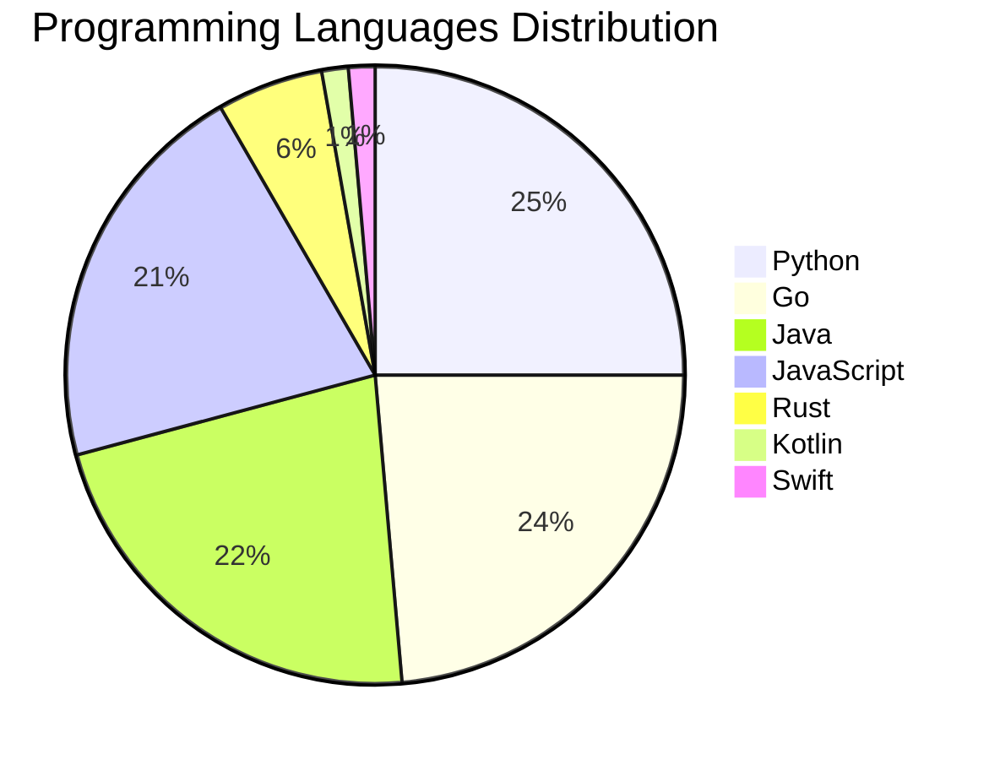

# 🚀 DevTech Auto News - Enhanced Edition


**DevTech Auto News Enhanced** is an advanced automated bot that aggregates trending topics in **AI**, **Web Development**, **Mobile**, **Cloud**, **DevOps**, and more from multiple sources including:

- 📰 [Dev.to](https://dev.to) - Developer community articles
- 🔥 [HackerNews](https://news.ycombinator.com) - Tech news discussions  
- 💻 [GitHub Trending](https://github.com/trending) - Trending repositories
- 🎯 Curated Interview Questions from multiple languages

## ✨ Features

✅ **Multi-Source Aggregation**: Combines articles from Dev.to, HackerNews, and GitHub  
✅ **Smart Categorization**: Automatically categorizes content into 10+ topics  
✅ **Image Support**: Displays cover images for visual appeal  
✅ **Pagination**: Fetches 50+ articles per update with deduplication  
✅ **Language Statistics**: Tracks programming language trends with charts  
✅ **Interview Questions**: Daily coding interview questions in multiple languages  
✅ **GitHub Actions**: Runs every 15 minutes automatically  

---

## 📊 Statistics Dashboard

### 📊 Articles by Category

**AI**: 🟦🟦🟦🟦🟦🟦🟦🟦🟦🟦🟦🟦🟦🟦🟦🟦🟦🟦🟦🟦 63 (60.0%)

**Tools**: 🟦🟦🟦🟦🟦🟦🟦 21 (20.0%)

**Python**: 🟦🟦🟦🟦🟦🟦 18 (17.1%)

**JavaScript**: 🟦🟦🟦🟦🟦 15 (14.3%)

**Cloud**: 🟦🟦🟦 9 (8.6%)

**Security**: 🟦🟦 7 (6.7%)

**DevOps**: 🟦 4 (3.8%)

**Database**: 🟦 3 (2.9%)

**Mobile**: 🟦 2 (1.9%)

**WebDev**:  1 (1.0%)


### 📡 Sources

- **Dev.to**: 60 articles
- **HackerNews**: 30 articles
- **GitHub**: 15 articles


### 💻 Programming Language Trends

```
Python          ██████████████████████████████ 25.0 (25.0%)
Go              ████████████████████████████ 23.6 (23.6%)
Java            ███████████████████████████ 22.2 (22.2%)
JavaScript      █████████████████████████ 20.8 (20.8%)
Rust            ███████ 5.6 (5.6%)
Kotlin          ██ 1.4 (1.4%)
Swift           ██ 1.4 (1.4%)

```




### 🏷️ Trending Tags

               


---

## 🛠️ How It Works

1. **Multi-Source Fetch**: Pulls from Dev.to (2 pages), HackerNews (3 topics), GitHub (3 languages)
2. **Smart Filter**: Uses keyword matching across 10+ categories  
3. **Deduplication**: Removes duplicate URLs  
4. **Image Extraction**: Captures cover images when available  
5. **Statistics**: Generates language trends and category breakdowns  
6. **Update Files**: Regenerates README and appends to comprehensive log  

---

## 📦 Installation & Usage

```bash
# Clone the repository
git clone https://github.com/Derrick-MUGISHA/github-activity-bot.git
cd github-activity-bot

# Install dependencies  
npm install

# Run manually
npm start

# Test mode
npm run test
```

---


# 🚀 DevTech Auto News - Enhanced Edition

## 📅 Latest Updates (2026-07-02 15:00 CAT)


### 🖼️ Featured Articles

<table>
<tr>
  <td align="center" width="33%">
    <a href="https://dev.to/javz/my-first-year-at-dev-recap-3na2">
      
      <br/>
      <b>My First Year at DEV Recap</b>
    </a>
    <br/>
    <sub>Dev.to</sub>
  </td>
  <td align="center" width="33%">
    <a href="https://dev.to/dailycontext/from-harness-engineering-to-evals-4212">
      
      <br/>
      <b>From Harness Engineering to Evals: What’s Trending...</b>
    </a>
    <br/>
    <sub>Dev.to</sub>
  </td>
  <td align="center" width="33%">
    <a href="https://dev.to/sylwia-lask/whats-next-for-ai-219i">
      
      <br/>
      <b>What's Next for AI?</b>
    </a>
    <br/>
    <sub>Dev.to</sub>
  </td>
</tr>
<tr>
  <td align="center" width="33%">
    <a href="https://dev.to/devteam/need-a-break-play-todays-game-from-the-daily-context-1fli">
      
      <br/>
      <b>Need a break? Play today's game from The Daily Con...</b>
    </a>
    <br/>
    <sub>Dev.to</sub>
  </td>
  <td align="center" width="33%">
    <a href="https://dev.to/konark_13/i-tried-to-escape-leetcode-for-2-years-but-here-we-are-1k99">
      
      <br/>
      <b>I Tried to Escape LeetCode for 2 Years (But Here W...</b>
    </a>
    <br/>
    <sub>Dev.to</sub>
  </td>
  <td align="center" width="33%">
    <a href="https://dev.to/dailycontext/gemma-the-epstein-files-and-sandboxing-cause-a-stir-at-the-worlds-fair-2a7p">
      
      <br/>
      <b>Gemma and sandboxing cause a stir at the World's F...</b>
    </a>
    <br/>
    <sub>Dev.to</sub>
  </td>
</tr>
</table>


### 📰 Top Headlines

- [My First Year at DEV Recap](https://dev.to/javz/my-first-year-at-dev-recap-3na2) _[Dev.to]_
- [From Harness Engineering to Evals: What’s Trending at AI Engineer](https://dev.to/dailycontext/from-harness-engineering-to-evals-4212) _[Dev.to]_
- [What's Next for AI?](https://dev.to/sylwia-lask/whats-next-for-ai-219i) _[Dev.to]_
- [Need a break? Play today's game from The Daily Context.](https://dev.to/devteam/need-a-break-play-todays-game-from-the-daily-context-1fli) _[Dev.to]_
- [I Tried to Escape LeetCode for 2 Years (But Here We Are)](https://dev.to/konark_13/i-tried-to-escape-leetcode-for-2-years-but-here-we-are-1k99) _[Dev.to]_
- [Gemma and sandboxing cause a stir at the World's Fair](https://dev.to/dailycontext/gemma-the-epstein-files-and-sandboxing-cause-a-stir-at-the-worlds-fair-2a7p) _[Dev.to]_
- [Welcome to AI Engineer World’s Fair 2026](https://dev.to/dailycontext/welcome-to-ai-engineer-worlds-fair-2026-2o09) _[Dev.to]_
- [You Don’t Always Need The Frontier](https://dev.to/dailycontext/you-dont-always-need-the-frontier-1k8o) _[Dev.to]_
- [It’s Time To Put Humans Back In The Software](https://dev.to/dailycontext/its-time-to-put-humans-back-in-the-software-factories-3cjh) _[Dev.to]_
- [Trust but verify when using AI for fixing security flaws](https://dev.to/dailycontext/trust-but-verify-when-using-ai-for-fixing-security-flaws-43n8) _[Dev.to]_
- [Bottleneck Resolution is, In Fact, All the Rage in AI Engineering](https://dev.to/dailycontext/bottleneck-resolution-is-in-fact-all-the-rage-in-ai-engineering-21cj) _[Dev.to]_
- [Top 7 Featured DEV Posts of the Week](https://dev.to/devteam/top-7-featured-dev-posts-of-the-week-18mk) _[Dev.to]_
- [Token Town](https://dev.to/dailycontext/token-town-1c45) _[Dev.to]_
- [Google Omni Flash Preview with MCP and Antigravity CLI](https://dev.to/gde/google-omni-flash-preview-with-mcp-and-antigravity-cli-24oi) _[Dev.to]_
- [Optimizing for Agents with llms.txt](https://dev.to/dailycontext/optimizing-for-agents-with-llmstxt-14l0) _[Dev.to]_
- [DevRel in the Age of AI Is A Search for Meaning](https://dev.to/dailycontext/devrel-in-the-age-of-ai-is-a-search-for-meaning-2j91) _[Dev.to]_
- [I built a native Android app in an afternoon, and I've never written a line of Kotlin](https://dev.to/googleai/i-built-a-native-android-app-in-an-afternoon-and-ive-never-written-a-line-of-kotlin-20d6) _[Dev.to]_
- [Hackathon Winners Scoop $35,000 In Cash And Credits](https://dev.to/dailycontext/hackathon-winners-scoop-35000-in-cash-and-credits-2ddl) _[Dev.to]_
- [The Future Of AI Is Local And Open](https://dev.to/dailycontext/the-future-of-ai-is-local-and-open-522c) _[Dev.to]_
- [Developers Urged To Reach Out And Touch Someone](https://dev.to/dailycontext/developers-urged-to-reach-out-and-touch-someone-4943) _[Dev.to]_

_Last automated update: Thu, 02 Jul 2026 15:27:08 CAT_


## 💡 Daily Interview Questions

_Sharpen your skills with these curated questions_

### 1. Java: What are Java Streams and how do they work?

**Difficulty**: Medium | **Topics**: functional programming, collections

<details>
<summary>💡 Hint</summary>

Lazy evaluation, pipeline, terminal operations

</details>

### 2. NodeJS: Explain middleware in Express.js

**Difficulty**: Easy | **Topics**: express, architecture

<details>
<summary>💡 Hint</summary>

Request/response cycle, next(), chain of functions

</details>

### 3. Database: Design a database schema for a social media platform

**Difficulty**: Hard | **Topics**: design, scalability

<details>
<summary>💡 Hint</summary>

Users, posts, relationships, indexes, partitioning

</details>


---

## 📚 Resources

- [Full News Archive](./data/news_log.md) - Complete history of all fetched articles
- [Statistics JSON](./data/stats.json) - Raw statistics data
- [Categorized Data](./data/categorized.json) - Articles organized by category
- [Interview Questions](./data/interview_questions.json) - Complete question bank

---

## 🤝 Contributing

Want to add more sources, categories, or interview questions? Feel free to:

1. Fork this repository
2. Add your improvements
3. Submit a pull request

---

## 📄 License

MIT License - Feel free to use and modify!

---

<p align="center">
  <b>Last automated update: Thu, 02 Jul 2026 13:27:08 GMT</b><br/>
  <sub>Powered by GitHub Actions | Made with ❤️ for developers</sub>
</p>

---

## 🔗 Quick Links

- [View Workflow](https://github.com/Derrick-MUGISHA/github-activity-bot/actions)
- [Report Issue](https://github.com/Derrick-MUGISHA/github-activity-bot/issues)
- [Suggest Feature](https://github.com/Derrick-MUGISHA/github-activity-bot/issues/new)
