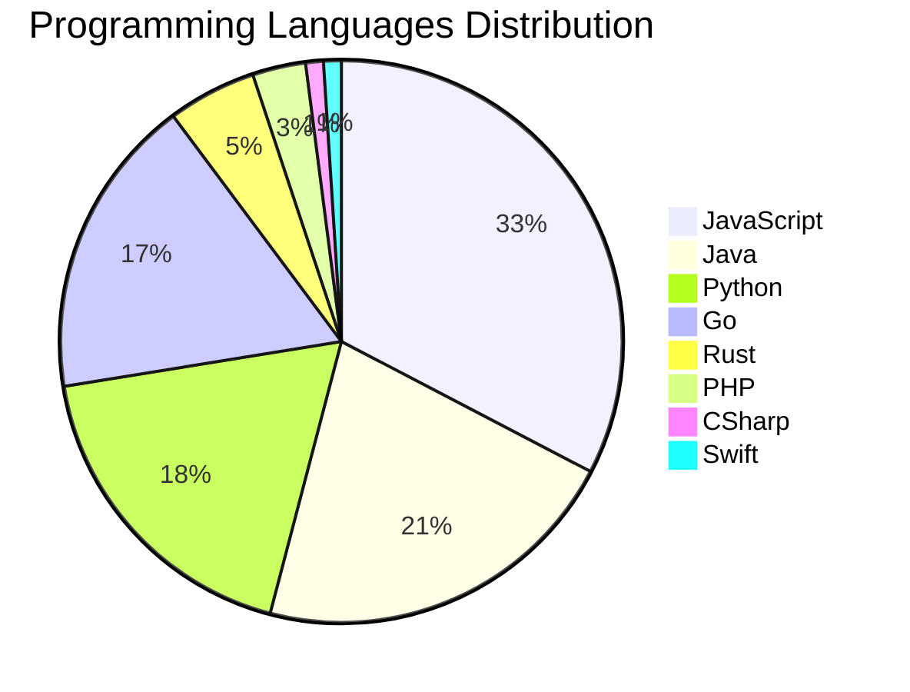

# 🚀 DevTech Auto News - Enhanced Edition


**DevTech Auto News Enhanced** is an advanced automated bot that aggregates trending topics in **AI**, **Web Development**, **Mobile**, **Cloud**, **DevOps**, and more from multiple sources including:

- 📰 [Dev.to](https://dev.to) - Developer community articles
- 🔥 [HackerNews](https://news.ycombinator.com) - Tech news discussions  
- 💻 [GitHub Trending](https://github.com/trending) - Trending repositories
- 🎯 Curated Interview Questions from multiple languages

## ✨ Features

✅ **Multi-Source Aggregation**: Combines articles from Dev.to, HackerNews, and GitHub  
✅ **Smart Categorization**: Automatically categorizes content into 10+ topics  
✅ **Image Support**: Displays cover images for visual appeal  
✅ **Pagination**: Fetches 50+ articles per update with deduplication  
✅ **Language Statistics**: Tracks programming language trends with charts  
✅ **Interview Questions**: Daily coding interview questions in multiple languages  
✅ **GitHub Actions**: Runs every 15 minutes automatically  

---

## 📊 Statistics Dashboard

### 📊 Articles by Category

**AI**: 🟦🟦🟦🟦🟦🟦🟦🟦🟦🟦🟦🟦🟦🟦🟦🟦🟦🟦🟦🟦 44 (42.3%)

**JavaScript**: 🟦🟦🟦🟦🟦🟦🟦🟦🟦🟦🟦🟦🟦🟦🟦 32 (30.8%)

**Tools**: 🟦🟦🟦🟦🟦🟦🟦🟦🟦🟦🟦🟦 27 (26.0%)

**Python**: 🟦🟦🟦🟦🟦🟦🟦🟦 18 (17.3%)

**Cloud**: 🟦🟦🟦 7 (6.7%)

**Security**: 🟦🟦🟦 7 (6.7%)

**DevOps**: 🟦🟦 4 (3.8%)

**WebDev**: 🟦🟦 4 (3.8%)

**Database**: 🟦🟦 4 (3.8%)

**Mobile**:  1 (1.0%)


### 📡 Sources

- **Dev.to**: 59 articles
- **HackerNews**: 30 articles
- **GitHub**: 15 articles


### 💻 Programming Language Trends

```
JavaScript      ██████████████████████████████ 32.7 (32.7%)
Java            ████████████████████ 21.4 (21.4%)
Python          █████████████████ 18.4 (18.4%)
Go              ████████████████ 17.3 (17.3%)
Rust            █████ 5.1 (5.1%)
PHP             ███ 3.1 (3.1%)
CSharp          █ 1.0 (1.0%)
Swift           █ 1.0 (1.0%)

```




### 🏷️ Trending Tags

               


---

## 🛠️ How It Works

1. **Multi-Source Fetch**: Pulls from Dev.to (2 pages), HackerNews (3 topics), GitHub (3 languages)
2. **Smart Filter**: Uses keyword matching across 10+ categories  
3. **Deduplication**: Removes duplicate URLs  
4. **Image Extraction**: Captures cover images when available  
5. **Statistics**: Generates language trends and category breakdowns  
6. **Update Files**: Regenerates README and appends to comprehensive log  

---

## 📦 Installation & Usage

```bash
# Clone the repository
git clone https://github.com/Derrick-MUGISHA/github-activity-bot.git
cd github-activity-bot

# Install dependencies  
npm install

# Run manually
npm start

# Test mode
npm run test
```

---


# 🚀 DevTech Auto News - Enhanced Edition

## 📅 Latest Updates (2026-02-22 7:00 CAT)


### 🖼️ Featured Articles

<table>
<tr>
  <td align="center" width="33%">
    <a href="https://dev.to/devteam/a-new-chapter-dev-is-joining-forces-with-major-league-hacking-mlh-3kfd">
      
      <br/>
      <b>A New Chapter: DEV is Joining Forces with Major Le...</b>
    </a>
    <br/>
    <sub>Dev.to</sub>
  </td>
  <td align="center" width="33%">
    <a href="https://dev.to/devteam/what-was-your-win-this-week-5a3g">
      
      <br/>
      <b>What was your win this week?</b>
    </a>
    <br/>
    <sub>Dev.to</sub>
  </td>
  <td align="center" width="33%">
    <a href="https://dev.to/googleai/teaching-a-robot-to-play-a-toddler-game-vlas-gemini-3-flash-and-first-orchard-14g4">
      
      <br/>
      <b>Teaching a Robot to Play a Toddler Game: VLAs, Gem...</b>
    </a>
    <br/>
    <sub>Dev.to</sub>
  </td>
</tr>
<tr>
  <td align="center" width="33%">
    <a href="https://dev.to/devteam/congrats-to-the-new-year-new-you-portfolio-challenge-winners-and-runner-ups-1l9h">
      
      <br/>
      <b>Congrats to the "New Year, New You" Portfolio Chal...</b>
    </a>
    <br/>
    <sub>Dev.to</sub>
  </td>
  <td align="center" width="33%">
    <a href="https://dev.to/maame-codes/suffering-from-bugs-how-i-almost-deleted-my-entire-project-1eef">
      
      <br/>
      <b>Suffering from BUGS: How I Almost Deleted My Entir...</b>
    </a>
    <br/>
    <sub>Dev.to</sub>
  </td>
  <td align="center" width="33%">
    <a href="https://dev.to/felixschober/why-azure-front-door-made-my-nextjs-app-take-90-seconds-to-load-and-how-i-fixed-it-4kof">
      
      <br/>
      <b>Why Azure Front Door Made My Next.js App Take 90 S...</b>
    </a>
    <br/>
    <sub>Dev.to</sub>
  </td>
</tr>
</table>


### 📰 Top Headlines

- [A New Chapter: DEV is Joining Forces with Major League Hacking (MLH)](https://dev.to/devteam/a-new-chapter-dev-is-joining-forces-with-major-league-hacking-mlh-3kfd) _[Dev.to]_
- [What was your win this week?](https://dev.to/devteam/what-was-your-win-this-week-5a3g) _[Dev.to]_
- [Teaching a Robot to Play a Toddler Game: VLAs, Gemini 3 Flash, and First Orchard](https://dev.to/googleai/teaching-a-robot-to-play-a-toddler-game-vlas-gemini-3-flash-and-first-orchard-14g4) _[Dev.to]_
- [Congrats to the "New Year, New You" Portfolio Challenge Winners and Runner-Ups!](https://dev.to/devteam/congrats-to-the-new-year-new-you-portfolio-challenge-winners-and-runner-ups-1l9h) _[Dev.to]_
- [Suffering from BUGS: How I Almost Deleted My Entire Project](https://dev.to/maame-codes/suffering-from-bugs-how-i-almost-deleted-my-entire-project-1eef) _[Dev.to]_
- [Why Azure Front Door Made My Next.js App Take 90 Seconds to Load (and How I Fixed It)](https://dev.to/felixschober/why-azure-front-door-made-my-nextjs-app-take-90-seconds-to-load-and-how-i-fixed-it-4kof) _[Dev.to]_
- [Getting Started with LLM Gateway in 5 Minutes](https://dev.to/smakosh/getting-started-with-llm-gateway-in-5-minutes-67p) _[Dev.to]_
- [Why did you become a Developer?](https://dev.to/francistrdev/why-did-you-become-a-developer-57ea) _[Dev.to]_
- [Build your own AI code review agent in CI](https://dev.to/lvndry/build-your-own-ai-code-review-agent-in-ci-4mai) _[Dev.to]_
- [StackOverflow - was it worth it?](https://dev.to/nikola/stackoverflow-was-it-worth-it-21ki) _[Dev.to]_
- [Optimizing Shared GitLab Pipelines: Flexibility and Maintainability](https://dev.to/rlespinasse/optimizing-shared-gitlab-pipelines-flexibility-and-maintainability-7p8) _[Dev.to]_
- [I Squeezed My $1k Monthly OpenClaw API Bill with ~$20/Month in AWS Credits — Here's the Exact Setup](https://dev.to/aws-builders/i-squeezed-my-1k-monthly-openclaw-api-bill-with-20month-in-aws-credits-heres-the-exact-setup-3gj4) _[Dev.to]_
- [What does MLH stand for?](https://dev.to/mellen/what-does-mlh-stand-for-2cbg) _[Dev.to]_
- [Your Secrets Aren’t Safe: How the .git Directory Can Leak Data via AI Tools](https://dev.to/yoheiseki/your-secrets-arent-safe-how-the-git-directory-can-leak-data-via-ai-tools-4ioo) _[Dev.to]_
- [Making Scrollable Code Blocks Accessible](https://dev.to/th3s4mur41/making-scrollable-code-blocks-accessible-3i0o) _[Dev.to]_
- [Securing Your App with Access and Refresh Tokens: A Practical Guide](https://dev.to/chukwu3meka/securing-your-app-with-access-and-refresh-tokens-a-practical-guide-28a1) _[Dev.to]_
- [If Writing still Matters, How to Do it Right and Avoid AI Suspicion?](https://dev.to/ingosteinke/if-writing-still-matters-how-to-do-it-right-and-avoid-ai-suspicion-2nac) _[Dev.to]_
- [What Do You Want to Know About Antigravity?](https://dev.to/devteam/what-do-you-want-to-know-about-antigravity-1o7a) _[Dev.to]_
- [Stacking Multiple Dialogs in React Without Hooks or Effects](https://dev.to/9thquadrant/stacking-multiple-dialogs-in-react-without-hooks-or-effects-4enj) _[Dev.to]_
- [How to Run Podman Quadlets on Raspberry Pi](https://dev.to/project42/how-to-run-podman-quadlets-on-raspberry-pi-3nc1) _[Dev.to]_

_Last automated update: Sun, 22 Feb 2026 07:30:57 CAT_


## 💡 Daily Interview Questions

_Sharpen your skills with these curated questions_

### 1. DataStructures: Find the median of two sorted arrays

**Difficulty**: Hard | **Topics**: arrays, binary search

<details>
<summary>💡 Hint</summary>

Binary search, partition, time complexity O(log(min(m,n)))

</details>

### 2. Database: What is database normalization and denormalization?

**Difficulty**: Medium | **Topics**: design, optimization

<details>
<summary>💡 Hint</summary>

Normal forms, redundancy, performance trade-offs

</details>

### 3. JavaScript: What are closures and provide a practical example?

**Difficulty**: Medium | **Topics**: functions, scope

<details>
<summary>💡 Hint</summary>

Function + lexical environment, data privacy, callbacks

</details>


---

## 📚 Resources

- [Full News Archive](./data/news_log.md) - Complete history of all fetched articles
- [Statistics JSON](./data/stats.json) - Raw statistics data
- [Categorized Data](./data/categorized.json) - Articles organized by category
- [Interview Questions](./data/interview_questions.json) - Complete question bank

---

## 🤝 Contributing

Want to add more sources, categories, or interview questions? Feel free to:

1. Fork this repository
2. Add your improvements
3. Submit a pull request

---

## 📄 License

MIT License - Feel free to use and modify!

---

<p align="center">
  <b>Last automated update: Sun, 22 Feb 2026 05:30:57 GMT</b><br/>
  <sub>Powered by GitHub Actions | Made with ❤️ for developers</sub>
</p>

---

## 🔗 Quick Links

- [View Workflow](https://github.com/Derrick-MUGISHA/github-activity-bot/actions)
- [Report Issue](https://github.com/Derrick-MUGISHA/github-activity-bot/issues)
- [Suggest Feature](https://github.com/Derrick-MUGISHA/github-activity-bot/issues/new)
