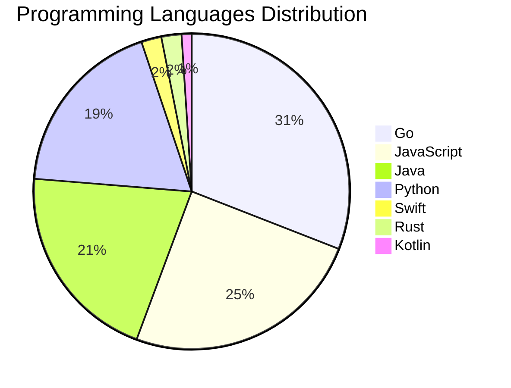

# 🚀 DevTech Auto News - Enhanced Edition


**DevTech Auto News Enhanced** is an advanced automated bot that aggregates trending topics in **AI**, **Web Development**, **Mobile**, **Cloud**, **DevOps**, and more from multiple sources including:

- 📰 [Dev.to](https://dev.to) - Developer community articles
- 🔥 [HackerNews](https://news.ycombinator.com) - Tech news discussions  
- 💻 [GitHub Trending](https://github.com/trending) - Trending repositories
- 🎯 Curated Interview Questions from multiple languages

## ✨ Features

✅ **Multi-Source Aggregation**: Combines articles from Dev.to, HackerNews, and GitHub  
✅ **Smart Categorization**: Automatically categorizes content into 10+ topics  
✅ **Image Support**: Displays cover images for visual appeal  
✅ **Pagination**: Fetches 50+ articles per update with deduplication  
✅ **Language Statistics**: Tracks programming language trends with charts  
✅ **Interview Questions**: Daily coding interview questions in multiple languages  
✅ **GitHub Actions**: Runs every 15 minutes automatically  

---

## 📊 Statistics Dashboard

### 📊 Articles by Category

**AI**: 🟦🟦🟦🟦🟦🟦🟦🟦🟦🟦🟦🟦🟦🟦🟦🟦🟦🟦🟦🟦 57 (54.3%)

**Tools**: 🟦🟦🟦🟦🟦🟦🟦🟦🟦🟦 28 (26.7%)

**JavaScript**: 🟦🟦🟦🟦🟦🟦🟦🟦 24 (22.9%)

**Python**: 🟦🟦🟦🟦🟦🟦 18 (17.1%)

**Cloud**: 🟦🟦🟦🟦🟦🟦 18 (17.1%)

**Security**: 🟦🟦 7 (6.7%)

**WebDev**: 🟦🟦 5 (4.8%)

**DevOps**: 🟦 3 (2.9%)

**Mobile**: 🟦 3 (2.9%)

**Database**: 🟦 2 (1.9%)


### 📡 Sources

- **Dev.to**: 60 articles
- **HackerNews**: 30 articles
- **GitHub**: 15 articles


### 💻 Programming Language Trends

```
Go              ██████████████████████████████ 30.9 (30.9%)
JavaScript      ████████████████████████ 24.7 (24.7%)
Java            ████████████████████ 20.6 (20.6%)
Python          ██████████████████ 18.6 (18.6%)
Swift           ██ 2.1 (2.1%)
Rust            ██ 2.1 (2.1%)
Kotlin          █ 1.0 (1.0%)

```




### 🏷️ Trending Tags

               


---

## 🛠️ How It Works

1. **Multi-Source Fetch**: Pulls from Dev.to (2 pages), HackerNews (3 topics), GitHub (3 languages)
2. **Smart Filter**: Uses keyword matching across 10+ categories  
3. **Deduplication**: Removes duplicate URLs  
4. **Image Extraction**: Captures cover images when available  
5. **Statistics**: Generates language trends and category breakdowns  
6. **Update Files**: Regenerates README and appends to comprehensive log  

---

## 📦 Installation & Usage

```bash
# Clone the repository
git clone https://github.com/Derrick-MUGISHA/github-activity-bot.git
cd github-activity-bot

# Install dependencies  
npm install

# Run manually
npm start

# Test mode
npm run test
```

---


# 🚀 DevTech Auto News - Enhanced Edition

## 📅 Latest Updates (2026-04-16 16:00 CAT)


### 🖼️ Featured Articles

<table>
<tr>
  <td align="center" width="33%">
    <a href="https://dev.to/admantium/turning-the-raspberry-pi-zero-into-a-hacking-gadget-2ekl">
      
      <br/>
      <b>Turning the Raspberry Pi Zero into a Hacking Gadge...</b>
    </a>
    <br/>
    <sub>Dev.to</sub>
  </td>
  <td align="center" width="33%">
    <a href="https://dev.to/gdg/architecture-documentation-as-a-first-class-engineering-asset-4a1j">
      
      <br/>
      <b>Architecture Documentation as a First-Class Engine...</b>
    </a>
    <br/>
    <sub>Dev.to</sub>
  </td>
  <td align="center" width="33%">
    <a href="https://dev.to/gde/multi-agent-a2a-with-the-agent-development-kitadk-amazon-fargate-and-gemini-cli-5jd">
      
      <br/>
      <b>Multi-Agent A2A with the Agent Development Kit(ADK...</b>
    </a>
    <br/>
    <sub>Dev.to</sub>
  </td>
</tr>
<tr>
  <td align="center" width="33%">
    <a href="https://dev.to/jonoherrington/ai-doesnt-fix-weak-engineering-it-just-speeds-it-up-5bak">
      
      <br/>
      <b>AI Doesn't Fix Weak Engineering. It Just Speeds It...</b>
    </a>
    <br/>
    <sub>Dev.to</sub>
  </td>
  <td align="center" width="33%">
    <a href="https://dev.to/tworrell/how-im-using-asts-and-gemini-to-solve-the-codebase-onboarding-problem-1la9">
      
      <br/>
      <b>How I'm using ASTs and Gemini to solve the "Codeba...</b>
    </a>
    <br/>
    <sub>Dev.to</sub>
  </td>
  <td align="center" width="33%">
    <a href="https://dev.to/aws/lost-in-the-ai-hype-i-started-small-2a72">
      
      <br/>
      <b>Lost in the AI Hype, I Started Small</b>
    </a>
    <br/>
    <sub>Dev.to</sub>
  </td>
</tr>
</table>


### 📰 Top Headlines

- [Turning the Raspberry Pi Zero into a Hacking Gadget](https://dev.to/admantium/turning-the-raspberry-pi-zero-into-a-hacking-gadget-2ekl) _[Dev.to]_
- [Architecture Documentation as a First-Class Engineering Asset](https://dev.to/gdg/architecture-documentation-as-a-first-class-engineering-asset-4a1j) _[Dev.to]_
- [Multi-Agent A2A with the Agent Development Kit(ADK), Amazon Fargate, and Gemini CLI](https://dev.to/gde/multi-agent-a2a-with-the-agent-development-kitadk-amazon-fargate-and-gemini-cli-5jd) _[Dev.to]_
- [AI Doesn't Fix Weak Engineering. It Just Speeds It Up.](https://dev.to/jonoherrington/ai-doesnt-fix-weak-engineering-it-just-speeds-it-up-5bak) _[Dev.to]_
- [How I'm using ASTs and Gemini to solve the "Codebase Onboarding" problem 🧠](https://dev.to/tworrell/how-im-using-asts-and-gemini-to-solve-the-codebase-onboarding-problem-1la9) _[Dev.to]_
- [Lost in the AI Hype, I Started Small](https://dev.to/aws/lost-in-the-ai-hype-i-started-small-2a72) _[Dev.to]_
- [Our SwiftUI snapshot tests passed locally but failed on CI. Here's the actual fix.](https://dev.to/d4g4/our-swiftui-snapshot-tests-passed-locally-but-failed-on-ci-heres-the-actual-fix-5fhd) _[Dev.to]_
- [Android desktop mode: features, device support, and the OLED screen burn-in problem](https://dev.to/maxmoffa/android-desktop-mode-features-device-support-and-the-oled-screen-burn-in-problem-5a40) _[Dev.to]_
- [Beyond Marker Clustering](https://dev.to/markosmilja/beyond-marker-clustering-1jmj) _[Dev.to]_
- [Top 7 Featured DEV Posts of the Week](https://dev.to/devteam/top-7-featured-dev-posts-of-the-week-5e38) _[Dev.to]_
- [Multi-Agent A2A with the Agent Development Kit(ADK), AWS Lightsail, and Gemini CLI](https://dev.to/gde/multi-agent-a2a-with-the-agent-development-kitadk-aws-lightsail-and-gemini-cli-dkg) _[Dev.to]_
- [Display and test openapi.yaml file](https://dev.to/gabrielweidmann/display-and-test-openapiyaml-file-53h9) _[Dev.to]_
- [Local AI Will Save Us All (The Math Says So, Trust Me)](https://dev.to/sebs/local-ai-will-save-us-all-the-math-says-so-trust-me-4m22) _[Dev.to]_
- [Multi-Agent A2A with the Agent Development Kit(ADK), Azure AKS, and Gemini CLI](https://dev.to/gde/multi-agent-a2a-with-the-agent-development-kitadk-azure-aks-and-gemini-cli-231o) _[Dev.to]_
- [How to prompt Gemini 3.1's new text to speech model](https://dev.to/googleai/how-to-prompt-gemini-31s-new-text-to-speech-model-24bb) _[Dev.to]_
- [Schrödinger's Backup: If You Haven't Tested a Restore, You Don't Have a Backup](https://dev.to/hugovalters/schrodingers-backup-if-you-havent-tested-a-restore-you-dont-have-a-backup-1d53) _[Dev.to]_
- [Building with the Google Cloud Run MCP Server for Multi-Agent A2A Deployment](https://dev.to/gde/building-with-the-google-cloud-run-mcp-server-for-multi-agent-a2a-deployment-fop) _[Dev.to]_
- [Claude skills vs Commands](https://dev.to/hellonehha/claude-skills-vs-commands-1dcm) _[Dev.to]_
- [Playwright in Pictures: Fully Parallel Mode](https://dev.to/vitalets/playwright-in-pictures-fully-parallel-mode-3ecj) _[Dev.to]_
- [Creating a Vertical Area Chart with JavaScript: 80+ Years of U.S. Presidential Approval Data](https://dev.to/anychart/creating-a-vertical-area-chart-with-javascript-80-years-of-us-presidential-approval-data-ei5) _[Dev.to]_

_Last automated update: Thu, 16 Apr 2026 16:51:55 CAT_


## 💡 Daily Interview Questions

_Sharpen your skills with these curated questions_

### 1. Python: Explain GIL and its implications for multithreading

**Difficulty**: Hard | **Topics**: concurrency, performance

<details>
<summary>💡 Hint</summary>

Global Interpreter Lock, multiprocessing alternatives

</details>

### 2. Java: What are Java Streams and how do they work?

**Difficulty**: Medium | **Topics**: functional programming, collections

<details>
<summary>💡 Hint</summary>

Lazy evaluation, pipeline, terminal operations

</details>

### 3. JavaScript: What is the difference between `let`, `const`, and `var`?

**Difficulty**: Easy | **Topics**: variables, scope

<details>
<summary>💡 Hint</summary>

Scope, hoisting, and reassignment capabilities

</details>


---

## 📚 Resources

- [Full News Archive](./data/news_log.md) - Complete history of all fetched articles
- [Statistics JSON](./data/stats.json) - Raw statistics data
- [Categorized Data](./data/categorized.json) - Articles organized by category
- [Interview Questions](./data/interview_questions.json) - Complete question bank

---

## 🤝 Contributing

Want to add more sources, categories, or interview questions? Feel free to:

1. Fork this repository
2. Add your improvements
3. Submit a pull request

---

## 📄 License

MIT License - Feel free to use and modify!

---

<p align="center">
  <b>Last automated update: Thu, 16 Apr 2026 14:51:55 GMT</b><br/>
  <sub>Powered by GitHub Actions | Made with ❤️ for developers</sub>
</p>

---

## 🔗 Quick Links

- [View Workflow](https://github.com/Derrick-MUGISHA/github-activity-bot/actions)
- [Report Issue](https://github.com/Derrick-MUGISHA/github-activity-bot/issues)
- [Suggest Feature](https://github.com/Derrick-MUGISHA/github-activity-bot/issues/new)
