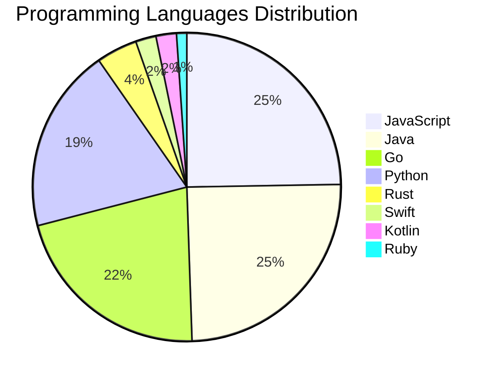

# 🚀 DevTech Auto News - Enhanced Edition


**DevTech Auto News Enhanced** is an advanced automated bot that aggregates trending topics in **AI**, **Web Development**, **Mobile**, **Cloud**, **DevOps**, and more from multiple sources including:

- 📰 [Dev.to](https://dev.to) - Developer community articles
- 🔥 [HackerNews](https://news.ycombinator.com) - Tech news discussions  
- 💻 [GitHub Trending](https://github.com/trending) - Trending repositories
- 🎯 Curated Interview Questions from multiple languages

## ✨ Features

✅ **Multi-Source Aggregation**: Combines articles from Dev.to, HackerNews, and GitHub  
✅ **Smart Categorization**: Automatically categorizes content into 10+ topics  
✅ **Image Support**: Displays cover images for visual appeal  
✅ **Pagination**: Fetches 50+ articles per update with deduplication  
✅ **Language Statistics**: Tracks programming language trends with charts  
✅ **Interview Questions**: Daily coding interview questions in multiple languages  
✅ **GitHub Actions**: Runs every 15 minutes automatically  

---

## 📊 Statistics Dashboard

### 📊 Articles by Category

**AI**: 🟦🟦🟦🟦🟦🟦🟦🟦🟦🟦🟦🟦🟦🟦🟦🟦🟦🟦🟦🟦 62 (59.0%)

**Tools**: 🟦🟦🟦🟦🟦🟦🟦🟦 26 (24.8%)

**JavaScript**: 🟦🟦🟦🟦🟦🟦🟦 23 (21.9%)

**Python**: 🟦🟦🟦🟦🟦🟦 19 (18.1%)

**Security**: 🟦🟦🟦 10 (9.5%)

**DevOps**: 🟦 4 (3.8%)

**WebDev**: 🟦 4 (3.8%)

**Database**: 🟦 4 (3.8%)

**Mobile**: 🟦 3 (2.9%)

**Cloud**: 🟦 3 (2.9%)


### 📡 Sources

- **Dev.to**: 60 articles
- **HackerNews**: 30 articles
- **GitHub**: 15 articles


### 💻 Programming Language Trends

```
JavaScript      ██████████████████████████████ 24.5 (24.5%)
Java            ██████████████████████████████ 24.5 (24.5%)
Go              ██████████████████████████ 21.3 (21.3%)
Python          ███████████████████████ 19.1 (19.1%)
Rust            █████ 4.3 (4.3%)
Swift           ███ 2.1 (2.1%)
Kotlin          ███ 2.1 (2.1%)
Ruby            █ 1.1 (1.1%)
CSharp          █ 1.1 (1.1%)

```




### 🏷️ Trending Tags

               


---

## 🛠️ How It Works

1. **Multi-Source Fetch**: Pulls from Dev.to (2 pages), HackerNews (3 topics), GitHub (3 languages)
2. **Smart Filter**: Uses keyword matching across 10+ categories  
3. **Deduplication**: Removes duplicate URLs  
4. **Image Extraction**: Captures cover images when available  
5. **Statistics**: Generates language trends and category breakdowns  
6. **Update Files**: Regenerates README and appends to comprehensive log  

---

## 📦 Installation & Usage

```bash
# Clone the repository
git clone https://github.com/Derrick-MUGISHA/github-activity-bot.git
cd github-activity-bot

# Install dependencies  
npm install

# Run manually
npm start

# Test mode
npm run test
```

---


# 🚀 DevTech Auto News - Enhanced Edition

## 📅 Latest Updates (2026-03-21 14:00 CAT)


### 🖼️ Featured Articles

<table>
<tr>
  <td align="center" width="33%">
    <a href="https://dev.to/devteam/what-was-your-win-this-week-35ja">
      
      <br/>
      <b>What was your win this week??</b>
    </a>
    <br/>
    <sub>Dev.to</sub>
  </td>
  <td align="center" width="33%">
    <a href="https://dev.to/francistrdev/get-started-on-devto-a-beginners-guide-to-engage-with-the-community-4ach">
      
      <br/>
      <b>Get Started on Dev.to! A Beginner's Guide to Engag...</b>
    </a>
    <br/>
    <sub>Dev.to</sub>
  </td>
  <td align="center" width="33%">
    <a href="https://dev.to/googleai/unlocking-gemini-cli-with-skills-hooks-plan-mode-2bgf">
      
      <br/>
      <b>Unlocking Gemini CLI with Skills, Hooks & Plan Mod...</b>
    </a>
    <br/>
    <sub>Dev.to</sub>
  </td>
</tr>
<tr>
  <td align="center" width="33%">
    <a href="https://dev.to/googleai/vandalizing-my-own-wikipedia-experience-a-90s-cyberpunk-geocities-makeover-13ie">
      
      <br/>
      <b>Vandalizing My Own Wikipedia Experience: A 90s Cyb...</b>
    </a>
    <br/>
    <sub>Dev.to</sub>
  </td>
  <td align="center" width="33%">
    <a href="https://dev.to/devteam/congrats-to-the-winners-of-our-first-dev-weekend-challenge-1gml">
      
      <br/>
      <b>Congrats to the Winners of Our First DEV Weekend C...</b>
    </a>
    <br/>
    <sub>Dev.to</sub>
  </td>
  <td align="center" width="33%">
    <a href="https://dev.to/ben/my-ai-agent-messed-up-a-utc-time-conversion-algorithm-after-i-specifically-told-it-to-make-no-46k7">
      
      <br/>
      <b>My AI agent messed up a UTC time conversion algori...</b>
    </a>
    <br/>
    <sub>Dev.to</sub>
  </td>
</tr>
</table>


### 📰 Top Headlines

- [What was your win this week??](https://dev.to/devteam/what-was-your-win-this-week-35ja) _[Dev.to]_
- [Get Started on Dev.to! A Beginner's Guide to Engage with the Community!](https://dev.to/francistrdev/get-started-on-devto-a-beginners-guide-to-engage-with-the-community-4ach) _[Dev.to]_
- [Unlocking Gemini CLI with Skills, Hooks & Plan Mode](https://dev.to/googleai/unlocking-gemini-cli-with-skills-hooks-plan-mode-2bgf) _[Dev.to]_
- [Vandalizing My Own Wikipedia Experience: A 90s Cyberpunk GeoCities Makeover](https://dev.to/googleai/vandalizing-my-own-wikipedia-experience-a-90s-cyberpunk-geocities-makeover-13ie) _[Dev.to]_
- [Congrats to the Winners of Our First DEV Weekend Challenge!](https://dev.to/devteam/congrats-to-the-winners-of-our-first-dev-weekend-challenge-1gml) _[Dev.to]_
- [My AI agent messed up a UTC time conversion algorithm after I *specifically told it* to make no mistakes. smh](https://dev.to/ben/my-ai-agent-messed-up-a-utc-time-conversion-algorithm-after-i-specifically-told-it-to-make-no-46k7) _[Dev.to]_
- [My First Experience Creating Antigravity Skills](https://dev.to/googleai/my-first-experience-creating-antigravity-skills-524b) _[Dev.to]_
- [What's in your headphones when you code? 🎧](https://dev.to/ben/whats-in-your-headphones-when-you-code-51i4) _[Dev.to]_
- [Vibe-coding in Google AI Studio: my tips to prompt better and create amazing apps](https://dev.to/googleai/vibe-coding-in-google-ai-studio-my-tips-to-prompt-better-and-create-amazing-apps-3kcp) _[Dev.to]_
- [Supercharge your workflow with AI dev tools](https://dev.to/googleai/supercharge-your-workflow-with-ai-dev-tools-199e) _[Dev.to]_
- [I Built a Claude Code Agent That Doesn't Need Me Anymore](https://dev.to/jkheadley/i-built-a-claude-code-agent-that-doesnt-need-me-anymore-dfm) _[Dev.to]_
- [OpenClaw Setup, Configuration, and Key Takeaways](https://dev.to/blove/openclaw-setup-configuration-and-key-takeaways-5ce8) _[Dev.to]_
- [Quick tip: your og:image should be 1200x630px](https://dev.to/bengreenberg/quick-tip-your-ogimage-should-be-1200x630px-4m27) _[Dev.to]_
- [Data governance just became a conversation, not a workflow.](https://dev.to/snowflake/data-governance-just-became-a-conversation-not-a-workflow-3998) _[Dev.to]_
- [AI Vocab 101](https://dev.to/bekahhw/ai-vocab-101-eh2) _[Dev.to]_
- [FE/BE - Unite Them!](https://dev.to/danieluhl/febe-unite-them-3kh3) _[Dev.to]_
- [We Can't Code Anymore. AI Won't. What Then?](https://dev.to/bagro/we-cant-code-anymore-ai-wont-what-then-46h3) _[Dev.to]_
- [Getting Started with Qwen3.5 Vision-Language Models](https://dev.to/digitalocean/getting-started-with-qwen35-vision-language-models-3ej3) _[Dev.to]_
- [Ai-lone](https://dev.to/314rate/ai-lone-4ae9) _[Dev.to]_
- [I Tried Vite+ and Replaced My Entire Frontend Toolchain](https://dev.to/erikch/i-tried-vite-and-replaced-my-entire-frontend-toolchain-4cgb) _[Dev.to]_

_Last automated update: Sat, 21 Mar 2026 14:40:34 CAT_


## 💡 Daily Interview Questions

_Sharpen your skills with these curated questions_

### 1. JavaScript: Explain event delegation and why it's useful

**Difficulty**: Medium | **Topics**: events, DOM

<details>
<summary>💡 Hint</summary>

Event bubbling, single listener for multiple elements

</details>

### 2. React: What are hooks and why were they introduced?

**Difficulty**: Medium | **Topics**: hooks, functional components

<details>
<summary>💡 Hint</summary>

State in functional components, reusable logic, cleaner code

</details>

### 3. Java: Explain the Java memory model

**Difficulty**: Hard | **Topics**: memory, JVM

<details>
<summary>💡 Hint</summary>

Heap, stack, garbage collection

</details>


---

## 📚 Resources

- [Full News Archive](./data/news_log.md) - Complete history of all fetched articles
- [Statistics JSON](./data/stats.json) - Raw statistics data
- [Categorized Data](./data/categorized.json) - Articles organized by category
- [Interview Questions](./data/interview_questions.json) - Complete question bank

---

## 🤝 Contributing

Want to add more sources, categories, or interview questions? Feel free to:

1. Fork this repository
2. Add your improvements
3. Submit a pull request

---

## 📄 License

MIT License - Feel free to use and modify!

---

<p align="center">
  <b>Last automated update: Sat, 21 Mar 2026 12:40:34 GMT</b><br/>
  <sub>Powered by GitHub Actions | Made with ❤️ for developers</sub>
</p>

---

## 🔗 Quick Links

- [View Workflow](https://github.com/Derrick-MUGISHA/github-activity-bot/actions)
- [Report Issue](https://github.com/Derrick-MUGISHA/github-activity-bot/issues)
- [Suggest Feature](https://github.com/Derrick-MUGISHA/github-activity-bot/issues/new)
