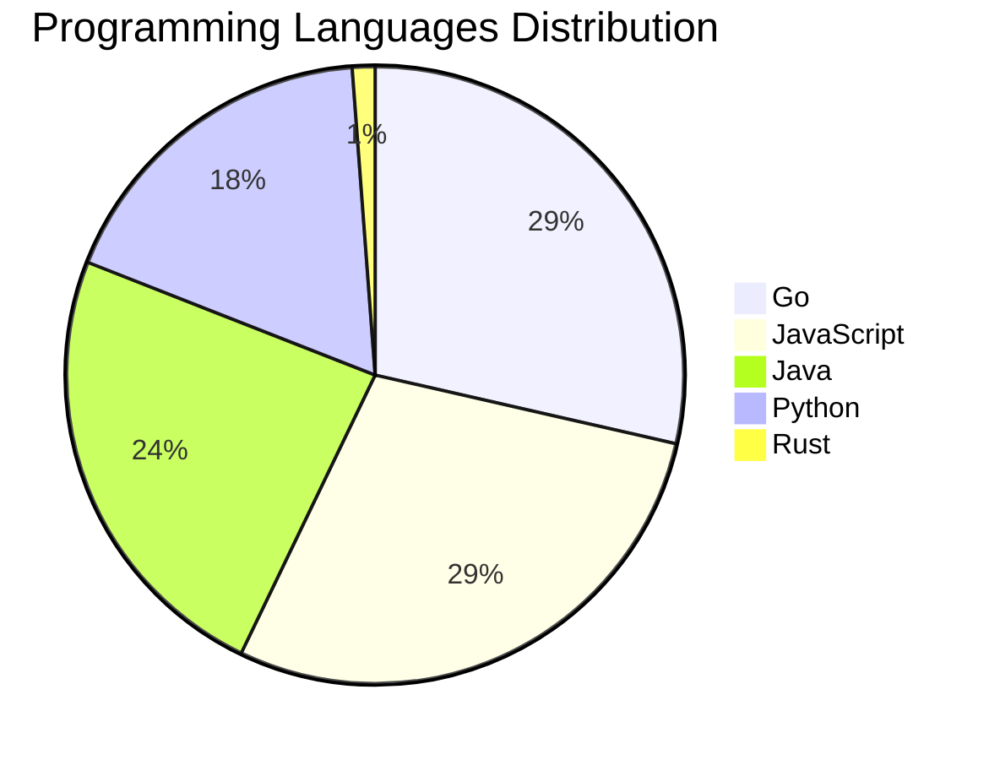

# 🚀 DevTech Auto News - Enhanced Edition


**DevTech Auto News Enhanced** is an advanced automated bot that aggregates trending topics in **AI**, **Web Development**, **Mobile**, **Cloud**, **DevOps**, and more from multiple sources including:

- 📰 [Dev.to](https://dev.to) - Developer community articles
- 🔥 [HackerNews](https://news.ycombinator.com) - Tech news discussions  
- 💻 [GitHub Trending](https://github.com/trending) - Trending repositories
- 🎯 Curated Interview Questions from multiple languages

## ✨ Features

✅ **Multi-Source Aggregation**: Combines articles from Dev.to, HackerNews, and GitHub  
✅ **Smart Categorization**: Automatically categorizes content into 10+ topics  
✅ **Image Support**: Displays cover images for visual appeal  
✅ **Pagination**: Fetches 50+ articles per update with deduplication  
✅ **Language Statistics**: Tracks programming language trends with charts  
✅ **Interview Questions**: Daily coding interview questions in multiple languages  
✅ **GitHub Actions**: Runs every 15 minutes automatically  

---

## 📊 Statistics Dashboard

### 📊 Articles by Category

**AI**: 🟦🟦🟦🟦🟦🟦🟦🟦🟦🟦🟦🟦🟦🟦🟦🟦🟦🟦🟦🟦 51 (48.6%)

**JavaScript**: 🟦🟦🟦🟦🟦🟦🟦🟦🟦 24 (22.9%)

**Tools**: 🟦🟦🟦🟦🟦🟦🟦🟦 21 (20.0%)

**Python**: 🟦🟦🟦🟦🟦🟦 15 (14.3%)

**Cloud**: 🟦🟦🟦🟦 11 (10.5%)

**WebDev**: 🟦🟦 6 (5.7%)

**Security**: 🟦🟦 6 (5.7%)

**DevOps**: 🟦🟦 4 (3.8%)

**Database**: 🟦🟦 4 (3.8%)


### 📡 Sources

- **Dev.to**: 60 articles
- **HackerNews**: 30 articles
- **GitHub**: 15 articles


### 💻 Programming Language Trends

```
Go              ██████████████████████████████ 28.6 (28.6%)
JavaScript      ██████████████████████████████ 28.6 (28.6%)
Java            █████████████████████████ 23.8 (23.8%)
Python          ███████████████████ 17.9 (17.9%)
Rust            █ 1.2 (1.2%)

```




### 🏷️ Trending Tags

               


---

## 🛠️ How It Works

1. **Multi-Source Fetch**: Pulls from Dev.to (2 pages), HackerNews (3 topics), GitHub (3 languages)
2. **Smart Filter**: Uses keyword matching across 10+ categories  
3. **Deduplication**: Removes duplicate URLs  
4. **Image Extraction**: Captures cover images when available  
5. **Statistics**: Generates language trends and category breakdowns  
6. **Update Files**: Regenerates README and appends to comprehensive log  

---

## 📦 Installation & Usage

```bash
# Clone the repository
git clone https://github.com/Derrick-MUGISHA/github-activity-bot.git
cd github-activity-bot

# Install dependencies  
npm install

# Run manually
npm start

# Test mode
npm run test
```

---


# 🚀 DevTech Auto News - Enhanced Edition

## 📅 Latest Updates (2026-04-22 17:00 CAT)


### 🖼️ Featured Articles

<table>
<tr>
  <td align="center" width="33%">
    <a href="https://dev.to/devteam/tune-in-and-join-the-google-cloud-next-26-writing-challenge-1000-in-prizes-21bd">
      
      <br/>
      <b>Tune In and Join the Google Cloud NEXT '26 Writing...</b>
    </a>
    <br/>
    <sub>Dev.to</sub>
  </td>
  <td align="center" width="33%">
    <a href="https://dev.to/devteam/top-7-featured-dev-posts-of-the-week-555a">
      
      <br/>
      <b>Top 7 Featured DEV Posts of the Week</b>
    </a>
    <br/>
    <sub>Dev.to</sub>
  </td>
  <td align="center" width="33%">
    <a href="https://dev.to/aws/build-your-own-blog-post-view-counter-on-aws-free-tier-306f">
      
      <br/>
      <b>Build your own blog post view counter on AWS Free ...</b>
    </a>
    <br/>
    <sub>Dev.to</sub>
  </td>
</tr>
<tr>
  <td align="center" width="33%">
    <a href="https://dev.to/googleai/migrating-vector-embeddings-in-production-without-downtime-5bli">
      
      <br/>
      <b>Migrating vector embeddings in production without ...</b>
    </a>
    <br/>
    <sub>Dev.to</sub>
  </td>
  <td align="center" width="33%">
    <a href="https://dev.to/dumebii/vercel-got-breached-heres-exactly-what-to-do-if-you-use-it-2026-guide-2k76">
      
      <br/>
      <b>What To Do If Your Project Was Affected By The Ver...</b>
    </a>
    <br/>
    <sub>Dev.to</sub>
  </td>
  <td align="center" width="33%">
    <a href="https://dev.to/emin-acikgoz/atomic-scaffolding-how-scbake-prevents-configuration-mishaps-2gmo">
      
      <br/>
      <b>Atomic Scaffolding: How scbake Prevents Configurat...</b>
    </a>
    <br/>
    <sub>Dev.to</sub>
  </td>
</tr>
</table>


### 📰 Top Headlines

- [Tune In and Join the Google Cloud NEXT '26 Writing Challenge: $1,000 in Prizes!](https://dev.to/devteam/tune-in-and-join-the-google-cloud-next-26-writing-challenge-1000-in-prizes-21bd) _[Dev.to]_
- [Top 7 Featured DEV Posts of the Week](https://dev.to/devteam/top-7-featured-dev-posts-of-the-week-555a) _[Dev.to]_
- [Build your own blog post view counter on AWS Free Tier](https://dev.to/aws/build-your-own-blog-post-view-counter-on-aws-free-tier-306f) _[Dev.to]_
- [Migrating vector embeddings in production without downtime](https://dev.to/googleai/migrating-vector-embeddings-in-production-without-downtime-5bli) _[Dev.to]_
- [What To Do If Your Project Was Affected By The Vercel Breach](https://dev.to/dumebii/vercel-got-breached-heres-exactly-what-to-do-if-you-use-it-2026-guide-2k76) _[Dev.to]_
- [Atomic Scaffolding: How scbake Prevents Configuration Mishaps](https://dev.to/emin-acikgoz/atomic-scaffolding-how-scbake-prevents-configuration-mishaps-2gmo) _[Dev.to]_
- [TPU Mythbusting: vendor lock-in](https://dev.to/googleai/tpu-mythbusting-vendor-lock-in-pbo) _[Dev.to]_
- [I built a self-hosted PostgreSQL Control Plane that runs on single Docker container](https://dev.to/matisiekpl/i-built-a-self-hosted-postgresql-control-plane-that-runs-on-single-docker-container-30gm) _[Dev.to]_
- [Boring code is an organizational tell](https://dev.to/simme/boring-code-is-an-organizational-tell-4gca) _[Dev.to]_
- [What Happens Between @SqsListener and Your Method in Spring Cloud AWS SQS](https://dev.to/tomazfernandes/what-happens-between-sqslistener-and-your-method-in-spring-cloud-aws-sqs-36e7) _[Dev.to]_
- [I Built a BaaS Where AI Agents Can Onboard Themselves](https://dev.to/steveemmerich/i-built-a-baas-where-ai-agents-can-onboard-themselves-11nn) _[Dev.to]_
- [Less Than Six Hours From Idea to Dev Release: Building a new Drupal Canvas SDC Module With AI, Deliberately](https://dev.to/jcandan/i-built-a-new-drupal-canvas-sdc-module-with-ai-in-under-6-hours-and-the-review-process-still-59b8) _[Dev.to]_
- [Add Telephony to a Gemini Live Agent with Twilio](https://dev.to/googleai/add-telephony-to-a-gemini-live-agent-with-twilio-1elc) _[Dev.to]_
- [I Built OxyTrack: Turning Small Daily Habits Into Real Environmental Impact 🌱](https://dev.to/ajitekom/i-built-oxytrack-turning-small-daily-habits-into-real-environmental-impact-1nj9) _[Dev.to]_
- [Orchestrating Agents via ADK for TypeScript and Gemini CLI](https://dev.to/gde/orchestrating-agents-via-adk-for-typescript-and-gemini-cli-jco) _[Dev.to]_
- [Vercel Hack: Why You Need to Rotate Your "Non-Sensitive" Environment Variables Today](https://dev.to/jon_at_backboardio/vercel-hack-why-you-need-to-rotate-your-non-sensitive-environment-variables-today-25mh) _[Dev.to]_
- [Display and test openapi.yaml file](https://dev.to/gabrielweidmann/display-and-test-openapiyaml-file-53h9) _[Dev.to]_
- [EcoDo AI: Making Earth a Little Less Heavy 🌍✨](https://dev.to/vaidehi_warghat_362ccfda5/ecodo-ai-making-earth-a-little-less-heavy-3mic) _[Dev.to]_
- [Claude skills vs Commands](https://dev.to/hellonehha/claude-skills-vs-commands-1dcm) _[Dev.to]_
- [Designing Multi-Tenant Backends With Both Ownership and Team Access](https://dev.to/oladele-david/designing-multi-tenant-backends-with-both-ownership-and-team-access-ao5) _[Dev.to]_

_Last automated update: Wed, 22 Apr 2026 17:48:56 CAT_


## 💡 Daily Interview Questions

_Sharpen your skills with these curated questions_

### 1. DataStructures: Implement LRU Cache

**Difficulty**: Hard | **Topics**: design, hash map, linked list

<details>
<summary>💡 Hint</summary>

Doubly linked list + hash map, O(1) operations

</details>

### 2. Database: What is the difference between SQL and NoSQL databases?

**Difficulty**: Easy | **Topics**: databases, design

<details>
<summary>💡 Hint</summary>

Schema, scalability, ACID vs BASE

</details>

### 3. NodeJS: Implement rate limiting for an API

**Difficulty**: Hard | **Topics**: security, middleware

<details>
<summary>💡 Hint</summary>

Token bucket, sliding window, Redis

</details>


---

## 📚 Resources

- [Full News Archive](./data/news_log.md) - Complete history of all fetched articles
- [Statistics JSON](./data/stats.json) - Raw statistics data
- [Categorized Data](./data/categorized.json) - Articles organized by category
- [Interview Questions](./data/interview_questions.json) - Complete question bank

---

## 🤝 Contributing

Want to add more sources, categories, or interview questions? Feel free to:

1. Fork this repository
2. Add your improvements
3. Submit a pull request

---

## 📄 License

MIT License - Feel free to use and modify!

---

<p align="center">
  <b>Last automated update: Wed, 22 Apr 2026 15:48:56 GMT</b><br/>
  <sub>Powered by GitHub Actions | Made with ❤️ for developers</sub>
</p>

---

## 🔗 Quick Links

- [View Workflow](https://github.com/Derrick-MUGISHA/github-activity-bot/actions)
- [Report Issue](https://github.com/Derrick-MUGISHA/github-activity-bot/issues)
- [Suggest Feature](https://github.com/Derrick-MUGISHA/github-activity-bot/issues/new)
