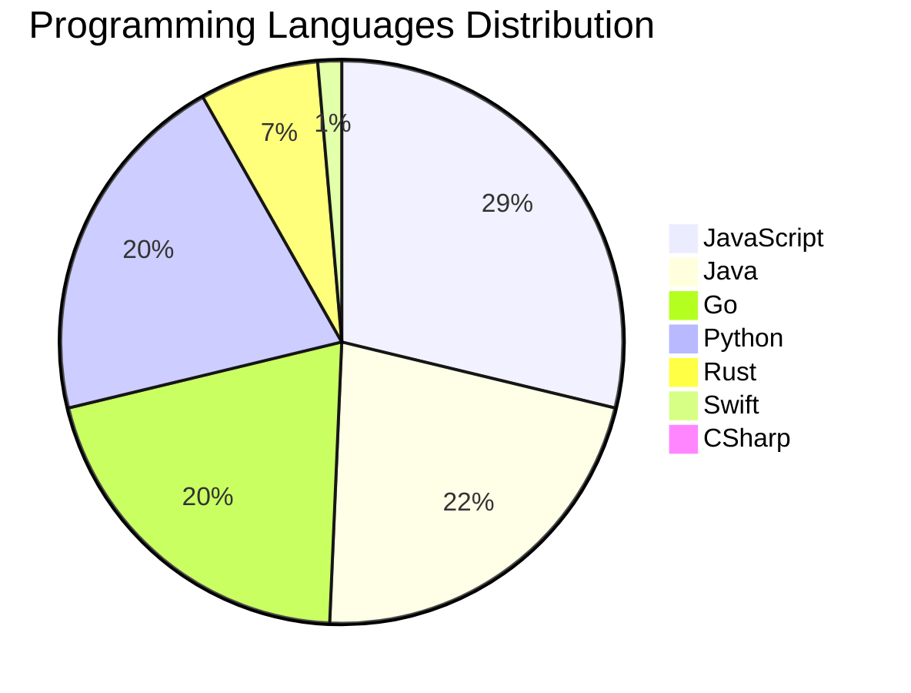

<div align="center">

# 📰 DevTech Auto News

**Your always-fresh digest of developer & AI tech news — curated automatically, around the clock.**


Aggregating [Dev.to](https://dev.to) · [Hacker News](https://news.ycombinator.com) · [GitHub Trending](https://github.com/trending) · [Lobste.rs](https://lobste.rs) · [Stack Overflow](https://stackoverflow.com) · [TechCrunch](https://techcrunch.com) · [freeCodeCamp](https://www.freecodecamp.org/news) — refreshed by GitHub Actions around the clock.

**[📰 Headlines](#-latest-headlines) · [💡 Interview Prep](#-interview-question-of-the-hour) · [📊 Statistics](#-statistics) · [⚙️ How It Works](#%EF%B8%8F-how-it-works)**

</div>

---

## 📰 Latest Headlines

> 🕐 Edition of **2026-08-22 3:00 CAT** — refreshed automatically, all day, every day.

### ✨ Featured Stories

<table>
<tr>
  <td align="center" width="33%">
    <a href="https://dev.to/devteam/what-was-your-win-this-week-1330">
      
      <br/>
      <b>What was your win this week?!</b>
    </a>
    <br/>
    <sub>Dev.to</sub>
  </td>
  <td align="center" width="33%">
    <a href="https://dev.to/adamthedeveloper/greatness-is-forged-by-limitation-e20">
      
      <br/>
      <b>Greatness Is Forged by Limitation</b>
    </a>
    <br/>
    <sub>Dev.to</sub>
  </td>
  <td align="center" width="33%">
    <a href="https://dev.to/backboardio/coding-agents-got-boring-the-moment-we-built-a-really-good-one-1mc4">
      
      <br/>
      <b>Coding agents got boring the moment we built a rea...</b>
    </a>
    <br/>
    <sub>Dev.to</sub>
  </td>
</tr>
<tr>
  <td align="center" width="33%">
    <a href="https://dev.to/devteam/hey-all-im-jem-the-dev-community-program-coordinator-2g2">
      
      <br/>
      <b>Hey all! I’m Jem, the DEV Community Program Coordi...</b>
    </a>
    <br/>
    <sub>Dev.to</sub>
  </td>
  <td align="center" width="33%">
    <a href="https://dev.to/francistrdev/i-joined-devto-because-fl0">
      
      <br/>
      <b>I Joined dev.to because...</b>
    </a>
    <br/>
    <sub>Dev.to</sub>
  </td>
  <td align="center" width="33%">
    <a href="https://dev.to/devteam/what-was-your-win-this-week-23ob">
      
      <br/>
      <b>What was your win this week??</b>
    </a>
    <br/>
    <sub>Dev.to</sub>
  </td>
</tr>
</table>


### 🗞️ Top Stories

| # | Headline | Source |
|---|----------|--------|
| 1 | [What was your win this week?!](https://dev.to/devteam/what-was-your-win-this-week-1330) | Dev.to |
| 2 | [Greatness Is Forged by Limitation](https://dev.to/adamthedeveloper/greatness-is-forged-by-limitation-e20) | Dev.to |
| 3 | [Coding agents got boring the moment we built a really good one.](https://dev.to/backboardio/coding-agents-got-boring-the-moment-we-built-a-really-good-one-1mc4) | Dev.to |
| 4 | [Hey all! I’m Jem, the DEV Community Program Coordinator](https://dev.to/devteam/hey-all-im-jem-the-dev-community-program-coordinator-2g2) | Dev.to |
| 5 | [I Joined dev.to because...](https://dev.to/francistrdev/i-joined-devto-because-fl0) | Dev.to |
| 6 | [What was your win this week??](https://dev.to/devteam/what-was-your-win-this-week-23ob) | Dev.to |
| 7 | [Backend Engineer (Me) Ships a Browser Game With One Unintentional System Requirement: My Monitor](https://dev.to/georgekobaidze/backend-engineer-me-ships-a-browser-game-with-one-unintentional-system-requirement-my-monitor-1ojd) | Dev.to |
| 8 | [I Stopped Trusting AI Agents With Tools. So I Built a Gatekeeper.](https://dev.to/debashish_ghosal/i-stopped-trusting-ai-agents-with-tools-so-i-built-a-gatekeeper-26fb) | Dev.to |
| 9 | [Hacktoberfest 2026: AI belongs to everyone](https://blog.mlh.com/hacktoberfest-2026-ai-belongs-to-everyone-3jl8) | Dev.to |
| 10 | [Welcome Thread - v389](https://dev.to/devteam/welcome-thread-v389-onj) | Dev.to |
| 11 | [Top 7 Featured DEV Posts of the Week](https://dev.to/devteam/top-7-featured-dev-posts-of-the-week-5c26) | Dev.to |
| 12 | [Meme Monday](https://dev.to/ben/meme-monday-1abg) | Dev.to |
| 13 | [The Accidental DDOS: How a Single React Bracket Triggered 100,000 API Requests and Melted Our Database](https://dev.to/pooja_bhavani/the-accidental-ddos-how-a-single-react-bracket-triggered-100000-api-requests-and-melted-our-36li) | Dev.to |
| 14 | [How Many Introductions Away Are You From Pedro Pascal? A Practical Introduction to Graph Search](https://dev.to/ale3oula/how-many-introductions-away-are-you-from-pedro-pascal-a-practical-introduction-to-graph-search-5bfg) | Dev.to |
| 15 | [Passkeys Explained Simply](https://dev.to/thomasbnt/passkeys-explained-simply-52jk) | Dev.to |
| 16 | [Join our latest Frontend Challenge: Comfort Food Edition 🍲](https://dev.to/devteam/join-our-latest-frontend-challenge-comfort-food-edition-28a0) | Dev.to |
| 17 | [Catbot: Custom Grammar Problem Fixed](https://dev.to/annavi11arrea1/catbot-custom-grammar-problem-fixed-oc5) | Dev.to |
| 18 | [It Was Just a Patch Update. What Could Possibly Go Wrong?](https://dev.to/sylwia-lask/it-was-just-a-patch-update-what-could-possibly-go-wrong-3be3) | Dev.to |
| 19 | [My (not so pretty) journey in tech](https://dev.to/ishacodes/why-i-joined-devto--5c63) | Dev.to |
| 20 | [Reviving Open Source Giants: How I Brought Weave Scope Back with Multi-Platform Docker Support in One Afternoon Using Antigravity](https://dev.to/gde/reviving-open-source-giants-how-i-brought-weave-scope-back-with-multi-platform-docker-support-in-cmo) | Dev.to |

<sub>Last fetched: Sat, 22 Aug 2026 03:28:17 CAT</sub>


---

## 💡 Interview Question of the Hour

> Sharpen your skills — new questions selected on every update. Try answering before opening the hint!

**1. `JavaScript` — What is the event loop and how does it work?**

&nbsp;&nbsp;&nbsp;&nbsp;🎯 Hard · 🏷 async, runtime

<details>
<summary>&nbsp;&nbsp;&nbsp;&nbsp;💡 Show hint</summary>

> Call stack, callback queue, microtask queue

</details>

**2. `SystemDesign` — Design Twitter's timeline feature**

&nbsp;&nbsp;&nbsp;&nbsp;🎯 Hard · 🏷 system design, scalability

<details>
<summary>&nbsp;&nbsp;&nbsp;&nbsp;💡 Show hint</summary>

> Fan-out, caching, ranking, real-time updates

</details>

**3. `Database` — What is the difference between SQL and NoSQL databases?**

&nbsp;&nbsp;&nbsp;&nbsp;🎯 Easy · 🏷 databases, design

<details>
<summary>&nbsp;&nbsp;&nbsp;&nbsp;💡 Show hint</summary>

> Schema, scalability, ACID vs BASE

</details>


---

## 📊 Statistics

#### 🗂 Articles by Category

| Category | Articles | Share | |
|----------|---------:|------:|---|
| **AI** | 74 | 40.2% | `████████████████████` |
| **JavaScript** | 42 | 22.8% | `███████████░░░░░░░░░` |
| **Tools** | 33 | 17.9% | `█████████░░░░░░░░░░░` |
| **Python** | 30 | 16.3% | `████████░░░░░░░░░░░░` |
| **Security** | 19 | 10.3% | `█████░░░░░░░░░░░░░░░` |
| **DevOps** | 14 | 7.6% | `████░░░░░░░░░░░░░░░░` |
| **WebDev** | 13 | 7.1% | `████░░░░░░░░░░░░░░░░` |
| **Cloud** | 12 | 6.5% | `███░░░░░░░░░░░░░░░░░` |
| **Mobile** | 5 | 2.7% | `█░░░░░░░░░░░░░░░░░░░` |
| **Database** | 4 | 2.2% | `█░░░░░░░░░░░░░░░░░░░` |

<sub>Articles can match more than one category, so shares may sum to over 100%.</sub>


#### 📡 Articles by Source

| Source | Articles |
|--------|---------:|
| Dev.to | 60 |
| HackerNews | 49 |
| GitHub | 25 |
| Lobste.rs | 10 |
| StackOverflow | 20 |
| TechCrunch | 10 |
| freeCodeCamp | 10 |


#### 💻 Programming Language Trends

```
JavaScript      ██████████████████████████████ 28.6%
Java            ███████████████████████ 21.8%
Go              █████████████████████ 20.4%
Python          █████████████████████ 20.4%
Rust            ███████ 6.8%
Swift           █ 1.4%
CSharp          █ 0.7%

```




#### 🏷 Trending Topics

            


---

## ⚙️ How It Works

This repository is a fully automated news pipeline. On every run, GitHub Actions:

1. **Fetches** the latest articles from seven sources: Dev.to, Hacker News, GitHub Trending, Lobste.rs, Stack Overflow, TechCrunch, and freeCodeCamp
2. **Deduplicates and categorizes** them across 10+ topics using keyword matching
3. **Extracts cover images** and computes language & category statistics
4. **Rebuilds this README** and appends everything to the [full archive](./data/news_log.md)
5. **Commits and pushes** the result — no human intervention needed

<details>
<summary><b>🚀 Run it yourself</b></summary>

```bash
git clone https://github.com/Derrick-MUGISHA/github-activity-bot.git
cd github-activity-bot
npm install
npm start
```

Fork the repo, enable GitHub Actions, and you have your own self-updating news feed.

</details>

<details>
<summary><b>📚 Data & resources</b></summary>

- [Full news archive](./data/news_log.md) — complete history of every fetched article
- [Statistics](./data/stats.json) — raw stats data (JSON)
- [Categorized articles](./data/categorized.json) — articles grouped by topic
- [Interview question bank](./data/interview_questions.json) — the full question set

</details>

---

## 🤝 Contributing

Ideas for new sources, categories, or interview questions are welcome — [open an issue](https://github.com/Derrick-MUGISHA/github-activity-bot/issues/new) or submit a pull request.

## 📄 License

Released under the [MIT License](https://opensource.org/licenses/MIT) — free to use, fork, and modify.

---

<div align="center">
  <sub>🤖 Last automated update: <b>Sat, 22 Aug 2026 01:28:17 GMT</b></sub><br/>
  <sub>Powered by GitHub Actions · Built with ❤️ by <a href="https://github.com/Derrick-MUGISHA">Derrick MUGISHA</a></sub>
</div>
