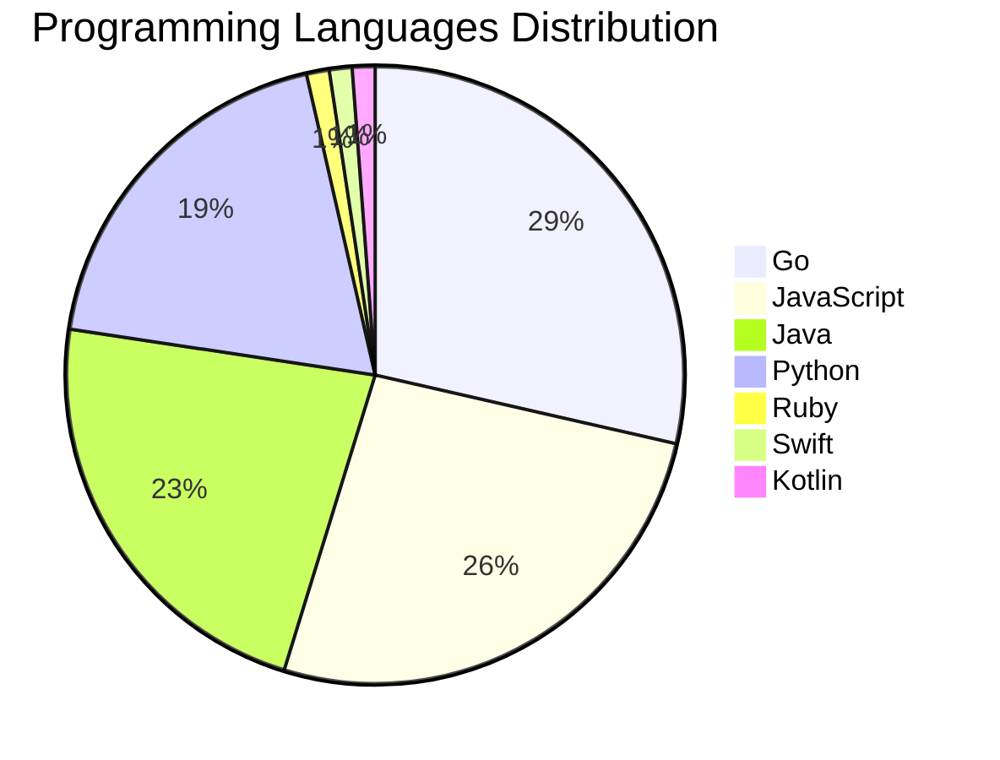

# 🚀 DevTech Auto News - Enhanced Edition


**DevTech Auto News Enhanced** is an advanced automated bot that aggregates trending topics in **AI**, **Web Development**, **Mobile**, **Cloud**, **DevOps**, and more from multiple sources including:

- 📰 [Dev.to](https://dev.to) - Developer community articles
- 🔥 [HackerNews](https://news.ycombinator.com) - Tech news discussions  
- 💻 [GitHub Trending](https://github.com/trending) - Trending repositories
- 🎯 Curated Interview Questions from multiple languages

## ✨ Features

✅ **Multi-Source Aggregation**: Combines articles from Dev.to, HackerNews, and GitHub  
✅ **Smart Categorization**: Automatically categorizes content into 10+ topics  
✅ **Image Support**: Displays cover images for visual appeal  
✅ **Pagination**: Fetches 50+ articles per update with deduplication  
✅ **Language Statistics**: Tracks programming language trends with charts  
✅ **Interview Questions**: Daily coding interview questions in multiple languages  
✅ **GitHub Actions**: Runs every 15 minutes automatically  

---

## 📊 Statistics Dashboard

### 📊 Articles by Category

**AI**: 🟦🟦🟦🟦🟦🟦🟦🟦🟦🟦🟦🟦🟦🟦🟦🟦🟦🟦🟦🟦 55 (52.4%)

**JavaScript**: 🟦🟦🟦🟦🟦🟦🟦🟦 22 (21.0%)

**Tools**: 🟦🟦🟦🟦🟦🟦🟦🟦 21 (20.0%)

**Python**: 🟦🟦🟦🟦🟦🟦 16 (15.2%)

**Cloud**: 🟦🟦🟦🟦🟦 13 (12.4%)

**WebDev**: 🟦🟦🟦 7 (6.7%)

**Security**: 🟦🟦 5 (4.8%)

**DevOps**: 🟦 3 (2.9%)

**Database**: 🟦 2 (1.9%)

**Mobile**:  1 (1.0%)


### 📡 Sources

- **Dev.to**: 60 articles
- **HackerNews**: 30 articles
- **GitHub**: 15 articles


### 💻 Programming Language Trends

```
Go              ██████████████████████████████ 28.6 (28.6%)
JavaScript      ███████████████████████████ 26.2 (26.2%)
Java            ████████████████████████ 22.6 (22.6%)
Python          ████████████████████ 19.0 (19.0%)
Ruby            █ 1.2 (1.2%)
Swift           █ 1.2 (1.2%)
Kotlin          █ 1.2 (1.2%)

```




### 🏷️ Trending Tags

               


---

## 🛠️ How It Works

1. **Multi-Source Fetch**: Pulls from Dev.to (2 pages), HackerNews (3 topics), GitHub (3 languages)
2. **Smart Filter**: Uses keyword matching across 10+ categories  
3. **Deduplication**: Removes duplicate URLs  
4. **Image Extraction**: Captures cover images when available  
5. **Statistics**: Generates language trends and category breakdowns  
6. **Update Files**: Regenerates README and appends to comprehensive log  

---

## 📦 Installation & Usage

```bash
# Clone the repository
git clone https://github.com/Derrick-MUGISHA/github-activity-bot.git
cd github-activity-bot

# Install dependencies  
npm install

# Run manually
npm start

# Test mode
npm run test
```

---


# 🚀 DevTech Auto News - Enhanced Edition

## 📅 Latest Updates (2026-04-21 9:00 CAT)


### 🖼️ Featured Articles

<table>
<tr>
  <td align="center" width="33%">
    <a href="https://dev.to/devteam/top-7-featured-dev-posts-of-the-week-555a">
      
      <br/>
      <b>Top 7 Featured DEV Posts of the Week</b>
    </a>
    <br/>
    <sub>Dev.to</sub>
  </td>
  <td align="center" width="33%">
    <a href="https://dev.to/eayurt/why-do-i-keep-killing-my-side-projects-31eh">
      
      <br/>
      <b>Why Do I Keep Killing My Side Projects?</b>
    </a>
    <br/>
    <sub>Dev.to</sub>
  </td>
  <td align="center" width="33%">
    <a href="https://dev.to/steveemmerich/i-built-a-baas-where-ai-agents-can-onboard-themselves-11nn">
      
      <br/>
      <b>I Built a BaaS Where AI Agents Can Onboard Themsel...</b>
    </a>
    <br/>
    <sub>Dev.to</sub>
  </td>
</tr>
<tr>
  <td align="center" width="33%">
    <a href="https://dev.to/jarvisscript/what-are-your-goals-for-the-week-175-324a">
      
      <br/>
      <b>What are your goals for the week? #175</b>
    </a>
    <br/>
    <sub>Dev.to</sub>
  </td>
  <td align="center" width="33%">
    <a href="https://dev.to/devteam/what-was-your-win-this-week-28fb">
      
      <br/>
      <b>What was your win this week?!</b>
    </a>
    <br/>
    <sub>Dev.to</sub>
  </td>
  <td align="center" width="33%">
    <a href="https://dev.to/devteam/watch-google-cloud-next-live-right-here-on-dev-2g6h">
      
      <br/>
      <b>Watch Google Cloud NEXT Live Right Here on DEV!</b>
    </a>
    <br/>
    <sub>Dev.to</sub>
  </td>
</tr>
</table>


### 📰 Top Headlines

- [Top 7 Featured DEV Posts of the Week](https://dev.to/devteam/top-7-featured-dev-posts-of-the-week-555a) _[Dev.to]_
- [Why Do I Keep Killing My Side Projects?](https://dev.to/eayurt/why-do-i-keep-killing-my-side-projects-31eh) _[Dev.to]_
- [I Built a BaaS Where AI Agents Can Onboard Themselves](https://dev.to/steveemmerich/i-built-a-baas-where-ai-agents-can-onboard-themselves-11nn) _[Dev.to]_
- [What are your goals for the week? #175](https://dev.to/jarvisscript/what-are-your-goals-for-the-week-175-324a) _[Dev.to]_
- [What was your win this week?!](https://dev.to/devteam/what-was-your-win-this-week-28fb) _[Dev.to]_
- [Watch Google Cloud NEXT Live Right Here on DEV!](https://dev.to/devteam/watch-google-cloud-next-live-right-here-on-dev-2g6h) _[Dev.to]_
- [Multi-Agent A2A with the Agent Development Kit(ADK), Azure ACI, and Gemini CLI](https://dev.to/gde/multi-agent-a2a-with-the-agent-development-kitadk-azure-aci-and-gemini-cli-1k84) _[Dev.to]_
- [TPU Mythbusting: vendor lock-in](https://dev.to/googleai/tpu-mythbusting-vendor-lock-in-pbo) _[Dev.to]_
- [I got tired of copy-pasting the same table code, so I built a library](https://dev.to/zonaibbokhari/i-got-tired-of-copy-pasting-the-same-table-code-so-i-built-a-library-2c3l) _[Dev.to]_
- [I built a self-hosted PostgreSQL Control Plane that runs on single Docker container](https://dev.to/matisiekpl/i-built-a-self-hosted-postgresql-control-plane-that-runs-on-single-docker-container-30gm) _[Dev.to]_
- [Boring code is an organizational tell](https://dev.to/simme/boring-code-is-an-organizational-tell-4gca) _[Dev.to]_
- [What Happens Between @SqsListener and Your Method in Spring Cloud AWS SQS](https://dev.to/tomazfernandes/what-happens-between-sqslistener-and-your-method-in-spring-cloud-aws-sqs-36e7) _[Dev.to]_
- [Congrats to the Notion MCP Challenge Winners!](https://dev.to/devteam/congrats-to-the-notion-mcp-challenge-winners-28ab) _[Dev.to]_
- [Less Than Six Hours From Idea to Dev Release: Building a new Drupal Canvas SDC Module With AI, Deliberately](https://dev.to/jcandan/i-built-a-new-drupal-canvas-sdc-module-with-ai-in-under-6-hours-and-the-review-process-still-59b8) _[Dev.to]_
- [I Built OxyTrack: Turning Small Daily Habits Into Real Environmental Impact 🌱](https://dev.to/ajitekom/i-built-oxytrack-turning-small-daily-habits-into-real-environmental-impact-1nj9) _[Dev.to]_
- [Building a Multimodal Agent with the ADK, Azure ACI, and Gemini Flash Live 3.1](https://dev.to/gde/building-a-multimodal-agent-with-the-adk-azure-aci-and-gemini-flash-live-31-3hp6) _[Dev.to]_
- [What does the term 'hacker' mean to you?](https://dev.to/jess/what-does-the-term-hacker-mean-to-you-2fp8) _[Dev.to]_
- [Multi-Agent A2A with the Agent Development Kit(ADK), Azure ACA, and Gemini CLI](https://dev.to/gde/multi-agent-a2a-with-the-agent-development-kitadk-azure-aca-and-gemini-cli-m15) _[Dev.to]_
- [Meme Monday](https://dev.to/ben/meme-monday-5ee) _[Dev.to]_
- [Web3 Terminology Mapped to What You Already Know](https://dev.to/100daysofsolana/web3-terminology-mapped-to-what-you-already-know-4afk) _[Dev.to]_

_Last automated update: Tue, 21 Apr 2026 09:11:14 CAT_


## 💡 Daily Interview Questions

_Sharpen your skills with these curated questions_

### 1. DataStructures: Implement a function to reverse a linked list

**Difficulty**: Medium | **Topics**: linked lists, pointers

<details>
<summary>💡 Hint</summary>

Iterative or recursive, three pointers

</details>

### 2. DataStructures: Implement LRU Cache

**Difficulty**: Hard | **Topics**: design, hash map, linked list

<details>
<summary>💡 Hint</summary>

Doubly linked list + hash map, O(1) operations

</details>

### 3. DataStructures: Implement LRU Cache

**Difficulty**: Hard | **Topics**: design, hash map, linked list

<details>
<summary>💡 Hint</summary>

Doubly linked list + hash map, O(1) operations

</details>


---

## 📚 Resources

- [Full News Archive](./data/news_log.md) - Complete history of all fetched articles
- [Statistics JSON](./data/stats.json) - Raw statistics data
- [Categorized Data](./data/categorized.json) - Articles organized by category
- [Interview Questions](./data/interview_questions.json) - Complete question bank

---

## 🤝 Contributing

Want to add more sources, categories, or interview questions? Feel free to:

1. Fork this repository
2. Add your improvements
3. Submit a pull request

---

## 📄 License

MIT License - Feel free to use and modify!

---

<p align="center">
  <b>Last automated update: Tue, 21 Apr 2026 07:11:14 GMT</b><br/>
  <sub>Powered by GitHub Actions | Made with ❤️ for developers</sub>
</p>

---

## 🔗 Quick Links

- [View Workflow](https://github.com/Derrick-MUGISHA/github-activity-bot/actions)
- [Report Issue](https://github.com/Derrick-MUGISHA/github-activity-bot/issues)
- [Suggest Feature](https://github.com/Derrick-MUGISHA/github-activity-bot/issues/new)
