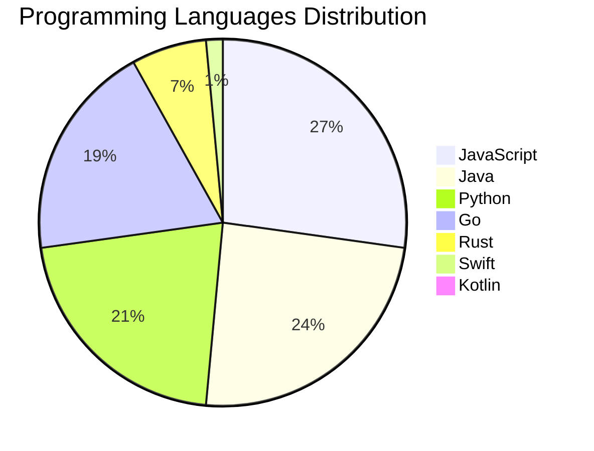

<div align="center">

# 📰 DevTech Auto News

**Your always-fresh digest of developer & AI tech news — curated automatically, around the clock.**


Aggregating [Dev.to](https://dev.to) · [Hacker News](https://news.ycombinator.com) · [GitHub Trending](https://github.com/trending) · [Lobste.rs](https://lobste.rs) · [Stack Overflow](https://stackoverflow.com) · [TechCrunch](https://techcrunch.com) · [freeCodeCamp](https://www.freecodecamp.org/news) — refreshed by GitHub Actions around the clock.

**[📰 Headlines](#-latest-headlines) · [💡 Interview Prep](#-interview-question-of-the-hour) · [📊 Statistics](#-statistics) · [⚙️ How It Works](#%EF%B8%8F-how-it-works)**

</div>

---

## 📰 Latest Headlines

> 🕐 Edition of **2026-07-05 23:00 CAT** — refreshed automatically, all day, every day.

### ✨ Featured Stories

<table>
<tr>
  <td align="center" width="33%">
    <a href="https://dev.to/dailycontext/forward-deployed-engineers-and-the-future-of-software-engineering-jll">
      
      <br/>
      <b>Forward Deployed Engineers and the future of softw...</b>
    </a>
    <br/>
    <sub>Dev.to</sub>
  </td>
  <td align="center" width="33%">
    <a href="https://dev.to/dailycontext/these-founders-skipped-graduation-to-be-here-1o3d">
      
      <br/>
      <b>These Founders Skipped Graduation To Be Here</b>
    </a>
    <br/>
    <sub>Dev.to</sub>
  </td>
  <td align="center" width="33%">
    <a href="https://dev.to/eschmechel/protect-yourself-mesh-yourself-3fkn">
      
      <br/>
      <b>Protect Yourself, Mesh Yourself</b>
    </a>
    <br/>
    <sub>Dev.to</sub>
  </td>
</tr>
<tr>
  <td align="center" width="33%">
    <a href="https://dev.to/devteam/play-todays-game-from-issue-2-of-the-daily-context-epf">
      
      <br/>
      <b>Play today’s game from Issue #2 of The Daily Conte...</b>
    </a>
    <br/>
    <sub>Dev.to</sub>
  </td>
  <td align="center" width="33%">
    <a href="https://dev.to/dailycontext/how-docusign-is-bringing-contract-table-extraction-to-production-with-nvidia-nemotron-parse-3bnh">
      
      <br/>
      <b>How Docusign is Bringing Contract Table Extraction...</b>
    </a>
    <br/>
    <sub>Dev.to</sub>
  </td>
  <td align="center" width="33%">
    <a href="https://dev.to/dailycontext/the-fragile-balance-of-ai-development-individual-flow-vs-collective-context-2f49">
      
      <br/>
      <b>The Fragile Balance of AI Development: Individual ...</b>
    </a>
    <br/>
    <sub>Dev.to</sub>
  </td>
</tr>
</table>


### 🗞️ Top Stories

| # | Headline | Source |
|---|----------|--------|
| 1 | [Forward Deployed Engineers and the future of software engineering](https://dev.to/dailycontext/forward-deployed-engineers-and-the-future-of-software-engineering-jll) | Dev.to |
| 2 | [These Founders Skipped Graduation To Be Here](https://dev.to/dailycontext/these-founders-skipped-graduation-to-be-here-1o3d) | Dev.to |
| 3 | [Protect Yourself, Mesh Yourself](https://dev.to/eschmechel/protect-yourself-mesh-yourself-3fkn) | Dev.to |
| 4 | [Play today’s game from Issue #2 of The Daily Context!](https://dev.to/devteam/play-todays-game-from-issue-2-of-the-daily-context-epf) | Dev.to |
| 5 | [How Docusign is Bringing Contract Table Extraction to Production with NVIDIA Nemotron Parse](https://dev.to/dailycontext/how-docusign-is-bringing-contract-table-extraction-to-production-with-nvidia-nemotron-parse-3bnh) | Dev.to |
| 6 | [The Fragile Balance of AI Development: Individual Flow vs. Collective Context](https://dev.to/dailycontext/the-fragile-balance-of-ai-development-individual-flow-vs-collective-context-2f49) | Dev.to |
| 7 | [What's Next for AI?](https://dev.to/sylwia-lask/whats-next-for-ai-219i) | Dev.to |
| 8 | [Reconciling the Distributed System: How the AI Engineer World's Fair Engineered Human Connection](https://dev.to/dailycontext/reconciling-the-distributed-system-how-the-ai-engineer-worlds-fair-engineered-human-connection-4p47) | Dev.to |
| 9 | [Letting the DEV Community Weigh in on the Topics of AIE](https://dev.to/dailycontext/letting-the-dev-community-weigh-in-on-the-topics-of-aie-439l) | Dev.to |
| 10 | [Congrats to the GitHub Finish-Up-A-Thon Challenge Winners!](https://dev.to/devteam/congrats-to-the-github-finish-up-a-thon-challenge-winners-1k0h) | Dev.to |
| 11 | [Choosing the Right Tooling Layer for Your Agent](https://dev.to/dailycontext/choosing-the-right-tooling-layer-for-your-agent-1eg2) | Dev.to |
| 12 | [Two-day hackathon kicks off AI Engineer World’s Fair](https://dev.to/dailycontext/two-day-hackathon-kicks-off-ai-engineer-worlds-fair-2l1d) | Dev.to |
| 13 | [The AI Engineer World’s Fair Spreads Globally](https://dev.to/dailycontext/the-ai-engineer-worlds-fair-spreads-globally-1o4h) | Dev.to |
| 14 | [What to Expect at the AI Engineer World’s Fair 2026](https://dev.to/dailycontext/what-to-expect-at-the-ai-engineer-worlds-fair-2026-3l8g) | Dev.to |
| 15 | [A Third Brain for your Second Brain](https://dev.to/dailycontext/a-third-brain-for-your-second-brain-38b4) | Dev.to |
| 16 | [FinSavant Part 1: Building an Agentic FinOps Platform with Google ADK, A2UI and Gemini Enterprise Agent Platform — Goals, Architecture, and Tech Stack](https://dev.to/gde/finsavant-part-1-building-an-agentic-finops-platform-with-google-adk-a2ui-and-gemini-enterprise-29l3) | Dev.to |
| 17 | [Midsommer Madness with WASM and Rust](https://dev.to/gde/midsommer-madness-with-wasm-and-rust-2ko3) | Dev.to |
| 18 | [Need a break? Play today's game from The Daily Context.](https://dev.to/devteam/need-a-break-play-todays-game-from-the-daily-context-1fli) | Dev.to |
| 19 | [Is Forward Deployed Engineering Killing DevRel?](https://dev.to/dailycontext/is-forward-deployed-engineering-killing-devrel-1833) | Dev.to |
| 20 | [Midsommer Madness with WASM, Rust, and Azure Container Apps](https://dev.to/gde/midsommer-madness-with-wasm-rust-and-azure-container-apps-113b) | Dev.to |

<sub>Last fetched: Sun, 05 Jul 2026 23:36:04 CAT</sub>


---

## 💡 Interview Question of the Hour

> Sharpen your skills — new questions selected on every update. Try answering before opening the hint!

**1. `SystemDesign` — Design Twitter's timeline feature**

&nbsp;&nbsp;&nbsp;&nbsp;🎯 Hard · 🏷 system design, scalability

<details>
<summary>&nbsp;&nbsp;&nbsp;&nbsp;💡 Show hint</summary>

> Fan-out, caching, ranking, real-time updates

</details>

**2. `NodeJS` — How do you handle errors in async/await?**

&nbsp;&nbsp;&nbsp;&nbsp;🎯 Medium · 🏷 error handling, async

<details>
<summary>&nbsp;&nbsp;&nbsp;&nbsp;💡 Show hint</summary>

> try/catch, .catch(), error middleware

</details>

**3. `React` — What are hooks and why were they introduced?**

&nbsp;&nbsp;&nbsp;&nbsp;🎯 Medium · 🏷 hooks, functional components

<details>
<summary>&nbsp;&nbsp;&nbsp;&nbsp;💡 Show hint</summary>

> State in functional components, reusable logic, cleaner code

</details>


---

## 📊 Statistics

#### 🗂 Articles by Category

| Category | Articles | Share | |
|----------|---------:|------:|---|
| **AI** | 77 | 42.1% | `████████████████████` |
| **Tools** | 47 | 25.7% | `████████████░░░░░░░░` |
| **JavaScript** | 37 | 20.2% | `██████████░░░░░░░░░░` |
| **Python** | 29 | 15.8% | `████████░░░░░░░░░░░░` |
| **DevOps** | 17 | 9.3% | `████░░░░░░░░░░░░░░░░` |
| **Security** | 16 | 8.7% | `████░░░░░░░░░░░░░░░░` |
| **WebDev** | 12 | 6.6% | `███░░░░░░░░░░░░░░░░░` |
| **Cloud** | 12 | 6.6% | `███░░░░░░░░░░░░░░░░░` |
| **Mobile** | 3 | 1.6% | `█░░░░░░░░░░░░░░░░░░░` |
| **Database** | 2 | 1.1% | `█░░░░░░░░░░░░░░░░░░░` |

<sub>Articles can match more than one category, so shares may sum to over 100%.</sub>


#### 📡 Articles by Source

| Source | Articles |
|--------|---------:|
| Dev.to | 59 |
| HackerNews | 49 |
| GitHub | 25 |
| Lobste.rs | 10 |
| StackOverflow | 20 |
| TechCrunch | 10 |
| freeCodeCamp | 10 |


#### 💻 Programming Language Trends

```
JavaScript      ██████████████████████████████ 27.0%
Java            ███████████████████████████ 24.1%
Python          ████████████████████████ 21.2%
Go              █████████████████████ 19.0%
Rust            ███████ 6.6%
Swift           ██ 1.5%
Kotlin          █ 0.7%

```




#### 🏷 Trending Topics

            


---

## ⚙️ How It Works

This repository is a fully automated news pipeline. On every run, GitHub Actions:

1. **Fetches** the latest articles from seven sources: Dev.to, Hacker News, GitHub Trending, Lobste.rs, Stack Overflow, TechCrunch, and freeCodeCamp
2. **Deduplicates and categorizes** them across 10+ topics using keyword matching
3. **Extracts cover images** and computes language & category statistics
4. **Rebuilds this README** and appends everything to the [full archive](./data/news_log.md)
5. **Commits and pushes** the result — no human intervention needed

<details>
<summary><b>🚀 Run it yourself</b></summary>

```bash
git clone https://github.com/Derrick-MUGISHA/github-activity-bot.git
cd github-activity-bot
npm install
npm start
```

Fork the repo, enable GitHub Actions, and you have your own self-updating news feed.

</details>

<details>
<summary><b>📚 Data & resources</b></summary>

- [Full news archive](./data/news_log.md) — complete history of every fetched article
- [Statistics](./data/stats.json) — raw stats data (JSON)
- [Categorized articles](./data/categorized.json) — articles grouped by topic
- [Interview question bank](./data/interview_questions.json) — the full question set

</details>

---

## 🤝 Contributing

Ideas for new sources, categories, or interview questions are welcome — [open an issue](https://github.com/Derrick-MUGISHA/github-activity-bot/issues/new) or submit a pull request.

## 📄 License

Released under the [MIT License](https://opensource.org/licenses/MIT) — free to use, fork, and modify.

---

<div align="center">
  <sub>🤖 Last automated update: <b>Sun, 05 Jul 2026 21:36:04 GMT</b></sub><br/>
  <sub>Powered by GitHub Actions · Built with ❤️ by <a href="https://github.com/Derrick-MUGISHA">Derrick MUGISHA</a></sub>
</div>
