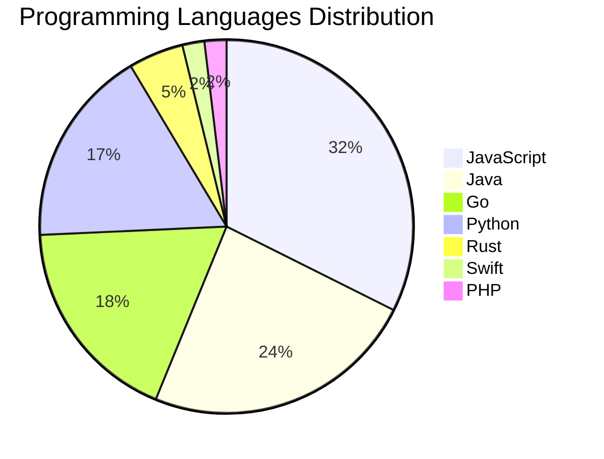

# 🚀 DevTech Auto News - Enhanced Edition


**DevTech Auto News Enhanced** is an advanced automated bot that aggregates trending topics in **AI**, **Web Development**, **Mobile**, **Cloud**, **DevOps**, and more from multiple sources including:

- 📰 [Dev.to](https://dev.to) - Developer community articles
- 🔥 [HackerNews](https://news.ycombinator.com) - Tech news discussions  
- 💻 [GitHub Trending](https://github.com/trending) - Trending repositories
- 🎯 Curated Interview Questions from multiple languages

## ✨ Features

✅ **Multi-Source Aggregation**: Combines articles from Dev.to, HackerNews, and GitHub  
✅ **Smart Categorization**: Automatically categorizes content into 10+ topics  
✅ **Image Support**: Displays cover images for visual appeal  
✅ **Pagination**: Fetches 50+ articles per update with deduplication  
✅ **Language Statistics**: Tracks programming language trends with charts  
✅ **Interview Questions**: Daily coding interview questions in multiple languages  
✅ **GitHub Actions**: Runs every 15 minutes automatically  

---

## 📊 Statistics Dashboard

### 📊 Articles by Category

**AI**: 🟦🟦🟦🟦🟦🟦🟦🟦🟦🟦🟦🟦🟦🟦🟦🟦🟦🟦🟦🟦 43 (41.0%)

**JavaScript**: 🟦🟦🟦🟦🟦🟦🟦🟦🟦🟦🟦🟦🟦🟦🟦🟦 34 (32.4%)

**Tools**: 🟦🟦🟦🟦🟦🟦🟦🟦🟦🟦🟦🟦🟦 29 (27.6%)

**Python**: 🟦🟦🟦🟦🟦🟦🟦🟦 18 (17.1%)

**Cloud**: 🟦🟦🟦🟦 9 (8.6%)

**WebDev**: 🟦🟦🟦🟦 8 (7.6%)

**Security**: 🟦🟦 5 (4.8%)

**DevOps**: 🟦🟦 4 (3.8%)

**Database**: 🟦🟦 4 (3.8%)

**Mobile**: 🟦 2 (1.9%)


### 📡 Sources

- **Dev.to**: 60 articles
- **HackerNews**: 30 articles
- **GitHub**: 15 articles


### 💻 Programming Language Trends

```
JavaScript      ██████████████████████████████ 32.4 (32.4%)
Java            ██████████████████████ 23.8 (23.8%)
Go              █████████████████ 18.1 (18.1%)
Python          ████████████████ 17.1 (17.1%)
Rust            ████ 4.8 (4.8%)
Swift           ██ 1.9 (1.9%)
PHP             ██ 1.9 (1.9%)

```




### 🏷️ Trending Tags

               


---

## 🛠️ How It Works

1. **Multi-Source Fetch**: Pulls from Dev.to (2 pages), HackerNews (3 topics), GitHub (3 languages)
2. **Smart Filter**: Uses keyword matching across 10+ categories  
3. **Deduplication**: Removes duplicate URLs  
4. **Image Extraction**: Captures cover images when available  
5. **Statistics**: Generates language trends and category breakdowns  
6. **Update Files**: Regenerates README and appends to comprehensive log  

---

## 📦 Installation & Usage

```bash
# Clone the repository
git clone https://github.com/Derrick-MUGISHA/github-activity-bot.git
cd github-activity-bot

# Install dependencies  
npm install

# Run manually
npm start

# Test mode
npm run test
```

---


# 🚀 DevTech Auto News - Enhanced Edition

## 📅 Latest Updates (2026-02-17 23:00 CAT)


### 🖼️ Featured Articles

<table>
<tr>
  <td align="center" width="33%">
    <a href="https://dev.to/devteam/top-7-featured-dev-posts-of-the-week-3h5k">
      
      <br/>
      <b>Top 7 Featured DEV Posts of the Week</b>
    </a>
    <br/>
    <sub>Dev.to</sub>
  </td>
  <td align="center" width="33%">
    <a href="https://dev.to/devteam/introducing-our-next-dev-education-track-build-multi-agent-systems-with-adk-4bg8">
      
      <br/>
      <b>Introducing Our Next DEV Education Track: "Build M...</b>
    </a>
    <br/>
    <sub>Dev.to</sub>
  </td>
  <td align="center" width="33%">
    <a href="https://dev.to/itsugo/how-a-dev-friend-and-i-brought-two-avatars-to-life-chp">
      
      <br/>
      <b>How a DEV Friend and I Brought Two Avatars to Life</b>
    </a>
    <br/>
    <sub>Dev.to</sub>
  </td>
</tr>
<tr>
  <td align="center" width="33%">
    <a href="https://dev.to/ben/meme-monday-44jk">
      
      <br/>
      <b>Meme Monday</b>
    </a>
    <br/>
    <sub>Dev.to</sub>
  </td>
  <td align="center" width="33%">
    <a href="https://dev.to/googlecloud/how-my-team-aligns-on-prompting-for-production-1lpf">
      
      <br/>
      <b>How My Team Aligns on Prompting for Production</b>
    </a>
    <br/>
    <sub>Dev.to</sub>
  </td>
  <td align="center" width="33%">
    <a href="https://dev.to/iceonfire/im-done-with-magic-heres-what-i-built-instead-988">
      
      <br/>
      <b>I'm Done With Magic. Here's What I Built Instead.</b>
    </a>
    <br/>
    <sub>Dev.to</sub>
  </td>
</tr>
</table>


### 📰 Top Headlines

- [Top 7 Featured DEV Posts of the Week](https://dev.to/devteam/top-7-featured-dev-posts-of-the-week-3h5k) _[Dev.to]_
- [Introducing Our Next DEV Education Track: "Build Multi-Agent Systems with ADK"](https://dev.to/devteam/introducing-our-next-dev-education-track-build-multi-agent-systems-with-adk-4bg8) _[Dev.to]_
- [How a DEV Friend and I Brought Two Avatars to Life](https://dev.to/itsugo/how-a-dev-friend-and-i-brought-two-avatars-to-life-chp) _[Dev.to]_
- [Meme Monday](https://dev.to/ben/meme-monday-44jk) _[Dev.to]_
- [How My Team Aligns on Prompting for Production](https://dev.to/googlecloud/how-my-team-aligns-on-prompting-for-production-1lpf) _[Dev.to]_
- [I'm Done With Magic. Here's What I Built Instead.](https://dev.to/iceonfire/im-done-with-magic-heres-what-i-built-instead-988) _[Dev.to]_
- [Do people still genuinely care about technical articles ?](https://dev.to/miracool/do-people-still-genuinely-care-about-technical-articles--1hfk) _[Dev.to]_
- [How to Run Podman Quadlets on Raspberry Pi](https://dev.to/project42/how-to-run-podman-quadlets-on-raspberry-pi-3nc1) _[Dev.to]_
- [The Ghost in the Training Set](https://dev.to/abahgat/the-ghost-in-the-training-set-496n) _[Dev.to]_
- [CNN-LSTM Hybrid Architecture for Thanglish-to-Tamil : Bridging 26 Letters to 247 Characters](https://dev.to/aj1thkr1sh/cnn-lstm-hybrid-architecture-for-thanglish-to-tamil-bridging-26-letters-to-247-characters-j4n) _[Dev.to]_
- [Turning Missing Avatars into a Design Opportunity](https://dev.to/bansal/turning-missing-avatars-into-a-design-opportunity-2ahl) _[Dev.to]_
- [Building a Native-Feeling Theme System in SwiftUI](https://dev.to/rozd/building-a-native-feeling-theme-system-in-swiftui-h1k) _[Dev.to]_
- [6 Pitfalls of Dynamic OG Image Generation on Cloudflare Workers (Satori + resvg-wasm)](https://dev.to/devoresyah/6-pitfalls-of-dynamic-og-image-generation-on-cloudflare-workers-satori-resvg-wasm-1kle) _[Dev.to]_
- [From Idea to Maintainable UI: A Practical React/TS Sprint Workflow](https://dev.to/semosem_20/from-idea-to-maintainable-ui-a-practical-reactts-sprint-workflow-4fak) _[Dev.to]_
- [Visualizing UV on a Polygon2D in Godot](https://dev.to/datadeer/visualizing-uv-on-a-polygon2d-in-godot-1e8o) _[Dev.to]_
- [Command Center for AI Coding Agents (Claude Code + Codex)](https://dev.to/deivid11/command-center-for-ai-coding-agents-claude-code-codex-3d5g) _[Dev.to]_
- [Adding Web Analytics on Vercel Is Easier Than Ever (Free & Built-In)](https://dev.to/shofol/adding-web-analytics-on-vercel-is-easier-than-ever-free-built-in-57bl) _[Dev.to]_
- [Software engineering is not dead](https://dev.to/juan1003/software-engineering-is-not-dead-5flc) _[Dev.to]_
- [I Built a CLI That Turns Claude Code's /insights Report Into Actionable Skills, Rules, and Workflows](https://dev.to/yahav10/i-built-a-cli-that-turns-claude-codes-insights-report-into-actionable-skills-rules-and-workflows-377) _[Dev.to]_
- [Checking Django Settings](https://dev.to/adamghill/checking-django-settings-12g4) _[Dev.to]_

_Last automated update: Tue, 17 Feb 2026 23:18:57 CAT_


## 💡 Daily Interview Questions

_Sharpen your skills with these curated questions_

### 1. Database: What is the difference between SQL and NoSQL databases?

**Difficulty**: Easy | **Topics**: databases, design

<details>
<summary>💡 Hint</summary>

Schema, scalability, ACID vs BASE

</details>

### 2. NodeJS: What is the difference between process.nextTick() and setImmediate()?

**Difficulty**: Medium | **Topics**: event loop, async

<details>
<summary>💡 Hint</summary>

Execution timing, event loop phases

</details>

### 3. React: What is the Virtual DOM and how does React use it?

**Difficulty**: Easy | **Topics**: rendering, performance

<details>
<summary>💡 Hint</summary>

Diffing algorithm, reconciliation, efficiency

</details>


---

## 📚 Resources

- [Full News Archive](./data/news_log.md) - Complete history of all fetched articles
- [Statistics JSON](./data/stats.json) - Raw statistics data
- [Categorized Data](./data/categorized.json) - Articles organized by category
- [Interview Questions](./data/interview_questions.json) - Complete question bank

---

## 🤝 Contributing

Want to add more sources, categories, or interview questions? Feel free to:

1. Fork this repository
2. Add your improvements
3. Submit a pull request

---

## 📄 License

MIT License - Feel free to use and modify!

---

<p align="center">
  <b>Last automated update: Tue, 17 Feb 2026 21:18:57 GMT</b><br/>
  <sub>Powered by GitHub Actions | Made with ❤️ for developers</sub>
</p>

---

## 🔗 Quick Links

- [View Workflow](https://github.com/Derrick-MUGISHA/github-activity-bot/actions)
- [Report Issue](https://github.com/Derrick-MUGISHA/github-activity-bot/issues)
- [Suggest Feature](https://github.com/Derrick-MUGISHA/github-activity-bot/issues/new)
