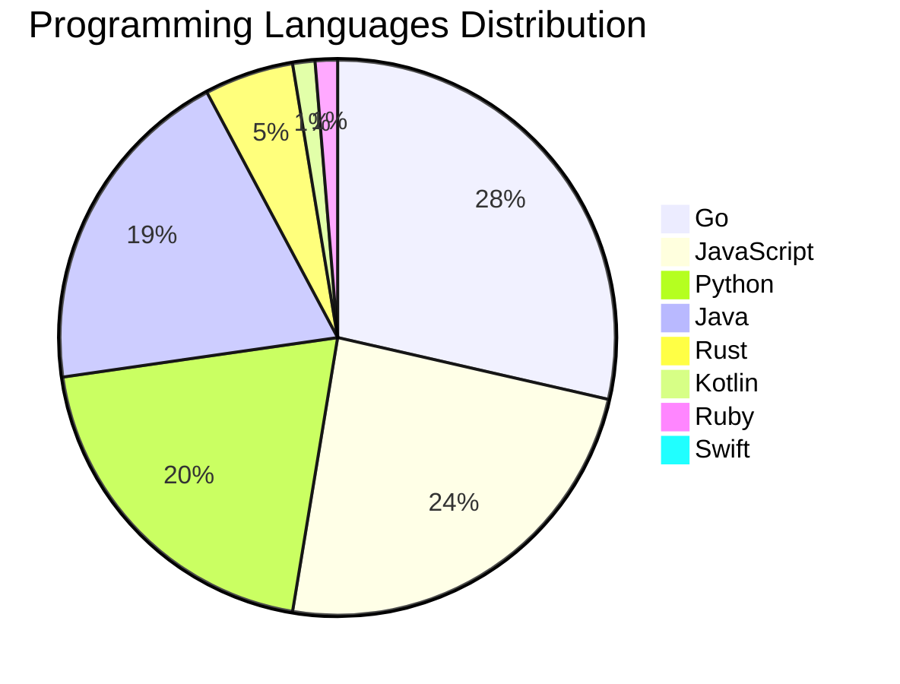

<div align="center">

# 📰 DevTech Auto News

**Your always-fresh digest of developer & AI tech news — curated automatically, around the clock.**


Aggregating [Dev.to](https://dev.to) · [Hacker News](https://news.ycombinator.com) · [GitHub Trending](https://github.com/trending) · [Lobste.rs](https://lobste.rs) · [Stack Overflow](https://stackoverflow.com) · [TechCrunch](https://techcrunch.com) · [freeCodeCamp](https://www.freecodecamp.org/news) — refreshed by GitHub Actions around the clock.

**[📰 Headlines](#-latest-headlines) · [💡 Interview Prep](#-interview-question-of-the-hour) · [📊 Statistics](#-statistics) · [⚙️ How It Works](#%EF%B8%8F-how-it-works)**

</div>

---

## 📰 Latest Headlines

> 🕐 Edition of **2026-08-01 23:00 CAT** — refreshed automatically, all day, every day.

### ✨ Featured Stories

<table>
<tr>
  <td align="center" width="33%">
    <a href="https://dev.to/rdiegoss/your-rag-copilot-cant-count-stop-letting-it-try-2ie3">
      
      <br/>
      <b>Your RAG copilot can't count — stop letting it try</b>
    </a>
    <br/>
    <sub>Dev.to</sub>
  </td>
  <td align="center" width="33%">
    <a href="https://dev.to/devteam/join-our-latest-frontend-challenge-comfort-food-edition-28a0">
      
      <br/>
      <b>Join our latest Frontend Challenge: Comfort Food E...</b>
    </a>
    <br/>
    <sub>Dev.to</sub>
  </td>
  <td align="center" width="33%">
    <a href="https://dev.to/devteam/what-was-your-win-this-week-1ed">
      
      <br/>
      <b>What was your win this week?</b>
    </a>
    <br/>
    <sub>Dev.to</sub>
  </td>
</tr>
<tr>
  <td align="center" width="33%">
    <a href="https://dev.to/gde/amazon-bedrock-agents-orchestrating-google-adk-over-a2a-5c2b">
      
      <br/>
      <b>Amazon Bedrock Agents Orchestrating Google ADK ove...</b>
    </a>
    <br/>
    <sub>Dev.to</sub>
  </td>
  <td align="center" width="33%">
    <a href="https://dev.to/daniellewashington/devrelcon-adult-summer-camp-and-my-first-time-speaking-4p2d">
      
      <br/>
      <b>DevRelCon, Adult Summer Camp, and My First Time Sp...</b>
    </a>
    <br/>
    <sub>Dev.to</sub>
  </td>
  <td align="center" width="33%">
    <a href="https://dev.to/jenueldev/how-to-build-a-local-ai-workspace-like-pewdiepies-odysseus-hardware-models-and-cost-3egh">
      
      <br/>
      <b>How to Build a Local AI Workspace Like PewDiePie's...</b>
    </a>
    <br/>
    <sub>Dev.to</sub>
  </td>
</tr>
</table>


### 🗞️ Top Stories

| # | Headline | Source |
|---|----------|--------|
| 1 | [Your RAG copilot can't count — stop letting it try](https://dev.to/rdiegoss/your-rag-copilot-cant-count-stop-letting-it-try-2ie3) | Dev.to |
| 2 | [Join our latest Frontend Challenge: Comfort Food Edition 🍲](https://dev.to/devteam/join-our-latest-frontend-challenge-comfort-food-edition-28a0) | Dev.to |
| 3 | [What was your win this week?](https://dev.to/devteam/what-was-your-win-this-week-1ed) | Dev.to |
| 4 | [Amazon Bedrock Agents Orchestrating Google ADK over A2A](https://dev.to/gde/amazon-bedrock-agents-orchestrating-google-adk-over-a2a-5c2b) | Dev.to |
| 5 | [DevRelCon, Adult Summer Camp, and My First Time Speaking](https://dev.to/daniellewashington/devrelcon-adult-summer-camp-and-my-first-time-speaking-4p2d) | Dev.to |
| 6 | [How to Build a Local AI Workspace Like PewDiePie's Odysseus: Hardware, Models, and Cost](https://dev.to/jenueldev/how-to-build-a-local-ai-workspace-like-pewdiepies-odysseus-hardware-models-and-cost-3egh) | Dev.to |
| 7 | [Gubernator Weekly Update: CoreDNS Aqueducts, SRE Stack, Network Topology & Cluster Auto-Updates!i](https://dev.to/gde/gubernator-weekly-update-coredns-aqueducts-sre-stack-network-topology-cluster-auto-updates-e1c) | Dev.to |
| 8 | [Data, Context & RAG Lineage Governance for Enterprise AI Agents](https://dev.to/gde/data-context-rag-lineage-governance-for-enterprise-ai-agents-4bdj) | Dev.to |
| 9 | [Switching Tracks in BlocSignal: The Universal State Switchyard for BLoC, Riverpod, and Provider](https://dev.to/gde/switching-tracks-in-blocsignal-the-universal-state-switchyard-for-bloc-riverpod-and-provider-929) | Dev.to |
| 10 | [What is current your "daily driver" coding model? (July 2026)](https://dev.to/peter/what-is-current-your-daily-driver-coding-model-july-2026-24cl) | Dev.to |
| 11 | [The memory layer that never calls an LLM: what that buys, and what it costs](https://dev.to/gde03/the-memory-layer-that-never-calls-an-llm-what-that-buys-and-what-it-costs-12ch) | Dev.to |
| 12 | [Inside the Virtual R&D Lab: How Human Imagination and AI Multi-Agents Shape the Future of Science](https://dev.to/gde/inside-the-virtual-rd-lab-how-human-imagination-and-ai-multi-agents-shape-the-future-of-science-3c6j) | Dev.to |
| 13 | [Fish Audio's $52M Seed: Open Weights Got Them Here](https://dev.to/lukeocodes/fish-audios-52m-seed-open-weights-got-them-here-25e5) | Dev.to |
| 14 | [Finally — Hard Caps to Limit Your Google Cloud Spend](https://dev.to/gde/finally-hard-caps-to-limit-your-google-cloud-spend-1363) | Dev.to |
| 15 | [Build and Deploy Java AI Agents with Google ADK](https://dev.to/gde/build-and-deploy-java-ai-agents-with-google-adk-28oi) | Dev.to |
| 16 | [Passkeys Explained Simply](https://dev.to/thomasbnt/passkeys-explained-simply-52jk) | Dev.to |
| 17 | [Skills vs MCP: How AI tools have evolved](https://dev.to/googleai/skills-vs-mcp-how-ai-tools-have-evolved-3pmk) | Dev.to |
| 18 | [I had two weeks, an 8-foot keyboard, and a Wordle Workflow](https://dev.to/temporalio/i-had-two-weeks-an-8-foot-keyboard-and-a-wordle-workflow-15h) | Dev.to |
| 19 | [Congrats to the DEV Weekend Challenge: Passion Edition Winners!](https://dev.to/devteam/congrats-to-the-dev-weekend-challenge-passion-edition-winners-30ne) | Dev.to |
| 20 | [Does it still make sense to learn how to code?](https://dev.to/robertobutti/does-it-still-make-sense-to-learn-how-to-code-3g7g) | Dev.to |

<sub>Last fetched: Sat, 01 Aug 2026 23:36:11 CAT</sub>


---

## 💡 Interview Question of the Hour

> Sharpen your skills — new questions selected on every update. Try answering before opening the hint!

**1. `DataStructures` — Implement a function to reverse a linked list**

&nbsp;&nbsp;&nbsp;&nbsp;🎯 Medium · 🏷 linked lists, pointers

<details>
<summary>&nbsp;&nbsp;&nbsp;&nbsp;💡 Show hint</summary>

> Iterative or recursive, three pointers

</details>

**2. `Java` — What is the difference between abstract class and interface?**

&nbsp;&nbsp;&nbsp;&nbsp;🎯 Easy · 🏷 OOP, design

<details>
<summary>&nbsp;&nbsp;&nbsp;&nbsp;💡 Show hint</summary>

> Multiple inheritance, method implementation, use cases

</details>

**3. `Java` — What is the difference between abstract class and interface?**

&nbsp;&nbsp;&nbsp;&nbsp;🎯 Easy · 🏷 OOP, design

<details>
<summary>&nbsp;&nbsp;&nbsp;&nbsp;💡 Show hint</summary>

> Multiple inheritance, method implementation, use cases

</details>


---

## 📊 Statistics

#### 🗂 Articles by Category

| Category | Articles | Share | |
|----------|---------:|------:|---|
| **AI** | 77 | 41.8% | `████████████████████` |
| **JavaScript** | 37 | 20.1% | `██████████░░░░░░░░░░` |
| **Tools** | 37 | 20.1% | `██████████░░░░░░░░░░` |
| **Python** | 31 | 16.8% | `████████░░░░░░░░░░░░` |
| **Security** | 21 | 11.4% | `█████░░░░░░░░░░░░░░░` |
| **Cloud** | 17 | 9.2% | `████░░░░░░░░░░░░░░░░` |
| **DevOps** | 13 | 7.1% | `███░░░░░░░░░░░░░░░░░` |
| **WebDev** | 7 | 3.8% | `██░░░░░░░░░░░░░░░░░░` |
| **Mobile** | 6 | 3.3% | `██░░░░░░░░░░░░░░░░░░` |
| **Database** | 2 | 1.1% | `█░░░░░░░░░░░░░░░░░░░` |

<sub>Articles can match more than one category, so shares may sum to over 100%.</sub>


#### 📡 Articles by Source

| Source | Articles |
|--------|---------:|
| Dev.to | 60 |
| HackerNews | 49 |
| GitHub | 25 |
| Lobste.rs | 10 |
| StackOverflow | 20 |
| TechCrunch | 10 |
| freeCodeCamp | 10 |


#### 💻 Programming Language Trends

```
Go              ██████████████████████████████ 28.4%
JavaScript      █████████████████████████ 23.9%
Python          █████████████████████ 20.0%
Java            ████████████████████ 19.4%
Rust            █████ 5.2%
Kotlin          █ 1.3%
Ruby            █ 1.3%
Swift           █ 0.6%

```




#### 🏷 Trending Topics

            


---

## ⚙️ How It Works

This repository is a fully automated news pipeline. On every run, GitHub Actions:

1. **Fetches** the latest articles from seven sources: Dev.to, Hacker News, GitHub Trending, Lobste.rs, Stack Overflow, TechCrunch, and freeCodeCamp
2. **Deduplicates and categorizes** them across 10+ topics using keyword matching
3. **Extracts cover images** and computes language & category statistics
4. **Rebuilds this README** and appends everything to the [full archive](./data/news_log.md)
5. **Commits and pushes** the result — no human intervention needed

<details>
<summary><b>🚀 Run it yourself</b></summary>

```bash
git clone https://github.com/Derrick-MUGISHA/github-activity-bot.git
cd github-activity-bot
npm install
npm start
```

Fork the repo, enable GitHub Actions, and you have your own self-updating news feed.

</details>

<details>
<summary><b>📚 Data & resources</b></summary>

- [Full news archive](./data/news_log.md) — complete history of every fetched article
- [Statistics](./data/stats.json) — raw stats data (JSON)
- [Categorized articles](./data/categorized.json) — articles grouped by topic
- [Interview question bank](./data/interview_questions.json) — the full question set

</details>

---

## 🤝 Contributing

Ideas for new sources, categories, or interview questions are welcome — [open an issue](https://github.com/Derrick-MUGISHA/github-activity-bot/issues/new) or submit a pull request.

## 📄 License

Released under the [MIT License](https://opensource.org/licenses/MIT) — free to use, fork, and modify.

---

<div align="center">
  <sub>🤖 Last automated update: <b>Sat, 01 Aug 2026 21:36:11 GMT</b></sub><br/>
  <sub>Powered by GitHub Actions · Built with ❤️ by <a href="https://github.com/Derrick-MUGISHA">Derrick MUGISHA</a></sub>
</div>
