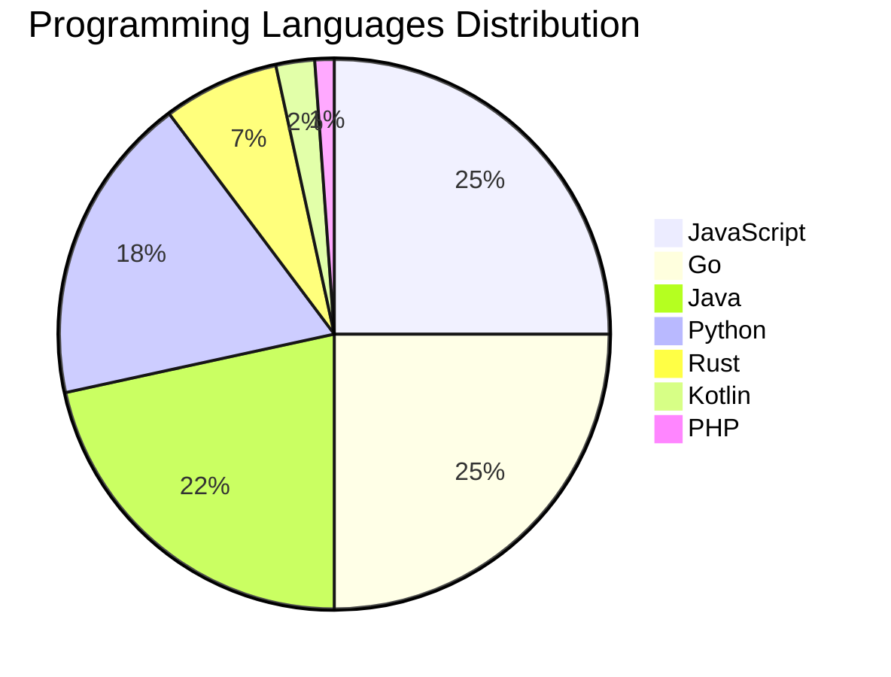

# 🚀 DevTech Auto News - Enhanced Edition


**DevTech Auto News Enhanced** is an advanced automated bot that aggregates trending topics in **AI**, **Web Development**, **Mobile**, **Cloud**, **DevOps**, and more from multiple sources including:

- 📰 [Dev.to](https://dev.to) - Developer community articles
- 🔥 [HackerNews](https://news.ycombinator.com) - Tech news discussions  
- 💻 [GitHub Trending](https://github.com/trending) - Trending repositories
- 🎯 Curated Interview Questions from multiple languages

## ✨ Features

✅ **Multi-Source Aggregation**: Combines articles from Dev.to, HackerNews, and GitHub  
✅ **Smart Categorization**: Automatically categorizes content into 10+ topics  
✅ **Image Support**: Displays cover images for visual appeal  
✅ **Pagination**: Fetches 50+ articles per update with deduplication  
✅ **Language Statistics**: Tracks programming language trends with charts  
✅ **Interview Questions**: Daily coding interview questions in multiple languages  
✅ **GitHub Actions**: Runs every 15 minutes automatically  

---

## 📊 Statistics Dashboard

### 📊 Articles by Category

**AI**: 🟦🟦🟦🟦🟦🟦🟦🟦🟦🟦🟦🟦🟦🟦🟦🟦🟦🟦🟦🟦 44 (41.9%)

**Tools**: 🟦🟦🟦🟦🟦🟦🟦🟦🟦🟦 23 (21.9%)

**JavaScript**: 🟦🟦🟦🟦🟦🟦🟦🟦🟦🟦 22 (21.0%)

**Python**: 🟦🟦🟦🟦🟦🟦🟦 16 (15.2%)

**Cloud**: 🟦🟦🟦🟦🟦 11 (10.5%)

**WebDev**: 🟦🟦🟦 6 (5.7%)

**DevOps**: 🟦 3 (2.9%)

**Mobile**: 🟦 3 (2.9%)

**Database**: 🟦 3 (2.9%)

**Security**:  1 (1.0%)


### 📡 Sources

- **Dev.to**: 60 articles
- **HackerNews**: 30 articles
- **GitHub**: 15 articles


### 💻 Programming Language Trends

```
JavaScript      ██████████████████████████████ 25.0 (25.0%)
Go              ██████████████████████████████ 25.0 (25.0%)
Java            ██████████████████████████ 21.6 (21.6%)
Python          ██████████████████████ 18.2 (18.2%)
Rust            ████████ 6.8 (6.8%)
Kotlin          ███ 2.3 (2.3%)
PHP             █ 1.1 (1.1%)

```




### 🏷️ Trending Tags

               


---

## 🛠️ How It Works

1. **Multi-Source Fetch**: Pulls from Dev.to (2 pages), HackerNews (3 topics), GitHub (3 languages)
2. **Smart Filter**: Uses keyword matching across 10+ categories  
3. **Deduplication**: Removes duplicate URLs  
4. **Image Extraction**: Captures cover images when available  
5. **Statistics**: Generates language trends and category breakdowns  
6. **Update Files**: Regenerates README and appends to comprehensive log  

---

## 📦 Installation & Usage

```bash
# Clone the repository
git clone https://github.com/Derrick-MUGISHA/github-activity-bot.git
cd github-activity-bot

# Install dependencies  
npm install

# Run manually
npm start

# Test mode
npm run test
```

---


# 🚀 DevTech Auto News - Enhanced Edition

## 📅 Latest Updates (2026-05-20 10:00 CAT)


### 🖼️ Featured Articles

<table>
<tr>
  <td align="center" width="33%">
    <a href="https://dev.to/valeriavg/great-little-software-rackula-1pa1">
      
      <br/>
      <b>Great Little Software: Rackula</b>
    </a>
    <br/>
    <sub>Dev.to</sub>
  </td>
  <td align="center" width="33%">
    <a href="https://dev.to/shubhradev/i-built-a-free-debugger-because-nextjs-16-use-cache-was-completely-invisible-during-development-4a8">
      
      <br/>
      <b>I built a free debugger because Next.js 16 'use ca...</b>
    </a>
    <br/>
    <sub>Dev.to</sub>
  </td>
  <td align="center" width="33%">
    <a href="https://dev.to/googleai/gemini-35-flash-developer-guide-1i46">
      
      <br/>
      <b>Gemini 3.5 Flash Developer Guide</b>
    </a>
    <br/>
    <sub>Dev.to</sub>
  </td>
</tr>
<tr>
  <td align="center" width="33%">
    <a href="https://dev.to/devteam/tune-in-and-join-the-google-io-2026-writing-challenge-1000-in-prizes-4apl">
      
      <br/>
      <b>Tune in and Join the Google I/O 2026 Writing Chall...</b>
    </a>
    <br/>
    <sub>Dev.to</sub>
  </td>
  <td align="center" width="33%">
    <a href="https://dev.to/aws/terminal-superpowers-you-should-be-using-in-2026-38b4">
      
      <br/>
      <b>Terminal Superpowers You Should Be Using in 2026</b>
    </a>
    <br/>
    <sub>Dev.to</sub>
  </td>
  <td align="center" width="33%">
    <a href="https://dev.to/googleai/demystifying-ai-agents-with-turtle-gemma-4ajj">
      
      <br/>
      <b>Demystifying AI Agents with Turtle & Gemma</b>
    </a>
    <br/>
    <sub>Dev.to</sub>
  </td>
</tr>
</table>


### 📰 Top Headlines

- [Great Little Software: Rackula](https://dev.to/valeriavg/great-little-software-rackula-1pa1) _[Dev.to]_
- [I built a free debugger because Next.js 16 'use cache' was completely invisible during development](https://dev.to/shubhradev/i-built-a-free-debugger-because-nextjs-16-use-cache-was-completely-invisible-during-development-4a8) _[Dev.to]_
- [Gemini 3.5 Flash Developer Guide](https://dev.to/googleai/gemini-35-flash-developer-guide-1i46) _[Dev.to]_
- [Tune in and Join the Google I/O 2026 Writing Challenge: $1,000 in Prizes!!](https://dev.to/devteam/tune-in-and-join-the-google-io-2026-writing-challenge-1000-in-prizes-4apl) _[Dev.to]_
- [Terminal Superpowers You Should Be Using in 2026](https://dev.to/aws/terminal-superpowers-you-should-be-using-in-2026-38b4) _[Dev.to]_
- [Demystifying AI Agents with Turtle & Gemma](https://dev.to/googleai/demystifying-ai-agents-with-turtle-gemma-4ajj) _[Dev.to]_
- [Building a Rust A2A Agent](https://dev.to/gde/building-a-rust-a2a-agent-4626) _[Dev.to]_
- [DeepSeek Is Running Inside Your Favorite AI Tool – And Nobody Told You](https://dev.to/harsh2644/deepseek-is-running-inside-your-favorite-ai-tool-and-nobody-told-you-5g47) _[Dev.to]_
- [Google Cloud & Claude Code workshop - 5/29 in SF, CA.](https://dev.to/googleai/google-cloud-claude-code-workshop-529-in-sf-ca-4k87) _[Dev.to]_
- [Some Notes on OMO Orchestrator Claude Alternatives](https://dev.to/tythos/some-notes-on-omo-orchestrator-claude-alternatives-1a7c) _[Dev.to]_
- [Building a Local-First Hotel Receptionist with Gemma 4, GGUF, and llama.cpp](https://dev.to/chuanman2707/building-a-local-first-hotel-receptionist-with-gemma-4-gguf-and-llamacpp-51a4) _[Dev.to]_
- [Genkit Middleware: Intercept, Extend and Harden your Gen AI Pipelines](https://dev.to/gde/genkit-middleware-intercept-extend-and-harden-your-gen-ai-pipelines-4k03) _[Dev.to]_
- [Unity begone](https://dev.to/sarthakganguly/unity-begone-56kc) _[Dev.to]_
- [Giving AI agents knowledge they were never trained on](https://dev.to/jgauffin/giving-ai-agents-knowledge-they-were-never-trained-on-5fd7) _[Dev.to]_
- [vLLM Gemma4 26B Tuning on v6e-4](https://dev.to/gde/vllm-gemma4-26b-tuning-on-v6e-4-79o) _[Dev.to]_
- [Deploying a Rust MCP Server to Amazon Lambda with Gemini CLI](https://dev.to/gde/deploying-a-rust-mcp-server-to-amazon-lambda-with-gemini-cli-41hd) _[Dev.to]_
- [How AI is changing my job as a Staff Engineer: Tracer bullets](https://dev.to/vinibrsl/how-ai-is-changing-my-job-as-a-staff-engineer-tracer-bullets-4nck) _[Dev.to]_
- [Google Cloud x NVIDIA Meet Up - 5/20/26 @ 5:30pm, Mountain View, CA](https://dev.to/googleai/google-cloud-x-nvidia-meet-up-52026-530pm-mountain-view-ca-9ea) _[Dev.to]_
- [Deploying a Rust MCP Server to Amazon EKS](https://dev.to/gde/deploying-a-rust-mcp-server-to-amazon-eks-183g) _[Dev.to]_
- [GPT-5.5 Instant: The New ChatGPT Default Model Complete Guide 2026](https://dev.to/akaranjkar08/gpt-55-instant-the-new-chatgpt-default-model-complete-guide-2026-1l4) _[Dev.to]_

_Last automated update: Wed, 20 May 2026 10:06:05 CAT_


## 💡 Daily Interview Questions

_Sharpen your skills with these curated questions_

### 1. Java: Explain the Java memory model

**Difficulty**: Hard | **Topics**: memory, JVM

<details>
<summary>💡 Hint</summary>

Heap, stack, garbage collection

</details>

### 2. Python: Implement a context manager using __enter__ and __exit__

**Difficulty**: Hard | **Topics**: context managers, resource management

<details>
<summary>💡 Hint</summary>

with statement, setup/teardown, exception handling

</details>

### 3. NodeJS: Implement rate limiting for an API

**Difficulty**: Hard | **Topics**: security, middleware

<details>
<summary>💡 Hint</summary>

Token bucket, sliding window, Redis

</details>


---

## 📚 Resources

- [Full News Archive](./data/news_log.md) - Complete history of all fetched articles
- [Statistics JSON](./data/stats.json) - Raw statistics data
- [Categorized Data](./data/categorized.json) - Articles organized by category
- [Interview Questions](./data/interview_questions.json) - Complete question bank

---

## 🤝 Contributing

Want to add more sources, categories, or interview questions? Feel free to:

1. Fork this repository
2. Add your improvements
3. Submit a pull request

---

## 📄 License

MIT License - Feel free to use and modify!

---

<p align="center">
  <b>Last automated update: Wed, 20 May 2026 08:06:05 GMT</b><br/>
  <sub>Powered by GitHub Actions | Made with ❤️ for developers</sub>
</p>

---

## 🔗 Quick Links

- [View Workflow](https://github.com/Derrick-MUGISHA/github-activity-bot/actions)
- [Report Issue](https://github.com/Derrick-MUGISHA/github-activity-bot/issues)
- [Suggest Feature](https://github.com/Derrick-MUGISHA/github-activity-bot/issues/new)
