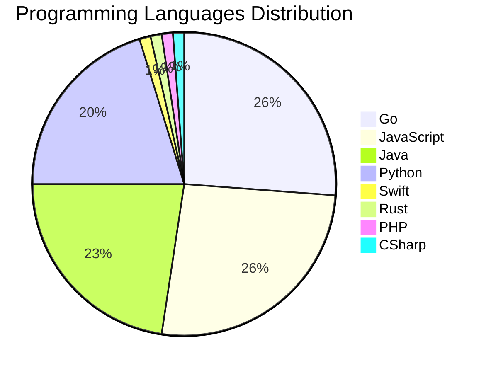

# 🚀 DevTech Auto News - Enhanced Edition


**DevTech Auto News Enhanced** is an advanced automated bot that aggregates trending topics in **AI**, **Web Development**, **Mobile**, **Cloud**, **DevOps**, and more from multiple sources including:

- 📰 [Dev.to](https://dev.to) - Developer community articles
- 🔥 [HackerNews](https://news.ycombinator.com) - Tech news discussions  
- 💻 [GitHub Trending](https://github.com/trending) - Trending repositories
- 🎯 Curated Interview Questions from multiple languages

## ✨ Features

✅ **Multi-Source Aggregation**: Combines articles from Dev.to, HackerNews, and GitHub  
✅ **Smart Categorization**: Automatically categorizes content into 10+ topics  
✅ **Image Support**: Displays cover images for visual appeal  
✅ **Pagination**: Fetches 50+ articles per update with deduplication  
✅ **Language Statistics**: Tracks programming language trends with charts  
✅ **Interview Questions**: Daily coding interview questions in multiple languages  
✅ **GitHub Actions**: Runs every 15 minutes automatically  

---

## 📊 Statistics Dashboard

### 📊 Articles by Category

**AI**: 🟦🟦🟦🟦🟦🟦🟦🟦🟦🟦🟦🟦🟦🟦🟦🟦🟦🟦🟦🟦 49 (47.6%)

**Tools**: 🟦🟦🟦🟦🟦🟦🟦🟦🟦🟦🟦🟦🟦 32 (31.1%)

**JavaScript**: 🟦🟦🟦🟦🟦🟦🟦🟦🟦 22 (21.4%)

**Python**: 🟦🟦🟦🟦🟦🟦🟦 17 (16.5%)

**Cloud**: 🟦🟦🟦🟦🟦 13 (12.6%)

**DevOps**: 🟦🟦🟦 7 (6.8%)

**WebDev**: 🟦🟦 5 (4.9%)

**Security**: 🟦 3 (2.9%)

**Database**: 🟦 2 (1.9%)

**Mobile**:  1 (1.0%)


### 📡 Sources

- **Dev.to**: 58 articles
- **HackerNews**: 30 articles
- **GitHub**: 15 articles


### 💻 Programming Language Trends

```
Go              ██████████████████████████████ 26.2 (26.2%)
JavaScript      ██████████████████████████████ 26.2 (26.2%)
Java            ██████████████████████████ 22.6 (22.6%)
Python          ███████████████████████ 20.2 (20.2%)
Swift           █ 1.2 (1.2%)
Rust            █ 1.2 (1.2%)
PHP             █ 1.2 (1.2%)
CSharp          █ 1.2 (1.2%)

```




### 🏷️ Trending Tags

               


---

## 🛠️ How It Works

1. **Multi-Source Fetch**: Pulls from Dev.to (2 pages), HackerNews (3 topics), GitHub (3 languages)
2. **Smart Filter**: Uses keyword matching across 10+ categories  
3. **Deduplication**: Removes duplicate URLs  
4. **Image Extraction**: Captures cover images when available  
5. **Statistics**: Generates language trends and category breakdowns  
6. **Update Files**: Regenerates README and appends to comprehensive log  

---

## 📦 Installation & Usage

```bash
# Clone the repository
git clone https://github.com/Derrick-MUGISHA/github-activity-bot.git
cd github-activity-bot

# Install dependencies  
npm install

# Run manually
npm start

# Test mode
npm run test
```

---


# 🚀 DevTech Auto News - Enhanced Edition

## 📅 Latest Updates (2026-06-08 11:00 CAT)


### 🖼️ Featured Articles

<table>
<tr>
  <td align="center" width="33%">
    <a href="https://dev.to/googlecloud/seamless-scaling-with-vpa-in-place-pod-resize-on-gke-117p">
      
      <br/>
      <b>Seamless scaling with VPA In-place Pod Resize on G...</b>
    </a>
    <br/>
    <sub>Dev.to</sub>
  </td>
  <td align="center" width="33%">
    <a href="https://dev.to/rodrigovidal/physics-engineering-and-architecture-in-software-systems-and-the-obsession-with-architecture-68j">
      
      <br/>
      <b>Physics, Engineering, and Architecture in Software...</b>
    </a>
    <br/>
    <sub>Dev.to</sub>
  </td>
  <td align="center" width="33%">
    <a href="https://dev.to/ingosteinke/dystopian-civilization-scenarios-4422">
      
      <br/>
      <b>Dystopian Civilization Scenarios</b>
    </a>
    <br/>
    <sub>Dev.to</sub>
  </td>
</tr>
<tr>
  <td align="center" width="33%">
    <a href="https://dev.to/gde/retour-sur-le-google-io-2026-focus-antigravity-20-33jh">
      
      <br/>
      <b>Retour sur le Google I/O 2026 | Focus Antigravity ...</b>
    </a>
    <br/>
    <sub>Dev.to</sub>
  </td>
  <td align="center" width="33%">
    <a href="https://dev.to/adamrybinski/liveknowledge-engineering-verifiable-knowledge-5gkl">
      
      <br/>
      <b>LiveKnowledge: Engineering Verifiable Knowledge</b>
    </a>
    <br/>
    <sub>Dev.to</sub>
  </td>
  <td align="center" width="33%">
    <a href="https://dev.to/devteam/join-the-june-solstice-game-jam-1000-in-prizes-3jla">
      
      <br/>
      <b>Join the June Solstice Game Jam: $1,000 in prizes!</b>
    </a>
    <br/>
    <sub>Dev.to</sub>
  </td>
</tr>
</table>


### 📰 Top Headlines

- [Seamless scaling with VPA In-place Pod Resize on GKE](https://dev.to/googlecloud/seamless-scaling-with-vpa-in-place-pod-resize-on-gke-117p) _[Dev.to]_
- [Physics, Engineering, and Architecture in Software Systems and the obsession with Architecture](https://dev.to/rodrigovidal/physics-engineering-and-architecture-in-software-systems-and-the-obsession-with-architecture-68j) _[Dev.to]_
- [Dystopian Civilization Scenarios](https://dev.to/ingosteinke/dystopian-civilization-scenarios-4422) _[Dev.to]_
- [Retour sur le Google I/O 2026 | Focus Antigravity 2.0](https://dev.to/gde/retour-sur-le-google-io-2026-focus-antigravity-20-33jh) _[Dev.to]_
- [LiveKnowledge: Engineering Verifiable Knowledge](https://dev.to/adamrybinski/liveknowledge-engineering-verifiable-knowledge-5gkl) _[Dev.to]_
- [Join the June Solstice Game Jam: $1,000 in prizes!](https://dev.to/devteam/join-the-june-solstice-game-jam-1000-in-prizes-3jla) _[Dev.to]_
- [Stop writing prompts to classify text: make evaluation declarative](https://dev.to/ayoolasolomon/stop-writing-prompts-to-classify-text-make-evaluation-declarative-5555) _[Dev.to]_
- [Strategies for running AI workloads on GKE without committed quota](https://dev.to/googlecloud/strategies-for-running-ai-workloads-on-gke-without-committed-quota-484l) _[Dev.to]_
- [I Finished What I Started: Adding AI to Every Layer of a Form Builder (With GitHub Copilot)](https://dev.to/natheesh_kumar_8ad28dbe85/i-finished-what-i-started-adding-ai-to-every-layer-of-a-form-builder-with-github-copilot-942) _[Dev.to]_
- [🦄 Modernizing Wild Rydes with modern technologies](https://dev.to/cferreirasuazo/modernizing-wild-rydes-with-modern-technologies-5g2p) _[Dev.to]_
- [The Software Developer's Guide to AEO](https://dev.to/karllhughes/the-software-developers-guide-to-aeo-1h5h) _[Dev.to]_
- [Extending a MCP/A2A Currency Agent with A2UI](https://dev.to/gde/extending-a-mcpa2a-currency-agent-with-a2ui-5hj3) _[Dev.to]_
- [How Are Developers Actually Using AI At Work?](https://dev.to/sylwia-lask/how-are-developers-actually-using-ai-at-work-4g9c) _[Dev.to]_
- [Broken Software](https://dev.to/alex27/broken-software-b54) _[Dev.to]_
- [Am I Becoming Too Slow for the AI World?](https://dev.to/marcosomma/am-i-becoming-too-slow-for-the-ai-world-1904) _[Dev.to]_
- [Azure Cloud Shell with Antigravity CLI](https://dev.to/gde/azure-cloud-shell-with-antigravity-cli-mn6) _[Dev.to]_
- [Kaggle is making AI benchmark creation effortless](https://dev.to/googleai/kaggle-is-making-ai-benchmark-creation-effortless-1g7n) _[Dev.to]_
- [Query Markdown as a Database with mq-db: SQL, mq, and Interval Indexes](https://dev.to/harehare/query-markdown-as-a-database-with-mq-db-sql-mq-and-interval-indexes-52h9) _[Dev.to]_
- [Cross Cloud A2A Agent Benchmarking with Antigravity CLI](https://dev.to/gde/cross-cloud-a2a-agent-benchmarking-with-antigravity-cli-1enf) _[Dev.to]_
- [🗓️ Monthly Dev Report: May 2026](https://dev.to/francistrdev/monthly-dev-report-may-2026-3gjj) _[Dev.to]_

_Last automated update: Mon, 08 Jun 2026 11:54:51 CAT_


## 💡 Daily Interview Questions

_Sharpen your skills with these curated questions_

### 1. NodeJS: Implement rate limiting for an API

**Difficulty**: Hard | **Topics**: security, middleware

<details>
<summary>💡 Hint</summary>

Token bucket, sliding window, Redis

</details>

### 2. Python: Explain decorators in Python with an example

**Difficulty**: Medium | **Topics**: functions, metaprogramming

<details>
<summary>💡 Hint</summary>

Function wrappers, @syntax, practical uses

</details>

### 3. Database: What is database normalization and denormalization?

**Difficulty**: Medium | **Topics**: design, optimization

<details>
<summary>💡 Hint</summary>

Normal forms, redundancy, performance trade-offs

</details>


---

## 📚 Resources

- [Full News Archive](./data/news_log.md) - Complete history of all fetched articles
- [Statistics JSON](./data/stats.json) - Raw statistics data
- [Categorized Data](./data/categorized.json) - Articles organized by category
- [Interview Questions](./data/interview_questions.json) - Complete question bank

---

## 🤝 Contributing

Want to add more sources, categories, or interview questions? Feel free to:

1. Fork this repository
2. Add your improvements
3. Submit a pull request

---

## 📄 License

MIT License - Feel free to use and modify!

---

<p align="center">
  <b>Last automated update: Mon, 08 Jun 2026 09:54:51 GMT</b><br/>
  <sub>Powered by GitHub Actions | Made with ❤️ for developers</sub>
</p>

---

## 🔗 Quick Links

- [View Workflow](https://github.com/Derrick-MUGISHA/github-activity-bot/actions)
- [Report Issue](https://github.com/Derrick-MUGISHA/github-activity-bot/issues)
- [Suggest Feature](https://github.com/Derrick-MUGISHA/github-activity-bot/issues/new)
