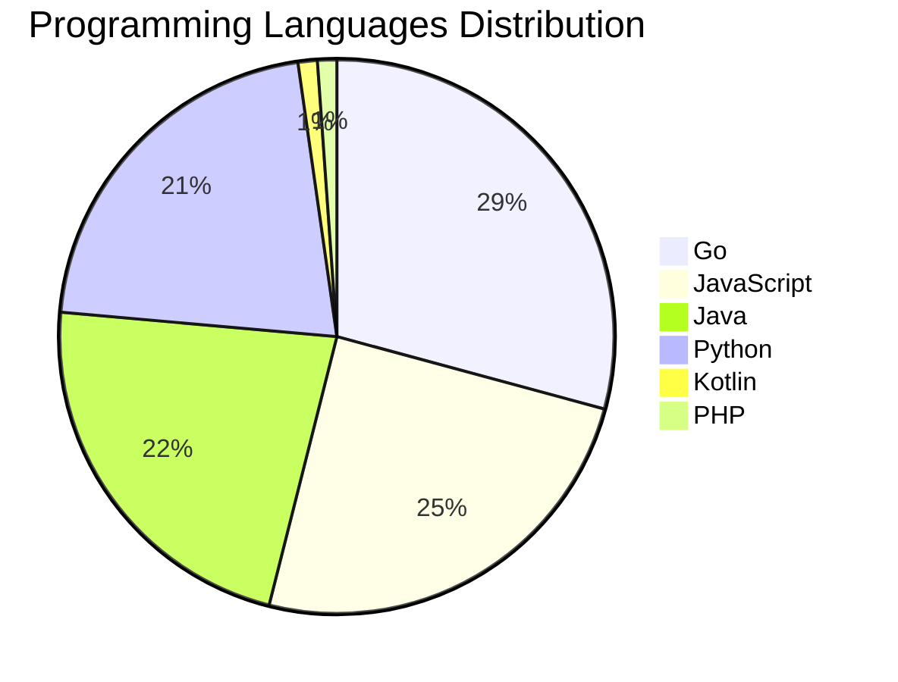

# 🚀 DevTech Auto News - Enhanced Edition


**DevTech Auto News Enhanced** is an advanced automated bot that aggregates trending topics in **AI**, **Web Development**, **Mobile**, **Cloud**, **DevOps**, and more from multiple sources including:

- 📰 [Dev.to](https://dev.to) - Developer community articles
- 🔥 [HackerNews](https://news.ycombinator.com) - Tech news discussions  
- 💻 [GitHub Trending](https://github.com/trending) - Trending repositories
- 🎯 Curated Interview Questions from multiple languages

## ✨ Features

✅ **Multi-Source Aggregation**: Combines articles from Dev.to, HackerNews, and GitHub  
✅ **Smart Categorization**: Automatically categorizes content into 10+ topics  
✅ **Image Support**: Displays cover images for visual appeal  
✅ **Pagination**: Fetches 50+ articles per update with deduplication  
✅ **Language Statistics**: Tracks programming language trends with charts  
✅ **Interview Questions**: Daily coding interview questions in multiple languages  
✅ **GitHub Actions**: Runs every 15 minutes automatically  

---

## 📊 Statistics Dashboard

### 📊 Articles by Category

**AI**: 🟦🟦🟦🟦🟦🟦🟦🟦🟦🟦🟦🟦🟦🟦🟦🟦🟦🟦🟦🟦 47 (44.8%)

**Tools**: 🟦🟦🟦🟦🟦🟦🟦🟦🟦🟦🟦🟦 28 (26.7%)

**JavaScript**: 🟦🟦🟦🟦🟦🟦🟦🟦🟦 22 (21.0%)

**Python**: 🟦🟦🟦🟦🟦🟦🟦🟦 19 (18.1%)

**Cloud**: 🟦🟦🟦🟦🟦🟦 14 (13.3%)

**Security**: 🟦🟦🟦 7 (6.7%)

**DevOps**: 🟦🟦 4 (3.8%)

**WebDev**: 🟦 3 (2.9%)

**Mobile**: 🟦 2 (1.9%)

**Database**: 🟦 2 (1.9%)


### 📡 Sources

- **Dev.to**: 60 articles
- **HackerNews**: 30 articles
- **GitHub**: 15 articles


### 💻 Programming Language Trends

```
Go              ██████████████████████████████ 29.2 (29.2%)
JavaScript      █████████████████████████ 24.7 (24.7%)
Java            ███████████████████████ 22.5 (22.5%)
Python          ██████████████████████ 21.3 (21.3%)
Kotlin          █ 1.1 (1.1%)
PHP             █ 1.1 (1.1%)

```




### 🏷️ Trending Tags

               


---

## 🛠️ How It Works

1. **Multi-Source Fetch**: Pulls from Dev.to (2 pages), HackerNews (3 topics), GitHub (3 languages)
2. **Smart Filter**: Uses keyword matching across 10+ categories  
3. **Deduplication**: Removes duplicate URLs  
4. **Image Extraction**: Captures cover images when available  
5. **Statistics**: Generates language trends and category breakdowns  
6. **Update Files**: Regenerates README and appends to comprehensive log  

---

## 📦 Installation & Usage

```bash
# Clone the repository
git clone https://github.com/Derrick-MUGISHA/github-activity-bot.git
cd github-activity-bot

# Install dependencies  
npm install

# Run manually
npm start

# Test mode
npm run test
```

---


# 🚀 DevTech Auto News - Enhanced Edition

## 📅 Latest Updates (2026-04-27 18:00 CAT)


### 🖼️ Featured Articles

<table>
<tr>
  <td align="center" width="33%">
    <a href="https://dev.to/ben/meme-monday-98e">
      
      <br/>
      <b>Meme Monday</b>
    </a>
    <br/>
    <sub>Dev.to</sub>
  </td>
  <td align="center" width="33%">
    <a href="https://dev.to/jasmin/i-taught-two-ais-what-not-to-say-about-their-humans-2148">
      
      <br/>
      <b>I Taught Two AIs What Not to Say About Their Human...</b>
    </a>
    <br/>
    <sub>Dev.to</sub>
  </td>
  <td align="center" width="33%">
    <a href="https://dev.to/gde/fine-tune-any-huggingface-model-like-gemma-on-tpus-with-torchax-5g21">
      
      <br/>
      <b>Fine-Tune Any HuggingFace Model like Gemma on TPUs...</b>
    </a>
    <br/>
    <sub>Dev.to</sub>
  </td>
</tr>
<tr>
  <td align="center" width="33%">
    <a href="https://dev.to/ijlee2/codemod-for-ignoring-lint-errors-2j3g">
      
      <br/>
      <b>Codemod for ignoring lint errors</b>
    </a>
    <br/>
    <sub>Dev.to</sub>
  </td>
  <td align="center" width="33%">
    <a href="https://dev.to/devteam/what-was-your-win-this-week-8ep">
      
      <br/>
      <b>What was your win this week!?</b>
    </a>
    <br/>
    <sub>Dev.to</sub>
  </td>
  <td align="center" width="33%">
    <a href="https://dev.to/feloy/creating-a-cli-tool-with-ai-agents-my-journey-with-kdn-46d8">
      
      <br/>
      <b>Creating a CLI Tool with AI Agents: My Journey wit...</b>
    </a>
    <br/>
    <sub>Dev.to</sub>
  </td>
</tr>
</table>


### 📰 Top Headlines

- [Meme Monday](https://dev.to/ben/meme-monday-98e) _[Dev.to]_
- [I Taught Two AIs What Not to Say About Their Humans](https://dev.to/jasmin/i-taught-two-ais-what-not-to-say-about-their-humans-2148) _[Dev.to]_
- [Fine-Tune Any HuggingFace Model like Gemma on TPUs with TorchAX](https://dev.to/gde/fine-tune-any-huggingface-model-like-gemma-on-tpus-with-torchax-5g21) _[Dev.to]_
- [Codemod for ignoring lint errors](https://dev.to/ijlee2/codemod-for-ignoring-lint-errors-2j3g) _[Dev.to]_
- [What was your win this week!?](https://dev.to/devteam/what-was-your-win-this-week-8ep) _[Dev.to]_
- [Creating a CLI Tool with AI Agents: My Journey with kdn](https://dev.to/feloy/creating-a-cli-tool-with-ai-agents-my-journey-with-kdn-46d8) _[Dev.to]_
- [How to Remove Console.log from React Native Production Builds](https://dev.to/neeraj1005/how-to-remove-consolelog-from-react-native-production-builds-2f7d) _[Dev.to]_
- [ChatGPT 5.4 v/s Claude Opus 4.6: Which Model Should You use?](https://dev.to/devashishmamgain/chatgpt-54-vs-claude-opus-46-which-model-should-you-use-oln) _[Dev.to]_
- [Officially Introducing: The Google AI and Google Cloud Run Badges](https://dev.to/devteam/officially-introducing-the-google-ai-and-google-cloud-run-badges-mn9) _[Dev.to]_
- [Service-to-Service Calls vs Event-Driven Flows: When to Use Which](https://dev.to/toybz/service-to-service-calls-vs-event-driven-flows-when-to-use-which-1da8) _[Dev.to]_
- [Keeping You in the Driver's Seat and AI as the Copilot](https://dev.to/liatmoss/keeping-you-in-the-drivers-seat-and-ai-as-the-copilot-1oc8) _[Dev.to]_
- [Leadership Micro Katas](https://dev.to/yrizos/leadership-micro-katas-363f) _[Dev.to]_
- [The Untold issues with AI job-takeover theory ( chapter 1)](https://dev.to/tiagobnobrega/the-untold-issues-with-ai-job-takeover-theory-chapter-1-g9h) _[Dev.to]_
- [Instructions. Skills. Tools. How Google Embedded Skills Into Every Layer of Its Agent Stack](https://dev.to/gde/instructions-skills-tools-how-google-embedded-skills-into-every-layer-of-its-agent-stack-5415) _[Dev.to]_
- [I wrote my third XML parser. Here's why this one was different.](https://dev.to/asm0dey/i-wrote-my-third-xml-parser-heres-why-this-one-was-different-445i) _[Dev.to]_
- [The Agentic SRE: How Google Cloud NEXT '26 Made AI Feel Less Like a Chatbot and More Like a Teammate](https://dev.to/contardorm/the-agentic-sre-how-google-cloud-next-26-made-ai-feel-less-like-a-chatbot-and-more-like-a-teammate-55go) _[Dev.to]_
- [Platform-Neutral AI Tools Are the Safer Long-Term Bet](https://dev.to/mrlarson2007_62/platform-neutral-ai-tools-are-the-safer-long-term-bet-42i1) _[Dev.to]_
- [Google's Most Important NEXT '26 Announcement Wasn't Gemini 2.5 Ultra](https://dev.to/pooja_bhavani/googles-most-important-next-26-announcement-wasnt-gemini-25-ultra-27ff) _[Dev.to]_
- [Next-Generation Google Workspace Automation](https://dev.to/gde/next-generation-google-workspace-automation-1h22) _[Dev.to]_
- [How to use AI to identify and fix security vulnerabilities in your codebase](https://dev.to/coderabbitai/how-to-use-ai-to-identify-and-fix-security-vulnerabilities-in-your-codebase-4na2) _[Dev.to]_

_Last automated update: Mon, 27 Apr 2026 18:06:47 CAT_


## 💡 Daily Interview Questions

_Sharpen your skills with these curated questions_

### 1. Database: What is the difference between SQL and NoSQL databases?

**Difficulty**: Easy | **Topics**: databases, design

<details>
<summary>💡 Hint</summary>

Schema, scalability, ACID vs BASE

</details>

### 2. Java: Explain the Java memory model

**Difficulty**: Hard | **Topics**: memory, JVM

<details>
<summary>💡 Hint</summary>

Heap, stack, garbage collection

</details>

### 3. Java: What is the difference between abstract class and interface?

**Difficulty**: Easy | **Topics**: OOP, design

<details>
<summary>💡 Hint</summary>

Multiple inheritance, method implementation, use cases

</details>


---

## 📚 Resources

- [Full News Archive](./data/news_log.md) - Complete history of all fetched articles
- [Statistics JSON](./data/stats.json) - Raw statistics data
- [Categorized Data](./data/categorized.json) - Articles organized by category
- [Interview Questions](./data/interview_questions.json) - Complete question bank

---

## 🤝 Contributing

Want to add more sources, categories, or interview questions? Feel free to:

1. Fork this repository
2. Add your improvements
3. Submit a pull request

---

## 📄 License

MIT License - Feel free to use and modify!

---

<p align="center">
  <b>Last automated update: Mon, 27 Apr 2026 16:06:47 GMT</b><br/>
  <sub>Powered by GitHub Actions | Made with ❤️ for developers</sub>
</p>

---

## 🔗 Quick Links

- [View Workflow](https://github.com/Derrick-MUGISHA/github-activity-bot/actions)
- [Report Issue](https://github.com/Derrick-MUGISHA/github-activity-bot/issues)
- [Suggest Feature](https://github.com/Derrick-MUGISHA/github-activity-bot/issues/new)
