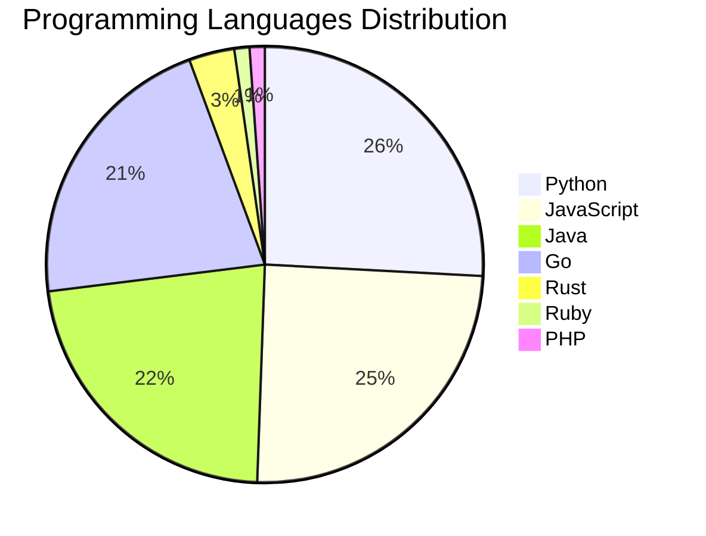

# 🚀 DevTech Auto News - Enhanced Edition


**DevTech Auto News Enhanced** is an advanced automated bot that aggregates trending topics in **AI**, **Web Development**, **Mobile**, **Cloud**, **DevOps**, and more from multiple sources including:

- 📰 [Dev.to](https://dev.to) - Developer community articles
- 🔥 [HackerNews](https://news.ycombinator.com) - Tech news discussions  
- 💻 [GitHub Trending](https://github.com/trending) - Trending repositories
- 🎯 Curated Interview Questions from multiple languages

## ✨ Features

✅ **Multi-Source Aggregation**: Combines articles from Dev.to, HackerNews, and GitHub  
✅ **Smart Categorization**: Automatically categorizes content into 10+ topics  
✅ **Image Support**: Displays cover images for visual appeal  
✅ **Pagination**: Fetches 50+ articles per update with deduplication  
✅ **Language Statistics**: Tracks programming language trends with charts  
✅ **Interview Questions**: Daily coding interview questions in multiple languages  
✅ **GitHub Actions**: Runs every 15 minutes automatically  

---

## 📊 Statistics Dashboard

### 📊 Articles by Category

**AI**: 🟦🟦🟦🟦🟦🟦🟦🟦🟦🟦🟦🟦🟦🟦🟦🟦🟦🟦🟦🟦 56 (53.8%)

**Tools**: 🟦🟦🟦🟦🟦🟦🟦🟦🟦 24 (23.1%)

**Python**: 🟦🟦🟦🟦🟦🟦🟦🟦 23 (22.1%)

**JavaScript**: 🟦🟦🟦🟦🟦🟦🟦🟦 22 (21.2%)

**Cloud**: 🟦🟦🟦 9 (8.7%)

**WebDev**: 🟦🟦 5 (4.8%)

**Security**: 🟦 4 (3.8%)

**Database**: 🟦 3 (2.9%)

**DevOps**: 🟦 2 (1.9%)


### 📡 Sources

- **Dev.to**: 59 articles
- **HackerNews**: 30 articles
- **GitHub**: 15 articles


### 💻 Programming Language Trends

```
Python          ██████████████████████████████ 25.8 (25.8%)
JavaScript      █████████████████████████████ 24.7 (24.7%)
Java            ██████████████████████████ 22.5 (22.5%)
Go              █████████████████████████ 21.3 (21.3%)
Rust            ████ 3.4 (3.4%)
Ruby            █ 1.1 (1.1%)
PHP             █ 1.1 (1.1%)

```




### 🏷️ Trending Tags

               


---

## 🛠️ How It Works

1. **Multi-Source Fetch**: Pulls from Dev.to (2 pages), HackerNews (3 topics), GitHub (3 languages)
2. **Smart Filter**: Uses keyword matching across 10+ categories  
3. **Deduplication**: Removes duplicate URLs  
4. **Image Extraction**: Captures cover images when available  
5. **Statistics**: Generates language trends and category breakdowns  
6. **Update Files**: Regenerates README and appends to comprehensive log  

---

## 📦 Installation & Usage

```bash
# Clone the repository
git clone https://github.com/Derrick-MUGISHA/github-activity-bot.git
cd github-activity-bot

# Install dependencies  
npm install

# Run manually
npm start

# Test mode
npm run test
```

---


# 🚀 DevTech Auto News - Enhanced Edition

## 📅 Latest Updates (2026-04-06 7:00 CAT)


### 🖼️ Featured Articles

<table>
<tr>
  <td align="center" width="33%">
    <a href="https://dev.to/sir_alexander_t/from-broken-docker-containers-to-a-working-ai-agent-the-full-openclaw-journey-3mc0">
      
      <br/>
      <b>From Broken Docker Containers to a Working AI Agen...</b>
    </a>
    <br/>
    <sub>Dev.to</sub>
  </td>
  <td align="center" width="33%">
    <a href="https://dev.to/diran_adeola/building-a-continuous-voice-interface-with-the-openai-realtime-api-2pn">
      
      <br/>
      <b>Building a Continuous Voice Interface with the Ope...</b>
    </a>
    <br/>
    <sub>Dev.to</sub>
  </td>
  <td align="center" width="33%">
    <a href="https://dev.to/thegdsks/i-built-a-self-hosted-ai-agent-that-runs-on-a-raspberry-pi-161e">
      
      <br/>
      <b>I Built a Self-Hosted AI Agent That Runs on a Rasp...</b>
    </a>
    <br/>
    <sub>Dev.to</sub>
  </td>
</tr>
<tr>
  <td align="center" width="33%">
    <a href="https://dev.to/piyush6348/master-class-understanding-database-replication-single-multi-and-leaderless-hhm">
      
      <br/>
      <b>Master-Class: Understanding Database Replication (...</b>
    </a>
    <br/>
    <sub>Dev.to</sub>
  </td>
  <td align="center" width="33%">
    <a href="https://dev.to/buildwithabid/how-i-found-1240month-in-wasted-llm-api-costs-and-built-a-tool-to-find-yours-3041">
      
      <br/>
      <b>How I Found $1,240/Month in Wasted LLM API Costs (...</b>
    </a>
    <br/>
    <sub>Dev.to</sub>
  </td>
  <td align="center" width="33%">
    <a href="https://dev.to/gde/mcp-development-with-python-and-azure-kubernates-service-aks-2in7">
      
      <br/>
      <b>MCP Development with Python, and Azure Kubernates ...</b>
    </a>
    <br/>
    <sub>Dev.to</sub>
  </td>
</tr>
</table>


### 📰 Top Headlines

- [From Broken Docker Containers to a Working AI Agent: The Full OpenClaw Journey](https://dev.to/sir_alexander_t/from-broken-docker-containers-to-a-working-ai-agent-the-full-openclaw-journey-3mc0) _[Dev.to]_
- [Building a Continuous Voice Interface with the OpenAI Realtime API](https://dev.to/diran_adeola/building-a-continuous-voice-interface-with-the-openai-realtime-api-2pn) _[Dev.to]_
- [I Built a Self-Hosted AI Agent That Runs on a Raspberry Pi](https://dev.to/thegdsks/i-built-a-self-hosted-ai-agent-that-runs-on-a-raspberry-pi-161e) _[Dev.to]_
- [Master-Class: Understanding Database Replication (Single, Multi, and Leaderless)](https://dev.to/piyush6348/master-class-understanding-database-replication-single-multi-and-leaderless-hhm) _[Dev.to]_
- [How I Found $1,240/Month in Wasted LLM API Costs (And Built a Tool to Find Yours)](https://dev.to/buildwithabid/how-i-found-1240month-in-wasted-llm-api-costs-and-built-a-tool-to-find-yours-3041) _[Dev.to]_
- [MCP Development with Python, and Azure Kubernates Service (AKS)](https://dev.to/gde/mcp-development-with-python-and-azure-kubernates-service-aks-2in7) _[Dev.to]_
- [0. Why I’m Growing HAID in Public, Not Building in Public](https://dev.to/shadowlik/0-why-im-growing-haid-in-public-not-building-in-public-1d0l) _[Dev.to]_
- [Scaling Product Discovery: Orchestrating AI Agent Workflows with Google Opal](https://dev.to/gdg/scaling-product-discovery-orchestrating-ai-agent-workflows-with-google-opal-2982) _[Dev.to]_
- [Building a Multimodal Cross Cloud Live Agent with ADK, Azure ACA, and Gemini CLI](https://dev.to/gde/building-a-multimodal-cross-cloud-live-agent-with-adk-azure-aca-and-gemini-cli-57a1) _[Dev.to]_
- [Building a Multimodal Cross Cloud Live Agent with ADK, Azure ACI, and Gemini CLI](https://dev.to/gde/building-a-multimodal-cross-cloud-live-agent-with-adk-azure-aci-and-gemini-cli-3g4) _[Dev.to]_
- [Deploying ADK Agents on Azure Kubernates Service (AKS)](https://dev.to/gde/deploying-adk-agents-on-azure-kubernates-service-aks-1lpf) _[Dev.to]_
- [Building a Production-Ready Serverless App on Google Cloud (Part 2: The Data Contract)](https://dev.to/gde/building-a-production-ready-serverless-app-on-google-cloud-part-2-the-data-contract-3hpa) _[Dev.to]_
- [Deploying ADK Agents on Azure ACI](https://dev.to/gde/deploying-adk-agents-on-azure-aci-2jk6) _[Dev.to]_
- [Join our April Fools Challenge for a chance at TEA-RRIFIC prizes!!!](https://dev.to/devteam/join-our-april-fools-challenge-for-a-chance-at-tea-rrific-prizes-1ofa) _[Dev.to]_
- [Page Numbers Lie: Offset vs Cursor Pagination](https://dev.to/mandy8055/page-numbers-lie-offset-vs-cursor-pagination-39f4) _[Dev.to]_
- [AI subscriptions are subsidized. Here's what happens when that stops.](https://dev.to/dzhuneyt/ai-subscriptions-are-subsidized-heres-what-happens-when-that-stops-293f) _[Dev.to]_
- [Big performance upgrade in DEV/Forem tag queries shipped yesterday. Breath of fresh air 🙂](https://dev.to/ben/big-performance-upgrade-in-devforem-tag-queries-shipped-yesterday-breath-of-fresh-air-2pp0) _[Dev.to]_
- [LoreKit - AI That GMs Full TTRPG Campaigns](https://dev.to/matluz/i-built-an-ai-that-gms-full-ttrpg-campaigns-774) _[Dev.to]_
- [I Analyzed AI Coding Mistakes and Built an ESLint Plugin to Catch Them](https://dev.to/pertrai1/i-analyzed-500-ai-coding-mistakes-and-built-an-eslint-plugin-to-catch-them-jme) _[Dev.to]_
- [You don't need to deal with code to understand Playwright](https://dev.to/abhivaikar/you-dont-need-to-deal-with-code-to-understand-playwright-39nk) _[Dev.to]_

_Last automated update: Mon, 06 Apr 2026 07:50:35 CAT_


## 💡 Daily Interview Questions

_Sharpen your skills with these curated questions_

### 1. React: What is the Virtual DOM and how does React use it?

**Difficulty**: Easy | **Topics**: rendering, performance

<details>
<summary>💡 Hint</summary>

Diffing algorithm, reconciliation, efficiency

</details>

### 2. Database: Design a database schema for a social media platform

**Difficulty**: Hard | **Topics**: design, scalability

<details>
<summary>💡 Hint</summary>

Users, posts, relationships, indexes, partitioning

</details>

### 3. JavaScript: Implement a debounce function from scratch

**Difficulty**: Hard | **Topics**: functions, timing

<details>
<summary>💡 Hint</summary>

setTimeout, clearTimeout, wrapper function

</details>


---

## 📚 Resources

- [Full News Archive](./data/news_log.md) - Complete history of all fetched articles
- [Statistics JSON](./data/stats.json) - Raw statistics data
- [Categorized Data](./data/categorized.json) - Articles organized by category
- [Interview Questions](./data/interview_questions.json) - Complete question bank

---

## 🤝 Contributing

Want to add more sources, categories, or interview questions? Feel free to:

1. Fork this repository
2. Add your improvements
3. Submit a pull request

---

## 📄 License

MIT License - Feel free to use and modify!

---

<p align="center">
  <b>Last automated update: Mon, 06 Apr 2026 05:50:35 GMT</b><br/>
  <sub>Powered by GitHub Actions | Made with ❤️ for developers</sub>
</p>

---

## 🔗 Quick Links

- [View Workflow](https://github.com/Derrick-MUGISHA/github-activity-bot/actions)
- [Report Issue](https://github.com/Derrick-MUGISHA/github-activity-bot/issues)
- [Suggest Feature](https://github.com/Derrick-MUGISHA/github-activity-bot/issues/new)
