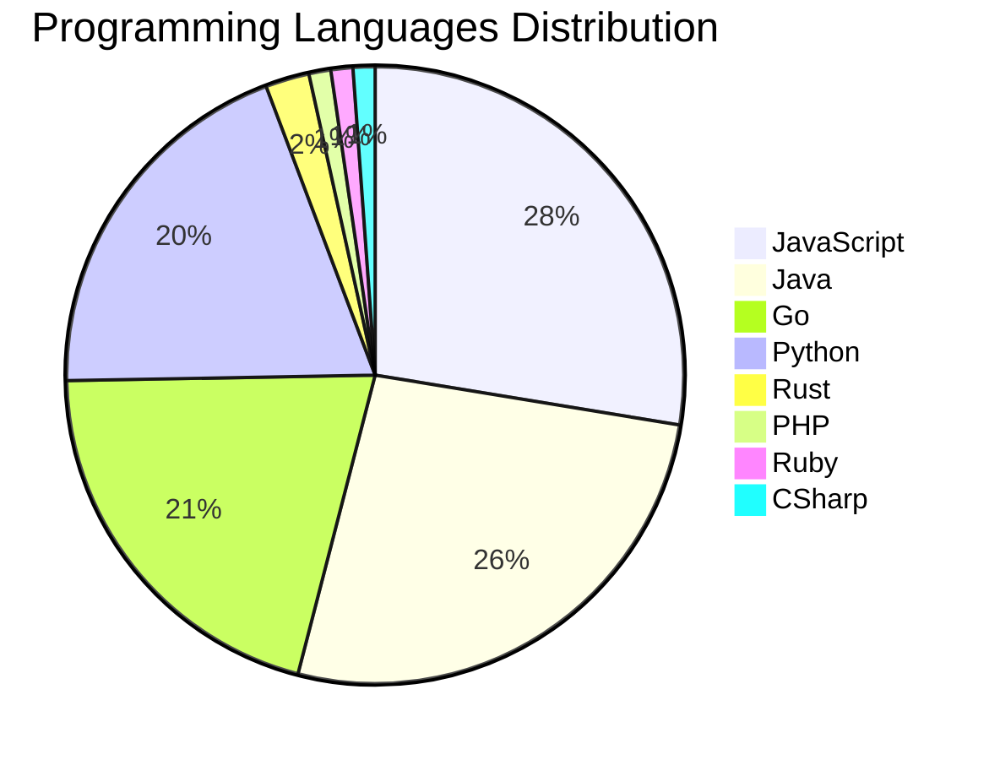

# 🚀 DevTech Auto News - Enhanced Edition


**DevTech Auto News Enhanced** is an advanced automated bot that aggregates trending topics in **AI**, **Web Development**, **Mobile**, **Cloud**, **DevOps**, and more from multiple sources including:

- 📰 [Dev.to](https://dev.to) - Developer community articles
- 🔥 [HackerNews](https://news.ycombinator.com) - Tech news discussions  
- 💻 [GitHub Trending](https://github.com/trending) - Trending repositories
- 🎯 Curated Interview Questions from multiple languages

## ✨ Features

✅ **Multi-Source Aggregation**: Combines articles from Dev.to, HackerNews, and GitHub  
✅ **Smart Categorization**: Automatically categorizes content into 10+ topics  
✅ **Image Support**: Displays cover images for visual appeal  
✅ **Pagination**: Fetches 50+ articles per update with deduplication  
✅ **Language Statistics**: Tracks programming language trends with charts  
✅ **Interview Questions**: Daily coding interview questions in multiple languages  
✅ **GitHub Actions**: Runs every 15 minutes automatically  

---

## 📊 Statistics Dashboard

### 📊 Articles by Category

**AI**: 🟦🟦🟦🟦🟦🟦🟦🟦🟦🟦🟦🟦🟦🟦🟦🟦🟦🟦🟦🟦 49 (46.7%)

**JavaScript**: 🟦🟦🟦🟦🟦🟦🟦🟦🟦🟦 24 (22.9%)

**Tools**: 🟦🟦🟦🟦🟦🟦🟦🟦🟦 23 (21.9%)

**Python**: 🟦🟦🟦🟦🟦🟦🟦 17 (16.2%)

**WebDev**: 🟦🟦 6 (5.7%)

**Cloud**: 🟦🟦 4 (3.8%)

**Database**: 🟦🟦 4 (3.8%)

**Security**: 🟦🟦 4 (3.8%)

**DevOps**:  1 (1.0%)


### 📡 Sources

- **Dev.to**: 60 articles
- **HackerNews**: 30 articles
- **GitHub**: 15 articles


### 💻 Programming Language Trends

```
JavaScript      ██████████████████████████████ 27.6 (27.6%)
Java            █████████████████████████████ 26.4 (26.4%)
Go              ██████████████████████ 20.7 (20.7%)
Python          █████████████████████ 19.5 (19.5%)
Rust            ███ 2.3 (2.3%)
PHP             █ 1.1 (1.1%)
Ruby            █ 1.1 (1.1%)
CSharp          █ 1.1 (1.1%)

```




### 🏷️ Trending Tags

               


---

## 🛠️ How It Works

1. **Multi-Source Fetch**: Pulls from Dev.to (2 pages), HackerNews (3 topics), GitHub (3 languages)
2. **Smart Filter**: Uses keyword matching across 10+ categories  
3. **Deduplication**: Removes duplicate URLs  
4. **Image Extraction**: Captures cover images when available  
5. **Statistics**: Generates language trends and category breakdowns  
6. **Update Files**: Regenerates README and appends to comprehensive log  

---

## 📦 Installation & Usage

```bash
# Clone the repository
git clone https://github.com/Derrick-MUGISHA/github-activity-bot.git
cd github-activity-bot

# Install dependencies  
npm install

# Run manually
npm start

# Test mode
npm run test
```

---


# 🚀 DevTech Auto News - Enhanced Edition

## 📅 Latest Updates (2026-03-17 22:00 CAT)


### 🖼️ Featured Articles

<table>
<tr>
  <td align="center" width="33%">
    <a href="https://dev.to/ben/whats-in-your-headphones-when-you-code-51i4">
      
      <br/>
      <b>What's in your headphones when you code? 🎧</b>
    </a>
    <br/>
    <sub>Dev.to</sub>
  </td>
  <td align="center" width="33%">
    <a href="https://dev.to/the_nortern_dev/i-think-a-lot-of-developers-are-quietly-grieving-the-old-internet-3d8">
      
      <br/>
      <b>I Think a Lot of Developers Are Quietly Grieving t...</b>
    </a>
    <br/>
    <sub>Dev.to</sub>
  </td>
  <td align="center" width="33%">
    <a href="https://dev.to/ben/meme-monday-cc9">
      
      <br/>
      <b>Meme Monday</b>
    </a>
    <br/>
    <sub>Dev.to</sub>
  </td>
</tr>
<tr>
  <td align="center" width="33%">
    <a href="https://dev.to/axrisi/drop-your-challenge-submission-here-mej">
      
      <br/>
      <b>Drop Your Challenge Submission Here</b>
    </a>
    <br/>
    <sub>Dev.to</sub>
  </td>
  <td align="center" width="33%">
    <a href="https://dev.to/teolex2020/i-built-a-cognitive-layer-for-ai-agents-that-learns-without-llm-calls-33no">
      
      <br/>
      <b>I built a cognitive layer for AI agents that learn...</b>
    </a>
    <br/>
    <sub>Dev.to</sub>
  </td>
  <td align="center" width="33%">
    <a href="https://dev.to/annavi11arrea1/path-of-discovery-1aoi">
      
      <br/>
      <b>Path of Discovery</b>
    </a>
    <br/>
    <sub>Dev.to</sub>
  </td>
</tr>
</table>


### 📰 Top Headlines

- [What's in your headphones when you code? 🎧](https://dev.to/ben/whats-in-your-headphones-when-you-code-51i4) _[Dev.to]_
- [I Think a Lot of Developers Are Quietly Grieving the Old Internet](https://dev.to/the_nortern_dev/i-think-a-lot-of-developers-are-quietly-grieving-the-old-internet-3d8) _[Dev.to]_
- [Meme Monday](https://dev.to/ben/meme-monday-cc9) _[Dev.to]_
- [Drop Your Challenge Submission Here](https://dev.to/axrisi/drop-your-challenge-submission-here-mej) _[Dev.to]_
- [I built a cognitive layer for AI agents that learns without LLM calls](https://dev.to/teolex2020/i-built-a-cognitive-layer-for-ai-agents-that-learns-without-llm-calls-33no) _[Dev.to]_
- [Path of Discovery](https://dev.to/annavi11arrea1/path-of-discovery-1aoi) _[Dev.to]_
- [Full Circle: Giving My AI's Knowledge Graph a Notion Interface using MCP](https://dev.to/juandastic/full-circle-giving-my-ais-knowledge-graph-a-notion-interface-using-mcp-2dmp) _[Dev.to]_
- [Announcing the Colab MCP Server: Connect Any AI Agent to Google Colab](https://dev.to/googleai/announcing-the-colab-mcp-server-connect-any-ai-agent-to-google-colab-308o) _[Dev.to]_
- [Who's hiring — March 2026](https://dev.to/fmerian/whos-hiring-march-2026-229i) _[Dev.to]_
- [Getting Started with Qwen3.5 Vision-Language Models](https://dev.to/digitalocean/getting-started-with-qwen35-vision-language-models-3ej3) _[Dev.to]_
- [How I Built Niobe: An AI Waitress with Gemini Live and Google Cloud](https://dev.to/provydon/how-i-built-niobe-an-ai-waitress-with-gemini-live-and-google-cloud-2o28) _[Dev.to]_
- [neither naive nor nostalgic](https://dev.to/ingosteinke/neither-naive-nor-nostalgic-1mmp) _[Dev.to]_
- [The Local AI Powerhouse](https://dev.to/amjadmh73/the-local-ai-powerhouse-28j) _[Dev.to]_
- [I built an open-source "focus group simulator" that spawns 1,000 AI customers to roast your startup idea](https://dev.to/nghiahsgs/i-built-an-open-source-focus-group-simulator-that-spawns-1000-ai-customers-to-roast-your-startup-1c5o) _[Dev.to]_
- [90% of Code Will Be AI-Generated — So What the Hell Do We Actually Do?](https://dev.to/harsh2644/90-of-code-will-be-ai-generated-so-what-the-hell-do-we-actually-do-2kg3) _[Dev.to]_
- [I Built a Browser UI for Claude Code — Here's Why](https://dev.to/hamed_farag/i-built-a-browser-ui-for-claude-code-heres-why-4959) _[Dev.to]_
- [Elvis (?:) vs Null Coalescing (??) in PHP: A Practical Guide for WordPress Developers](https://dev.to/abbeymaniak/elvis-vs-null-coalescing-in-php-a-practical-guide-for-wordpress-developers-3ih4) _[Dev.to]_
- [Fortran meets AI](https://dev.to/viksaaskool/fortran-meets-ai-3oac) _[Dev.to]_
- [Ship Less, Measure More](https://dev.to/snowman647/ship-less-measure-more-58m4) _[Dev.to]_
- [Gemini CLI and Jules: my March 2026 stack](https://dev.to/rowan_m/gemini-cli-and-jules-my-march-2026-stack-4146) _[Dev.to]_

_Last automated update: Tue, 17 Mar 2026 22:02:35 CAT_


## 💡 Daily Interview Questions

_Sharpen your skills with these curated questions_

### 1. Database: Design a database schema for a social media platform

**Difficulty**: Hard | **Topics**: design, scalability

<details>
<summary>💡 Hint</summary>

Users, posts, relationships, indexes, partitioning

</details>

### 2. Java: Explain the Java memory model

**Difficulty**: Hard | **Topics**: memory, JVM

<details>
<summary>💡 Hint</summary>

Heap, stack, garbage collection

</details>

### 3. Java: What is the difference between abstract class and interface?

**Difficulty**: Easy | **Topics**: OOP, design

<details>
<summary>💡 Hint</summary>

Multiple inheritance, method implementation, use cases

</details>


---

## 📚 Resources

- [Full News Archive](./data/news_log.md) - Complete history of all fetched articles
- [Statistics JSON](./data/stats.json) - Raw statistics data
- [Categorized Data](./data/categorized.json) - Articles organized by category
- [Interview Questions](./data/interview_questions.json) - Complete question bank

---

## 🤝 Contributing

Want to add more sources, categories, or interview questions? Feel free to:

1. Fork this repository
2. Add your improvements
3. Submit a pull request

---

## 📄 License

MIT License - Feel free to use and modify!

---

<p align="center">
  <b>Last automated update: Tue, 17 Mar 2026 20:02:35 GMT</b><br/>
  <sub>Powered by GitHub Actions | Made with ❤️ for developers</sub>
</p>

---

## 🔗 Quick Links

- [View Workflow](https://github.com/Derrick-MUGISHA/github-activity-bot/actions)
- [Report Issue](https://github.com/Derrick-MUGISHA/github-activity-bot/issues)
- [Suggest Feature](https://github.com/Derrick-MUGISHA/github-activity-bot/issues/new)
