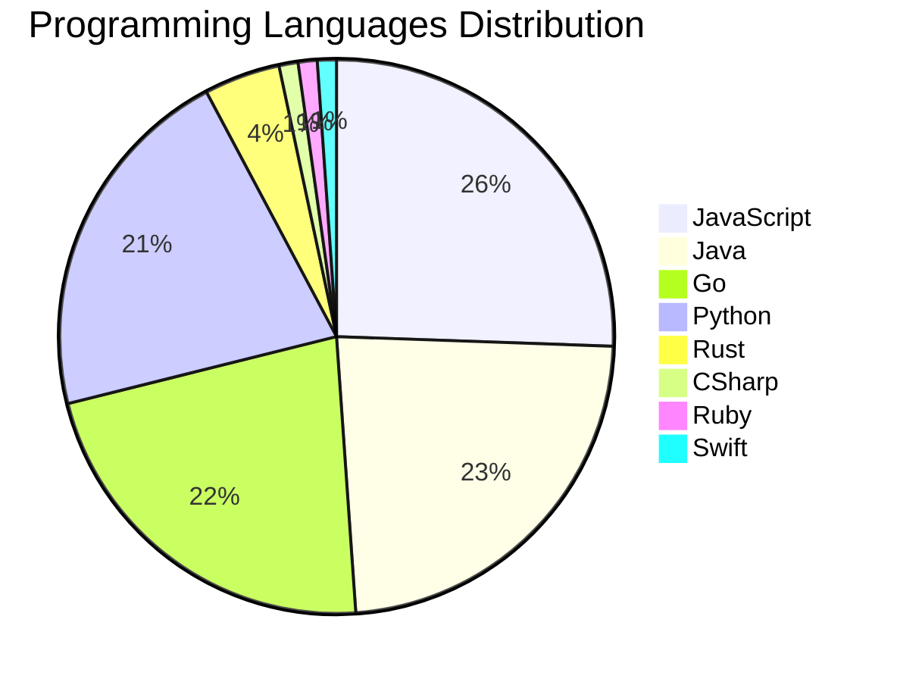

# 🚀 DevTech Auto News - Enhanced Edition


**DevTech Auto News Enhanced** is an advanced automated bot that aggregates trending topics in **AI**, **Web Development**, **Mobile**, **Cloud**, **DevOps**, and more from multiple sources including:

- 📰 [Dev.to](https://dev.to) - Developer community articles
- 🔥 [HackerNews](https://news.ycombinator.com) - Tech news discussions  
- 💻 [GitHub Trending](https://github.com/trending) - Trending repositories
- 🎯 Curated Interview Questions from multiple languages

## ✨ Features

✅ **Multi-Source Aggregation**: Combines articles from Dev.to, HackerNews, and GitHub  
✅ **Smart Categorization**: Automatically categorizes content into 10+ topics  
✅ **Image Support**: Displays cover images for visual appeal  
✅ **Pagination**: Fetches 50+ articles per update with deduplication  
✅ **Language Statistics**: Tracks programming language trends with charts  
✅ **Interview Questions**: Daily coding interview questions in multiple languages  
✅ **GitHub Actions**: Runs every 15 minutes automatically  

---

## 📊 Statistics Dashboard

### 📊 Articles by Category

**AI**: 🟦🟦🟦🟦🟦🟦🟦🟦🟦🟦🟦🟦🟦🟦🟦🟦🟦🟦🟦🟦 53 (50.5%)

**Tools**: 🟦🟦🟦🟦🟦🟦🟦🟦🟦🟦🟦 30 (28.6%)

**JavaScript**: 🟦🟦🟦🟦🟦🟦🟦🟦🟦 23 (21.9%)

**Python**: 🟦🟦🟦🟦🟦🟦🟦 19 (18.1%)

**Cloud**: 🟦🟦🟦 8 (7.6%)

**WebDev**: 🟦🟦🟦 7 (6.7%)

**Security**: 🟦🟦🟦 7 (6.7%)

**DevOps**: 🟦🟦 4 (3.8%)

**Database**: 🟦 3 (2.9%)

**Mobile**:  1 (1.0%)


### 📡 Sources

- **Dev.to**: 60 articles
- **HackerNews**: 30 articles
- **GitHub**: 15 articles


### 💻 Programming Language Trends

```
JavaScript      ██████████████████████████████ 25.6 (25.6%)
Java            ███████████████████████████ 23.3 (23.3%)
Go              ██████████████████████████ 22.2 (22.2%)
Python          █████████████████████████ 21.1 (21.1%)
Rust            █████ 4.4 (4.4%)
CSharp          █ 1.1 (1.1%)
Ruby            █ 1.1 (1.1%)
Swift           █ 1.1 (1.1%)

```




### 🏷️ Trending Tags

               


---

## 🛠️ How It Works

1. **Multi-Source Fetch**: Pulls from Dev.to (2 pages), HackerNews (3 topics), GitHub (3 languages)
2. **Smart Filter**: Uses keyword matching across 10+ categories  
3. **Deduplication**: Removes duplicate URLs  
4. **Image Extraction**: Captures cover images when available  
5. **Statistics**: Generates language trends and category breakdowns  
6. **Update Files**: Regenerates README and appends to comprehensive log  

---

## 📦 Installation & Usage

```bash
# Clone the repository
git clone https://github.com/Derrick-MUGISHA/github-activity-bot.git
cd github-activity-bot

# Install dependencies  
npm install

# Run manually
npm start

# Test mode
npm run test
```

---


# 🚀 DevTech Auto News - Enhanced Edition

## 📅 Latest Updates (2026-03-26 20:00 CAT)


### 🖼️ Featured Articles

<table>
<tr>
  <td align="center" width="33%">
    <a href="https://dev.to/ben/speed-vs-smarts-for-coding-agents-3h">
      
      <br/>
      <b>Speed vs smarts for coding agents?</b>
    </a>
    <br/>
    <sub>Dev.to</sub>
  </td>
  <td align="center" width="33%">
    <a href="https://dev.to/ghostbuild/your-agent-can-think-it-cant-remember-5e1o">
      
      <br/>
      <b>your agent can think. it can't remember.</b>
    </a>
    <br/>
    <sub>Dev.to</sub>
  </td>
  <td align="center" width="33%">
    <a href="https://dev.to/francistrdev/check-up-with-each-other-2ogc">
      
      <br/>
      <b>Check Up with Each Other</b>
    </a>
    <br/>
    <sub>Dev.to</sub>
  </td>
</tr>
<tr>
  <td align="center" width="33%">
    <a href="https://dev.to/aliirz/i-built-a-file-transfer-tool-that-cant-spy-on-you-even-if-it-wanted-to-2p39">
      
      <br/>
      <b>I built a file transfer tool that can’t spy on you...</b>
    </a>
    <br/>
    <sub>Dev.to</sub>
  </td>
  <td align="center" width="33%">
    <a href="https://dev.to/marcosomma/i-tried-to-turn-agent-memory-into-plumbing-instead-of-philosophy-3a8e">
      
      <br/>
      <b>I Tried to Turn Agent Memory Into Plumbing Instead...</b>
    </a>
    <br/>
    <sub>Dev.to</sub>
  </td>
  <td align="center" width="33%">
    <a href="https://dev.to/jonoherrington/ai-didnt-break-your-culture-it-exposed-it-2729">
      
      <br/>
      <b>AI Didn't Break Your Culture. It Exposed It.</b>
    </a>
    <br/>
    <sub>Dev.to</sub>
  </td>
</tr>
</table>


### 📰 Top Headlines

- [Speed vs smarts for coding agents?](https://dev.to/ben/speed-vs-smarts-for-coding-agents-3h) _[Dev.to]_
- [your agent can think. it can't remember.](https://dev.to/ghostbuild/your-agent-can-think-it-cant-remember-5e1o) _[Dev.to]_
- [Check Up with Each Other](https://dev.to/francistrdev/check-up-with-each-other-2ogc) _[Dev.to]_
- [I built a file transfer tool that can’t spy on you even if it wanted to](https://dev.to/aliirz/i-built-a-file-transfer-tool-that-cant-spy-on-you-even-if-it-wanted-to-2p39) _[Dev.to]_
- [I Tried to Turn Agent Memory Into Plumbing Instead of Philosophy](https://dev.to/marcosomma/i-tried-to-turn-agent-memory-into-plumbing-instead-of-philosophy-3a8e) _[Dev.to]_
- [AI Didn't Break Your Culture. It Exposed It.](https://dev.to/jonoherrington/ai-didnt-break-your-culture-it-exposed-it-2729) _[Dev.to]_
- [The Future of Coding is Communication, Not Just Code](https://dev.to/auth0/the-future-of-coding-is-communication-not-just-code-328p) _[Dev.to]_
- [Building a Error Library](https://dev.to/fafhrd91/building-a-error-library-3kda) _[Dev.to]_
- [The Vonage Dev Discussion: Open Source](https://dev.to/vonagedev/the-vonage-dev-discussion-open-source-ipb) _[Dev.to]_
- [Scaling ID Generation with Redis](https://dev.to/chkrishnatej/scaling-id-generation-with-redis-3h4e) _[Dev.to]_
- [How to Build a Cookie Consent Banner in WordPress Without a Plugin (Complete Guide)](https://dev.to/saroz/how-to-build-a-cookie-consent-banner-in-wordpress-without-a-plugin-complete-guide-fi0) _[Dev.to]_
- [Take your vibe coding to the next level](https://dev.to/googleai/take-your-vibe-coding-to-the-next-level-1ea) _[Dev.to]_
- [Build real-time conversational agents with Gemini 3.1 Flash Live](https://dev.to/googleai/build-real-time-conversational-agents-with-gemini-31-flash-live-27f6) _[Dev.to]_
- [Stop Paying for Cloud: Deploy a Highly Available Cluster on Your Own Hardware in Minutes](https://dev.to/axrisi/stop-paying-for-cloud-deploy-a-highly-available-cluster-on-your-own-hardware-in-minutes-14f0) _[Dev.to]_
- [I Was Tired of Re-Recording Product Demos Every Sprint. So I Built a Tool That Turns Playwright Tests Into Videos.](https://dev.to/thepatriczek/i-was-tired-of-re-recording-product-demos-every-sprint-so-i-built-a-tool-that-turns-playwright-21od) _[Dev.to]_
- [Zero-copy protobuf and ConnectRPC for Rust](https://dev.to/iainmcgin/zero-copy-protobuf-and-connectrpc-for-rust-1m3e) _[Dev.to]_
- [Tend (and about Vibe Coding)](https://dev.to/iamschulz/tend-and-about-vibe-coding-2501) _[Dev.to]_
- [rgql: AST-Aware GraphQL Refactoring That AI Agents Can Trust](https://dev.to/yamashou/rgql-ast-aware-graphql-refactoring-that-ai-agents-can-trust-4aib) _[Dev.to]_
- [AI Crash Course: Hallucinations](https://dev.to/kathryngrayson/ai-crash-course-hallucinations-1jeg) _[Dev.to]_
- [Why most AI agent frameworks break in production (and what I’m doing differently)](https://dev.to/octaviannn/why-most-ai-agent-frameworks-break-in-production-and-what-im-doing-differently-3f5i) _[Dev.to]_

_Last automated update: Thu, 26 Mar 2026 20:04:14 CAT_


## 💡 Daily Interview Questions

_Sharpen your skills with these curated questions_

### 1. Database: What is the difference between SQL and NoSQL databases?

**Difficulty**: Easy | **Topics**: databases, design

<details>
<summary>💡 Hint</summary>

Schema, scalability, ACID vs BASE

</details>

### 2. Database: What is the difference between SQL and NoSQL databases?

**Difficulty**: Easy | **Topics**: databases, design

<details>
<summary>💡 Hint</summary>

Schema, scalability, ACID vs BASE

</details>

### 3. Python: What are generators and when would you use them?

**Difficulty**: Medium | **Topics**: iterators, memory

<details>
<summary>💡 Hint</summary>

yield keyword, lazy evaluation, memory efficiency

</details>


---

## 📚 Resources

- [Full News Archive](./data/news_log.md) - Complete history of all fetched articles
- [Statistics JSON](./data/stats.json) - Raw statistics data
- [Categorized Data](./data/categorized.json) - Articles organized by category
- [Interview Questions](./data/interview_questions.json) - Complete question bank

---

## 🤝 Contributing

Want to add more sources, categories, or interview questions? Feel free to:

1. Fork this repository
2. Add your improvements
3. Submit a pull request

---

## 📄 License

MIT License - Feel free to use and modify!

---

<p align="center">
  <b>Last automated update: Thu, 26 Mar 2026 18:04:14 GMT</b><br/>
  <sub>Powered by GitHub Actions | Made with ❤️ for developers</sub>
</p>

---

## 🔗 Quick Links

- [View Workflow](https://github.com/Derrick-MUGISHA/github-activity-bot/actions)
- [Report Issue](https://github.com/Derrick-MUGISHA/github-activity-bot/issues)
- [Suggest Feature](https://github.com/Derrick-MUGISHA/github-activity-bot/issues/new)
