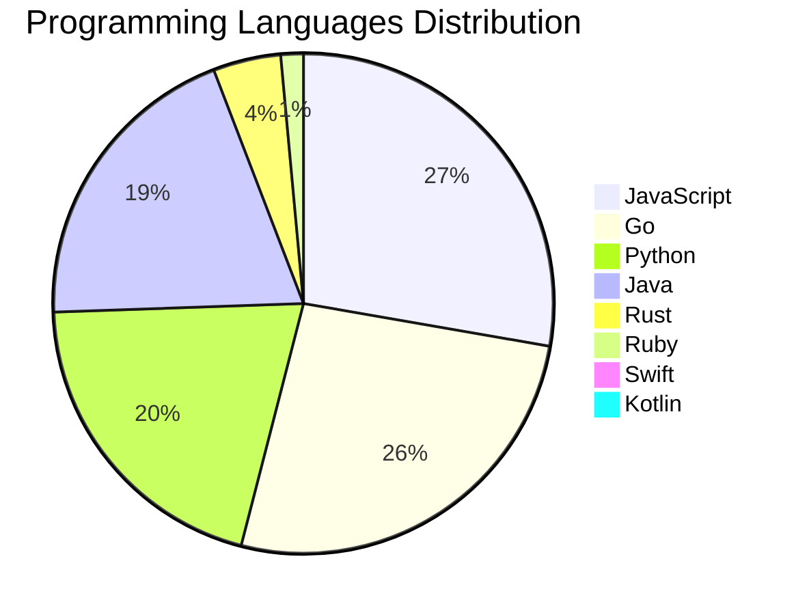

<div align="center">

# 📰 DevTech Auto News

**Your always-fresh digest of developer & AI tech news — curated automatically, around the clock.**


Aggregating [Dev.to](https://dev.to) · [Hacker News](https://news.ycombinator.com) · [GitHub Trending](https://github.com/trending) · [Lobste.rs](https://lobste.rs) · [Stack Overflow](https://stackoverflow.com) · [TechCrunch](https://techcrunch.com) · [freeCodeCamp](https://www.freecodecamp.org/news) — refreshed by GitHub Actions around the clock.

**[📰 Headlines](#-latest-headlines) · [💡 Interview Prep](#-interview-question-of-the-hour) · [📊 Statistics](#-statistics) · [⚙️ How It Works](#%EF%B8%8F-how-it-works)**

</div>

---

## 📰 Latest Headlines

> 🕐 Edition of **2026-09-08 11:00 CAT** — refreshed automatically, all day, every day.

### ✨ Featured Stories

<table>
<tr>
  <td align="center" width="33%">
    <a href="https://dev.to/dannwaneri/my-grandmother-ran-ajo-i-built-the-version-where-the-pot-cant-walk-away-5gkn">
      
      <br/>
      <b>My Grandmother Ran Ajo. I Built the Version Where ...</b>
    </a>
    <br/>
    <sub>Dev.to</sub>
  </td>
  <td align="center" width="33%">
    <a href="https://dev.to/sylwia-lask/20-agentic-ai-terms-every-developer-should-know-explained-simply-jii">
      
      <br/>
      <b>20 Agentic AI Terms Every Developer Should Know (E...</b>
    </a>
    <br/>
    <sub>Dev.to</sub>
  </td>
  <td align="center" width="33%">
    <a href="https://dev.to/fm/boonfest-the-anti-sloth-game-where-generosity-means-survival-3pg8">
      
      <br/>
      <b>BoonFest: The Anti-Sloth Game Where Generosity Mea...</b>
    </a>
    <br/>
    <sub>Dev.to</sub>
  </td>
</tr>
<tr>
  <td align="center" width="33%">
    <a href="https://dev.to/ujja/ai-engineering-is-easy-changing-how-we-work-is-hard-39j4">
      
      <br/>
      <b>AI Engineering Is Easy. Changing How We Work Is Ha...</b>
    </a>
    <br/>
    <sub>Dev.to</sub>
  </td>
  <td align="center" width="33%">
    <a href="https://dev.to/gde/the-unbreakable-shopping-cart-pairing-blocsignal-with-fast-immutable-collections-fic-for-1pn2">
      
      <br/>
      <b>The Unbreakable Shopping Cart: Pairing BlocSignal ...</b>
    </a>
    <br/>
    <sub>Dev.to</sub>
  </td>
  <td align="center" width="33%">
    <a href="https://dev.to/devteam/what-was-your-win-this-week-1mo8">
      
      <br/>
      <b>What was your win this week?</b>
    </a>
    <br/>
    <sub>Dev.to</sub>
  </td>
</tr>
</table>


### 🗞️ Top Stories

| # | Headline | Source |
|---|----------|--------|
| 1 | [My Grandmother Ran Ajo. I Built the Version Where the Pot Can't Walk Away](https://dev.to/dannwaneri/my-grandmother-ran-ajo-i-built-the-version-where-the-pot-cant-walk-away-5gkn) | Dev.to |
| 2 | [20 Agentic AI Terms Every Developer Should Know (Explained Simply)](https://dev.to/sylwia-lask/20-agentic-ai-terms-every-developer-should-know-explained-simply-jii) | Dev.to |
| 3 | [BoonFest: The Anti-Sloth Game Where Generosity Means Survival!](https://dev.to/fm/boonfest-the-anti-sloth-game-where-generosity-means-survival-3pg8) | Dev.to |
| 4 | [AI Engineering Is Easy. Changing How We Work Is Hard](https://dev.to/ujja/ai-engineering-is-easy-changing-how-we-work-is-hard-39j4) | Dev.to |
| 5 | [The Unbreakable Shopping Cart: Pairing BlocSignal with Fast Immutable Collections (FIC) for Bulletproof Flutter Apps](https://dev.to/gde/the-unbreakable-shopping-cart-pairing-blocsignal-with-fast-immutable-collections-fic-for-1pn2) | Dev.to |
| 6 | [What was your win this week?](https://dev.to/devteam/what-was-your-win-this-week-1mo8) | Dev.to |
| 7 | [Building With AI When You Don't Know Architecture: A Survival Guide](https://dev.to/james_anderson_h/building-with-ai-when-you-dont-know-architecture-a-survival-guide-1ma3) | Dev.to |
| 8 | [Kubeflow Without Kubernetes? Deploy a Complete MLOps Suite in 60 Seconds with Gubernator](https://dev.to/gde/kubeflow-without-kubernetes-deploy-a-complete-mlops-suite-in-60-seconds-with-gubernator-3moo) | Dev.to |
| 9 | [Unifying Google Workspace and Apache Iceberg: Serverless Lakehouse Management](https://dev.to/gde/unifying-google-workspace-and-apache-iceberg-serverless-lakehouse-management-ep3) | Dev.to |
| 10 | [Two-step control plane upgrades in GKE: How minor version rollbacks work under the hood](https://dev.to/googlecloud/two-step-control-plane-upgrades-in-gke-how-minor-version-rollbacks-work-under-the-hood-i1l) | Dev.to |
| 11 | [Cross Cloud A2A Agent Card Field Comparison](https://dev.to/gde/cross-cloud-a2a-agent-card-field-comparison-2hod) | Dev.to |
| 12 | [The job description already changed. We're not coders anymore, but couriers.](https://dev.to/canro91/the-job-description-already-changed-were-not-coders-anymore-but-couriers-40eg) | Dev.to |
| 13 | [Step up to the Sheets: AI Eval Export and Illustrating Data](https://dev.to/googleai/step-up-to-the-sheets-ai-eval-export-and-illustrating-data-bak) | Dev.to |
| 14 | [What Do You Do While AI Codes?](https://dev.to/anchildress1/what-do-you-do-while-ai-codes-k8k) | Dev.to |
| 15 | [Claude Fable 5.1 is now available on Agent Platform!](https://dev.to/googleai/claude-fable-51-is-now-available-on-agent-platform-1b16) | Dev.to |
| 16 | [Elevating Antigravity agent skills, Part 2: Image generation](https://dev.to/googleai/elevating-antigravity-agent-skills-part-2-image-generation-2jno) | Dev.to |
| 17 | [Grand Central Station: Why BLoC, Riverpod, and BlocSignal Are Now True Peers](https://dev.to/gde/grand-central-station-why-bloc-riverpod-and-blocsignal-are-now-true-peers-3fd8) | Dev.to |
| 18 | [ChromeOS Lookalikes, Two Ways: One With Drivers, One Without](https://dev.to/gde/chromeos-lookalikes-two-ways-one-with-drivers-one-without-83m) | Dev.to |
| 19 | [Seven Iceberg REST Catalogs: What They Declare, and What They Serve](https://dev.to/gde/seven-iceberg-rest-catalogs-what-they-declare-and-what-they-serve-40oj) | Dev.to |
| 20 | [Accelerating JVM startup on GKE: How VPA CPU startup boost eliminates ongoing resource waste](https://dev.to/googlecloud/accelerating-jvm-startup-on-gke-how-vpa-cpu-startup-boost-eliminates-ongoing-resource-waste-33i2) | Dev.to |

<sub>Last fetched: Tue, 08 Sep 2026 11:38:04 CAT</sub>


---

## 💡 Interview Question of the Hour

> Sharpen your skills — new questions selected on every update. Try answering before opening the hint!

**1. `SystemDesign` — How would you design a rate limiter?**

&nbsp;&nbsp;&nbsp;&nbsp;🎯 Medium · 🏷 system design, algorithms

<details>
<summary>&nbsp;&nbsp;&nbsp;&nbsp;💡 Show hint</summary>

> Token bucket, sliding window, distributed systems

</details>

**2. `Java` — Explain the Java memory model**

&nbsp;&nbsp;&nbsp;&nbsp;🎯 Hard · 🏷 memory, JVM

<details>
<summary>&nbsp;&nbsp;&nbsp;&nbsp;💡 Show hint</summary>

> Heap, stack, garbage collection

</details>

**3. `DataStructures` — Implement LRU Cache**

&nbsp;&nbsp;&nbsp;&nbsp;🎯 Hard · 🏷 design, hash map, linked list

<details>
<summary>&nbsp;&nbsp;&nbsp;&nbsp;💡 Show hint</summary>

> Doubly linked list + hash map, O(1) operations

</details>


---

## 📊 Statistics

#### 🗂 Articles by Category

| Category | Articles | Share | |
|----------|---------:|------:|---|
| **AI** | 80 | 43.5% | `████████████████████` |
| **JavaScript** | 38 | 20.7% | `██████████░░░░░░░░░░` |
| **Tools** | 38 | 20.7% | `██████████░░░░░░░░░░` |
| **Python** | 28 | 15.2% | `███████░░░░░░░░░░░░░` |
| **Cloud** | 24 | 13.0% | `██████░░░░░░░░░░░░░░` |
| **DevOps** | 16 | 8.7% | `████░░░░░░░░░░░░░░░░` |
| **Security** | 16 | 8.7% | `████░░░░░░░░░░░░░░░░` |
| **WebDev** | 6 | 3.3% | `██░░░░░░░░░░░░░░░░░░` |
| **Mobile** | 6 | 3.3% | `██░░░░░░░░░░░░░░░░░░` |
| **Database** | 6 | 3.3% | `██░░░░░░░░░░░░░░░░░░` |

<sub>Articles can match more than one category, so shares may sum to over 100%.</sub>


#### 📡 Articles by Source

| Source | Articles |
|--------|---------:|
| Dev.to | 60 |
| HackerNews | 49 |
| GitHub | 25 |
| Lobste.rs | 10 |
| StackOverflow | 20 |
| TechCrunch | 10 |
| freeCodeCamp | 10 |


#### 💻 Programming Language Trends

```
JavaScript      ██████████████████████████████ 27.1%
Go              ████████████████████████████ 25.7%
Python          ██████████████████████ 20.0%
Java            █████████████████████ 19.3%
Rust            █████ 4.3%
Ruby            ██ 1.4%
Swift           █ 0.7%
Kotlin          █ 0.7%
CSharp          █ 0.7%

```




#### 🏷 Trending Topics

            


---

## ⚙️ How It Works

This repository is a fully automated news pipeline. On every run, GitHub Actions:

1. **Fetches** the latest articles from seven sources: Dev.to, Hacker News, GitHub Trending, Lobste.rs, Stack Overflow, TechCrunch, and freeCodeCamp
2. **Deduplicates and categorizes** them across 10+ topics using keyword matching
3. **Extracts cover images** and computes language & category statistics
4. **Rebuilds this README** and appends everything to the [full archive](./data/news_log.md)
5. **Commits and pushes** the result — no human intervention needed

<details>
<summary><b>🚀 Run it yourself</b></summary>

```bash
git clone https://github.com/Derrick-MUGISHA/github-activity-bot.git
cd github-activity-bot
npm install
npm start
```

Fork the repo, enable GitHub Actions, and you have your own self-updating news feed.

</details>

<details>
<summary><b>📚 Data & resources</b></summary>

- [Full news archive](./data/news_log.md) — complete history of every fetched article
- [Statistics](./data/stats.json) — raw stats data (JSON)
- [Categorized articles](./data/categorized.json) — articles grouped by topic
- [Interview question bank](./data/interview_questions.json) — the full question set

</details>

---

## 🤝 Contributing

Ideas for new sources, categories, or interview questions are welcome — [open an issue](https://github.com/Derrick-MUGISHA/github-activity-bot/issues/new) or submit a pull request.

## 📄 License

Released under the [MIT License](https://opensource.org/licenses/MIT) — free to use, fork, and modify.

---

<div align="center">
  <sub>🤖 Last automated update: <b>Tue, 08 Sep 2026 09:38:04 GMT</b></sub><br/>
  <sub>Powered by GitHub Actions · Built with ❤️ by <a href="https://github.com/Derrick-MUGISHA">Derrick MUGISHA</a></sub>
</div>
