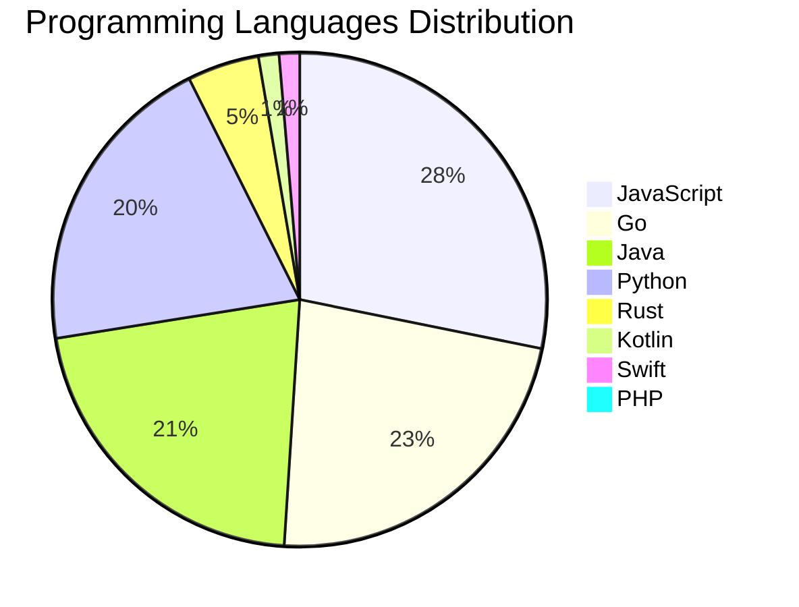

<div align="center">

# 📰 DevTech Auto News

**Your always-fresh digest of developer & AI tech news — curated automatically, around the clock.**


Aggregating [Dev.to](https://dev.to) · [Hacker News](https://news.ycombinator.com) · [GitHub Trending](https://github.com/trending) · [Lobste.rs](https://lobste.rs) · [Stack Overflow](https://stackoverflow.com) · [TechCrunch](https://techcrunch.com) · [freeCodeCamp](https://www.freecodecamp.org/news) — refreshed by GitHub Actions around the clock.

**[📰 Headlines](#-latest-headlines) · [💡 Interview Prep](#-interview-question-of-the-hour) · [📊 Statistics](#-statistics) · [⚙️ How It Works](#%EF%B8%8F-how-it-works)**

</div>

---

## 📰 Latest Headlines

> 🕐 Edition of **2026-08-25 17:00 CAT** — refreshed automatically, all day, every day.

### ✨ Featured Stories

<table>
<tr>
  <td align="center" width="33%">
    <a href="https://dev.to/anchildress1/what-do-you-do-while-ai-codes-k8k">
      
      <br/>
      <b>What Do You Do While AI Codes?</b>
    </a>
    <br/>
    <sub>Dev.to</sub>
  </td>
  <td align="center" width="33%">
    <a href="https://dev.to/alvaromontoro/comicss-255-yellow-1bj">
      
      <br/>
      <b>comiCSS #255: Yellow</b>
    </a>
    <br/>
    <sub>Dev.to</sub>
  </td>
  <td align="center" width="33%">
    <a href="https://dev.to/googleai/ai-evals-at-a-glance-heatmaps-for-stakeholders-2mki">
      
      <br/>
      <b>AI Evals at a Glance: Heatmaps for Stakeholders</b>
    </a>
    <br/>
    <sub>Dev.to</sub>
  </td>
</tr>
<tr>
  <td align="center" width="33%">
    <a href="https://blog.mlh.com/the-data-is-in-ai-is-how-developers-learn-now-28p4">
      
      <br/>
      <b>The data is in: AI is how developers learn now</b>
    </a>
    <br/>
    <sub>Dev.to</sub>
  </td>
  <td align="center" width="33%">
    <a href="https://dev.to/gde/wiring-the-reasoning-loop-gemini-neo4j-mcp-for-multi-hop-ai-agents-51p9">
      
      <br/>
      <b>Wiring the Reasoning Loop: Gemini + Neo4j + MCP fo...</b>
    </a>
    <br/>
    <sub>Dev.to</sub>
  </td>
  <td align="center" width="33%">
    <a href="https://dev.to/googleai/tech-webinar-how-to-control-costs-measure-roi-for-claude-code-on-gcp-91-12pm-pt-1m3b">
      
      <br/>
      <b>Tech webinar: How to control costs & measure ROI f...</b>
    </a>
    <br/>
    <sub>Dev.to</sub>
  </td>
</tr>
</table>


### 🗞️ Top Stories

| # | Headline | Source |
|---|----------|--------|
| 1 | [What Do You Do While AI Codes?](https://dev.to/anchildress1/what-do-you-do-while-ai-codes-k8k) | Dev.to |
| 2 | [comiCSS #255: Yellow](https://dev.to/alvaromontoro/comicss-255-yellow-1bj) | Dev.to |
| 3 | [AI Evals at a Glance: Heatmaps for Stakeholders](https://dev.to/googleai/ai-evals-at-a-glance-heatmaps-for-stakeholders-2mki) | Dev.to |
| 4 | [The data is in: AI is how developers learn now](https://blog.mlh.com/the-data-is-in-ai-is-how-developers-learn-now-28p4) | Dev.to |
| 5 | [Wiring the Reasoning Loop: Gemini + Neo4j + MCP for Multi-Hop AI Agents](https://dev.to/gde/wiring-the-reasoning-loop-gemini-neo4j-mcp-for-multi-hop-ai-agents-51p9) | Dev.to |
| 6 | [Tech webinar: How to control costs & measure ROI for Claude Code on GCP - 9/1 12pm PT.](https://dev.to/googleai/tech-webinar-how-to-control-costs-measure-roi-for-claude-code-on-gcp-91-12pm-pt-1m3b) | Dev.to |
| 7 | [Coding agents got boring the moment we built a really good one.](https://dev.to/backboardio/coding-agents-got-boring-the-moment-we-built-a-really-good-one-1mc4) | Dev.to |
| 8 | [Mix and Match: One Agent, Three Clouds, One Protocol](https://dev.to/gde/mix-and-match-one-agent-three-clouds-one-protocol-4e5l) | Dev.to |
| 9 | [Meme Monday](https://dev.to/ben/meme-monday-385f) | Dev.to |
| 10 | [HTML is getting cool again: Meet the Invoker Commands API](https://dev.to/ale3oula/html-is-getting-cool-again-meet-the-invoker-commands-api-1367) | Dev.to |
| 11 | [Mix and Match: Serving an ADK Agent to AWS and Azure](https://dev.to/gde/mix-and-match-serving-an-adk-agent-to-aws-and-azure-161f) | Dev.to |
| 12 | [Greatness Is Forged by Limitation](https://dev.to/adamthedeveloper/greatness-is-forged-by-limitation-e20) | Dev.to |
| 13 | [Git Gud!](https://dev.to/francistrdev/git-gud-4e6g) | Dev.to |
| 14 | [Hey all! I’m Jem, the DEV Community Program Coordinator](https://dev.to/devteam/hey-all-im-jem-the-dev-community-program-coordinator-2g2) | Dev.to |
| 15 | [My First Engineering Job Is Teaching Me Something I Didn't Expect](https://dev.to/itsugo/my-first-engineering-job-is-teaching-me-something-i-didnt-expect-l96) | Dev.to |
| 16 | [I Joined dev.to because...](https://dev.to/francistrdev/i-joined-devto-because-fl0) | Dev.to |
| 17 | [Ichiraku Ramen — A Cozy Japanese Restaurant Landing Page 🍜🌸](https://dev.to/gamya_m/ichiraku-ramen-a-cozy-japanese-restaurant-landing-page-3pb8) | Dev.to |
| 18 | [What was your win this week??](https://dev.to/devteam/what-was-your-win-this-week-23ob) | Dev.to |
| 19 | [Backend Engineer (Me) Ships a Browser Game With One Unintentional System Requirement: My Monitor](https://dev.to/georgekobaidze/backend-engineer-me-ships-a-browser-game-with-one-unintentional-system-requirement-my-monitor-1ojd) | Dev.to |
| 20 | [Bridging the AI Cutoff: Teaching Coding Agents Every Dart Feature from 1.0 to 3.14](https://dev.to/gde/bridging-the-ai-cutoff-teaching-coding-agents-every-dart-feature-from-10-to-314-3752) | Dev.to |

<sub>Last fetched: Tue, 25 Aug 2026 17:00:14 CAT</sub>


---

## 💡 Interview Question of the Hour

> Sharpen your skills — new questions selected on every update. Try answering before opening the hint!

**1. `DataStructures` — Implement a function to reverse a linked list**

&nbsp;&nbsp;&nbsp;&nbsp;🎯 Medium · 🏷 linked lists, pointers

<details>
<summary>&nbsp;&nbsp;&nbsp;&nbsp;💡 Show hint</summary>

> Iterative or recursive, three pointers

</details>

**2. `Database` — What is database normalization and denormalization?**

&nbsp;&nbsp;&nbsp;&nbsp;🎯 Medium · 🏷 design, optimization

<details>
<summary>&nbsp;&nbsp;&nbsp;&nbsp;💡 Show hint</summary>

> Normal forms, redundancy, performance trade-offs

</details>

**3. `Database` — What is database normalization and denormalization?**

&nbsp;&nbsp;&nbsp;&nbsp;🎯 Medium · 🏷 design, optimization

<details>
<summary>&nbsp;&nbsp;&nbsp;&nbsp;💡 Show hint</summary>

> Normal forms, redundancy, performance trade-offs

</details>


---

## 📊 Statistics

#### 🗂 Articles by Category

| Category | Articles | Share | |
|----------|---------:|------:|---|
| **AI** | 78 | 42.4% | `████████████████████` |
| **JavaScript** | 42 | 22.8% | `███████████░░░░░░░░░` |
| **Tools** | 41 | 22.3% | `███████████░░░░░░░░░` |
| **Python** | 30 | 16.3% | `████████░░░░░░░░░░░░` |
| **Security** | 20 | 10.9% | `█████░░░░░░░░░░░░░░░` |
| **DevOps** | 14 | 7.6% | `████░░░░░░░░░░░░░░░░` |
| **WebDev** | 12 | 6.5% | `███░░░░░░░░░░░░░░░░░` |
| **Cloud** | 12 | 6.5% | `███░░░░░░░░░░░░░░░░░` |
| **Mobile** | 11 | 6.0% | `███░░░░░░░░░░░░░░░░░` |
| **Database** | 6 | 3.3% | `██░░░░░░░░░░░░░░░░░░` |

<sub>Articles can match more than one category, so shares may sum to over 100%.</sub>


#### 📡 Articles by Source

| Source | Articles |
|--------|---------:|
| Dev.to | 60 |
| HackerNews | 49 |
| GitHub | 25 |
| Lobste.rs | 10 |
| StackOverflow | 20 |
| TechCrunch | 10 |
| freeCodeCamp | 10 |


#### 💻 Programming Language Trends

```
JavaScript      ██████████████████████████████ 28.0%
Go              ████████████████████████ 22.7%
Java            ███████████████████████ 21.3%
Python          █████████████████████ 20.0%
Rust            █████ 4.7%
Kotlin          █ 1.3%
Swift           █ 1.3%
PHP             █ 0.7%

```




#### 🏷 Trending Topics

            


---

## ⚙️ How It Works

This repository is a fully automated news pipeline. On every run, GitHub Actions:

1. **Fetches** the latest articles from seven sources: Dev.to, Hacker News, GitHub Trending, Lobste.rs, Stack Overflow, TechCrunch, and freeCodeCamp
2. **Deduplicates and categorizes** them across 10+ topics using keyword matching
3. **Extracts cover images** and computes language & category statistics
4. **Rebuilds this README** and appends everything to the [full archive](./data/news_log.md)
5. **Commits and pushes** the result — no human intervention needed

<details>
<summary><b>🚀 Run it yourself</b></summary>

```bash
git clone https://github.com/Derrick-MUGISHA/github-activity-bot.git
cd github-activity-bot
npm install
npm start
```

Fork the repo, enable GitHub Actions, and you have your own self-updating news feed.

</details>

<details>
<summary><b>📚 Data & resources</b></summary>

- [Full news archive](./data/news_log.md) — complete history of every fetched article
- [Statistics](./data/stats.json) — raw stats data (JSON)
- [Categorized articles](./data/categorized.json) — articles grouped by topic
- [Interview question bank](./data/interview_questions.json) — the full question set

</details>

---

## 🤝 Contributing

Ideas for new sources, categories, or interview questions are welcome — [open an issue](https://github.com/Derrick-MUGISHA/github-activity-bot/issues/new) or submit a pull request.

## 📄 License

Released under the [MIT License](https://opensource.org/licenses/MIT) — free to use, fork, and modify.

---

<div align="center">
  <sub>🤖 Last automated update: <b>Tue, 25 Aug 2026 15:00:14 GMT</b></sub><br/>
  <sub>Powered by GitHub Actions · Built with ❤️ by <a href="https://github.com/Derrick-MUGISHA">Derrick MUGISHA</a></sub>
</div>
