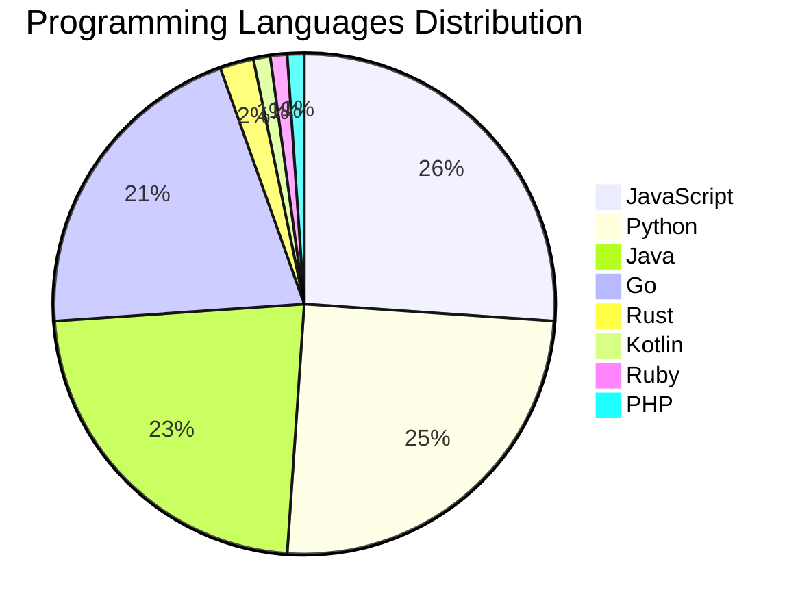

# 🚀 DevTech Auto News - Enhanced Edition


**DevTech Auto News Enhanced** is an advanced automated bot that aggregates trending topics in **AI**, **Web Development**, **Mobile**, **Cloud**, **DevOps**, and more from multiple sources including:

- 📰 [Dev.to](https://dev.to) - Developer community articles
- 🔥 [HackerNews](https://news.ycombinator.com) - Tech news discussions  
- 💻 [GitHub Trending](https://github.com/trending) - Trending repositories
- 🎯 Curated Interview Questions from multiple languages

## ✨ Features

✅ **Multi-Source Aggregation**: Combines articles from Dev.to, HackerNews, and GitHub  
✅ **Smart Categorization**: Automatically categorizes content into 10+ topics  
✅ **Image Support**: Displays cover images for visual appeal  
✅ **Pagination**: Fetches 50+ articles per update with deduplication  
✅ **Language Statistics**: Tracks programming language trends with charts  
✅ **Interview Questions**: Daily coding interview questions in multiple languages  
✅ **GitHub Actions**: Runs every 15 minutes automatically  

---

## 📊 Statistics Dashboard

### 📊 Articles by Category

**AI**: 🟦🟦🟦🟦🟦🟦🟦🟦🟦🟦🟦🟦🟦🟦🟦🟦🟦🟦🟦🟦 55 (52.9%)

**JavaScript**: 🟦🟦🟦🟦🟦🟦🟦🟦🟦 24 (23.1%)

**Python**: 🟦🟦🟦🟦🟦🟦🟦🟦 23 (22.1%)

**Tools**: 🟦🟦🟦🟦🟦🟦🟦🟦 22 (21.2%)

**Cloud**: 🟦🟦🟦 9 (8.7%)

**WebDev**: 🟦 4 (3.8%)

**Security**: 🟦 4 (3.8%)

**Database**: 🟦 3 (2.9%)

**DevOps**: 🟦 2 (1.9%)

**Mobile**:  1 (1.0%)


### 📡 Sources

- **Dev.to**: 59 articles
- **HackerNews**: 30 articles
- **GitHub**: 15 articles


### 💻 Programming Language Trends

```
JavaScript      ██████████████████████████████ 26.1 (26.1%)
Python          █████████████████████████████ 25.0 (25.0%)
Java            ██████████████████████████ 22.8 (22.8%)
Go              ████████████████████████ 20.7 (20.7%)
Rust            ███ 2.2 (2.2%)
Kotlin          █ 1.1 (1.1%)
Ruby            █ 1.1 (1.1%)
PHP             █ 1.1 (1.1%)

```




### 🏷️ Trending Tags

               


---

## 🛠️ How It Works

1. **Multi-Source Fetch**: Pulls from Dev.to (2 pages), HackerNews (3 topics), GitHub (3 languages)
2. **Smart Filter**: Uses keyword matching across 10+ categories  
3. **Deduplication**: Removes duplicate URLs  
4. **Image Extraction**: Captures cover images when available  
5. **Statistics**: Generates language trends and category breakdowns  
6. **Update Files**: Regenerates README and appends to comprehensive log  

---

## 📦 Installation & Usage

```bash
# Clone the repository
git clone https://github.com/Derrick-MUGISHA/github-activity-bot.git
cd github-activity-bot

# Install dependencies  
npm install

# Run manually
npm start

# Test mode
npm run test
```

---


# 🚀 DevTech Auto News - Enhanced Edition

## 📅 Latest Updates (2026-04-07 13:00 CAT)


### 🖼️ Featured Articles

<table>
<tr>
  <td align="center" width="33%">
    <a href="https://dev.to/devteam/top-7-featured-dev-posts-of-the-week-4idc">
      
      <br/>
      <b>Top 7 Featured DEV Posts of the Week</b>
    </a>
    <br/>
    <sub>Dev.to</sub>
  </td>
  <td align="center" width="33%">
    <a href="https://dev.to/phalkmin/move-over-vibe-coding-i-built-an-ai-editor-for-stress-coding-4243">
      
      <br/>
      <b>Move over, Vibe-Coding: I built an AI editor for S...</b>
    </a>
    <br/>
    <sub>Dev.to</sub>
  </td>
  <td align="center" width="33%">
    <a href="https://dev.to/gde/observability-at-scale-mastering-adk-callbacks-for-cost-latency-and-auditability-1mo5">
      
      <br/>
      <b>Observability at Scale: Mastering ADK Callbacks fo...</b>
    </a>
    <br/>
    <sub>Dev.to</sub>
  </td>
</tr>
<tr>
  <td align="center" width="33%">
    <a href="https://dev.to/gde/deploying-adk-agents-on-azure-fabric-48mf">
      
      <br/>
      <b>Deploying ADK Agents on Azure Fabric</b>
    </a>
    <br/>
    <sub>Dev.to</sub>
  </td>
  <td align="center" width="33%">
    <a href="https://dev.to/auth0/how-to-use-auth0-agent-skills-in-claude-code-ai-coding-assistants-56e5">
      
      <br/>
      <b>How to Use Auth0 Agent Skills in Claude Code & AI ...</b>
    </a>
    <br/>
    <sub>Dev.to</sub>
  </td>
  <td align="center" width="33%">
    <a href="https://dev.to/piyush6348/master-class-understanding-database-replication-single-multi-and-leaderless-hhm">
      
      <br/>
      <b>Master-Class: Understanding Database Replication (...</b>
    </a>
    <br/>
    <sub>Dev.to</sub>
  </td>
</tr>
</table>


### 📰 Top Headlines

- [Top 7 Featured DEV Posts of the Week](https://dev.to/devteam/top-7-featured-dev-posts-of-the-week-4idc) _[Dev.to]_
- [Move over, Vibe-Coding: I built an AI editor for STRESS-CODING](https://dev.to/phalkmin/move-over-vibe-coding-i-built-an-ai-editor-for-stress-coding-4243) _[Dev.to]_
- [Observability at Scale: Mastering ADK Callbacks for Cost, Latency, and Auditability [GDE]](https://dev.to/gde/observability-at-scale-mastering-adk-callbacks-for-cost-latency-and-auditability-1mo5) _[Dev.to]_
- [Deploying ADK Agents on Azure Fabric](https://dev.to/gde/deploying-adk-agents-on-azure-fabric-48mf) _[Dev.to]_
- [How to Use Auth0 Agent Skills in Claude Code & AI Coding Assistants](https://dev.to/auth0/how-to-use-auth0-agent-skills-in-claude-code-ai-coding-assistants-56e5) _[Dev.to]_
- [Master-Class: Understanding Database Replication (Single, Multi, and Leaderless)](https://dev.to/piyush6348/master-class-understanding-database-replication-single-multi-and-leaderless-hhm) _[Dev.to]_
- [What are your goals for the week? #173](https://dev.to/jarvisscript/what-are-your-goals-for-the-week-173-597n) _[Dev.to]_
- [Agentic interaction using AppFunctions](https://dev.to/tkuenneth/agentic-interaction-using-appfunctions-m8k) _[Dev.to]_
- [Join our April Fools Challenge for a chance at TEA-RRIFIC prizes!!!](https://dev.to/devteam/join-our-april-fools-challenge-for-a-chance-at-tea-rrific-prizes-1ofa) _[Dev.to]_
- [What was your win this week?](https://dev.to/devteam/what-was-your-win-this-week-2on5) _[Dev.to]_
- [Meme Monday](https://dev.to/ben/meme-monday-3lh9) _[Dev.to]_
- [MCP Development with Python, Gemini CLI, and Amazon AWS ECS Express](https://dev.to/gde/mcp-development-with-python-gemini-cli-and-amazon-aws-ecs-express-1oei) _[Dev.to]_
- [MCP Development with Python, and Azure Kubernates Service (AKS)](https://dev.to/gde/mcp-development-with-python-and-azure-kubernates-service-aks-2in7) _[Dev.to]_
- [AI subscriptions are subsidized. Here's what happens when that stops.](https://dev.to/dzhuneyt/ai-subscriptions-are-subsidized-heres-what-happens-when-that-stops-293f) _[Dev.to]_
- [Building a Production-Ready Serverless App on Google Cloud (Part 2: The Data Contract)](https://dev.to/gde/building-a-production-ready-serverless-app-on-google-cloud-part-2-the-data-contract-3hpa) _[Dev.to]_
- [Building a Multimodal Cross Cloud Live Agent with ADK, Azure ACA, and Gemini CLI](https://dev.to/gde/building-a-multimodal-cross-cloud-live-agent-with-adk-azure-aca-and-gemini-cli-57a1) _[Dev.to]_
- [Big performance upgrade in DEV/Forem tag queries shipped yesterday. Breath of fresh air 🙂](https://dev.to/ben/big-performance-upgrade-in-devforem-tag-queries-shipped-yesterday-breath-of-fresh-air-2pp0) _[Dev.to]_
- [Deploying ADK Agents on Azure Kubernates Service (AKS)](https://dev.to/gde/deploying-adk-agents-on-azure-kubernates-service-aks-1lpf) _[Dev.to]_
- [I Analyzed AI Coding Mistakes and Built an ESLint Plugin to Catch Them](https://dev.to/pertrai1/i-analyzed-500-ai-coding-mistakes-and-built-an-eslint-plugin-to-catch-them-jme) _[Dev.to]_
- [You don't need to deal with code to understand Playwright](https://dev.to/abhivaikar/you-dont-need-to-deal-with-code-to-understand-playwright-39nk) _[Dev.to]_

_Last automated update: Tue, 07 Apr 2026 13:37:37 CAT_


## 💡 Daily Interview Questions

_Sharpen your skills with these curated questions_

### 1. JavaScript: What are closures and provide a practical example?

**Difficulty**: Medium | **Topics**: functions, scope

<details>
<summary>💡 Hint</summary>

Function + lexical environment, data privacy, callbacks

</details>

### 2. Python: What are generators and when would you use them?

**Difficulty**: Medium | **Topics**: iterators, memory

<details>
<summary>💡 Hint</summary>

yield keyword, lazy evaluation, memory efficiency

</details>

### 3. JavaScript: Explain event delegation and why it's useful

**Difficulty**: Medium | **Topics**: events, DOM

<details>
<summary>💡 Hint</summary>

Event bubbling, single listener for multiple elements

</details>


---

## 📚 Resources

- [Full News Archive](./data/news_log.md) - Complete history of all fetched articles
- [Statistics JSON](./data/stats.json) - Raw statistics data
- [Categorized Data](./data/categorized.json) - Articles organized by category
- [Interview Questions](./data/interview_questions.json) - Complete question bank

---

## 🤝 Contributing

Want to add more sources, categories, or interview questions? Feel free to:

1. Fork this repository
2. Add your improvements
3. Submit a pull request

---

## 📄 License

MIT License - Feel free to use and modify!

---

<p align="center">
  <b>Last automated update: Tue, 07 Apr 2026 11:37:37 GMT</b><br/>
  <sub>Powered by GitHub Actions | Made with ❤️ for developers</sub>
</p>

---

## 🔗 Quick Links

- [View Workflow](https://github.com/Derrick-MUGISHA/github-activity-bot/actions)
- [Report Issue](https://github.com/Derrick-MUGISHA/github-activity-bot/issues)
- [Suggest Feature](https://github.com/Derrick-MUGISHA/github-activity-bot/issues/new)
