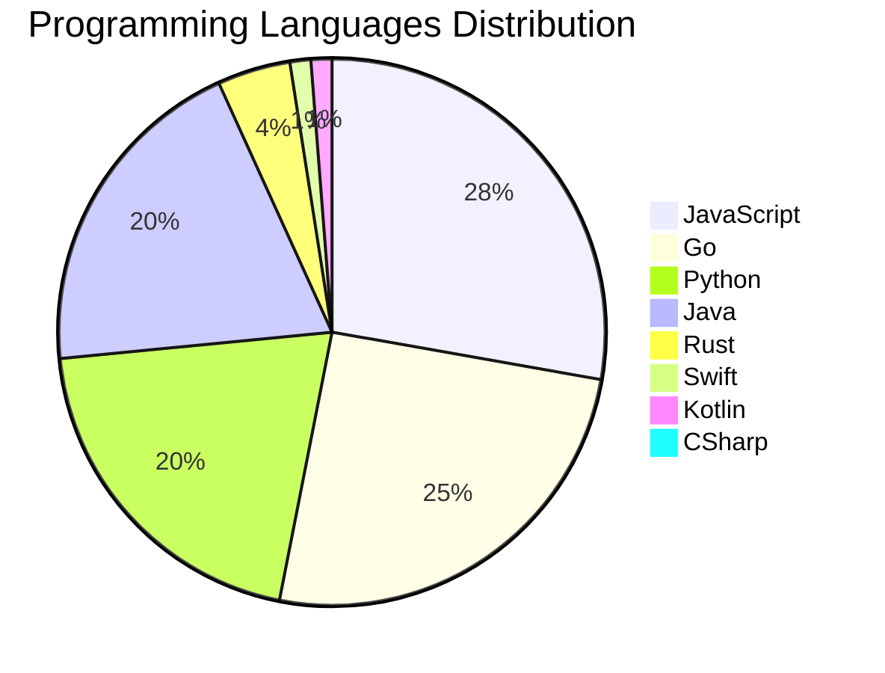

<div align="center">

# 📰 DevTech Auto News

**Your always-fresh digest of developer & AI tech news — curated automatically, around the clock.**


Aggregating [Dev.to](https://dev.to) · [Hacker News](https://news.ycombinator.com) · [GitHub Trending](https://github.com/trending) · [Lobste.rs](https://lobste.rs) · [Stack Overflow](https://stackoverflow.com) · [TechCrunch](https://techcrunch.com) · [freeCodeCamp](https://www.freecodecamp.org/news) — refreshed by GitHub Actions around the clock.

**[📰 Headlines](#-latest-headlines) · [💡 Interview Prep](#-interview-question-of-the-hour) · [📊 Statistics](#-statistics) · [⚙️ How It Works](#%EF%B8%8F-how-it-works)**

</div>

---

## 📰 Latest Headlines

> 🕐 Edition of **2026-08-11 9:00 CAT** — refreshed automatically, all day, every day.

### ✨ Featured Stories

<table>
<tr>
  <td align="center" width="33%">
    <a href="https://dev.to/francistrdev/i-joined-devto-because-fl0">
      
      <br/>
      <b>I Joined dev.to because...</b>
    </a>
    <br/>
    <sub>Dev.to</sub>
  </td>
  <td align="center" width="33%">
    <a href="https://dev.to/devteam/hey-all-im-jem-the-dev-community-program-coordinator-2g2">
      
      <br/>
      <b>Hey all! I’m Jem, the DEV Community Program Coordi...</b>
    </a>
    <br/>
    <sub>Dev.to</sub>
  </td>
  <td align="center" width="33%">
    <a href="https://dev.to/jess/jem-has-quietly-been-working-behind-the-scenes-here-at-dev-for-years-and-im-so-happy-that-they-129e">
      
      <br/>
      <b>Jem has quietly been working behind-the-scenes her...</b>
    </a>
    <br/>
    <sub>Dev.to</sub>
  </td>
</tr>
<tr>
  <td align="center" width="33%">
    <a href="https://dev.to/ben/meme-monday-3n1d">
      
      <br/>
      <b>Meme Monday</b>
    </a>
    <br/>
    <sub>Dev.to</sub>
  </td>
  <td align="center" width="33%">
    <a href="https://dev.to/gde/three-clouds-three-native-agents-3egf">
      
      <br/>
      <b>Three Clouds, Three Native Agents</b>
    </a>
    <br/>
    <sub>Dev.to</sub>
  </td>
  <td align="center" width="33%">
    <a href="https://dev.to/gde/self-hosting-a-lite-agent-backend-on-one-tpu-gemma-4-e2b-vllm-on-a-v5e-1-fk1">
      
      <br/>
      <b>Self-hosting a lite agent backend on one TPU: Gemm...</b>
    </a>
    <br/>
    <sub>Dev.to</sub>
  </td>
</tr>
</table>


### 🗞️ Top Stories

| # | Headline | Source |
|---|----------|--------|
| 1 | [I Joined dev.to because...](https://dev.to/francistrdev/i-joined-devto-because-fl0) | Dev.to |
| 2 | [Hey all! I’m Jem, the DEV Community Program Coordinator](https://dev.to/devteam/hey-all-im-jem-the-dev-community-program-coordinator-2g2) | Dev.to |
| 3 | [Jem has quietly been working behind-the-scenes here at DEV for YEARS, and I'm so happy that they are finally introducing themselves to everyone!!](https://dev.to/jess/jem-has-quietly-been-working-behind-the-scenes-here-at-dev-for-years-and-im-so-happy-that-they-129e) | Dev.to |
| 4 | [Meme Monday](https://dev.to/ben/meme-monday-3n1d) | Dev.to |
| 5 | [Three Clouds, Three Native Agents](https://dev.to/gde/three-clouds-three-native-agents-3egf) | Dev.to |
| 6 | [Self-hosting a lite agent backend on one TPU: Gemma 4 E2B + vLLM on a v5e-1](https://dev.to/gde/self-hosting-a-lite-agent-backend-on-one-tpu-gemma-4-e2b-vllm-on-a-v5e-1-fk1) | Dev.to |
| 7 | [Unit Testing in BlocSignal: The Practical Handbook](https://dev.to/gde/unit-testing-in-blocsignal-the-practical-handbook-17o1) | Dev.to |
| 8 | [Serving Gemma 4 2B on a Single TPU v5e Chip with MCP and Antigravity CLI](https://dev.to/gde/serving-gemma-4-2b-on-a-single-tpu-v5e-chip-with-mcp-and-antigravity-cli-33l8) | Dev.to |
| 9 | [From Threat Model to Framework: Closing the Real Gaps in Agent Skill Security](https://dev.to/gde/from-threat-model-to-framework-closing-the-real-gaps-in-agent-skill-security-7m8) | Dev.to |
| 10 | [Build a Dart ADK Agent and MCP Server](https://dev.to/gde/build-a-dart-adk-agent-and-mcp-server-4f9n) | Dev.to |
| 11 | [Amazon Bedrock Agents Orchestrating Google ADK over A2A](https://dev.to/gde/amazon-bedrock-agents-orchestrating-google-adk-over-a2a-5c2b) | Dev.to |
| 12 | [From Raw Signals to BlocSignal: Taming Reactivity for Enterprise Scale](https://dev.to/gde/from-raw-signals-to-blocsignal-taming-reactivity-for-enterprise-scale-2cmi) | Dev.to |
| 13 | [What was your win this week?](https://dev.to/devteam/what-was-your-win-this-week-3n23) | Dev.to |
| 14 | [Passkeys Explained Simply](https://dev.to/thomasbnt/passkeys-explained-simply-52jk) | Dev.to |
| 15 | [Build Hybrid Image Analysis Application with Angular, Firebase AI Logic, and Gemini Nano [GDE]](https://dev.to/gde/build-hybrid-image-analysis-application-with-angular-firebase-ai-logic-and-gemini-nano-1ipl) | Dev.to |
| 16 | [Join our latest Frontend Challenge: Comfort Food Edition 🍲](https://dev.to/devteam/join-our-latest-frontend-challenge-comfort-food-edition-28a0) | Dev.to |
| 17 | [I built an open source library of animated icons for React, all using motion and Phosphor icons](https://dev.to/smammar14/i-built-an-open-source-library-of-animated-icons-for-react-all-using-motion-and-phosphor-icons-325p) | Dev.to |
| 18 | [Before the Quake: How Antigravity CLI's AI Agents & IoT Data Predict Earthquakes](https://dev.to/gde/before-the-quake-how-antigravity-clis-ai-agents-iot-data-predict-earthquakes-34if) | Dev.to |
| 19 | [It Was Just a Patch Update. What Could Possibly Go Wrong?](https://dev.to/sylwia-lask/it-was-just-a-patch-update-what-could-possibly-go-wrong-3be3) | Dev.to |
| 20 | [The Ghost in the View Transitions API: A Bizarre Debugging Saga with Google AI 👻](https://dev.to/omarafifi/the-ghost-in-the-view-transitions-api-a-bizarre-debugging-saga-with-google-ai-5aph) | Dev.to |

<sub>Last fetched: Tue, 11 Aug 2026 09:42:50 CAT</sub>


---

## 💡 Interview Question of the Hour

> Sharpen your skills — new questions selected on every update. Try answering before opening the hint!

**1. `JavaScript` — What is the event loop and how does it work?**

&nbsp;&nbsp;&nbsp;&nbsp;🎯 Hard · 🏷 async, runtime

<details>
<summary>&nbsp;&nbsp;&nbsp;&nbsp;💡 Show hint</summary>

> Call stack, callback queue, microtask queue

</details>

**2. `JavaScript` — Implement a debounce function from scratch**

&nbsp;&nbsp;&nbsp;&nbsp;🎯 Hard · 🏷 functions, timing

<details>
<summary>&nbsp;&nbsp;&nbsp;&nbsp;💡 Show hint</summary>

> setTimeout, clearTimeout, wrapper function

</details>

**3. `Python` — What are generators and when would you use them?**

&nbsp;&nbsp;&nbsp;&nbsp;🎯 Medium · 🏷 iterators, memory

<details>
<summary>&nbsp;&nbsp;&nbsp;&nbsp;💡 Show hint</summary>

> yield keyword, lazy evaluation, memory efficiency

</details>


---

## 📊 Statistics

#### 🗂 Articles by Category

| Category | Articles | Share | |
|----------|---------:|------:|---|
| **AI** | 79 | 42.9% | `████████████████████` |
| **JavaScript** | 45 | 24.5% | `███████████░░░░░░░░░` |
| **Tools** | 43 | 23.4% | `███████████░░░░░░░░░` |
| **Python** | 33 | 17.9% | `████████░░░░░░░░░░░░` |
| **Security** | 21 | 11.4% | `█████░░░░░░░░░░░░░░░` |
| **Cloud** | 19 | 10.3% | `█████░░░░░░░░░░░░░░░` |
| **DevOps** | 15 | 8.2% | `████░░░░░░░░░░░░░░░░` |
| **WebDev** | 14 | 7.6% | `████░░░░░░░░░░░░░░░░` |
| **Mobile** | 9 | 4.9% | `██░░░░░░░░░░░░░░░░░░` |
| **Database** | 2 | 1.1% | `█░░░░░░░░░░░░░░░░░░░` |

<sub>Articles can match more than one category, so shares may sum to over 100%.</sub>


#### 📡 Articles by Source

| Source | Articles |
|--------|---------:|
| Dev.to | 60 |
| HackerNews | 49 |
| GitHub | 25 |
| Lobste.rs | 10 |
| StackOverflow | 20 |
| TechCrunch | 10 |
| freeCodeCamp | 10 |


#### 💻 Programming Language Trends

```
JavaScript      ██████████████████████████████ 27.6%
Go              ███████████████████████████ 25.2%
Python          ██████████████████████ 20.2%
Java            █████████████████████ 19.6%
Rust            █████ 4.3%
Swift           █ 1.2%
Kotlin          █ 1.2%
CSharp          █ 0.6%

```




#### 🏷 Trending Topics

            


---

## ⚙️ How It Works

This repository is a fully automated news pipeline. On every run, GitHub Actions:

1. **Fetches** the latest articles from seven sources: Dev.to, Hacker News, GitHub Trending, Lobste.rs, Stack Overflow, TechCrunch, and freeCodeCamp
2. **Deduplicates and categorizes** them across 10+ topics using keyword matching
3. **Extracts cover images** and computes language & category statistics
4. **Rebuilds this README** and appends everything to the [full archive](./data/news_log.md)
5. **Commits and pushes** the result — no human intervention needed

<details>
<summary><b>🚀 Run it yourself</b></summary>

```bash
git clone https://github.com/Derrick-MUGISHA/github-activity-bot.git
cd github-activity-bot
npm install
npm start
```

Fork the repo, enable GitHub Actions, and you have your own self-updating news feed.

</details>

<details>
<summary><b>📚 Data & resources</b></summary>

- [Full news archive](./data/news_log.md) — complete history of every fetched article
- [Statistics](./data/stats.json) — raw stats data (JSON)
- [Categorized articles](./data/categorized.json) — articles grouped by topic
- [Interview question bank](./data/interview_questions.json) — the full question set

</details>

---

## 🤝 Contributing

Ideas for new sources, categories, or interview questions are welcome — [open an issue](https://github.com/Derrick-MUGISHA/github-activity-bot/issues/new) or submit a pull request.

## 📄 License

Released under the [MIT License](https://opensource.org/licenses/MIT) — free to use, fork, and modify.

---

<div align="center">
  <sub>🤖 Last automated update: <b>Tue, 11 Aug 2026 07:42:50 GMT</b></sub><br/>
  <sub>Powered by GitHub Actions · Built with ❤️ by <a href="https://github.com/Derrick-MUGISHA">Derrick MUGISHA</a></sub>
</div>
