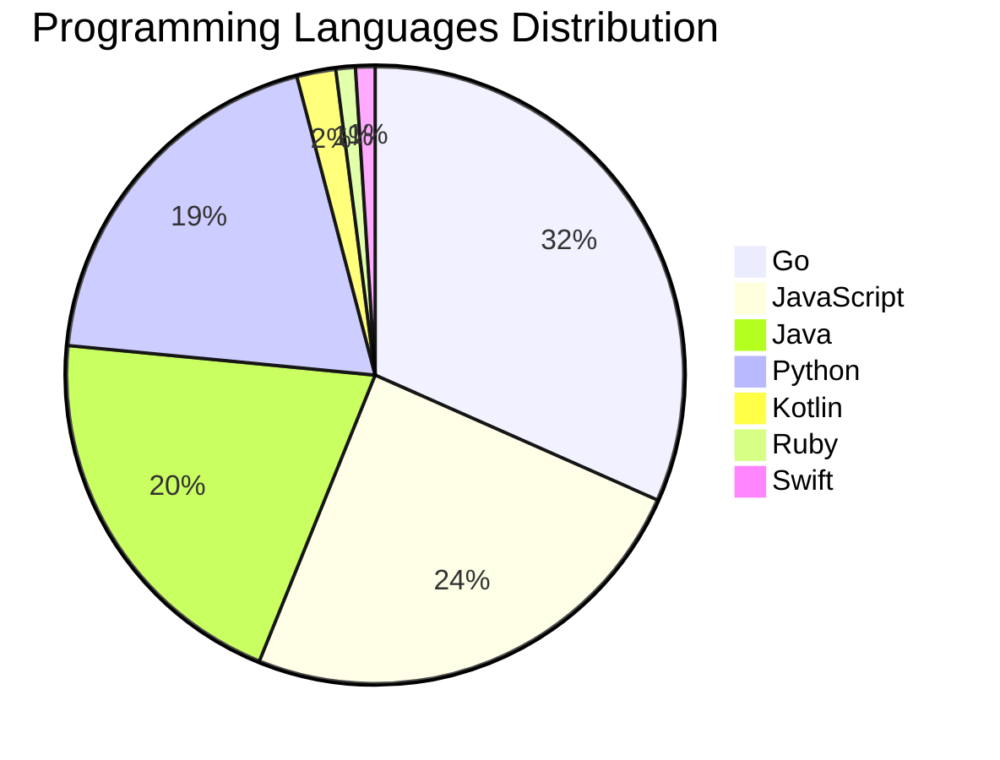

# 🚀 DevTech Auto News - Enhanced Edition


**DevTech Auto News Enhanced** is an advanced automated bot that aggregates trending topics in **AI**, **Web Development**, **Mobile**, **Cloud**, **DevOps**, and more from multiple sources including:

- 📰 [Dev.to](https://dev.to) - Developer community articles
- 🔥 [HackerNews](https://news.ycombinator.com) - Tech news discussions  
- 💻 [GitHub Trending](https://github.com/trending) - Trending repositories
- 🎯 Curated Interview Questions from multiple languages

## ✨ Features

✅ **Multi-Source Aggregation**: Combines articles from Dev.to, HackerNews, and GitHub  
✅ **Smart Categorization**: Automatically categorizes content into 10+ topics  
✅ **Image Support**: Displays cover images for visual appeal  
✅ **Pagination**: Fetches 50+ articles per update with deduplication  
✅ **Language Statistics**: Tracks programming language trends with charts  
✅ **Interview Questions**: Daily coding interview questions in multiple languages  
✅ **GitHub Actions**: Runs every 15 minutes automatically  

---

## 📊 Statistics Dashboard

### 📊 Articles by Category

**AI**: 🟦🟦🟦🟦🟦🟦🟦🟦🟦🟦🟦🟦🟦🟦🟦🟦🟦🟦🟦🟦 60 (57.1%)

**JavaScript**: 🟦🟦🟦🟦🟦🟦🟦🟦 24 (22.9%)

**Tools**: 🟦🟦🟦🟦🟦🟦🟦🟦 23 (21.9%)

**Python**: 🟦🟦🟦🟦🟦🟦 19 (18.1%)

**Cloud**: 🟦🟦🟦🟦🟦🟦 18 (17.1%)

**WebDev**: 🟦🟦🟦 8 (7.6%)

**Security**: 🟦🟦 5 (4.8%)

**DevOps**: 🟦 3 (2.9%)

**Mobile**: 🟦 3 (2.9%)

**Database**:  1 (1.0%)


### 📡 Sources

- **Dev.to**: 60 articles
- **HackerNews**: 30 articles
- **GitHub**: 15 articles


### 💻 Programming Language Trends

```
Go              ██████████████████████████████ 31.6 (31.6%)
JavaScript      ███████████████████████ 24.5 (24.5%)
Java            ███████████████████ 20.4 (20.4%)
Python          ██████████████████ 19.4 (19.4%)
Kotlin          ██ 2.0 (2.0%)
Ruby            █ 1.0 (1.0%)
Swift           █ 1.0 (1.0%)

```




### 🏷️ Trending Tags

               


---

## 🛠️ How It Works

1. **Multi-Source Fetch**: Pulls from Dev.to (2 pages), HackerNews (3 topics), GitHub (3 languages)
2. **Smart Filter**: Uses keyword matching across 10+ categories  
3. **Deduplication**: Removes duplicate URLs  
4. **Image Extraction**: Captures cover images when available  
5. **Statistics**: Generates language trends and category breakdowns  
6. **Update Files**: Regenerates README and appends to comprehensive log  

---

## 📦 Installation & Usage

```bash
# Clone the repository
git clone https://github.com/Derrick-MUGISHA/github-activity-bot.git
cd github-activity-bot

# Install dependencies  
npm install

# Run manually
npm start

# Test mode
npm run test
```

---


# 🚀 DevTech Auto News - Enhanced Edition

## 📅 Latest Updates (2026-04-20 13:00 CAT)


### 🖼️ Featured Articles

<table>
<tr>
  <td align="center" width="33%">
    <a href="https://dev.to/devteam/join-the-openclaw-challenge-1200-prize-pool-5682">
      
      <br/>
      <b>Join the OpenClaw Challenge: $1,200 Prize Pool!</b>
    </a>
    <br/>
    <sub>Dev.to</sub>
  </td>
  <td align="center" width="33%">
    <a href="https://dev.to/gde/multi-agent-a2a-with-the-agent-development-kitadk-azure-aci-and-gemini-cli-1k84">
      
      <br/>
      <b>Multi-Agent A2A with the Agent Development Kit(ADK...</b>
    </a>
    <br/>
    <sub>Dev.to</sub>
  </td>
  <td align="center" width="33%">
    <a href="https://dev.to/devteam/what-was-your-win-this-week-28fb">
      
      <br/>
      <b>What was your win this week?!</b>
    </a>
    <br/>
    <sub>Dev.to</sub>
  </td>
</tr>
<tr>
  <td align="center" width="33%">
    <a href="https://dev.to/simme/boring-code-is-an-organizational-tell-4gca">
      
      <br/>
      <b>Boring code is an organizational tell</b>
    </a>
    <br/>
    <sub>Dev.to</sub>
  </td>
  <td align="center" width="33%">
    <a href="https://dev.to/jonoherrington/ai-doesnt-fix-weak-engineering-it-just-speeds-it-up-5bak">
      
      <br/>
      <b>AI Doesn't Fix Weak Engineering. It Just Speeds It...</b>
    </a>
    <br/>
    <sub>Dev.to</sub>
  </td>
  <td align="center" width="33%">
    <a href="https://dev.to/devteam/join-our-dev-weekend-challenge-1000-in-prizes-across-ten-winners-submissions-due-april-20-at-47i1">
      
      <br/>
      <b>Join our DEV Weekend Challenge — $1,000 in Prizes ...</b>
    </a>
    <br/>
    <sub>Dev.to</sub>
  </td>
</tr>
</table>


### 📰 Top Headlines

- [Join the OpenClaw Challenge: $1,200 Prize Pool!](https://dev.to/devteam/join-the-openclaw-challenge-1200-prize-pool-5682) _[Dev.to]_
- [Multi-Agent A2A with the Agent Development Kit(ADK), Azure ACI, and Gemini CLI](https://dev.to/gde/multi-agent-a2a-with-the-agent-development-kitadk-azure-aci-and-gemini-cli-1k84) _[Dev.to]_
- [What was your win this week?!](https://dev.to/devteam/what-was-your-win-this-week-28fb) _[Dev.to]_
- [Boring code is an organizational tell](https://dev.to/simme/boring-code-is-an-organizational-tell-4gca) _[Dev.to]_
- [AI Doesn't Fix Weak Engineering. It Just Speeds It Up.](https://dev.to/jonoherrington/ai-doesnt-fix-weak-engineering-it-just-speeds-it-up-5bak) _[Dev.to]_
- [Join our DEV Weekend Challenge — $1,000 in Prizes Across TEN winners! Submissions Due April 20 at 6:59 AM UTC.](https://dev.to/devteam/join-our-dev-weekend-challenge-1000-in-prizes-across-ten-winners-submissions-due-april-20-at-47i1) _[Dev.to]_
- [Every climate chatbot is amnesiac. So I built Aura — a stateful climate coach on Backboard + Gemini](https://dev.to/dev_rajput_2d46f92f8a3418/every-climate-chatbot-is-amnesiac-so-i-built-aura-a-stateful-climate-coach-on-backboard-gemini-4kih) _[Dev.to]_
- [The Mental Framework for Unlocking Agentic Workflows](https://dev.to/somedood/the-mental-framework-for-unlocking-agentic-workflows-cg1) _[Dev.to]_
- [Android desktop mode: features, device support, and the OLED screen burn-in problem](https://dev.to/maxmoffa/android-desktop-mode-features-device-support-and-the-oled-screen-burn-in-problem-5a40) _[Dev.to]_
- [Congrats to the Notion MCP Challenge Winners!](https://dev.to/devteam/congrats-to-the-notion-mcp-challenge-winners-28ab) _[Dev.to]_
- [Less Than Six Hours From Idea to Dev Release: Building a new Drupal Canvas SDC Module With AI, Deliberately](https://dev.to/jcandan/i-built-a-new-drupal-canvas-sdc-module-with-ai-in-under-6-hours-and-the-review-process-still-59b8) _[Dev.to]_
- [Multi-Agent A2A with the Agent Development Kit(ADK), Amazon ECS Express, and Gemini CLI](https://dev.to/gde/multi-agent-a2a-with-the-agent-development-kitadk-amazon-ecs-express-and-gemini-cli-1gcl) _[Dev.to]_
- [I Built OxyTrack: Turning Small Daily Habits Into Real Environmental Impact 🌱](https://dev.to/ajitekom/i-built-oxytrack-turning-small-daily-habits-into-real-environmental-impact-1nj9) _[Dev.to]_
- [Building a Multimodal Agent with the ADK, Azure ACI, and Gemini Flash Live 3.1](https://dev.to/gde/building-a-multimodal-agent-with-the-adk-azure-aci-and-gemini-flash-live-31-3hp6) _[Dev.to]_
- [Multi-Agent A2A with the Agent Development Kit(ADK), Azure ACA, and Gemini CLI](https://dev.to/gde/multi-agent-a2a-with-the-agent-development-kitadk-azure-aca-and-gemini-cli-m15) _[Dev.to]_
- [Don't be mad, BMAD instead](https://dev.to/basteez/dont-be-mad-bmad-instead-3d4i) _[Dev.to]_
- [Congrats to the 2026 WeCoded Challenge Winners!](https://dev.to/devteam/congrats-to-the-2026-wecoded-challenge-winners-2pee) _[Dev.to]_
- [I built an API in C, couldn't document it, so I accidentally created an open-source tool](https://dev.to/devgirl_/i-built-an-api-in-c-couldnt-document-it-so-i-accidentally-created-an-open-source-tool-5cgn) _[Dev.to]_
- [Building a Smarter Hiring Engine: AI Recruiter with RAG, Memory & Web Search](https://dev.to/ranjancse/building-a-smarter-hiring-engine-ai-recruiter-with-rag-memory-web-search-4fpe) _[Dev.to]_
- [Brain, Explained](https://dev.to/jimmymcbride/brain-explained-757) _[Dev.to]_

_Last automated update: Mon, 20 Apr 2026 13:50:07 CAT_


## 💡 Daily Interview Questions

_Sharpen your skills with these curated questions_

### 1. Python: What are generators and when would you use them?

**Difficulty**: Medium | **Topics**: iterators, memory

<details>
<summary>💡 Hint</summary>

yield keyword, lazy evaluation, memory efficiency

</details>

### 2. React: Explain the difference between state and props

**Difficulty**: Easy | **Topics**: data flow, components

<details>
<summary>💡 Hint</summary>

Ownership, mutability, data flow direction

</details>

### 3. Database: Explain database indexing and when to use it

**Difficulty**: Medium | **Topics**: optimization, performance

<details>
<summary>💡 Hint</summary>

B-tree, trade-offs, query performance

</details>


---

## 📚 Resources

- [Full News Archive](./data/news_log.md) - Complete history of all fetched articles
- [Statistics JSON](./data/stats.json) - Raw statistics data
- [Categorized Data](./data/categorized.json) - Articles organized by category
- [Interview Questions](./data/interview_questions.json) - Complete question bank

---

## 🤝 Contributing

Want to add more sources, categories, or interview questions? Feel free to:

1. Fork this repository
2. Add your improvements
3. Submit a pull request

---

## 📄 License

MIT License - Feel free to use and modify!

---

<p align="center">
  <b>Last automated update: Mon, 20 Apr 2026 11:50:07 GMT</b><br/>
  <sub>Powered by GitHub Actions | Made with ❤️ for developers</sub>
</p>

---

## 🔗 Quick Links

- [View Workflow](https://github.com/Derrick-MUGISHA/github-activity-bot/actions)
- [Report Issue](https://github.com/Derrick-MUGISHA/github-activity-bot/issues)
- [Suggest Feature](https://github.com/Derrick-MUGISHA/github-activity-bot/issues/new)
