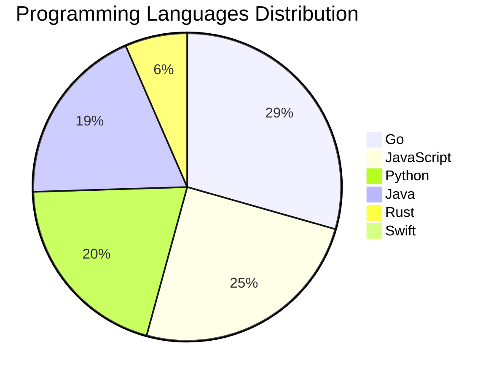

<div align="center">

# 📰 DevTech Auto News

**Your always-fresh digest of developer & AI tech news — curated automatically, around the clock.**


Aggregating [Dev.to](https://dev.to) · [Hacker News](https://news.ycombinator.com) · [GitHub Trending](https://github.com/trending) · [Lobste.rs](https://lobste.rs) · [Stack Overflow](https://stackoverflow.com) · [TechCrunch](https://techcrunch.com) · [freeCodeCamp](https://www.freecodecamp.org/news) — refreshed by GitHub Actions around the clock.

**[📰 Headlines](#-latest-headlines) · [💡 Interview Prep](#-interview-question-of-the-hour) · [📊 Statistics](#-statistics) · [⚙️ How It Works](#%EF%B8%8F-how-it-works)**

</div>

---

## 📰 Latest Headlines

> 🕐 Edition of **2026-07-28 0:00 CAT** — refreshed automatically, all day, every day.

### ✨ Featured Stories

<table>
<tr>
  <td align="center" width="33%">
    <a href="https://dev.to/thomasbnt/passkeys-explained-simply-52jk">
      
      <br/>
      <b>Passkeys Explained Simply</b>
    </a>
    <br/>
    <sub>Dev.to</sub>
  </td>
  <td align="center" width="33%">
    <a href="https://dev.to/madsendev/i-built-something-good-with-ai-now-some-developer-communities-dont-want-to-see-it-20mo">
      
      <br/>
      <b>I Built Something Good With AI. Now Some Developer...</b>
    </a>
    <br/>
    <sub>Dev.to</sub>
  </td>
  <td align="center" width="33%">
    <a href="https://dev.to/lovestaco/how-terminal-sharing-tools-put-your-shell-in-a-browser-328">
      
      <br/>
      <b>How terminal-sharing tools put your shell in a bro...</b>
    </a>
    <br/>
    <sub>Dev.to</sub>
  </td>
</tr>
<tr>
  <td align="center" width="33%">
    <a href="https://dev.to/devteam/top-7-featured-dev-posts-of-the-week-257h">
      
      <br/>
      <b>Top 7 Featured DEV Posts of the Week</b>
    </a>
    <br/>
    <sub>Dev.to</sub>
  </td>
  <td align="center" width="33%">
    <a href="https://dev.to/ben/meme-monday-mm5">
      
      <br/>
      <b>Meme Monday</b>
    </a>
    <br/>
    <sub>Dev.to</sub>
  </td>
  <td align="center" width="33%">
    <a href="https://dev.to/gde/auditing-agent-skills-a-threat-model-for-the-next-generation-of-ai-package-managers-2g25">
      
      <br/>
      <b>Auditing Agent Skills: A Threat Model for the Next...</b>
    </a>
    <br/>
    <sub>Dev.to</sub>
  </td>
</tr>
</table>


### 🗞️ Top Stories

| # | Headline | Source |
|---|----------|--------|
| 1 | [Passkeys Explained Simply](https://dev.to/thomasbnt/passkeys-explained-simply-52jk) | Dev.to |
| 2 | [I Built Something Good With AI. Now Some Developer Communities Don't Want to See It.](https://dev.to/madsendev/i-built-something-good-with-ai-now-some-developer-communities-dont-want-to-see-it-20mo) | Dev.to |
| 3 | [How terminal-sharing tools put your shell in a browser](https://dev.to/lovestaco/how-terminal-sharing-tools-put-your-shell-in-a-browser-328) | Dev.to |
| 4 | [Top 7 Featured DEV Posts of the Week](https://dev.to/devteam/top-7-featured-dev-posts-of-the-week-257h) | Dev.to |
| 5 | [Meme Monday](https://dev.to/ben/meme-monday-mm5) | Dev.to |
| 6 | [Auditing Agent Skills: A Threat Model for the Next Generation of AI Package Managers](https://dev.to/gde/auditing-agent-skills-a-threat-model-for-the-next-generation-of-ai-package-managers-2g25) | Dev.to |
| 7 | [Beyond Prompt Injection: The Non-Human Authorization Gap in Enterprise AI](https://dev.to/gde/beyond-prompt-injection-the-non-human-authorization-gap-in-enterprise-ai-3g5c) | Dev.to |
| 8 | [Zero-Trust Data Sovereignty: Enforcing Localized MCP Tool Policies in Multi-Region Stacks](https://dev.to/gde/zero-trust-data-sovereignty-enforcing-localized-mcp-tool-policies-in-multi-region-stacks-4jbn) | Dev.to |
| 9 | [Google ADK: Introduction to AI Agent Development](https://dev.to/gde/google-adk-introduction-to-ai-agent-development-1b4e) | Dev.to |
| 10 | [I've Spent 10+ Years in Software Engineering. After Sickness, Burnout, and a Layoff, I'm Rebuilding My Career. Ask Me Anything](https://dev.to/canro91/ive-spent-10-years-in-software-engineering-after-sickness-burnout-and-a-layoff-im-rebuilding-efc) | Dev.to |
| 11 | [TPU Deployments with Gemma 31B, v6e-8, and Antigravity CLI](https://dev.to/gde/tpu-deployments-with-gemma-31b-v6e-8-and-antigravity-cli-3e4n) | Dev.to |
| 12 | [Debugging Deployments with Gemma 2B, TPU v6e-1, MCP, and Antigravity CLI](https://dev.to/gde/debugging-deployments-with-gemma-2b-tpu-v6e-1-mcp-and-antigravity-cli-3hh3) | Dev.to |
| 13 | [Teaching Claude Code to Direct: A Stateful Video-Editing Skill Built on Gemini’s Interactions API…](https://dev.to/gde/teaching-claude-code-to-direct-a-stateful-video-editing-skill-built-on-geminis-interactions-api-1j9a) | Dev.to |
| 14 | [AI And Code Ownership: Who Is Responsible For Generated Code?](https://dev.to/nazar-boyko/ai-and-code-ownership-who-is-responsible-for-generated-code-1dnj) | Dev.to |
| 15 | [I Run Bare-Metal Kubernetes on $200 of Scrap Hardware (And Why I Burned 3 SD Cards Learning)](https://dev.to/le_beltagy/i-run-bare-metal-kubernetes-on-200-of-scrap-hardware-and-why-i-burned-3-sd-cards-learning-34cb) | Dev.to |
| 16 | [Every AI Commit Is Someone's Future Legacy Code](https://dev.to/eayurt/every-ai-commit-is-someones-future-legacy-code-444l) | Dev.to |
| 17 | [Teaching Google Antigravity to Paint: A Stateful Image-Editing Skill Built on Gemini's Interactions API and MCP](https://dev.to/gde/teaching-google-antigravity-to-paint-a-stateful-image-editing-skill-built-on-geminis-interactions-9g1) | Dev.to |
| 18 | [Should I quit IT or just live through the burnout?](https://dev.to/klaudiagrz/should-i-quit-it-or-just-live-through-the-burnout-1gng) | Dev.to |
| 19 | [Better than Next.js? Is Rust Finally Ready for Full-Stack Web Development? Introducing Topcoat](https://dev.to/francescoxx/better-than-nextjs-is-rust-finally-ready-for-full-stack-web-development-introducing-topcoat-2h09) | Dev.to |
| 20 | [Build Firebase AI Logic Application with Antigravity CLI and Stitch MCP Server [GDE]](https://dev.to/gde/build-firebase-ai-logic-application-with-antigravity-cli-and-stitch-mcp-server-gde-g6o) | Dev.to |

<sub>Last fetched: Tue, 28 Jul 2026 00:42:20 CAT</sub>


---

## 💡 Interview Question of the Hour

> Sharpen your skills — new questions selected on every update. Try answering before opening the hint!

**1. `DataStructures` — Find the longest substring without repeating characters**

&nbsp;&nbsp;&nbsp;&nbsp;🎯 Medium · 🏷 strings, sliding window

<details>
<summary>&nbsp;&nbsp;&nbsp;&nbsp;💡 Show hint</summary>

> Sliding window, hash map, two pointers

</details>

**2. `JavaScript` — Explain event delegation and why it's useful**

&nbsp;&nbsp;&nbsp;&nbsp;🎯 Medium · 🏷 events, DOM

<details>
<summary>&nbsp;&nbsp;&nbsp;&nbsp;💡 Show hint</summary>

> Event bubbling, single listener for multiple elements

</details>

**3. `DataStructures` — Implement LRU Cache**

&nbsp;&nbsp;&nbsp;&nbsp;🎯 Hard · 🏷 design, hash map, linked list

<details>
<summary>&nbsp;&nbsp;&nbsp;&nbsp;💡 Show hint</summary>

> Doubly linked list + hash map, O(1) operations

</details>


---

## 📊 Statistics

#### 🗂 Articles by Category

| Category | Articles | Share | |
|----------|---------:|------:|---|
| **AI** | 85 | 46.2% | `████████████████████` |
| **Tools** | 45 | 24.5% | `███████████░░░░░░░░░` |
| **JavaScript** | 38 | 20.7% | `█████████░░░░░░░░░░░` |
| **Python** | 31 | 16.8% | `███████░░░░░░░░░░░░░` |
| **Security** | 23 | 12.5% | `█████░░░░░░░░░░░░░░░` |
| **Cloud** | 18 | 9.8% | `████░░░░░░░░░░░░░░░░` |
| **DevOps** | 16 | 8.7% | `████░░░░░░░░░░░░░░░░` |
| **WebDev** | 8 | 4.3% | `██░░░░░░░░░░░░░░░░░░` |
| **Database** | 5 | 2.7% | `█░░░░░░░░░░░░░░░░░░░` |
| **Mobile** | 3 | 1.6% | `█░░░░░░░░░░░░░░░░░░░` |

<sub>Articles can match more than one category, so shares may sum to over 100%.</sub>


#### 📡 Articles by Source

| Source | Articles |
|--------|---------:|
| Dev.to | 60 |
| HackerNews | 49 |
| GitHub | 25 |
| Lobste.rs | 10 |
| StackOverflow | 20 |
| TechCrunch | 10 |
| freeCodeCamp | 10 |


#### 💻 Programming Language Trends

```
Go              ██████████████████████████████ 29.2%
JavaScript      █████████████████████████ 24.7%
Python          █████████████████████ 20.1%
Java            ███████████████████ 18.8%
Rust            ███████ 6.5%
Swift           █ 0.6%

```




#### 🏷 Trending Topics

            


---

## ⚙️ How It Works

This repository is a fully automated news pipeline. On every run, GitHub Actions:

1. **Fetches** the latest articles from seven sources: Dev.to, Hacker News, GitHub Trending, Lobste.rs, Stack Overflow, TechCrunch, and freeCodeCamp
2. **Deduplicates and categorizes** them across 10+ topics using keyword matching
3. **Extracts cover images** and computes language & category statistics
4. **Rebuilds this README** and appends everything to the [full archive](./data/news_log.md)
5. **Commits and pushes** the result — no human intervention needed

<details>
<summary><b>🚀 Run it yourself</b></summary>

```bash
git clone https://github.com/Derrick-MUGISHA/github-activity-bot.git
cd github-activity-bot
npm install
npm start
```

Fork the repo, enable GitHub Actions, and you have your own self-updating news feed.

</details>

<details>
<summary><b>📚 Data & resources</b></summary>

- [Full news archive](./data/news_log.md) — complete history of every fetched article
- [Statistics](./data/stats.json) — raw stats data (JSON)
- [Categorized articles](./data/categorized.json) — articles grouped by topic
- [Interview question bank](./data/interview_questions.json) — the full question set

</details>

---

## 🤝 Contributing

Ideas for new sources, categories, or interview questions are welcome — [open an issue](https://github.com/Derrick-MUGISHA/github-activity-bot/issues/new) or submit a pull request.

## 📄 License

Released under the [MIT License](https://opensource.org/licenses/MIT) — free to use, fork, and modify.

---

<div align="center">
  <sub>🤖 Last automated update: <b>Mon, 27 Jul 2026 22:42:20 GMT</b></sub><br/>
  <sub>Powered by GitHub Actions · Built with ❤️ by <a href="https://github.com/Derrick-MUGISHA">Derrick MUGISHA</a></sub>
</div>
