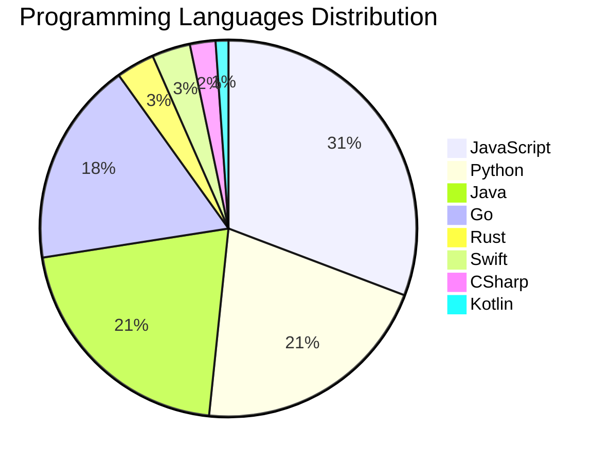

# 🚀 DevTech Auto News - Enhanced Edition


**DevTech Auto News Enhanced** is an advanced automated bot that aggregates trending topics in **AI**, **Web Development**, **Mobile**, **Cloud**, **DevOps**, and more from multiple sources including:

- 📰 [Dev.to](https://dev.to) - Developer community articles
- 🔥 [HackerNews](https://news.ycombinator.com) - Tech news discussions  
- 💻 [GitHub Trending](https://github.com/trending) - Trending repositories
- 🎯 Curated Interview Questions from multiple languages

## ✨ Features

✅ **Multi-Source Aggregation**: Combines articles from Dev.to, HackerNews, and GitHub  
✅ **Smart Categorization**: Automatically categorizes content into 10+ topics  
✅ **Image Support**: Displays cover images for visual appeal  
✅ **Pagination**: Fetches 50+ articles per update with deduplication  
✅ **Language Statistics**: Tracks programming language trends with charts  
✅ **Interview Questions**: Daily coding interview questions in multiple languages  
✅ **GitHub Actions**: Runs every 15 minutes automatically  

---

## 📊 Statistics Dashboard

### 📊 Articles by Category

**AI**: 🟦🟦🟦🟦🟦🟦🟦🟦🟦🟦🟦🟦🟦🟦🟦🟦🟦🟦🟦🟦 44 (41.9%)

**Tools**: 🟦🟦🟦🟦🟦🟦🟦🟦🟦🟦🟦🟦🟦🟦🟦 32 (30.5%)

**JavaScript**: 🟦🟦🟦🟦🟦🟦🟦🟦🟦🟦🟦🟦🟦 28 (26.7%)

**Python**: 🟦🟦🟦🟦🟦🟦🟦🟦🟦 19 (18.1%)

**DevOps**: 🟦🟦🟦 6 (5.7%)

**WebDev**: 🟦🟦 5 (4.8%)

**Cloud**: 🟦🟦 4 (3.8%)

**Mobile**: 🟦 3 (2.9%)

**Security**: 🟦 3 (2.9%)

**Database**: 🟦 2 (1.9%)


### 📡 Sources

- **Dev.to**: 60 articles
- **HackerNews**: 30 articles
- **GitHub**: 15 articles


### 💻 Programming Language Trends

```
JavaScript      ██████████████████████████████ 30.8 (30.8%)
Python          ████████████████████ 20.9 (20.9%)
Java            ████████████████████ 20.9 (20.9%)
Go              █████████████████ 17.6 (17.6%)
Rust            ███ 3.3 (3.3%)
Swift           ███ 3.3 (3.3%)
CSharp          ██ 2.2 (2.2%)
Kotlin          █ 1.1 (1.1%)

```




### 🏷️ Trending Tags

               


---

## 🛠️ How It Works

1. **Multi-Source Fetch**: Pulls from Dev.to (2 pages), HackerNews (3 topics), GitHub (3 languages)
2. **Smart Filter**: Uses keyword matching across 10+ categories  
3. **Deduplication**: Removes duplicate URLs  
4. **Image Extraction**: Captures cover images when available  
5. **Statistics**: Generates language trends and category breakdowns  
6. **Update Files**: Regenerates README and appends to comprehensive log  

---

## 📦 Installation & Usage

```bash
# Clone the repository
git clone https://github.com/Derrick-MUGISHA/github-activity-bot.git
cd github-activity-bot

# Install dependencies  
npm install

# Run manually
npm start

# Test mode
npm run test
```

---


# 🚀 DevTech Auto News - Enhanced Edition

## 📅 Latest Updates (2026-02-26 13:00 CAT)


### 🖼️ Featured Articles

<table>
<tr>
  <td align="center" width="33%">
    <a href="https://dev.to/devteam/join-the-built-with-google-gemini-writing-challenge-presented-by-major-league-hacking-mlh-win-17pk">
      
      <br/>
      <b>Join the "Built with Google Gemini: Writing Challe...</b>
    </a>
    <br/>
    <sub>Dev.to</sub>
  </td>
  <td align="center" width="33%">
    <a href="https://dev.to/pascal_cescato_692b7a8a20/stop-ignoring-rfc-2324-its-the-most-important-protocol-youve-never-implemented-53pe">
      
      <br/>
      <b>Stop Ignoring RFC 2324. It's the Most Important Pr...</b>
    </a>
    <br/>
    <sub>Dev.to</sub>
  </td>
  <td align="center" width="33%">
    <a href="https://dev.to/narnaiezzsshaa/the-developer-im-grateful-i-never-became-255d">
      
      <br/>
      <b>The Developer I'm Grateful I Never Became</b>
    </a>
    <br/>
    <sub>Dev.to</sub>
  </td>
</tr>
<tr>
  <td align="center" width="33%">
    <a href="https://dev.to/art_light/the-0-developer-phase-and-how-devto-pulled-me-out-84g">
      
      <br/>
      <b>The $0 Developer Phase — And How Dev.to Pulled Me ...</b>
    </a>
    <br/>
    <sub>Dev.to</sub>
  </td>
  <td align="center" width="33%">
    <a href="https://dev.to/canro91/a-quick-recovery-guide-for-ai-dependent-coders-4112">
      
      <br/>
      <b>A Quick Recovery Guide for AI-Dependent Coders</b>
    </a>
    <br/>
    <sub>Dev.to</sub>
  </td>
  <td align="center" width="33%">
    <a href="https://dev.to/canro91/think-of-ai-assisted-coding-as-calculators-in-math-classes-you-cant-use-them-until-you-know-the-2dlh">
      
      <br/>
      <b>Think of AI-assisted coding as calculators in math...</b>
    </a>
    <br/>
    <sub>Dev.to</sub>
  </td>
</tr>
</table>


### 📰 Top Headlines

- [Join the "Built with Google Gemini: Writing Challenge" Presented by Major League Hacking (MLH). Win a Raspberry Pi AI Kit!](https://dev.to/devteam/join-the-built-with-google-gemini-writing-challenge-presented-by-major-league-hacking-mlh-win-17pk) _[Dev.to]_
- [Stop Ignoring RFC 2324. It's the Most Important Protocol You've Never Implemented.](https://dev.to/pascal_cescato_692b7a8a20/stop-ignoring-rfc-2324-its-the-most-important-protocol-youve-never-implemented-53pe) _[Dev.to]_
- [The Developer I'm Grateful I Never Became](https://dev.to/narnaiezzsshaa/the-developer-im-grateful-i-never-became-255d) _[Dev.to]_
- [The $0 Developer Phase — And How Dev.to Pulled Me Out](https://dev.to/art_light/the-0-developer-phase-and-how-devto-pulled-me-out-84g) _[Dev.to]_
- [A Quick Recovery Guide for AI-Dependent Coders](https://dev.to/canro91/a-quick-recovery-guide-for-ai-dependent-coders-4112) _[Dev.to]_
- [Think of AI-assisted coding as calculators in math classes. You can't use them until you know the procedure you want to automate by hand.](https://dev.to/canro91/think-of-ai-assisted-coding-as-calculators-in-math-classes-you-cant-use-them-until-you-know-the-2dlh) _[Dev.to]_
- [Mastering Smooth UI Transitions: The End of the "Height: Auto" Hack](https://dev.to/vanaf1979/mastering-smooth-ui-transitions-the-end-of-the-height-auto-hack-3hjc) _[Dev.to]_
- [Domain-First Nx Monorepos: Using `packages/` to Make Ownership and Boundaries Obvious](https://dev.to/codenamegrant/domain-first-nx-monorepos-using-packages-to-make-ownership-and-boundaries-obvious-4h5g) _[Dev.to]_
- [Once Upon a Time, Writing Code Was Fun](https://dev.to/ismail9k/once-upon-a-time-writing-code-was-fun-62) _[Dev.to]_
- [Stop Burning Tokens on Redundant Context: Why your AGENTS.md is failing](https://dev.to/aileenvl/stop-burning-tokens-on-redundant-context-why-your-agentsmd-is-failing-3cpn) _[Dev.to]_
- [I Built a Compiler with AI Engineering Over a Weekend. These are 3 Core Strategies for Scalable AI Development](https://dev.to/yaser/i-built-a-compiler-with-ai-engineering-over-a-weekend-these-are-3-core-strategies-for-scalable-ai-5k7) _[Dev.to]_
- [claude-sandbox: Yet another sandboxing tool for Claude Code on macOS](https://dev.to/kohkimakimoto/claude-sandbox-yet-another-sandboxing-tool-for-claude-code-on-macos-o6n) _[Dev.to]_
- [Static Imports Are Undermining JavaScript’s Isomorphism](https://dev.to/flancer64/static-imports-are-undermining-javascripts-isomorphism-25nm) _[Dev.to]_
- [Stop Wasting Context](https://dev.to/prathamudeshmukh/stop-wasting-context-34b3) _[Dev.to]_
- [Get React out of my terminal: a case for headless mode](https://dev.to/antonmry/get-react-out-of-my-terminal-a-case-for-headless-mode-44ie) _[Dev.to]_
- [The Increasing Need for Human Connection in the Age of AI](https://dev.to/javz/the-increasing-need-for-human-connection-in-the-age-of-ai-43cd) _[Dev.to]_
- [Top 7 Featured DEV Posts of the Week](https://dev.to/devteam/top-7-featured-dev-posts-of-the-week-2phc) _[Dev.to]_
- [Optimizing Shared GitLab Pipelines: Flexibility and Maintainability](https://dev.to/rlespinasse/optimizing-shared-gitlab-pipelines-flexibility-and-maintainability-7p8) _[Dev.to]_
- [Your Secrets Aren’t Safe: How the .git Directory Can Leak Data via AI Tools](https://dev.to/yoheiseki/your-secrets-arent-safe-how-the-git-directory-can-leak-data-via-ai-tools-4ioo) _[Dev.to]_
- [The Evolution of the AI-Driven Coder](https://dev.to/iwilsonq/the-evolution-of-the-ai-driven-coder-2p0f) _[Dev.to]_

_Last automated update: Thu, 26 Feb 2026 13:06:16 CAT_


## 💡 Daily Interview Questions

_Sharpen your skills with these curated questions_

### 1. SystemDesign: Design a distributed cache system

**Difficulty**: Hard | **Topics**: distributed systems, caching

<details>
<summary>💡 Hint</summary>

Consistency, partitioning, replication, eviction policies

</details>

### 2. React: How would you optimize a React app's performance?

**Difficulty**: Hard | **Topics**: optimization, performance

<details>
<summary>💡 Hint</summary>

React.memo, useMemo, useCallback, code splitting, lazy loading

</details>

### 3. SystemDesign: Design a distributed cache system

**Difficulty**: Hard | **Topics**: distributed systems, caching

<details>
<summary>💡 Hint</summary>

Consistency, partitioning, replication, eviction policies

</details>


---

## 📚 Resources

- [Full News Archive](./data/news_log.md) - Complete history of all fetched articles
- [Statistics JSON](./data/stats.json) - Raw statistics data
- [Categorized Data](./data/categorized.json) - Articles organized by category
- [Interview Questions](./data/interview_questions.json) - Complete question bank

---

## 🤝 Contributing

Want to add more sources, categories, or interview questions? Feel free to:

1. Fork this repository
2. Add your improvements
3. Submit a pull request

---

## 📄 License

MIT License - Feel free to use and modify!

---

<p align="center">
  <b>Last automated update: Thu, 26 Feb 2026 11:06:16 GMT</b><br/>
  <sub>Powered by GitHub Actions | Made with ❤️ for developers</sub>
</p>

---

## 🔗 Quick Links

- [View Workflow](https://github.com/Derrick-MUGISHA/github-activity-bot/actions)
- [Report Issue](https://github.com/Derrick-MUGISHA/github-activity-bot/issues)
- [Suggest Feature](https://github.com/Derrick-MUGISHA/github-activity-bot/issues/new)
