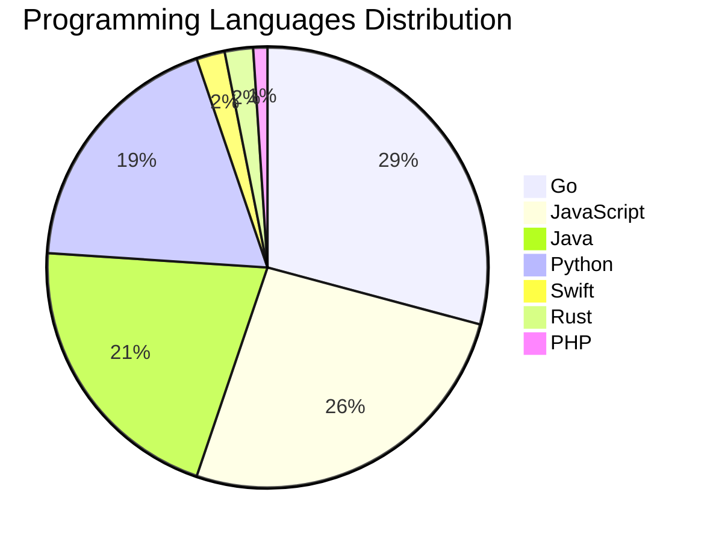

# 🚀 DevTech Auto News - Enhanced Edition


**DevTech Auto News Enhanced** is an advanced automated bot that aggregates trending topics in **AI**, **Web Development**, **Mobile**, **Cloud**, **DevOps**, and more from multiple sources including:

- 📰 [Dev.to](https://dev.to) - Developer community articles
- 🔥 [HackerNews](https://news.ycombinator.com) - Tech news discussions  
- 💻 [GitHub Trending](https://github.com/trending) - Trending repositories
- 🎯 Curated Interview Questions from multiple languages

## ✨ Features

✅ **Multi-Source Aggregation**: Combines articles from Dev.to, HackerNews, and GitHub  
✅ **Smart Categorization**: Automatically categorizes content into 10+ topics  
✅ **Image Support**: Displays cover images for visual appeal  
✅ **Pagination**: Fetches 50+ articles per update with deduplication  
✅ **Language Statistics**: Tracks programming language trends with charts  
✅ **Interview Questions**: Daily coding interview questions in multiple languages  
✅ **GitHub Actions**: Runs every 15 minutes automatically  

---

## 📊 Statistics Dashboard

### 📊 Articles by Category

**AI**: 🟦🟦🟦🟦🟦🟦🟦🟦🟦🟦🟦🟦🟦🟦🟦🟦🟦🟦🟦🟦 54 (51.4%)

**Tools**: 🟦🟦🟦🟦🟦🟦🟦🟦🟦🟦🟦🟦🟦 34 (32.4%)

**JavaScript**: 🟦🟦🟦🟦🟦🟦🟦🟦🟦 25 (23.8%)

**Python**: 🟦🟦🟦🟦🟦🟦🟦 18 (17.1%)

**Cloud**: 🟦🟦🟦🟦 12 (11.4%)

**DevOps**: 🟦🟦 5 (4.8%)

**WebDev**: 🟦🟦 5 (4.8%)

**Security**: 🟦 3 (2.9%)

**Mobile**: 🟦 2 (1.9%)

**Database**: 🟦 2 (1.9%)


### 📡 Sources

- **Dev.to**: 60 articles
- **HackerNews**: 30 articles
- **GitHub**: 15 articles


### 💻 Programming Language Trends

```
Go              ██████████████████████████████ 29.2 (29.2%)
JavaScript      ███████████████████████████ 26.0 (26.0%)
Java            █████████████████████ 20.8 (20.8%)
Python          ███████████████████ 18.8 (18.8%)
Swift           ██ 2.1 (2.1%)
Rust            ██ 2.1 (2.1%)
PHP             █ 1.0 (1.0%)

```




### 🏷️ Trending Tags

               


---

## 🛠️ How It Works

1. **Multi-Source Fetch**: Pulls from Dev.to (2 pages), HackerNews (3 topics), GitHub (3 languages)
2. **Smart Filter**: Uses keyword matching across 10+ categories  
3. **Deduplication**: Removes duplicate URLs  
4. **Image Extraction**: Captures cover images when available  
5. **Statistics**: Generates language trends and category breakdowns  
6. **Update Files**: Regenerates README and appends to comprehensive log  

---

## 📦 Installation & Usage

```bash
# Clone the repository
git clone https://github.com/Derrick-MUGISHA/github-activity-bot.git
cd github-activity-bot

# Install dependencies  
npm install

# Run manually
npm start

# Test mode
npm run test
```

---


# 🚀 DevTech Auto News - Enhanced Edition

## 📅 Latest Updates (2026-06-09 18:00 CAT)


### 🖼️ Featured Articles

<table>
<tr>
  <td align="center" width="33%">
    <a href="https://dev.to/devteam/top-7-featured-dev-posts-of-the-week-14hj">
      
      <br/>
      <b>Top 7 Featured DEV Posts of the Week</b>
    </a>
    <br/>
    <sub>Dev.to</sub>
  </td>
  <td align="center" width="33%">
    <a href="https://dev.to/googleai/build-a-realtime-translation-app-with-gemini-live-api-livekit-google-cloud-run-5474">
      
      <br/>
      <b>Build a Realtime Translation App with Gemini Live ...</b>
    </a>
    <br/>
    <sub>Dev.to</sub>
  </td>
  <td align="center" width="33%">
    <a href="https://dev.to/hadil/youre-a-real-typescript-developer-only-if-1d9o">
      
      <br/>
      <b>You’re a Real TypeScript Developer Only If...</b>
    </a>
    <br/>
    <sub>Dev.to</sub>
  </td>
</tr>
<tr>
  <td align="center" width="33%">
    <a href="https://dev.to/erikch/tanstack-start-is-kind-of-a-big-deal-4nec">
      
      <br/>
      <b>TanStack Start Is Kind of a Big Deal</b>
    </a>
    <br/>
    <sub>Dev.to</sub>
  </td>
  <td align="center" width="33%">
    <a href="https://dev.to/sebs/its-time-we-all-eat-some-cucumber-16ic">
      
      <br/>
      <b>It's Time We All Eat some more Cucumber!</b>
    </a>
    <br/>
    <sub>Dev.to</sub>
  </td>
  <td align="center" width="33%">
    <a href="https://dev.to/googleai/antigravity-managed-agents-tutorial-ship-production-ai-agents-21c0">
      
      <br/>
      <b>Antigravity Managed Agents Tutorial: Ship Producti...</b>
    </a>
    <br/>
    <sub>Dev.to</sub>
  </td>
</tr>
</table>


### 📰 Top Headlines

- [Top 7 Featured DEV Posts of the Week](https://dev.to/devteam/top-7-featured-dev-posts-of-the-week-14hj) _[Dev.to]_
- [Build a Realtime Translation App with Gemini Live API, LiveKit, & Google Cloud Run](https://dev.to/googleai/build-a-realtime-translation-app-with-gemini-live-api-livekit-google-cloud-run-5474) _[Dev.to]_
- [You’re a Real TypeScript Developer Only If...](https://dev.to/hadil/youre-a-real-typescript-developer-only-if-1d9o) _[Dev.to]_
- [TanStack Start Is Kind of a Big Deal](https://dev.to/erikch/tanstack-start-is-kind-of-a-big-deal-4nec) _[Dev.to]_
- [It's Time We All Eat some more Cucumber!](https://dev.to/sebs/its-time-we-all-eat-some-cucumber-16ic) _[Dev.to]_
- [Antigravity Managed Agents Tutorial: Ship Production AI Agents](https://dev.to/googleai/antigravity-managed-agents-tutorial-ship-production-ai-agents-21c0) _[Dev.to]_
- [From Dashboards to Autonomous Action: Why You Need to Attend Google Cloud Labs](https://dev.to/googleai/from-dashboards-to-autonomous-action-why-you-need-to-attend-google-cloud-labs-3ada) _[Dev.to]_
- [The perfect background music for Vibecoding...](https://dev.to/gdg/the-perfect-background-music-for-vibecoding-3edg) _[Dev.to]_
- [I tried to make an AI agent answer more. It answered less.](https://dev.to/ankushchadha/i-tried-to-make-an-ai-agent-answer-more-it-answered-less-3d7a) _[Dev.to]_
- [Github "Finish-Up-A-Thon" Challenge Winner Announcement Delayed & General Challenge Timeline Updates](https://dev.to/devteam/github-finish-up-a-thon-challenge-winner-announcement-delayed-general-challenge-timeline-updates-ckk) _[Dev.to]_
- [Seamless scaling with VPA In-place Pod Resize on GKE](https://dev.to/googlecloud/seamless-scaling-with-vpa-in-place-pod-resize-on-gke-117p) _[Dev.to]_
- [Meme Monday](https://dev.to/ben/meme-monday-1m9f) _[Dev.to]_
- [The agent that fixes bugs by running the code](https://dev.to/shreyshah/the-agent-that-fixes-bugs-by-running-the-code-4lbg) _[Dev.to]_
- [Dialling Our Agents to 11: My Favourite MCP Servers](https://dev.to/gde/dialling-our-agents-to-11-my-favourite-mcp-servers-3hbm) _[Dev.to]_
- [Dystopian Civilization Scenarios](https://dev.to/ingosteinke/dystopian-civilization-scenarios-4422) _[Dev.to]_
- [Retour sur le Google I/O 2026 | Focus Antigravity 2.0](https://dev.to/gde/retour-sur-le-google-io-2026-focus-antigravity-20-33jh) _[Dev.to]_
- [How I took my Rust GUI from 135 MB to 30 MB by ditching the GPU](https://dev.to/trystan_sarrade/how-i-took-my-rust-gui-from-135-mb-to-30-mb-by-ditching-the-gpu-2i7d) _[Dev.to]_
- [Skill, MCP, Plugin, or just a CLI: how I pick a Claude Code extension, lightest first](https://dev.to/rapls/skill-mcp-plugin-or-just-a-cli-how-i-pick-a-claude-code-extension-lightest-first-3hon) _[Dev.to]_
- [Join the June Solstice Game Jam: $1,000 in prizes!](https://dev.to/devteam/join-the-june-solstice-game-jam-1000-in-prizes-3jla) _[Dev.to]_
- [Stop writing prompts to classify text: make evaluation declarative](https://dev.to/ayoolasolomon/stop-writing-prompts-to-classify-text-make-evaluation-declarative-5555) _[Dev.to]_

_Last automated update: Tue, 09 Jun 2026 18:46:46 CAT_


## 💡 Daily Interview Questions

_Sharpen your skills with these curated questions_

### 1. NodeJS: Implement rate limiting for an API

**Difficulty**: Hard | **Topics**: security, middleware

<details>
<summary>💡 Hint</summary>

Token bucket, sliding window, Redis

</details>

### 2. SystemDesign: Design a distributed cache system

**Difficulty**: Hard | **Topics**: distributed systems, caching

<details>
<summary>💡 Hint</summary>

Consistency, partitioning, replication, eviction policies

</details>

### 3. Java: What are Java Streams and how do they work?

**Difficulty**: Medium | **Topics**: functional programming, collections

<details>
<summary>💡 Hint</summary>

Lazy evaluation, pipeline, terminal operations

</details>


---

## 📚 Resources

- [Full News Archive](./data/news_log.md) - Complete history of all fetched articles
- [Statistics JSON](./data/stats.json) - Raw statistics data
- [Categorized Data](./data/categorized.json) - Articles organized by category
- [Interview Questions](./data/interview_questions.json) - Complete question bank

---

## 🤝 Contributing

Want to add more sources, categories, or interview questions? Feel free to:

1. Fork this repository
2. Add your improvements
3. Submit a pull request

---

## 📄 License

MIT License - Feel free to use and modify!

---

<p align="center">
  <b>Last automated update: Tue, 09 Jun 2026 16:46:46 GMT</b><br/>
  <sub>Powered by GitHub Actions | Made with ❤️ for developers</sub>
</p>

---

## 🔗 Quick Links

- [View Workflow](https://github.com/Derrick-MUGISHA/github-activity-bot/actions)
- [Report Issue](https://github.com/Derrick-MUGISHA/github-activity-bot/issues)
- [Suggest Feature](https://github.com/Derrick-MUGISHA/github-activity-bot/issues/new)
