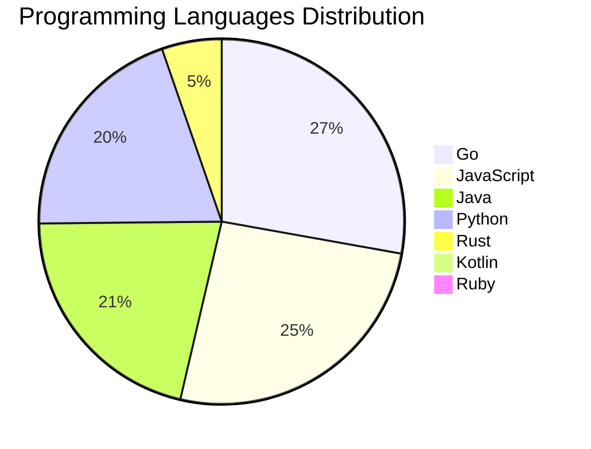

<div align="center">

# 📰 DevTech Auto News

**Your always-fresh digest of developer & AI tech news — curated automatically, around the clock.**


Aggregating [Dev.to](https://dev.to) · [Hacker News](https://news.ycombinator.com) · [GitHub Trending](https://github.com/trending) · [Lobste.rs](https://lobste.rs) · [Stack Overflow](https://stackoverflow.com) · [TechCrunch](https://techcrunch.com) · [freeCodeCamp](https://www.freecodecamp.org/news) — refreshed by GitHub Actions around the clock.

**[📰 Headlines](#-latest-headlines) · [💡 Interview Prep](#-interview-question-of-the-hour) · [📊 Statistics](#-statistics) · [⚙️ How It Works](#%EF%B8%8F-how-it-works)**

</div>

---

## 📰 Latest Headlines

> 🕐 Edition of **2026-07-29 5:00 CAT** — refreshed automatically, all day, every day.

### ✨ Featured Stories

<table>
<tr>
  <td align="center" width="33%">
    <a href="https://dev.to/thomasbnt/passkeys-explained-simply-52jk">
      
      <br/>
      <b>Passkeys Explained Simply</b>
    </a>
    <br/>
    <sub>Dev.to</sub>
  </td>
  <td align="center" width="33%">
    <a href="https://dev.to/shubhradev/react-19s-useactionstate-showed-me-why-disabling-my-submit-button-was-never-enough-53jd">
      
      <br/>
      <b>React 19's useActionState Showed Me Why Disabling ...</b>
    </a>
    <br/>
    <sub>Dev.to</sub>
  </td>
  <td align="center" width="33%">
    <a href="https://dev.to/gde/your-face-on-a-world-cup-sticker-our-nano-banana-story-43p6">
      
      <br/>
      <b>Your Face on a World Cup Sticker: Our Nano Banana ...</b>
    </a>
    <br/>
    <sub>Dev.to</sub>
  </td>
</tr>
<tr>
  <td align="center" width="33%">
    <a href="https://dev.to/temporalio/i-had-two-weeks-an-8-foot-keyboard-and-a-wordle-workflow-15h">
      
      <br/>
      <b>I had two weeks, an 8-foot keyboard, and a Wordle ...</b>
    </a>
    <br/>
    <sub>Dev.to</sub>
  </td>
  <td align="center" width="33%">
    <a href="https://dev.to/gde/can-google-adk-talk-to-amazon-bedrock-agentcore-runtime-a-cross-cloud-a2a-benchmark-162l">
      
      <br/>
      <b>Can Google ADK Talk to Amazon Bedrock AgentCore Ru...</b>
    </a>
    <br/>
    <sub>Dev.to</sub>
  </td>
  <td align="center" width="33%">
    <a href="https://dev.to/gde/building-ai-agents-with-the-kotlin-agent-development-kit-adk-2gpa">
      
      <br/>
      <b>Building AI Agents with the Kotlin Agent Developme...</b>
    </a>
    <br/>
    <sub>Dev.to</sub>
  </td>
</tr>
</table>


### 🗞️ Top Stories

| # | Headline | Source |
|---|----------|--------|
| 1 | [Passkeys Explained Simply](https://dev.to/thomasbnt/passkeys-explained-simply-52jk) | Dev.to |
| 2 | [React 19's useActionState Showed Me Why Disabling My Submit Button Was Never Enough](https://dev.to/shubhradev/react-19s-useactionstate-showed-me-why-disabling-my-submit-button-was-never-enough-53jd) | Dev.to |
| 3 | [Your Face on a World Cup Sticker: Our Nano Banana Story](https://dev.to/gde/your-face-on-a-world-cup-sticker-our-nano-banana-story-43p6) | Dev.to |
| 4 | [I had two weeks, an 8-foot keyboard, and a Wordle Workflow](https://dev.to/temporalio/i-had-two-weeks-an-8-foot-keyboard-and-a-wordle-workflow-15h) | Dev.to |
| 5 | [Can Google ADK Talk to Amazon Bedrock AgentCore Runtime? A Cross-Cloud A2A Benchmark](https://dev.to/gde/can-google-adk-talk-to-amazon-bedrock-agentcore-runtime-a-cross-cloud-a2a-benchmark-162l) | Dev.to |
| 6 | [Building AI Agents with the Kotlin Agent Development Kit (ADK)](https://dev.to/gde/building-ai-agents-with-the-kotlin-agent-development-kit-adk-2gpa) | Dev.to |
| 7 | [Beyond Flutter: Running BlocSignal State Machines in Pure Dart, Jaspr Web, and CLI Tools](https://dev.to/gde/beyond-flutter-running-blocsignal-state-machines-in-pure-dart-jaspr-web-and-cli-tools-51f6) | Dev.to |
| 8 | [Bug Smash isn't glamorous and that's what I love about it.](https://dev.to/devteam/bug-smash-isnt-glamorous-and-thats-what-i-love-about-it-445i) | Dev.to |
| 9 | [Can Google ADK Talk to Microsoft Foundry on Azure? A Cross-Cloud A2A Benchmark](https://dev.to/gde/can-google-adk-talk-to-microsoft-foundry-on-azure-a-cross-cloud-a2a-benchmark-4h36) | Dev.to |
| 10 | [[Learning Notes][Golang] Authorization Challenges in the AI Agent Era: What is ID-JAG and Why I Re-implemented It in Go](https://dev.to/gde/learning-notesgolang-authorization-challenges-in-the-ai-agent-era-what-is-id-jag-and-why-i-jfb) | Dev.to |
| 11 | [DevRelCon, Adult Summer Camp, and My First Time Speaking](https://dev.to/daniellewashington/devrelcon-adult-summer-camp-and-my-first-time-speaking-4p2d) | Dev.to |
| 12 | [[Dev Log][Node.js] Feedly Classic is gone, so I built my own FeedFlow (Part 1)](https://dev.to/gde/dev-lognodejs-feedly-classic-is-gone-so-i-built-my-own-feedflow-part-1-55h4) | Dev.to |
| 13 | [Seamless Flutter Hooks Integration with BlocSignal via signals_hooks](https://dev.to/gde/seamless-flutter-hooks-integration-with-blocsignal-via-signalshooks-55e) | Dev.to |
| 14 | [Switching Tracks in BlocSignal: The Universal State Switchyard for BLoC, Riverpod, and Provider](https://dev.to/gde/switching-tracks-in-blocsignal-the-universal-state-switchyard-for-bloc-riverpod-and-provider-929) | Dev.to |
| 15 | [Beyond System Prompts: Enforcing Policy & Action Boundaries in Enterprise AI Agents](https://dev.to/gde/beyond-system-prompts-enforcing-policy-action-boundaries-in-enterprise-ai-agents-29ac) | Dev.to |
| 16 | [Build and Deploy Java AI Agents with Google ADK](https://dev.to/gde/build-and-deploy-java-ai-agents-with-google-adk-28oi) | Dev.to |
| 17 | [How terminal-sharing tools put your shell in a browser](https://dev.to/lovestaco/how-terminal-sharing-tools-put-your-shell-in-a-browser-328) | Dev.to |
| 18 | [Auditing Agent Skills: A Threat Model for the Next Generation of AI Package Managers](https://dev.to/gde/auditing-agent-skills-a-threat-model-for-the-next-generation-of-ai-package-managers-2g25) | Dev.to |
| 19 | [Top 7 Featured DEV Posts of the Week](https://dev.to/devteam/top-7-featured-dev-posts-of-the-week-257h) | Dev.to |
| 20 | [Building AI Agents with the TypeScript Agent Development Kit (ADK)](https://dev.to/gde/building-ai-agents-with-the-typescript-agent-development-kit-adk-3mf) | Dev.to |

<sub>Last fetched: Wed, 29 Jul 2026 05:30:41 CAT</sub>


---

## 💡 Interview Question of the Hour

> Sharpen your skills — new questions selected on every update. Try answering before opening the hint!

**1. `Python` — Explain decorators in Python with an example**

&nbsp;&nbsp;&nbsp;&nbsp;🎯 Medium · 🏷 functions, metaprogramming

<details>
<summary>&nbsp;&nbsp;&nbsp;&nbsp;💡 Show hint</summary>

> Function wrappers, @syntax, practical uses

</details>

**2. `Database` — Explain database indexing and when to use it**

&nbsp;&nbsp;&nbsp;&nbsp;🎯 Medium · 🏷 optimization, performance

<details>
<summary>&nbsp;&nbsp;&nbsp;&nbsp;💡 Show hint</summary>

> B-tree, trade-offs, query performance

</details>

**3. `NodeJS` — Implement rate limiting for an API**

&nbsp;&nbsp;&nbsp;&nbsp;🎯 Hard · 🏷 security, middleware

<details>
<summary>&nbsp;&nbsp;&nbsp;&nbsp;💡 Show hint</summary>

> Token bucket, sliding window, Redis

</details>


---

## 📊 Statistics

#### 🗂 Articles by Category

| Category | Articles | Share | |
|----------|---------:|------:|---|
| **AI** | 78 | 42.6% | `████████████████████` |
| **Tools** | 45 | 24.6% | `████████████░░░░░░░░` |
| **JavaScript** | 39 | 21.3% | `██████████░░░░░░░░░░` |
| **Python** | 30 | 16.4% | `████████░░░░░░░░░░░░` |
| **Security** | 24 | 13.1% | `██████░░░░░░░░░░░░░░` |
| **Cloud** | 18 | 9.8% | `█████░░░░░░░░░░░░░░░` |
| **DevOps** | 17 | 9.3% | `████░░░░░░░░░░░░░░░░` |
| **WebDev** | 5 | 2.7% | `█░░░░░░░░░░░░░░░░░░░` |
| **Mobile** | 4 | 2.2% | `█░░░░░░░░░░░░░░░░░░░` |
| **Database** | 2 | 1.1% | `█░░░░░░░░░░░░░░░░░░░` |

<sub>Articles can match more than one category, so shares may sum to over 100%.</sub>


#### 📡 Articles by Source

| Source | Articles |
|--------|---------:|
| Dev.to | 59 |
| HackerNews | 49 |
| GitHub | 25 |
| Lobste.rs | 10 |
| StackOverflow | 20 |
| TechCrunch | 10 |
| freeCodeCamp | 10 |


#### 💻 Programming Language Trends

```
Go              ██████████████████████████████ 27.5%
JavaScript      ████████████████████████████ 25.5%
Java            ███████████████████████ 20.9%
Python          █████████████████████ 19.6%
Rust            ██████ 5.2%
Kotlin          █ 0.7%
Ruby            █ 0.7%

```




#### 🏷 Trending Topics

            


---

## ⚙️ How It Works

This repository is a fully automated news pipeline. On every run, GitHub Actions:

1. **Fetches** the latest articles from seven sources: Dev.to, Hacker News, GitHub Trending, Lobste.rs, Stack Overflow, TechCrunch, and freeCodeCamp
2. **Deduplicates and categorizes** them across 10+ topics using keyword matching
3. **Extracts cover images** and computes language & category statistics
4. **Rebuilds this README** and appends everything to the [full archive](./data/news_log.md)
5. **Commits and pushes** the result — no human intervention needed

<details>
<summary><b>🚀 Run it yourself</b></summary>

```bash
git clone https://github.com/Derrick-MUGISHA/github-activity-bot.git
cd github-activity-bot
npm install
npm start
```

Fork the repo, enable GitHub Actions, and you have your own self-updating news feed.

</details>

<details>
<summary><b>📚 Data & resources</b></summary>

- [Full news archive](./data/news_log.md) — complete history of every fetched article
- [Statistics](./data/stats.json) — raw stats data (JSON)
- [Categorized articles](./data/categorized.json) — articles grouped by topic
- [Interview question bank](./data/interview_questions.json) — the full question set

</details>

---

## 🤝 Contributing

Ideas for new sources, categories, or interview questions are welcome — [open an issue](https://github.com/Derrick-MUGISHA/github-activity-bot/issues/new) or submit a pull request.

## 📄 License

Released under the [MIT License](https://opensource.org/licenses/MIT) — free to use, fork, and modify.

---

<div align="center">
  <sub>🤖 Last automated update: <b>Wed, 29 Jul 2026 03:30:41 GMT</b></sub><br/>
  <sub>Powered by GitHub Actions · Built with ❤️ by <a href="https://github.com/Derrick-MUGISHA">Derrick MUGISHA</a></sub>
</div>
