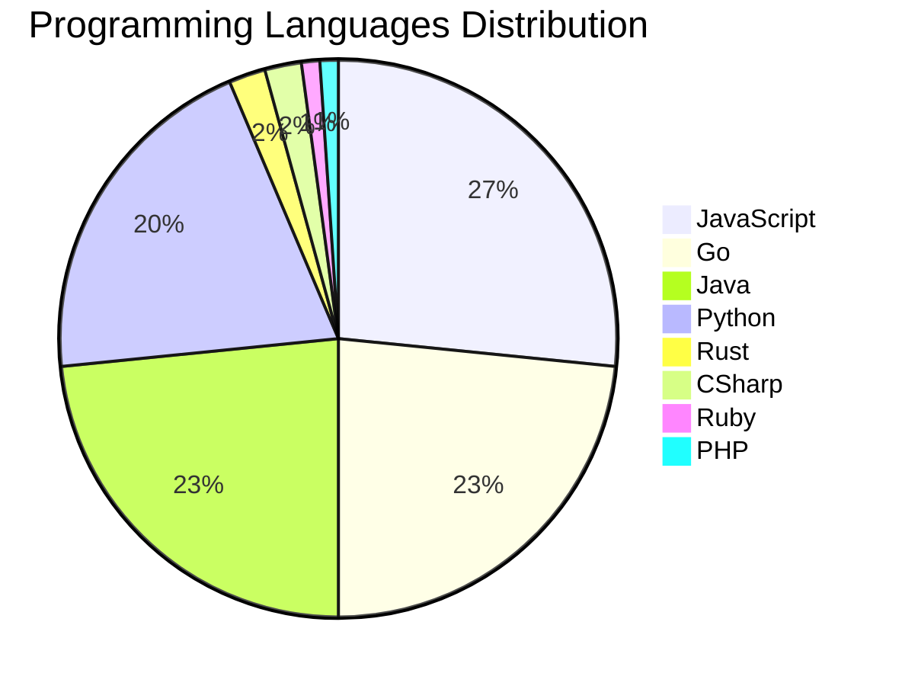

# 🚀 DevTech Auto News - Enhanced Edition


**DevTech Auto News Enhanced** is an advanced automated bot that aggregates trending topics in **AI**, **Web Development**, **Mobile**, **Cloud**, **DevOps**, and more from multiple sources including:

- 📰 [Dev.to](https://dev.to) - Developer community articles
- 🔥 [HackerNews](https://news.ycombinator.com) - Tech news discussions  
- 💻 [GitHub Trending](https://github.com/trending) - Trending repositories
- 🎯 Curated Interview Questions from multiple languages

## ✨ Features

✅ **Multi-Source Aggregation**: Combines articles from Dev.to, HackerNews, and GitHub  
✅ **Smart Categorization**: Automatically categorizes content into 10+ topics  
✅ **Image Support**: Displays cover images for visual appeal  
✅ **Pagination**: Fetches 50+ articles per update with deduplication  
✅ **Language Statistics**: Tracks programming language trends with charts  
✅ **Interview Questions**: Daily coding interview questions in multiple languages  
✅ **GitHub Actions**: Runs every 15 minutes automatically  

---

## 📊 Statistics Dashboard

### 📊 Articles by Category

**AI**: 🟦🟦🟦🟦🟦🟦🟦🟦🟦🟦🟦🟦🟦🟦🟦🟦🟦🟦🟦🟦 53 (50.5%)

**JavaScript**: 🟦🟦🟦🟦🟦🟦🟦🟦🟦 25 (23.8%)

**Tools**: 🟦🟦🟦🟦🟦🟦🟦🟦🟦 24 (22.9%)

**Python**: 🟦🟦🟦🟦🟦🟦🟦 19 (18.1%)

**Cloud**: 🟦🟦🟦 7 (6.7%)

**WebDev**: 🟦🟦 6 (5.7%)

**Database**: 🟦🟦 4 (3.8%)

**Security**: 🟦 3 (2.9%)

**DevOps**:  1 (1.0%)

**Mobile**:  1 (1.0%)


### 📡 Sources

- **Dev.to**: 60 articles
- **HackerNews**: 30 articles
- **GitHub**: 15 articles


### 💻 Programming Language Trends

```
JavaScript      ██████████████████████████████ 26.3 (26.3%)
Go              ██████████████████████████ 23.2 (23.2%)
Java            ██████████████████████████ 23.2 (23.2%)
Python          ███████████████████████ 20.0 (20.0%)
Rust            ██ 2.1 (2.1%)
CSharp          ██ 2.1 (2.1%)
Ruby            █ 1.1 (1.1%)
PHP             █ 1.1 (1.1%)
Swift           █ 1.1 (1.1%)

```




### 🏷️ Trending Tags

               


---

## 🛠️ How It Works

1. **Multi-Source Fetch**: Pulls from Dev.to (2 pages), HackerNews (3 topics), GitHub (3 languages)
2. **Smart Filter**: Uses keyword matching across 10+ categories  
3. **Deduplication**: Removes duplicate URLs  
4. **Image Extraction**: Captures cover images when available  
5. **Statistics**: Generates language trends and category breakdowns  
6. **Update Files**: Regenerates README and appends to comprehensive log  

---

## 📦 Installation & Usage

```bash
# Clone the repository
git clone https://github.com/Derrick-MUGISHA/github-activity-bot.git
cd github-activity-bot

# Install dependencies  
npm install

# Run manually
npm start

# Test mode
npm run test
```

---


# 🚀 DevTech Auto News - Enhanced Edition

## 📅 Latest Updates (2026-03-31 13:00 CAT)


### 🖼️ Featured Articles

<table>
<tr>
  <td align="center" width="33%">
    <a href="https://dev.to/francistrdev/what-is-your-wpm-words-per-minute-1af7">
      
      <br/>
      <b>What is your WPM (Words per Minute)? #1</b>
    </a>
    <br/>
    <sub>Dev.to</sub>
  </td>
  <td align="center" width="33%">
    <a href="https://dev.to/jarvisscript/what-are-your-goals-for-the-week-55nm">
      
      <br/>
      <b>What are your goals for the week? #172</b>
    </a>
    <br/>
    <sub>Dev.to</sub>
  </td>
  <td align="center" width="33%">
    <a href="https://dev.to/tigerdata/how-to-break-your-postgresql-iiot-database-and-learn-something-in-the-process-n2d">
      
      <br/>
      <b>How to Break Your PostgreSQL IIoT Database and Lea...</b>
    </a>
    <br/>
    <sub>Dev.to</sub>
  </td>
</tr>
<tr>
  <td align="center" width="33%">
    <a href="https://dev.to/martinrojas/the-excel-moment-why-every-profession-that-absorbed-a-transformative-tool-followed-the-same-pattern-1lm4">
      
      <br/>
      <b>The Excel Moment: Why Every Profession That Absorb...</b>
    </a>
    <br/>
    <sub>Dev.to</sub>
  </td>
  <td align="center" width="33%">
    <a href="https://dev.to/wassimchegham/agentic-rag-done-right-4846">
      
      <br/>
      <b>Prompt Stuffing Is Killing Your Agent</b>
    </a>
    <br/>
    <sub>Dev.to</sub>
  </td>
  <td align="center" width="33%">
    <a href="https://dev.to/jvoltci/zerojitter-stop-layout-thrashing-stream-llm-tokens-without-jitter-36ef">
      
      <br/>
      <b>I Eliminated Layout Jitter From LLM Streaming — He...</b>
    </a>
    <br/>
    <sub>Dev.to</sub>
  </td>
</tr>
</table>


### 📰 Top Headlines

- [What is your WPM (Words per Minute)? #1](https://dev.to/francistrdev/what-is-your-wpm-words-per-minute-1af7) _[Dev.to]_
- [What are your goals for the week? #172](https://dev.to/jarvisscript/what-are-your-goals-for-the-week-55nm) _[Dev.to]_
- [How to Break Your PostgreSQL IIoT Database and Learn Something in the Process](https://dev.to/tigerdata/how-to-break-your-postgresql-iiot-database-and-learn-something-in-the-process-n2d) _[Dev.to]_
- [The Excel Moment: Why Every Profession That Absorbed a Transformative Tool Followed the Same Pattern](https://dev.to/martinrojas/the-excel-moment-why-every-profession-that-absorbed-a-transformative-tool-followed-the-same-pattern-1lm4) _[Dev.to]_
- [Prompt Stuffing Is Killing Your Agent](https://dev.to/wassimchegham/agentic-rag-done-right-4846) _[Dev.to]_
- [I Eliminated Layout Jitter From LLM Streaming — Here's How](https://dev.to/jvoltci/zerojitter-stop-layout-thrashing-stream-llm-tokens-without-jitter-36ef) _[Dev.to]_
- [What is ‘Harness Design’ and why does it matter](https://dev.to/baltz/what-is-harness-design-and-why-does-it-matter-2dbj) _[Dev.to]_
- [Why Rails Still Feels Like a Startup’s Best Friend in the AI Era](https://dev.to/mezbahalam/why-rails-still-feels-like-a-startups-best-friend-in-the-ai-era-45hn) _[Dev.to]_
- [Building for Production: A Guide to Deploying a 3-Tier App on Azure](https://dev.to/cafedeluv/building-for-production-a-guide-to-deploying-a-3-tier-app-on-azure-chb) _[Dev.to]_
- [Run Any HuggingFace Model on TPUs: A Beginner's Guide to TorchAX](https://dev.to/gde/run-any-huggingface-model-on-tpus-a-beginners-guide-to-torchax-4ln0) _[Dev.to]_
- [Understanding Object-Oriented Programming in JavaScript](https://dev.to/ritam369/understanding-object-oriented-programming-in-javascript-570e) _[Dev.to]_
- [With the advent of AI, is there still a need for Frontend Engineers?](https://dev.to/olumidesamuel_/with-the-advent-of-ai-is-there-still-a-need-for-frontend-engineers-2ejm) _[Dev.to]_
- [Midnight network is live](https://dev.to/devsofmidnight/midnight-network-is-live-1apj) _[Dev.to]_
- [building an atomic bomberman clone, part 1: why rust, why now](https://dev.to/tomerl1/im-rebuilding-a-90s-lan-game-in-rust-to-finally-learn-it-5eo8) _[Dev.to]_
- [Meme Monday](https://dev.to/ben/meme-monday-o5i) _[Dev.to]_
- [I'm so sick of my editor telling me how great I am. Not that I'm not great.](https://dev.to/ben/im-so-sick-of-my-editor-telling-me-how-great-i-am-not-that-im-not-great-2oam) _[Dev.to]_
- [Google Workspace Studio Tutorial: Building an AI Meeting Prep Agent](https://dev.to/gde/google-workspace-studio-tutorial-building-an-ai-meeting-prep-agent-43ij) _[Dev.to]_
- [String Polyfills & Common Interview Methods in JavaScript](https://dev.to/ritam369/string-polyfills-common-interview-methods-in-javascript-224g) _[Dev.to]_
- [Stop Wasting Tokens: Building Deterministic Custom Agents with Google ADK [GDE]](https://dev.to/gde/stop-wasting-tokens-building-deterministic-custom-agents-with-google-adk-gde-56ck) _[Dev.to]_
- [Async without async](https://dev.to/szymongib/async-without-async-eik) _[Dev.to]_

_Last automated update: Tue, 31 Mar 2026 13:10:08 CAT_


## 💡 Daily Interview Questions

_Sharpen your skills with these curated questions_

### 1. SystemDesign: Design a distributed cache system

**Difficulty**: Hard | **Topics**: distributed systems, caching

<details>
<summary>💡 Hint</summary>

Consistency, partitioning, replication, eviction policies

</details>

### 2. NodeJS: Explain middleware in Express.js

**Difficulty**: Easy | **Topics**: express, architecture

<details>
<summary>💡 Hint</summary>

Request/response cycle, next(), chain of functions

</details>

### 3. Database: Explain database indexing and when to use it

**Difficulty**: Medium | **Topics**: optimization, performance

<details>
<summary>💡 Hint</summary>

B-tree, trade-offs, query performance

</details>


---

## 📚 Resources

- [Full News Archive](./data/news_log.md) - Complete history of all fetched articles
- [Statistics JSON](./data/stats.json) - Raw statistics data
- [Categorized Data](./data/categorized.json) - Articles organized by category
- [Interview Questions](./data/interview_questions.json) - Complete question bank

---

## 🤝 Contributing

Want to add more sources, categories, or interview questions? Feel free to:

1. Fork this repository
2. Add your improvements
3. Submit a pull request

---

## 📄 License

MIT License - Feel free to use and modify!

---

<p align="center">
  <b>Last automated update: Tue, 31 Mar 2026 11:10:08 GMT</b><br/>
  <sub>Powered by GitHub Actions | Made with ❤️ for developers</sub>
</p>

---

## 🔗 Quick Links

- [View Workflow](https://github.com/Derrick-MUGISHA/github-activity-bot/actions)
- [Report Issue](https://github.com/Derrick-MUGISHA/github-activity-bot/issues)
- [Suggest Feature](https://github.com/Derrick-MUGISHA/github-activity-bot/issues/new)
