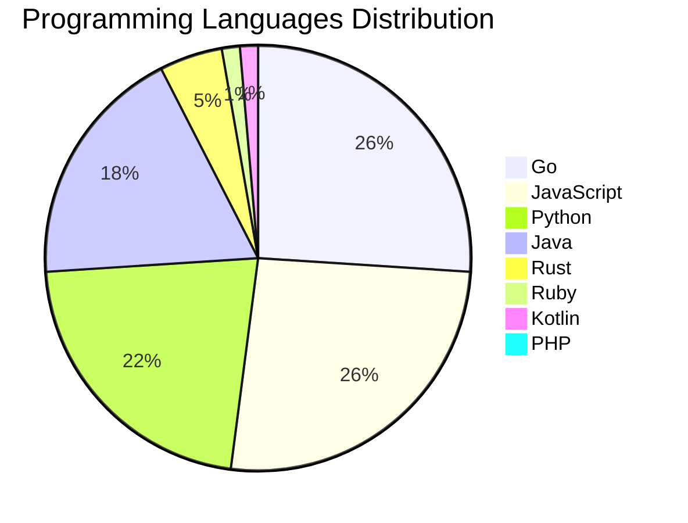

<div align="center">

# 📰 DevTech Auto News

**Your always-fresh digest of developer & AI tech news — curated automatically, around the clock.**


Aggregating [Dev.to](https://dev.to) · [Hacker News](https://news.ycombinator.com) · [GitHub Trending](https://github.com/trending) · [Lobste.rs](https://lobste.rs) · [Stack Overflow](https://stackoverflow.com) · [TechCrunch](https://techcrunch.com) · [freeCodeCamp](https://www.freecodecamp.org/news) — refreshed by GitHub Actions around the clock.

**[📰 Headlines](#-latest-headlines) · [💡 Interview Prep](#-interview-question-of-the-hour) · [📊 Statistics](#-statistics) · [⚙️ How It Works](#%EF%B8%8F-how-it-works)**

</div>

---

## 📰 Latest Headlines

> 🕐 Edition of **2026-09-12 0:00 CAT** — refreshed automatically, all day, every day.

### ✨ Featured Stories

<table>
<tr>
  <td align="center" width="33%">
    <a href="https://dev.to/devteam/what-was-your-win-this-week-5amk">
      
      <br/>
      <b>What was your win this week??</b>
    </a>
    <br/>
    <sub>Dev.to</sub>
  </td>
  <td align="center" width="33%">
    <a href="https://dev.to/gde/fastmcp-is-now-mcpserver-migrating-a-python-mcp-server-to-the-mcp-sdk-2x-2nhj">
      
      <br/>
      <b>FastMCP Is Now MCPServer: Migrating a Python MCP S...</b>
    </a>
    <br/>
    <sub>Dev.to</sub>
  </td>
  <td align="center" width="33%">
    <a href="https://dev.to/gde/the-symmetry-of-state-why-flutter-deserves-contextvalue-and-contextstate-4250">
      
      <br/>
      <b>The Symmetry of State: Why Flutter Deserves contex...</b>
    </a>
    <br/>
    <sub>Dev.to</sub>
  </td>
</tr>
<tr>
  <td align="center" width="33%">
    <a href="https://dev.to/gde/autoscaling-docker-containers-without-kubernetes-how-gubernator-scales-cpu-gpu-workloads-1p0b">
      
      <br/>
      <b>Autoscaling Docker Containers Without Kubernetes: ...</b>
    </a>
    <br/>
    <sub>Dev.to</sub>
  </td>
  <td align="center" width="33%">
    <a href="https://dev.to/gde/the-modern-pitch-for-blocsignal-why-engineering-leads-are-moving-to-reactive-primitives-5d5h">
      
      <br/>
      <b>The Modern Pitch for BlocSignal: Why Engineering L...</b>
    </a>
    <br/>
    <sub>Dev.to</sub>
  </td>
  <td align="center" width="33%">
    <a href="https://dev.to/googleai/4-pitfalls-of-loop-engineering-and-how-to-fix-them-1ji2">
      
      <br/>
      <b>4 pitfalls of loop engineering (and how to fix the...</b>
    </a>
    <br/>
    <sub>Dev.to</sub>
  </td>
</tr>
</table>


### 🗞️ Top Stories

| # | Headline | Source |
|---|----------|--------|
| 1 | [What was your win this week??](https://dev.to/devteam/what-was-your-win-this-week-5amk) | Dev.to |
| 2 | [FastMCP Is Now MCPServer: Migrating a Python MCP Server to the MCP SDK 2.x](https://dev.to/gde/fastmcp-is-now-mcpserver-migrating-a-python-mcp-server-to-the-mcp-sdk-2x-2nhj) | Dev.to |
| 3 | [The Symmetry of State: Why Flutter Deserves context.value and context.state](https://dev.to/gde/the-symmetry-of-state-why-flutter-deserves-contextvalue-and-contextstate-4250) | Dev.to |
| 4 | [Autoscaling Docker Containers Without Kubernetes: How Gubernator Scales CPU & GPU Workloads Automatically](https://dev.to/gde/autoscaling-docker-containers-without-kubernetes-how-gubernator-scales-cpu-gpu-workloads-1p0b) | Dev.to |
| 5 | [The Modern Pitch for BlocSignal: Why Engineering Leads Are Moving to Reactive Primitives](https://dev.to/gde/the-modern-pitch-for-blocsignal-why-engineering-leads-are-moving-to-reactive-primitives-5d5h) | Dev.to |
| 6 | [4 pitfalls of loop engineering (and how to fix them)](https://dev.to/googleai/4-pitfalls-of-loop-engineering-and-how-to-fix-them-1ji2) | Dev.to |
| 7 | [DEV Weekend Challenge: Dog Days Edition Winner Announcement Delayed](https://dev.to/devteam/dev-weekend-challenge-dog-days-edition-winner-announcement-delayed-36f0) | Dev.to |
| 8 | [Gemma 4 on an 2021 4 GB Laptop GPU: QAT Takes It From 9.5 GiB to 1.6](https://dev.to/gde/gemma-4-on-an-old-4-gb-laptop-gpu-qat-takes-it-from-95-gib-to-16-b5l) | Dev.to |
| 9 | [is Graph Engineering just reinventing systems architecture for the AI age?](https://dev.to/googleai/is-graph-engineering-just-reinventing-systems-architecture-for-the-ai-age-2427) | Dev.to |
| 10 | [2B Gemma 4 Deployment with Cloud Run, NVIDIA L4, MCP SDK 2.x, and Claude Code](https://dev.to/gde/2b-gemma-4-deployment-with-cloud-run-nvidia-l4-mcp-sdk-2x-and-claude-code-4ml3) | Dev.to |
| 11 | [Interactive AI Eval Dashboards with Data Studio](https://dev.to/googleai/interactive-ai-eval-dashboards-with-data-studio-1kl9) | Dev.to |
| 12 | [20 Agentic AI Terms Every Developer Should Know (Explained Simply)](https://dev.to/sylwia-lask/20-agentic-ai-terms-every-developer-should-know-explained-simply-jii) | Dev.to |
| 13 | [Four Debian 13 Boxes, One Brief: 1,923 Packages on Metal, 328 in the Cloud](https://dev.to/gde/four-debian-13-boxes-one-brief-1923-packages-on-metal-328-in-the-cloud-and-the-backup-gpt-cc2) | Dev.to |
| 14 | [Congrats to the Frontend Challenge: Comfort Food Edition Winners!](https://dev.to/devteam/congrats-to-the-frontend-challenge-comfort-food-edition-winners-1l8) | Dev.to |
| 15 | [Taking Advantage of Cloud Run Sandboxes with Google Apps Script for Google Workspace](https://dev.to/gde/taking-advantage-of-cloud-run-sandboxes-with-google-apps-script-for-google-workspace-5fc5) | Dev.to |
| 16 | [Bidirectional Writeback for Apache Iceberg via Google Sheets: Serverless Lakehouse Console](https://dev.to/gde/bidirectional-writeback-for-apache-iceberg-via-google-sheets-serverless-lakehouse-console-14ic) | Dev.to |
| 17 | [Serverless Multimodal Vector Search on Apache Iceberg via Google Apps Script](https://dev.to/gde/serverless-multimodal-vector-search-on-apache-iceberg-via-google-apps-script-4fg) | Dev.to |
| 18 | [Building With AI When You Don't Know Architecture: A Survival Guide](https://dev.to/james_anderson_h/building-with-ai-when-you-dont-know-architecture-a-survival-guide-1ma3) | Dev.to |
| 19 | [Two-step control plane upgrades in GKE: How minor version rollbacks work under the hood](https://dev.to/googlecloud/two-step-control-plane-upgrades-in-gke-how-minor-version-rollbacks-work-under-the-hood-i1l) | Dev.to |
| 20 | [Cross Cloud A2A Agent Card Field Comparison](https://dev.to/gde/cross-cloud-a2a-agent-card-field-comparison-2hod) | Dev.to |

<sub>Last fetched: Sat, 12 Sep 2026 00:32:00 CAT</sub>


---

## 💡 Interview Question of the Hour

> Sharpen your skills — new questions selected on every update. Try answering before opening the hint!

**1. `Database` — What is the difference between SQL and NoSQL databases?**

&nbsp;&nbsp;&nbsp;&nbsp;🎯 Easy · 🏷 databases, design

<details>
<summary>&nbsp;&nbsp;&nbsp;&nbsp;💡 Show hint</summary>

> Schema, scalability, ACID vs BASE

</details>

**2. `DataStructures` — Implement LRU Cache**

&nbsp;&nbsp;&nbsp;&nbsp;🎯 Hard · 🏷 design, hash map, linked list

<details>
<summary>&nbsp;&nbsp;&nbsp;&nbsp;💡 Show hint</summary>

> Doubly linked list + hash map, O(1) operations

</details>

**3. `Database` — What is database normalization and denormalization?**

&nbsp;&nbsp;&nbsp;&nbsp;🎯 Medium · 🏷 design, optimization

<details>
<summary>&nbsp;&nbsp;&nbsp;&nbsp;💡 Show hint</summary>

> Normal forms, redundancy, performance trade-offs

</details>


---

## 📊 Statistics

#### 🗂 Articles by Category

| Category | Articles | Share | |
|----------|---------:|------:|---|
| **AI** | 82 | 44.6% | `████████████████████` |
| **Tools** | 41 | 22.3% | `██████████░░░░░░░░░░` |
| **JavaScript** | 38 | 20.7% | `█████████░░░░░░░░░░░` |
| **Python** | 32 | 17.4% | `████████░░░░░░░░░░░░` |
| **Cloud** | 22 | 12.0% | `█████░░░░░░░░░░░░░░░` |
| **Security** | 19 | 10.3% | `█████░░░░░░░░░░░░░░░` |
| **DevOps** | 17 | 9.2% | `████░░░░░░░░░░░░░░░░` |
| **WebDev** | 10 | 5.4% | `██░░░░░░░░░░░░░░░░░░` |
| **Mobile** | 9 | 4.9% | `██░░░░░░░░░░░░░░░░░░` |
| **Database** | 2 | 1.1% | `░░░░░░░░░░░░░░░░░░░░` |

<sub>Articles can match more than one category, so shares may sum to over 100%.</sub>


#### 📡 Articles by Source

| Source | Articles |
|--------|---------:|
| Dev.to | 60 |
| HackerNews | 49 |
| GitHub | 25 |
| Lobste.rs | 10 |
| StackOverflow | 20 |
| TechCrunch | 10 |
| freeCodeCamp | 10 |


#### 💻 Programming Language Trends

```
Go              ██████████████████████████████ 25.7%
JavaScript      ██████████████████████████████ 25.7%
Python          █████████████████████████ 21.6%
Java            █████████████████████ 18.2%
Rust            █████ 4.7%
Ruby            ██ 1.4%
Kotlin          ██ 1.4%
PHP             █ 0.7%
Swift           █ 0.7%

```




#### 🏷 Trending Topics

            


---

## ⚙️ How It Works

This repository is a fully automated news pipeline. On every run, GitHub Actions:

1. **Fetches** the latest articles from seven sources: Dev.to, Hacker News, GitHub Trending, Lobste.rs, Stack Overflow, TechCrunch, and freeCodeCamp
2. **Deduplicates and categorizes** them across 10+ topics using keyword matching
3. **Extracts cover images** and computes language & category statistics
4. **Rebuilds this README** and appends everything to the [full archive](./data/news_log.md)
5. **Commits and pushes** the result — no human intervention needed

<details>
<summary><b>🚀 Run it yourself</b></summary>

```bash
git clone https://github.com/Derrick-MUGISHA/github-activity-bot.git
cd github-activity-bot
npm install
npm start
```

Fork the repo, enable GitHub Actions, and you have your own self-updating news feed.

</details>

<details>
<summary><b>📚 Data & resources</b></summary>

- [Full news archive](./data/news_log.md) — complete history of every fetched article
- [Statistics](./data/stats.json) — raw stats data (JSON)
- [Categorized articles](./data/categorized.json) — articles grouped by topic
- [Interview question bank](./data/interview_questions.json) — the full question set

</details>

---

## 🤝 Contributing

Ideas for new sources, categories, or interview questions are welcome — [open an issue](https://github.com/Derrick-MUGISHA/github-activity-bot/issues/new) or submit a pull request.

## 📄 License

Released under the [MIT License](https://opensource.org/licenses/MIT) — free to use, fork, and modify.

---

<div align="center">
  <sub>🤖 Last automated update: <b>Fri, 11 Sep 2026 22:32:00 GMT</b></sub><br/>
  <sub>Powered by GitHub Actions · Built with ❤️ by <a href="https://github.com/Derrick-MUGISHA">Derrick MUGISHA</a></sub>
</div>
