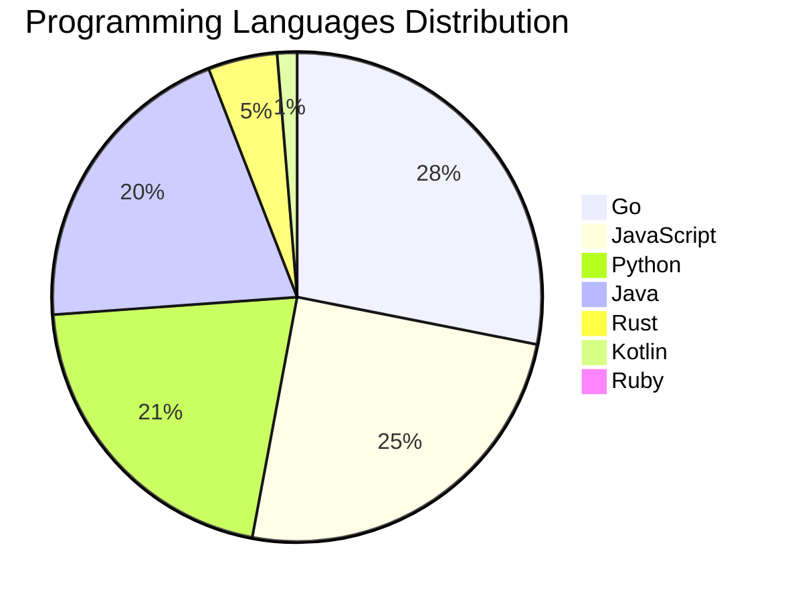

<div align="center">

# 📰 DevTech Auto News

**Your always-fresh digest of developer & AI tech news — curated automatically, around the clock.**


Aggregating [Dev.to](https://dev.to) · [Hacker News](https://news.ycombinator.com) · [GitHub Trending](https://github.com/trending) · [Lobste.rs](https://lobste.rs) · [Stack Overflow](https://stackoverflow.com) · [TechCrunch](https://techcrunch.com) · [freeCodeCamp](https://www.freecodecamp.org/news) — refreshed by GitHub Actions around the clock.

**[📰 Headlines](#-latest-headlines) · [💡 Interview Prep](#-interview-question-of-the-hour) · [📊 Statistics](#-statistics) · [⚙️ How It Works](#%EF%B8%8F-how-it-works)**

</div>

---

## 📰 Latest Headlines

> 🕐 Edition of **2026-08-04 17:00 CAT** — refreshed automatically, all day, every day.

### ✨ Featured Stories

<table>
<tr>
  <td align="center" width="33%">
    <a href="https://dev.to/gde/amazon-bedrock-agents-orchestrating-google-adk-over-a2a-5c2b">
      
      <br/>
      <b>Amazon Bedrock Agents Orchestrating Google ADK ove...</b>
    </a>
    <br/>
    <sub>Dev.to</sub>
  </td>
  <td align="center" width="33%">
    <a href="https://dev.to/jenueldev/how-to-build-a-local-ai-workspace-like-pewdiepies-odysseus-hardware-models-and-cost-3egh">
      
      <br/>
      <b>How to Build a Local AI Workspace Like PewDiePie's...</b>
    </a>
    <br/>
    <sub>Dev.to</sub>
  </td>
  <td align="center" width="33%">
    <a href="https://dev.to/gde/switching-tracks-in-blocsignal-the-universal-state-switchyard-for-bloc-riverpod-and-provider-929">
      
      <br/>
      <b>Switching Tracks in BlocSignal: The Universal Stat...</b>
    </a>
    <br/>
    <sub>Dev.to</sub>
  </td>
</tr>
<tr>
  <td align="center" width="33%">
    <a href="https://dev.to/gde/google-adk-architecture-and-essential-components-4hb6">
      
      <br/>
      <b>Google ADK: Architecture and Essential Components</b>
    </a>
    <br/>
    <sub>Dev.to</sub>
  </td>
  <td align="center" width="33%">
    <a href="https://dev.to/devteam/join-our-latest-frontend-challenge-comfort-food-edition-28a0">
      
      <br/>
      <b>Join our latest Frontend Challenge: Comfort Food E...</b>
    </a>
    <br/>
    <sub>Dev.to</sub>
  </td>
  <td align="center" width="33%">
    <a href="https://dev.to/thomasbnt/passkeys-explained-simply-52jk">
      
      <br/>
      <b>Passkeys Explained Simply</b>
    </a>
    <br/>
    <sub>Dev.to</sub>
  </td>
</tr>
</table>


### 🗞️ Top Stories

| # | Headline | Source |
|---|----------|--------|
| 1 | [Amazon Bedrock Agents Orchestrating Google ADK over A2A](https://dev.to/gde/amazon-bedrock-agents-orchestrating-google-adk-over-a2a-5c2b) | Dev.to |
| 2 | [How to Build a Local AI Workspace Like PewDiePie's Odysseus: Hardware, Models, and Cost](https://dev.to/jenueldev/how-to-build-a-local-ai-workspace-like-pewdiepies-odysseus-hardware-models-and-cost-3egh) | Dev.to |
| 3 | [Switching Tracks in BlocSignal: The Universal State Switchyard for BLoC, Riverpod, and Provider](https://dev.to/gde/switching-tracks-in-blocsignal-the-universal-state-switchyard-for-bloc-riverpod-and-provider-929) | Dev.to |
| 4 | [Google ADK: Architecture and Essential Components](https://dev.to/gde/google-adk-architecture-and-essential-components-4hb6) | Dev.to |
| 5 | [Join our latest Frontend Challenge: Comfort Food Edition 🍲](https://dev.to/devteam/join-our-latest-frontend-challenge-comfort-food-edition-28a0) | Dev.to |
| 6 | [Passkeys Explained Simply](https://dev.to/thomasbnt/passkeys-explained-simply-52jk) | Dev.to |
| 7 | [Lifecycle, DevOps & Multi-Agent Orchestration for Enterprise AI](https://dev.to/gde/lifecycle-devops-multi-agent-orchestration-for-enterprise-ai-1a1m) | Dev.to |
| 8 | [I had two weeks, an 8-foot keyboard, and a Wordle Workflow](https://dev.to/temporalio/i-had-two-weeks-an-8-foot-keyboard-and-a-wordle-workflow-15h) | Dev.to |
| 9 | [Bug Smash isn't glamorous and that's what I love about it.](https://dev.to/devteam/bug-smash-isnt-glamorous-and-thats-what-i-love-about-it-445i) | Dev.to |
| 10 | [React 19's useActionState Showed Me Why Disabling My Submit Button Was Never Enough](https://dev.to/shubhradev/react-19s-useactionstate-showed-me-why-disabling-my-submit-button-was-never-enough-53jd) | Dev.to |
| 11 | [Building AI Agents with the TypeScript Agent Development Kit (ADK)](https://dev.to/gde/building-ai-agents-with-the-typescript-agent-development-kit-adk-3mf) | Dev.to |
| 12 | [Google ADK: Introduction to AI Agent Development](https://dev.to/gde/google-adk-introduction-to-ai-agent-development-1b4e) | Dev.to |
| 13 | [Your RAG copilot can't count — stop letting it try](https://dev.to/rdiegoss/your-rag-copilot-cant-count-stop-letting-it-try-2ie3) | Dev.to |
| 14 | [Building AI Agents with the Python Agent Development Kit (ADK) — 2026 Edition (v2)](https://dev.to/gde/building-ai-agents-with-the-python-agent-development-kit-adk-2026-edition-v2-32hf) | Dev.to |
| 15 | [Building AI Agents with the GO Agent Development Kit (ADK) — 2026 Edition (v2)](https://dev.to/gde/building-ai-agents-with-the-go-agent-development-kit-adk-2026-edition-v2-4n55) | Dev.to |
| 16 | [What was your win this week?](https://dev.to/devteam/what-was-your-win-this-week-1ed) | Dev.to |
| 17 | [One TPU Chip, Eight Agents: Serving Small Agent Workloads with Raw JAX](https://dev.to/gde/one-tpu-chip-eight-agents-serving-small-agent-workloads-with-raw-jax-2cc4) | Dev.to |
| 18 | [Six Cross-Cloud A2A Paths, One Benchmark: How AWS, Azure, and GCP Agents Actually Work Together](https://dev.to/gde/six-cross-cloud-a2a-paths-one-benchmark-what-aws-azure-and-gcp-agents-actually-cost-each-other-13g0) | Dev.to |
| 19 | [I've Spent 10+ Years in Software Engineering. After Sickness, Burnout, and a Layoff, I'm Rebuilding My Career. Ask Me Anything](https://dev.to/canro91/ive-spent-10-years-in-software-engineering-after-sickness-burnout-and-a-layoff-im-rebuilding-efc) | Dev.to |
| 20 | [Microsoft Foundry as the Master Cloud, Google ADK as the Client: Cross-Cloud A2A v1.0](https://dev.to/gde/microsoft-foundry-as-the-master-cloud-google-adk-as-the-client-cross-cloud-a2a-v10-3me0) | Dev.to |

<sub>Last fetched: Tue, 04 Aug 2026 17:26:54 CAT</sub>


---

## 💡 Interview Question of the Hour

> Sharpen your skills — new questions selected on every update. Try answering before opening the hint!

**1. `SystemDesign` — Design a distributed cache system**

&nbsp;&nbsp;&nbsp;&nbsp;🎯 Hard · 🏷 distributed systems, caching

<details>
<summary>&nbsp;&nbsp;&nbsp;&nbsp;💡 Show hint</summary>

> Consistency, partitioning, replication, eviction policies

</details>

**2. `Database` — What is database normalization and denormalization?**

&nbsp;&nbsp;&nbsp;&nbsp;🎯 Medium · 🏷 design, optimization

<details>
<summary>&nbsp;&nbsp;&nbsp;&nbsp;💡 Show hint</summary>

> Normal forms, redundancy, performance trade-offs

</details>

**3. `DataStructures` — Find the longest substring without repeating characters**

&nbsp;&nbsp;&nbsp;&nbsp;🎯 Medium · 🏷 strings, sliding window

<details>
<summary>&nbsp;&nbsp;&nbsp;&nbsp;💡 Show hint</summary>

> Sliding window, hash map, two pointers

</details>


---

## 📊 Statistics

#### 🗂 Articles by Category

| Category | Articles | Share | |
|----------|---------:|------:|---|
| **AI** | 79 | 42.9% | `████████████████████` |
| **Tools** | 44 | 23.9% | `███████████░░░░░░░░░` |
| **JavaScript** | 38 | 20.7% | `██████████░░░░░░░░░░` |
| **Python** | 32 | 17.4% | `████████░░░░░░░░░░░░` |
| **Cloud** | 21 | 11.4% | `█████░░░░░░░░░░░░░░░` |
| **DevOps** | 16 | 8.7% | `████░░░░░░░░░░░░░░░░` |
| **Security** | 16 | 8.7% | `████░░░░░░░░░░░░░░░░` |
| **WebDev** | 9 | 4.9% | `██░░░░░░░░░░░░░░░░░░` |
| **Mobile** | 5 | 2.7% | `█░░░░░░░░░░░░░░░░░░░` |
| **Database** | 2 | 1.1% | `█░░░░░░░░░░░░░░░░░░░` |

<sub>Articles can match more than one category, so shares may sum to over 100%.</sub>


#### 📡 Articles by Source

| Source | Articles |
|--------|---------:|
| Dev.to | 60 |
| HackerNews | 49 |
| GitHub | 25 |
| Lobste.rs | 10 |
| StackOverflow | 20 |
| TechCrunch | 10 |
| freeCodeCamp | 10 |


#### 💻 Programming Language Trends

```
Go              ██████████████████████████████ 27.9%
JavaScript      ███████████████████████████ 24.7%
Python          ██████████████████████ 20.8%
Java            ██████████████████████ 20.1%
Rust            █████ 4.5%
Kotlin          █ 1.3%
Ruby            █ 0.6%

```




#### 🏷 Trending Topics

            


---

## ⚙️ How It Works

This repository is a fully automated news pipeline. On every run, GitHub Actions:

1. **Fetches** the latest articles from seven sources: Dev.to, Hacker News, GitHub Trending, Lobste.rs, Stack Overflow, TechCrunch, and freeCodeCamp
2. **Deduplicates and categorizes** them across 10+ topics using keyword matching
3. **Extracts cover images** and computes language & category statistics
4. **Rebuilds this README** and appends everything to the [full archive](./data/news_log.md)
5. **Commits and pushes** the result — no human intervention needed

<details>
<summary><b>🚀 Run it yourself</b></summary>

```bash
git clone https://github.com/Derrick-MUGISHA/github-activity-bot.git
cd github-activity-bot
npm install
npm start
```

Fork the repo, enable GitHub Actions, and you have your own self-updating news feed.

</details>

<details>
<summary><b>📚 Data & resources</b></summary>

- [Full news archive](./data/news_log.md) — complete history of every fetched article
- [Statistics](./data/stats.json) — raw stats data (JSON)
- [Categorized articles](./data/categorized.json) — articles grouped by topic
- [Interview question bank](./data/interview_questions.json) — the full question set

</details>

---

## 🤝 Contributing

Ideas for new sources, categories, or interview questions are welcome — [open an issue](https://github.com/Derrick-MUGISHA/github-activity-bot/issues/new) or submit a pull request.

## 📄 License

Released under the [MIT License](https://opensource.org/licenses/MIT) — free to use, fork, and modify.

---

<div align="center">
  <sub>🤖 Last automated update: <b>Tue, 04 Aug 2026 15:26:54 GMT</b></sub><br/>
  <sub>Powered by GitHub Actions · Built with ❤️ by <a href="https://github.com/Derrick-MUGISHA">Derrick MUGISHA</a></sub>
</div>
