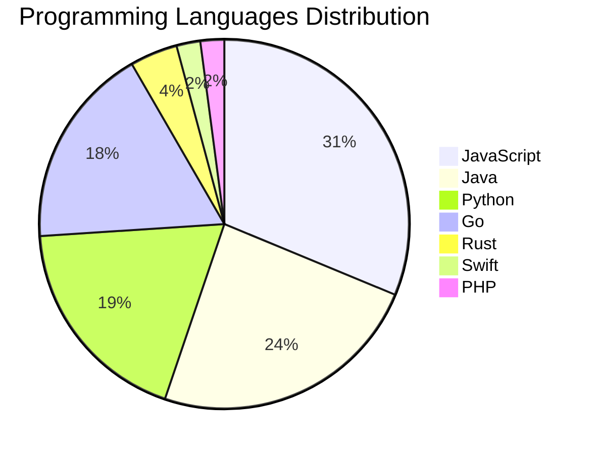

# 🚀 DevTech Auto News - Enhanced Edition


**DevTech Auto News Enhanced** is an advanced automated bot that aggregates trending topics in **AI**, **Web Development**, **Mobile**, **Cloud**, **DevOps**, and more from multiple sources including:

- 📰 [Dev.to](https://dev.to) - Developer community articles
- 🔥 [HackerNews](https://news.ycombinator.com) - Tech news discussions  
- 💻 [GitHub Trending](https://github.com/trending) - Trending repositories
- 🎯 Curated Interview Questions from multiple languages

## ✨ Features

✅ **Multi-Source Aggregation**: Combines articles from Dev.to, HackerNews, and GitHub  
✅ **Smart Categorization**: Automatically categorizes content into 10+ topics  
✅ **Image Support**: Displays cover images for visual appeal  
✅ **Pagination**: Fetches 50+ articles per update with deduplication  
✅ **Language Statistics**: Tracks programming language trends with charts  
✅ **Interview Questions**: Daily coding interview questions in multiple languages  
✅ **GitHub Actions**: Runs every 15 minutes automatically  

---

## 📊 Statistics Dashboard

### 📊 Articles by Category

**AI**: 🟦🟦🟦🟦🟦🟦🟦🟦🟦🟦🟦🟦🟦🟦🟦🟦🟦🟦🟦🟦 41 (39.0%)

**JavaScript**: 🟦🟦🟦🟦🟦🟦🟦🟦🟦🟦🟦🟦🟦🟦🟦 30 (28.6%)

**Tools**: 🟦🟦🟦🟦🟦🟦🟦🟦🟦🟦🟦🟦🟦 27 (25.7%)

**Python**: 🟦🟦🟦🟦🟦🟦🟦🟦🟦 18 (17.1%)

**Cloud**: 🟦🟦🟦 6 (5.7%)

**DevOps**: 🟦🟦 4 (3.8%)

**WebDev**: 🟦🟦 4 (3.8%)

**Database**: 🟦🟦 4 (3.8%)

**Security**: 🟦 3 (2.9%)

**Mobile**: 🟦 2 (1.9%)


### 📡 Sources

- **Dev.to**: 60 articles
- **HackerNews**: 30 articles
- **GitHub**: 15 articles


### 💻 Programming Language Trends

```
JavaScript      ██████████████████████████████ 31.3 (31.3%)
Java            ███████████████████████ 24.0 (24.0%)
Python          ██████████████████ 18.8 (18.8%)
Go              █████████████████ 17.7 (17.7%)
Rust            ████ 4.2 (4.2%)
Swift           ██ 2.1 (2.1%)
PHP             ██ 2.1 (2.1%)

```




### 🏷️ Trending Tags

               


---

## 🛠️ How It Works

1. **Multi-Source Fetch**: Pulls from Dev.to (2 pages), HackerNews (3 topics), GitHub (3 languages)
2. **Smart Filter**: Uses keyword matching across 10+ categories  
3. **Deduplication**: Removes duplicate URLs  
4. **Image Extraction**: Captures cover images when available  
5. **Statistics**: Generates language trends and category breakdowns  
6. **Update Files**: Regenerates README and appends to comprehensive log  

---

## 📦 Installation & Usage

```bash
# Clone the repository
git clone https://github.com/Derrick-MUGISHA/github-activity-bot.git
cd github-activity-bot

# Install dependencies  
npm install

# Run manually
npm start

# Test mode
npm run test
```

---


# 🚀 DevTech Auto News - Enhanced Edition

## 📅 Latest Updates (2026-02-19 11:00 CAT)


### 🖼️ Featured Articles

<table>
<tr>
  <td align="center" width="33%">
    <a href="https://dev.to/devteam/a-new-chapter-dev-is-joining-forces-with-major-league-hacking-mlh-3kfd">
      
      <br/>
      <b>A New Chapter: DEV is Joining Forces with Major Le...</b>
    </a>
    <br/>
    <sub>Dev.to</sub>
  </td>
  <td align="center" width="33%">
    <a href="https://dev.to/mlh/the-future-of-software-has-a-lot-more-builders-theyre-going-to-need-a-home-1k65">
      
      <br/>
      <b>The Future of Software Has a Lot More Builders. Th...</b>
    </a>
    <br/>
    <sub>Dev.to</sub>
  </td>
  <td align="center" width="33%">
    <a href="https://dev.to/the_nortern_dev/the-most-valuable-skill-in-2026-isnt-writing-code-it-is-deleting-it-53j1">
      
      <br/>
      <b>The most valuable skill in 2026 isn't writing code...</b>
    </a>
    <br/>
    <sub>Dev.to</sub>
  </td>
</tr>
<tr>
  <td align="center" width="33%">
    <a href="https://dev.to/devteam/introducing-our-next-dev-education-track-build-multi-agent-systems-with-adk-4bg8">
      
      <br/>
      <b>Introducing Our Next DEV Education Track: "Build M...</b>
    </a>
    <br/>
    <sub>Dev.to</sub>
  </td>
  <td align="center" width="33%">
    <a href="https://dev.to/maximsaplin/ran-out-of-cursor-tokens-and-switched-to-github-copilot-side-by-side-2n5p">
      
      <br/>
      <b>Ran out of Cursor tokens and switched to GitHub Co...</b>
    </a>
    <br/>
    <sub>Dev.to</sub>
  </td>
  <td align="center" width="33%">
    <a href="https://dev.to/googleai/how-i-turned-an-ugly-spreadsheet-into-an-ai-assisted-app-with-antigravity-3j52">
      
      <br/>
      <b>How I Turned an Ugly Spreadsheet into an AI Assist...</b>
    </a>
    <br/>
    <sub>Dev.to</sub>
  </td>
</tr>
</table>


### 📰 Top Headlines

- [A New Chapter: DEV is Joining Forces with Major League Hacking (MLH)](https://dev.to/devteam/a-new-chapter-dev-is-joining-forces-with-major-league-hacking-mlh-3kfd) _[Dev.to]_
- [The Future of Software Has a Lot More Builders. They’re Going to Need a Home.](https://dev.to/mlh/the-future-of-software-has-a-lot-more-builders-theyre-going-to-need-a-home-1k65) _[Dev.to]_
- [The most valuable skill in 2026 isn't writing code. It is deleting it.](https://dev.to/the_nortern_dev/the-most-valuable-skill-in-2026-isnt-writing-code-it-is-deleting-it-53j1) _[Dev.to]_
- [Introducing Our Next DEV Education Track: "Build Multi-Agent Systems with ADK"](https://dev.to/devteam/introducing-our-next-dev-education-track-build-multi-agent-systems-with-adk-4bg8) _[Dev.to]_
- [Ran out of Cursor tokens and switched to GitHub Copilot: Side-by-Side](https://dev.to/maximsaplin/ran-out-of-cursor-tokens-and-switched-to-github-copilot-side-by-side-2n5p) _[Dev.to]_
- [How I Turned an Ugly Spreadsheet into an AI Assisted App with Antigravity](https://dev.to/googleai/how-i-turned-an-ugly-spreadsheet-into-an-ai-assisted-app-with-antigravity-3j52) _[Dev.to]_
- [If Writing still Matters, How to Do it Right and Avoid AI Suspicion?](https://dev.to/ingosteinke/if-writing-still-matters-how-to-do-it-right-and-avoid-ai-suspicion-2nac) _[Dev.to]_
- [Can you order a pizza on my site? ❌ 99% Can't 😤](https://dev.to/jacksonkasi/can-you-order-a-pizza-on-this-site-99-cant-30pd) _[Dev.to]_
- [I'm Done With Magic. Here's What I Built Instead.](https://dev.to/iceonfire/im-done-with-magic-heres-what-i-built-instead-988) _[Dev.to]_
- [Stacking Multiple Dialogs in React Without Hooks or Effects](https://dev.to/9thquadrant/stacking-multiple-dialogs-in-react-without-hooks-or-effects-4enj) _[Dev.to]_
- [How a DEV Friend and I Brought Two Avatars to Life](https://dev.to/itsugo/how-a-dev-friend-and-i-brought-two-avatars-to-life-chp) _[Dev.to]_
- [How to Run Podman Quadlets on Raspberry Pi](https://dev.to/project42/how-to-run-podman-quadlets-on-raspberry-pi-3nc1) _[Dev.to]_
- [The Ghost in the Training Set](https://dev.to/abahgat/the-ghost-in-the-training-set-496n) _[Dev.to]_
- [CNN-LSTM Hybrid Architecture for Thanglish-to-Tamil : Bridging 26 Letters to 247 Characters](https://dev.to/aj1thkr1sh/cnn-lstm-hybrid-architecture-for-thanglish-to-tamil-bridging-26-letters-to-247-characters-j4n) _[Dev.to]_
- [The Gatekeeping Panic: What AI Actually Threatens in Software Development](https://dev.to/dannwaneri/the-gatekeeping-panic-what-ai-actually-threatens-in-software-development-5b9l) _[Dev.to]_
- [Who Are We Still Writing Technical Articles For?](https://dev.to/pascal_cescato_692b7a8a20/who-are-we-still-writing-technical-articles-for-i64) _[Dev.to]_
- [Building a Native-Feeling Theme System in SwiftUI](https://dev.to/rozd/building-a-native-feeling-theme-system-in-swiftui-h1k) _[Dev.to]_
- [6 Pitfalls of Dynamic OG Image Generation on Cloudflare Workers (Satori + resvg-wasm)](https://dev.to/devoresyah/6-pitfalls-of-dynamic-og-image-generation-on-cloudflare-workers-satori-resvg-wasm-1kle) _[Dev.to]_
- [From Idea to Maintainable UI: A Practical React/TS Sprint Workflow](https://dev.to/semosem_20/from-idea-to-maintainable-ui-a-practical-reactts-sprint-workflow-4fak) _[Dev.to]_
- [Visualizing UV on a Polygon2D in Godot](https://dev.to/datadeer/visualizing-uv-on-a-polygon2d-in-godot-1e8o) _[Dev.to]_

_Last automated update: Thu, 19 Feb 2026 11:03:59 CAT_


## 💡 Daily Interview Questions

_Sharpen your skills with these curated questions_

### 1. React: Explain the difference between state and props

**Difficulty**: Easy | **Topics**: data flow, components

<details>
<summary>💡 Hint</summary>

Ownership, mutability, data flow direction

</details>

### 2. JavaScript: What is the difference between `let`, `const`, and `var`?

**Difficulty**: Easy | **Topics**: variables, scope

<details>
<summary>💡 Hint</summary>

Scope, hoisting, and reassignment capabilities

</details>

### 3. React: What are hooks and why were they introduced?

**Difficulty**: Medium | **Topics**: hooks, functional components

<details>
<summary>💡 Hint</summary>

State in functional components, reusable logic, cleaner code

</details>


---

## 📚 Resources

- [Full News Archive](./data/news_log.md) - Complete history of all fetched articles
- [Statistics JSON](./data/stats.json) - Raw statistics data
- [Categorized Data](./data/categorized.json) - Articles organized by category
- [Interview Questions](./data/interview_questions.json) - Complete question bank

---

## 🤝 Contributing

Want to add more sources, categories, or interview questions? Feel free to:

1. Fork this repository
2. Add your improvements
3. Submit a pull request

---

## 📄 License

MIT License - Feel free to use and modify!

---

<p align="center">
  <b>Last automated update: Thu, 19 Feb 2026 09:03:59 GMT</b><br/>
  <sub>Powered by GitHub Actions | Made with ❤️ for developers</sub>
</p>

---

## 🔗 Quick Links

- [View Workflow](https://github.com/Derrick-MUGISHA/github-activity-bot/actions)
- [Report Issue](https://github.com/Derrick-MUGISHA/github-activity-bot/issues)
- [Suggest Feature](https://github.com/Derrick-MUGISHA/github-activity-bot/issues/new)
