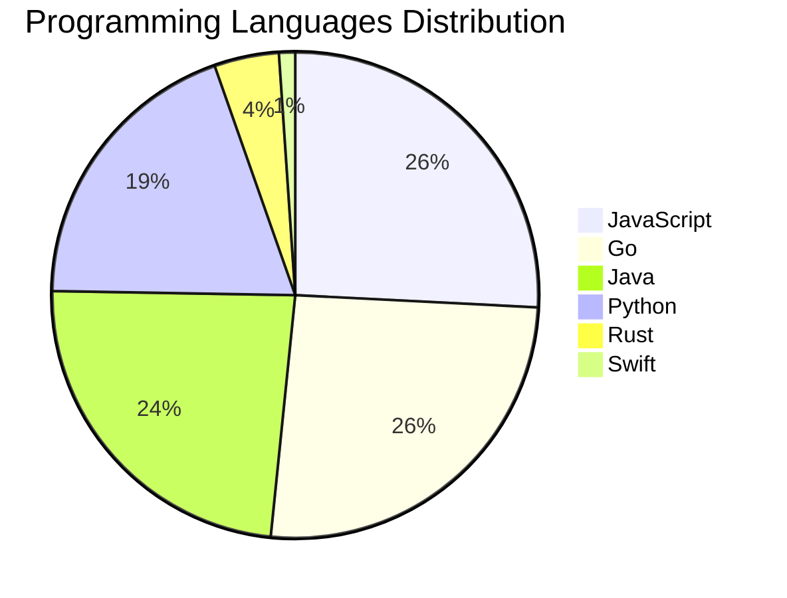

# 🚀 DevTech Auto News - Enhanced Edition


**DevTech Auto News Enhanced** is an advanced automated bot that aggregates trending topics in **AI**, **Web Development**, **Mobile**, **Cloud**, **DevOps**, and more from multiple sources including:

- 📰 [Dev.to](https://dev.to) - Developer community articles
- 🔥 [HackerNews](https://news.ycombinator.com) - Tech news discussions  
- 💻 [GitHub Trending](https://github.com/trending) - Trending repositories
- 🎯 Curated Interview Questions from multiple languages

## ✨ Features

✅ **Multi-Source Aggregation**: Combines articles from Dev.to, HackerNews, and GitHub  
✅ **Smart Categorization**: Automatically categorizes content into 10+ topics  
✅ **Image Support**: Displays cover images for visual appeal  
✅ **Pagination**: Fetches 50+ articles per update with deduplication  
✅ **Language Statistics**: Tracks programming language trends with charts  
✅ **Interview Questions**: Daily coding interview questions in multiple languages  
✅ **GitHub Actions**: Runs every 15 minutes automatically  

---

## 📊 Statistics Dashboard

### 📊 Articles by Category

**AI**: 🟦🟦🟦🟦🟦🟦🟦🟦🟦🟦🟦🟦🟦🟦🟦🟦🟦🟦🟦🟦 48 (46.6%)

**Tools**: 🟦🟦🟦🟦🟦🟦🟦🟦🟦🟦🟦🟦🟦 31 (30.1%)

**JavaScript**: 🟦🟦🟦🟦🟦🟦🟦🟦🟦🟦 24 (23.3%)

**Python**: 🟦🟦🟦🟦🟦🟦🟦🟦 18 (17.5%)

**Cloud**: 🟦🟦🟦🟦🟦 13 (12.6%)

**Security**: 🟦🟦 5 (4.9%)

**DevOps**: 🟦🟦 4 (3.9%)

**WebDev**: 🟦 3 (2.9%)

**Database**: 🟦 2 (1.9%)

**Mobile**:  1 (1.0%)


### 📡 Sources

- **Dev.to**: 58 articles
- **HackerNews**: 30 articles
- **GitHub**: 15 articles


### 💻 Programming Language Trends

```
JavaScript      ██████████████████████████████ 25.8 (25.8%)
Go              ██████████████████████████████ 25.8 (25.8%)
Java            ████████████████████████████ 23.7 (23.7%)
Python          ███████████████████████ 19.4 (19.4%)
Rust            █████ 4.3 (4.3%)
Swift           █ 1.1 (1.1%)

```




### 🏷️ Trending Tags

               


---

## 🛠️ How It Works

1. **Multi-Source Fetch**: Pulls from Dev.to (2 pages), HackerNews (3 topics), GitHub (3 languages)
2. **Smart Filter**: Uses keyword matching across 10+ categories  
3. **Deduplication**: Removes duplicate URLs  
4. **Image Extraction**: Captures cover images when available  
5. **Statistics**: Generates language trends and category breakdowns  
6. **Update Files**: Regenerates README and appends to comprehensive log  

---

## 📦 Installation & Usage

```bash
# Clone the repository
git clone https://github.com/Derrick-MUGISHA/github-activity-bot.git
cd github-activity-bot

# Install dependencies  
npm install

# Run manually
npm start

# Test mode
npm run test
```

---


# 🚀 DevTech Auto News - Enhanced Edition

## 📅 Latest Updates (2026-06-26 3:00 CAT)


### 🖼️ Featured Articles

<table>
<tr>
  <td align="center" width="33%">
    <a href="https://dev.to/ohkpond/not-enough-smes-or-customers-to-make-your-evals-make-some-11nc">
      
      <br/>
      <b>Not Enough SMEs or Customers to Make Your Evals? M...</b>
    </a>
    <br/>
    <sub>Dev.to</sub>
  </td>
  <td align="center" width="33%">
    <a href="https://dev.to/devteam/winner-announcement-delayed-for-the-github-finish-up-a-thon-challenge-1766">
      
      <br/>
      <b>Winner Announcement Delayed for the Github "Finish...</b>
    </a>
    <br/>
    <sub>Dev.to</sub>
  </td>
  <td align="center" width="33%">
    <a href="https://dev.to/jeancarlosn/lite-harness-sdk-3f28">
      
      <br/>
      <b>Lite-Harness SDK</b>
    </a>
    <br/>
    <sub>Dev.to</sub>
  </td>
</tr>
<tr>
  <td align="center" width="33%">
    <a href="https://dev.to/adamklein/the-agent-first-approach-to-building-products-51oj">
      
      <br/>
      <b>The agent-first approach to building products</b>
    </a>
    <br/>
    <sub>Dev.to</sub>
  </td>
  <td align="center" width="33%">
    <a href="https://dev.to/mvzundert/why-i-built-nvim-starter-a-neovim-config-beginners-can-actually-understand-19a5">
      
      <br/>
      <b>Why I Built nvim-starter — a Neovim Config Beginne...</b>
    </a>
    <br/>
    <sub>Dev.to</sub>
  </td>
  <td align="center" width="33%">
    <a href="https://dev.to/bclonan/cognitive-pong-an-open-source-arena-where-ai-agents-compete-learn-and-train-mdp">
      
      <br/>
      <b>Cognitive Pong: An Open Source Arena Where AI Agen...</b>
    </a>
    <br/>
    <sub>Dev.to</sub>
  </td>
</tr>
</table>


### 📰 Top Headlines

- [Not Enough SMEs or Customers to Make Your Evals? Make Some!](https://dev.to/ohkpond/not-enough-smes-or-customers-to-make-your-evals-make-some-11nc) _[Dev.to]_
- [Winner Announcement Delayed for the Github "Finish-Up-A-Thon" Challenge](https://dev.to/devteam/winner-announcement-delayed-for-the-github-finish-up-a-thon-challenge-1766) _[Dev.to]_
- [Lite-Harness SDK](https://dev.to/jeancarlosn/lite-harness-sdk-3f28) _[Dev.to]_
- [The agent-first approach to building products](https://dev.to/adamklein/the-agent-first-approach-to-building-products-51oj) _[Dev.to]_
- [Why I Built nvim-starter — a Neovim Config Beginners Can Actually Understand](https://dev.to/mvzundert/why-i-built-nvim-starter-a-neovim-config-beginners-can-actually-understand-19a5) _[Dev.to]_
- [Cognitive Pong: An Open Source Arena Where AI Agents Compete, Learn, and Train](https://dev.to/bclonan/cognitive-pong-an-open-source-arena-where-ai-agents-compete-learn-and-train-mdp) _[Dev.to]_
- [The Security Bug Every Node.js Developer Ships to Production](https://dev.to/manolito99/the-security-bug-every-nodejs-developer-ships-to-production-49e6) _[Dev.to]_
- [Did you want more Claude on Cloud? ☁️ Let's talk about Securing Agents at Scale](https://dev.to/googleai/did-you-want-more-claude-on-cloud-lets-talk-about-securing-agents-at-scale-29jh) _[Dev.to]_
- [_action: Declarative Event Handlers in an Attribute](https://dev.to/jon49/action-declarative-event-handlers-in-an-attribute-3b35) _[Dev.to]_
- [The Rise of Agentic Engineering — Part 1: The Prompt Engineering Era](https://dev.to/raminjafary/the-rise-of-agentic-engineering-part-1-the-prompt-engineering-era-4cb4) _[Dev.to]_
- [What it takes to build docs worth reading](https://dev.to/devsofmidnight/what-it-takes-to-build-docs-worth-reading-2290) _[Dev.to]_
- [12B Gemma 4 Deployment with NVIDIA Blackwell 6000, QAT, MTP, and Antigravity CLI](https://dev.to/gde/12b-gemma-4-deployment-with-nvidia-blackwell-6000-qat-mtp-and-antigravity-cli-3gn6) _[Dev.to]_
- [12B Gemma 4 Deployment with NVIDIA Blackwell 6000, MCP, Cloud Run, and Antigravity CLI](https://dev.to/gde/12b-gemma-4-deployment-with-nvidia-blackwell-6000-mcp-cloud-run-and-antigravity-cli-3ckn) _[Dev.to]_
- [Building a Custom Status Line for Claude Code](https://dev.to/ndrone/building-a-custom-status-line-for-claude-code-5822) _[Dev.to]_
- [How I Use AI Councils to Solve Ambiguous Engineering Problems](https://dev.to/j3nnning/how-i-use-ai-councils-to-solve-ambiguous-engineering-problems-4dii) _[Dev.to]_
- [How to Get Your First Tool Online](https://dev.to/mlh/how-to-get-your-first-tool-online-3c8k) _[Dev.to]_
- [Function Names in JS Can't Contain Spaces, Right?](https://dev.to/jonrandy/function-names-in-js-cant-contain-spaces-right-mp7) _[Dev.to]_
- [cuenv: one typed file for your whole project](https://dev.to/peterj/cuenv-one-typed-file-for-your-whole-project-76a) _[Dev.to]_
- [Announcing the Public Preview of Integrated Embeddings in Azure Cosmos DB: Build AI Apps With Embeddings That Stay in Sync](https://dev.to/abhirockzz/announcing-the-public-preview-of-integrated-embeddings-in-azure-cosmos-db-build-ai-apps-with-234k) _[Dev.to]_
- [Extending a Rust MCP/A2A Currency Agent with A2UI](https://dev.to/gde/extending-a-rust-mcpa2a-currency-agent-with-a2ui-22jc) _[Dev.to]_

_Last automated update: Fri, 26 Jun 2026 03:52:47 CAT_


## 💡 Daily Interview Questions

_Sharpen your skills with these curated questions_

### 1. Database: Explain database indexing and when to use it

**Difficulty**: Medium | **Topics**: optimization, performance

<details>
<summary>💡 Hint</summary>

B-tree, trade-offs, query performance

</details>

### 2. Python: Explain GIL and its implications for multithreading

**Difficulty**: Hard | **Topics**: concurrency, performance

<details>
<summary>💡 Hint</summary>

Global Interpreter Lock, multiprocessing alternatives

</details>

### 3. SystemDesign: How would you design a rate limiter?

**Difficulty**: Medium | **Topics**: system design, algorithms

<details>
<summary>💡 Hint</summary>

Token bucket, sliding window, distributed systems

</details>


---

## 📚 Resources

- [Full News Archive](./data/news_log.md) - Complete history of all fetched articles
- [Statistics JSON](./data/stats.json) - Raw statistics data
- [Categorized Data](./data/categorized.json) - Articles organized by category
- [Interview Questions](./data/interview_questions.json) - Complete question bank

---

## 🤝 Contributing

Want to add more sources, categories, or interview questions? Feel free to:

1. Fork this repository
2. Add your improvements
3. Submit a pull request

---

## 📄 License

MIT License - Feel free to use and modify!

---

<p align="center">
  <b>Last automated update: Fri, 26 Jun 2026 01:52:47 GMT</b><br/>
  <sub>Powered by GitHub Actions | Made with ❤️ for developers</sub>
</p>

---

## 🔗 Quick Links

- [View Workflow](https://github.com/Derrick-MUGISHA/github-activity-bot/actions)
- [Report Issue](https://github.com/Derrick-MUGISHA/github-activity-bot/issues)
- [Suggest Feature](https://github.com/Derrick-MUGISHA/github-activity-bot/issues/new)
