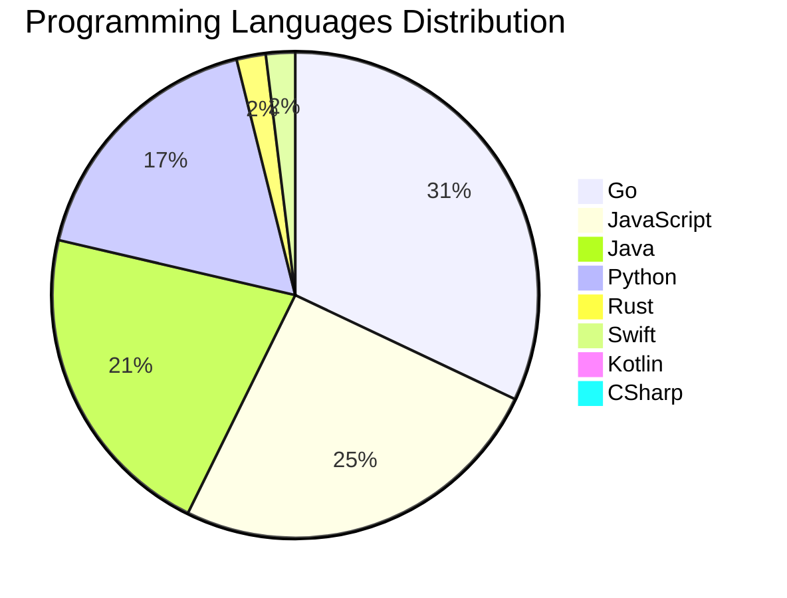

# 🚀 DevTech Auto News - Enhanced Edition


**DevTech Auto News Enhanced** is an advanced automated bot that aggregates trending topics in **AI**, **Web Development**, **Mobile**, **Cloud**, **DevOps**, and more from multiple sources including:

- 📰 [Dev.to](https://dev.to) - Developer community articles
- 🔥 [HackerNews](https://news.ycombinator.com) - Tech news discussions  
- 💻 [GitHub Trending](https://github.com/trending) - Trending repositories
- 🎯 Curated Interview Questions from multiple languages

## ✨ Features

✅ **Multi-Source Aggregation**: Combines articles from Dev.to, HackerNews, and GitHub  
✅ **Smart Categorization**: Automatically categorizes content into 10+ topics  
✅ **Image Support**: Displays cover images for visual appeal  
✅ **Pagination**: Fetches 50+ articles per update with deduplication  
✅ **Language Statistics**: Tracks programming language trends with charts  
✅ **Interview Questions**: Daily coding interview questions in multiple languages  
✅ **GitHub Actions**: Runs every 15 minutes automatically  

---

## 📊 Statistics Dashboard

### 📊 Articles by Category

**AI**: 🟦🟦🟦🟦🟦🟦🟦🟦🟦🟦🟦🟦🟦🟦🟦🟦🟦🟦🟦🟦 55 (52.4%)

**JavaScript**: 🟦🟦🟦🟦🟦🟦🟦🟦🟦 26 (24.8%)

**Tools**: 🟦🟦🟦🟦🟦🟦🟦🟦 23 (21.9%)

**Python**: 🟦🟦🟦🟦🟦🟦🟦 18 (17.1%)

**Cloud**: 🟦🟦🟦🟦 12 (11.4%)

**DevOps**: 🟦🟦🟦 7 (6.7%)

**WebDev**: 🟦🟦🟦 7 (6.7%)

**Mobile**: 🟦 4 (3.8%)

**Security**: 🟦 4 (3.8%)

**Database**: 🟦 3 (2.9%)


### 📡 Sources

- **Dev.to**: 60 articles
- **HackerNews**: 30 articles
- **GitHub**: 15 articles


### 💻 Programming Language Trends

```
Go              ██████████████████████████████ 31.4 (31.4%)
JavaScript      ████████████████████████ 24.8 (24.8%)
Java            ████████████████████ 21.0 (21.0%)
Python          ████████████████ 17.1 (17.1%)
Rust            ██ 1.9 (1.9%)
Swift           ██ 1.9 (1.9%)
Kotlin          █ 1.0 (1.0%)
CSharp          █ 1.0 (1.0%)

```




### 🏷️ Trending Tags

               


---

## 🛠️ How It Works

1. **Multi-Source Fetch**: Pulls from Dev.to (2 pages), HackerNews (3 topics), GitHub (3 languages)
2. **Smart Filter**: Uses keyword matching across 10+ categories  
3. **Deduplication**: Removes duplicate URLs  
4. **Image Extraction**: Captures cover images when available  
5. **Statistics**: Generates language trends and category breakdowns  
6. **Update Files**: Regenerates README and appends to comprehensive log  

---

## 📦 Installation & Usage

```bash
# Clone the repository
git clone https://github.com/Derrick-MUGISHA/github-activity-bot.git
cd github-activity-bot

# Install dependencies  
npm install

# Run manually
npm start

# Test mode
npm run test
```

---


# 🚀 DevTech Auto News - Enhanced Edition

## 📅 Latest Updates (2026-06-14 23:00 CAT)


### 🖼️ Featured Articles

<table>
<tr>
  <td align="center" width="33%">
    <a href="https://dev.to/devteam/congrats-to-the-google-io-writing-challenge-winners-1364">
      
      <br/>
      <b>Congrats to the Google I/O 2026 Writing Challenge ...</b>
    </a>
    <br/>
    <sub>Dev.to</sub>
  </td>
  <td align="center" width="33%">
    <a href="https://dev.to/devteam/what-was-your-win-this-week-4k11">
      
      <br/>
      <b>What was your win this week?</b>
    </a>
    <br/>
    <sub>Dev.to</sub>
  </td>
  <td align="center" width="33%">
    <a href="https://dev.to/googleai/building-knowledge-graphs-with-gemini-3ail">
      
      <br/>
      <b>Building Knowledge Graphs with Gemini</b>
    </a>
    <br/>
    <sub>Dev.to</sub>
  </td>
</tr>
<tr>
  <td align="center" width="33%">
    <a href="https://dev.to/dsheiko/why-i-still-teach-singleton-even-though-modules-make-it-redundant-1a7m">
      
      <br/>
      <b>Why I still teach Singleton even though modules ma...</b>
    </a>
    <br/>
    <sub>Dev.to</sub>
  </td>
  <td align="center" width="33%">
    <a href="https://dev.to/virtualcoffee/virtual-coffee-needs-your-help-46ih">
      
      <br/>
      <b>Virtual Coffee Needs Your Help</b>
    </a>
    <br/>
    <sub>Dev.to</sub>
  </td>
  <td align="center" width="33%">
    <a href="https://dev.to/znsstudio/the-ai-addiction-nobody-is-talking-about-2of8">
      
      <br/>
      <b>The AI Addiction Nobody Is Talking About</b>
    </a>
    <br/>
    <sub>Dev.to</sub>
  </td>
</tr>
</table>


### 📰 Top Headlines

- [Congrats to the Google I/O 2026 Writing Challenge Winners!](https://dev.to/devteam/congrats-to-the-google-io-writing-challenge-winners-1364) _[Dev.to]_
- [What was your win this week?](https://dev.to/devteam/what-was-your-win-this-week-4k11) _[Dev.to]_
- [Building Knowledge Graphs with Gemini](https://dev.to/googleai/building-knowledge-graphs-with-gemini-3ail) _[Dev.to]_
- [Why I still teach Singleton even though modules make it redundant](https://dev.to/dsheiko/why-i-still-teach-singleton-even-though-modules-make-it-redundant-1a7m) _[Dev.to]_
- [Virtual Coffee Needs Your Help](https://dev.to/virtualcoffee/virtual-coffee-needs-your-help-46ih) _[Dev.to]_
- [The AI Addiction Nobody Is Talking About](https://dev.to/znsstudio/the-ai-addiction-nobody-is-talking-about-2of8) _[Dev.to]_
- [Lessons Learned: Deployment Trade-offs with Gemma4, NVIDIA L4, Cloud Run, and Antigravity CLI](https://dev.to/gde/lessons-learned-deployment-trade-offs-with-gemma4-nvidia-l4-cloud-run-and-antigravity-cli-lnl) _[Dev.to]_
- [Connecting GCP Budget Alerts to AppSheet: A Step-by-Step Guide](https://dev.to/gde/connecting-gcp-budget-alerts-to-appsheet-a-step-by-step-guide-4pda) _[Dev.to]_
- [Mastering Self-Hosted Convex: A Complete Deployment Guide](https://dev.to/jookllo/mastering-self-hosted-convex-a-complete-deployment-guide-3mp5) _[Dev.to]_
- [I tried to make an AI agent answer more. It answered less.](https://dev.to/ankushchadha/i-tried-to-make-an-ai-agent-answer-more-it-answered-less-3d7a) _[Dev.to]_
- [Deployment Planning with Gemma 26B, NVIDIA L4, MCP, Cloud Run, and Antigravity CLI](https://dev.to/gde/deployment-planning-with-gemma-26b-nvidia-l4-mcp-cloud-run-and-antigravity-cli-kn0) _[Dev.to]_
- [12B Gemma 4 QAT Deployment with NVIDIA L4, Cloud Run, MCP, and Antigravity CLI](https://dev.to/gde/12b-gemma-4-qat-deployment-with-nvidia-l4-cloud-run-mcp-and-antigravity-cli-21l2) _[Dev.to]_
- [[Hands-on Gemini 3.5 Live](https://dev.to/gde/hands-on-gemini-35-live-3dh6) _[Dev.to]_
- [[AI Practice] Building blazing-Fast AI Mac OS App with Antigravity CLI](https://dev.to/gde/ai-practice-blazing-fast-ai-co-29l7) _[Dev.to]_
- [Debugging Deployments with Gemma 12B, NVIDIA L4, MCP, Cloud Run, and Antigravity CLI](https://dev.to/gde/debugging-deployments-with-gemma-12b-nvidia-l4-mcp-cloud-run-and-antigravity-cli-32eg) _[Dev.to]_
- [G4 Fractional VMs are now available on Google Cloud!](https://dev.to/googleai/g4-fractional-vms-are-now-available-on-google-cloud-knp) _[Dev.to]_
- [Flutter Midsommer Madnesss](https://dev.to/gde/flutter-midsommer-madnesss-kkb) _[Dev.to]_
- [Claude Fable 5 is Now Generally Available on Google Cloud! 🚀](https://dev.to/googleai/claude-fable-5-is-now-generally-available-on-google-cloud-3gog) _[Dev.to]_
- [Antigravity Managed Agents Tutorial: Ship Production AI Agents](https://dev.to/googleai/antigravity-managed-agents-tutorial-ship-production-ai-agents-21c0) _[Dev.to]_
- [Celebrate June rituals with Solstice Bingo!](https://dev.to/klaudiagrz/celebrate-june-rituals-with-solstice-bingo-1al6) _[Dev.to]_

_Last automated update: Sun, 14 Jun 2026 23:13:02 CAT_


## 💡 Daily Interview Questions

_Sharpen your skills with these curated questions_

### 1. JavaScript: Explain event delegation and why it's useful

**Difficulty**: Medium | **Topics**: events, DOM

<details>
<summary>💡 Hint</summary>

Event bubbling, single listener for multiple elements

</details>

### 2. JavaScript: What are closures and provide a practical example?

**Difficulty**: Medium | **Topics**: functions, scope

<details>
<summary>💡 Hint</summary>

Function + lexical environment, data privacy, callbacks

</details>

### 3. React: What are hooks and why were they introduced?

**Difficulty**: Medium | **Topics**: hooks, functional components

<details>
<summary>💡 Hint</summary>

State in functional components, reusable logic, cleaner code

</details>


---

## 📚 Resources

- [Full News Archive](./data/news_log.md) - Complete history of all fetched articles
- [Statistics JSON](./data/stats.json) - Raw statistics data
- [Categorized Data](./data/categorized.json) - Articles organized by category
- [Interview Questions](./data/interview_questions.json) - Complete question bank

---

## 🤝 Contributing

Want to add more sources, categories, or interview questions? Feel free to:

1. Fork this repository
2. Add your improvements
3. Submit a pull request

---

## 📄 License

MIT License - Feel free to use and modify!

---

<p align="center">
  <b>Last automated update: Sun, 14 Jun 2026 21:13:02 GMT</b><br/>
  <sub>Powered by GitHub Actions | Made with ❤️ for developers</sub>
</p>

---

## 🔗 Quick Links

- [View Workflow](https://github.com/Derrick-MUGISHA/github-activity-bot/actions)
- [Report Issue](https://github.com/Derrick-MUGISHA/github-activity-bot/issues)
- [Suggest Feature](https://github.com/Derrick-MUGISHA/github-activity-bot/issues/new)
