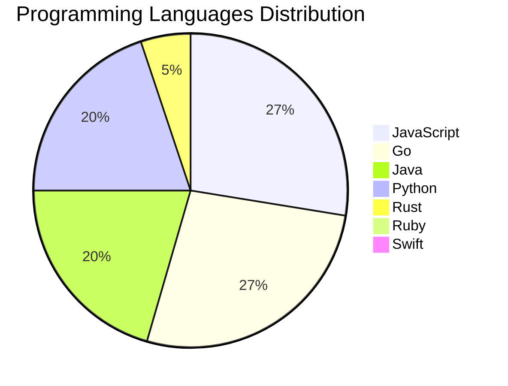

<div align="center">

# 📰 DevTech Auto News

**Your always-fresh digest of developer & AI tech news — curated automatically, around the clock.**


Aggregating [Dev.to](https://dev.to) · [Hacker News](https://news.ycombinator.com) · [GitHub Trending](https://github.com/trending) · [Lobste.rs](https://lobste.rs) · [Stack Overflow](https://stackoverflow.com) · [TechCrunch](https://techcrunch.com) · [freeCodeCamp](https://www.freecodecamp.org/news) — refreshed by GitHub Actions around the clock.

**[📰 Headlines](#-latest-headlines) · [💡 Interview Prep](#-interview-question-of-the-hour) · [📊 Statistics](#-statistics) · [⚙️ How It Works](#%EF%B8%8F-how-it-works)**

</div>

---

## 📰 Latest Headlines

> 🕐 Edition of **2026-08-28 6:00 CAT** — refreshed automatically, all day, every day.

### ✨ Featured Stories

<table>
<tr>
  <td align="center" width="33%">
    <a href="https://dev.to/googlecloud/two-step-control-plane-upgrades-in-gke-how-minor-version-rollbacks-work-under-the-hood-i1l">
      
      <br/>
      <b>Two-step control plane upgrades in GKE: How minor ...</b>
    </a>
    <br/>
    <sub>Dev.to</sub>
  </td>
  <td align="center" width="33%">
    <a href="https://dev.to/anchildress1/what-do-you-do-while-ai-codes-k8k">
      
      <br/>
      <b>What Do You Do While AI Codes?</b>
    </a>
    <br/>
    <sub>Dev.to</sub>
  </td>
  <td align="center" width="33%">
    <a href="https://dev.to/eugeniya_ivanova_4a58eadc/the-agent-posted-successfully-to-the-wrong-account-3kf3">
      
      <br/>
      <b>The agent posted successfully. To the wrong accoun...</b>
    </a>
    <br/>
    <sub>Dev.to</sub>
  </td>
</tr>
<tr>
  <td align="center" width="33%">
    <a href="https://dev.to/gde/go-in-practice-writing-modern-go-with-ai-testing-jetbrains-go-modern-guidelines-and-refactoring-151o">
      
      <br/>
      <b>[Go in Practice] Writing Modern Go with AI: Testin...</b>
    </a>
    <br/>
    <sub>Dev.to</sub>
  </td>
  <td align="center" width="33%">
    <a href="https://dev.to/gde/futurebuilder-and-streambuilder-as-anti-patterns-why-your-async-boundary-should-be-far-away-from-1d8g">
      
      <br/>
      <b>FutureBuilder and StreamBuilder as Anti-Patterns: ...</b>
    </a>
    <br/>
    <sub>Dev.to</sub>
  </td>
  <td align="center" width="33%">
    <a href="https://dev.to/gde/cross-cloud-a2a-agent-card-field-comparison-2hod">
      
      <br/>
      <b>Cross Cloud A2A Agent Card Field Comparison</b>
    </a>
    <br/>
    <sub>Dev.to</sub>
  </td>
</tr>
</table>


### 🗞️ Top Stories

| # | Headline | Source |
|---|----------|--------|
| 1 | [Two-step control plane upgrades in GKE: How minor version rollbacks work under the hood](https://dev.to/googlecloud/two-step-control-plane-upgrades-in-gke-how-minor-version-rollbacks-work-under-the-hood-i1l) | Dev.to |
| 2 | [What Do You Do While AI Codes?](https://dev.to/anchildress1/what-do-you-do-while-ai-codes-k8k) | Dev.to |
| 3 | [The agent posted successfully. To the wrong account.](https://dev.to/eugeniya_ivanova_4a58eadc/the-agent-posted-successfully-to-the-wrong-account-3kf3) | Dev.to |
| 4 | [[Go in Practice] Writing Modern Go with AI: Testing JetBrains go-modern-guidelines and Refactoring a 1,039-line main.go](https://dev.to/gde/go-in-practice-writing-modern-go-with-ai-testing-jetbrains-go-modern-guidelines-and-refactoring-151o) | Dev.to |
| 5 | [FutureBuilder and StreamBuilder as Anti-Patterns: Why Your Async Boundary Should Be Far Away From Your Views](https://dev.to/gde/futurebuilder-and-streambuilder-as-anti-patterns-why-your-async-boundary-should-be-far-away-from-1d8g) | Dev.to |
| 6 | [Cross Cloud A2A Agent Card Field Comparison](https://dev.to/gde/cross-cloud-a2a-agent-card-field-comparison-2hod) | Dev.to |
| 7 | [Vector Search Is Still the Memory Layer Agents Actually Need](https://dev.to/bengreenberg/vector-search-is-still-the-memory-layer-agents-actually-need-50dn) | Dev.to |
| 8 | [comiCSS #255: Yellow](https://dev.to/alvaromontoro/comicss-255-yellow-1bj) | Dev.to |
| 9 | [Go Completely Offline: Build a Privacy-First Personal Finance Assistant with LiteRT and Gemma 4 [GDE]](https://dev.to/gde/go-completely-offline-build-a-privacy-first-personal-finance-assistant-with-litert-and-gemma-4-542g) | Dev.to |
| 10 | [Go Completely Offline: Build a Privacy-First Personal Finance Assistant with LiteRT and Gemma 4](https://dev.to/railsstudent/go-completely-offline-build-a-privacy-first-personal-finance-assistant-with-litert-and-gemma-4-227l) | Dev.to |
| 11 | [Building E-commerce AI Agents on MongoDB with CrewAI](https://dev.to/mongodb/building-e-commerce-ai-agents-on-mongodb-with-crewai-4n8p) | Dev.to |
| 12 | [Wiring the Reasoning Loop: Gemini + Neo4j + MCP for Multi-Hop AI Agents](https://dev.to/gde/wiring-the-reasoning-loop-gemini-neo4j-mcp-for-multi-hop-ai-agents-51p9) | Dev.to |
| 13 | [Coding agents got boring the moment we built a really good one.](https://dev.to/backboardio/coding-agents-got-boring-the-moment-we-built-a-really-good-one-1mc4) | Dev.to |
| 14 | [Introducing AI Disclosure on DEV: Tools for Nuance, Clarity, and Better Feeds](https://dev.to/devteam/introducing-ai-disclosure-on-dev-tools-for-nuance-clarity-and-better-feeds-34mk) | Dev.to |
| 15 | [Mix and Match: One Agent, Three Clouds, One Protocol](https://dev.to/gde/mix-and-match-one-agent-three-clouds-one-protocol-4e5l) | Dev.to |
| 16 | [Welcome Thread - v390](https://dev.to/devteam/welcome-thread-v390-1bic) | Dev.to |
| 17 | [I Counted the Attack Vectors in Our AI Stack and Now I Can't Sleep](https://dev.to/jon_at_backboardio/i-counted-the-attack-vectors-in-our-ai-stack-and-now-i-cant-sleep-155o) | Dev.to |
| 18 | [Top 7 Featured DEV Posts of the Week](https://dev.to/devteam/top-7-featured-dev-posts-of-the-week-4h3f) | Dev.to |
| 19 | [Taking control of cluster security: A deep dive into GKE ClusterNetworkPolicy](https://dev.to/googlecloud/taking-control-of-cluster-security-a-deep-dive-into-gke-clusternetworkpolicy-536c) | Dev.to |
| 20 | [Mix and Match: Serving an ADK Agent to AWS and Azure](https://dev.to/gde/mix-and-match-serving-an-adk-agent-to-aws-and-azure-161f) | Dev.to |

<sub>Last fetched: Fri, 28 Aug 2026 06:58:48 CAT</sub>


---

## 💡 Interview Question of the Hour

> Sharpen your skills — new questions selected on every update. Try answering before opening the hint!

**1. `React` — Explain the difference between state and props**

&nbsp;&nbsp;&nbsp;&nbsp;🎯 Easy · 🏷 data flow, components

<details>
<summary>&nbsp;&nbsp;&nbsp;&nbsp;💡 Show hint</summary>

> Ownership, mutability, data flow direction

</details>

**2. `Python` — What is the difference between list and tuple in Python?**

&nbsp;&nbsp;&nbsp;&nbsp;🎯 Easy · 🏷 data structures, mutability

<details>
<summary>&nbsp;&nbsp;&nbsp;&nbsp;💡 Show hint</summary>

> Mutability, performance, use cases

</details>

**3. `DataStructures` — Implement LRU Cache**

&nbsp;&nbsp;&nbsp;&nbsp;🎯 Hard · 🏷 design, hash map, linked list

<details>
<summary>&nbsp;&nbsp;&nbsp;&nbsp;💡 Show hint</summary>

> Doubly linked list + hash map, O(1) operations

</details>


---

## 📊 Statistics

#### 🗂 Articles by Category

| Category | Articles | Share | |
|----------|---------:|------:|---|
| **AI** | 86 | 46.7% | `████████████████████` |
| **JavaScript** | 43 | 23.4% | `██████████░░░░░░░░░░` |
| **Tools** | 42 | 22.8% | `██████████░░░░░░░░░░` |
| **Python** | 31 | 16.8% | `███████░░░░░░░░░░░░░` |
| **Security** | 21 | 11.4% | `█████░░░░░░░░░░░░░░░` |
| **DevOps** | 14 | 7.6% | `███░░░░░░░░░░░░░░░░░` |
| **WebDev** | 12 | 6.5% | `███░░░░░░░░░░░░░░░░░` |
| **Cloud** | 11 | 6.0% | `███░░░░░░░░░░░░░░░░░` |
| **Mobile** | 8 | 4.3% | `██░░░░░░░░░░░░░░░░░░` |
| **Database** | 6 | 3.3% | `█░░░░░░░░░░░░░░░░░░░` |

<sub>Articles can match more than one category, so shares may sum to over 100%.</sub>


#### 📡 Articles by Source

| Source | Articles |
|--------|---------:|
| Dev.to | 60 |
| HackerNews | 49 |
| GitHub | 25 |
| Lobste.rs | 10 |
| StackOverflow | 20 |
| TechCrunch | 10 |
| freeCodeCamp | 10 |


#### 💻 Programming Language Trends

```
JavaScript      ██████████████████████████████ 27.2%
Go              █████████████████████████████ 26.6%
Java            ██████████████████████ 20.3%
Python          ██████████████████████ 19.6%
Rust            ██████ 5.1%
Ruby            █ 0.6%
Swift           █ 0.6%

```




#### 🏷 Trending Topics

            


---

## ⚙️ How It Works

This repository is a fully automated news pipeline. On every run, GitHub Actions:

1. **Fetches** the latest articles from seven sources: Dev.to, Hacker News, GitHub Trending, Lobste.rs, Stack Overflow, TechCrunch, and freeCodeCamp
2. **Deduplicates and categorizes** them across 10+ topics using keyword matching
3. **Extracts cover images** and computes language & category statistics
4. **Rebuilds this README** and appends everything to the [full archive](./data/news_log.md)
5. **Commits and pushes** the result — no human intervention needed

<details>
<summary><b>🚀 Run it yourself</b></summary>

```bash
git clone https://github.com/Derrick-MUGISHA/github-activity-bot.git
cd github-activity-bot
npm install
npm start
```

Fork the repo, enable GitHub Actions, and you have your own self-updating news feed.

</details>

<details>
<summary><b>📚 Data & resources</b></summary>

- [Full news archive](./data/news_log.md) — complete history of every fetched article
- [Statistics](./data/stats.json) — raw stats data (JSON)
- [Categorized articles](./data/categorized.json) — articles grouped by topic
- [Interview question bank](./data/interview_questions.json) — the full question set

</details>

---

## 🤝 Contributing

Ideas for new sources, categories, or interview questions are welcome — [open an issue](https://github.com/Derrick-MUGISHA/github-activity-bot/issues/new) or submit a pull request.

## 📄 License

Released under the [MIT License](https://opensource.org/licenses/MIT) — free to use, fork, and modify.

---

<div align="center">
  <sub>🤖 Last automated update: <b>Fri, 28 Aug 2026 04:58:48 GMT</b></sub><br/>
  <sub>Powered by GitHub Actions · Built with ❤️ by <a href="https://github.com/Derrick-MUGISHA">Derrick MUGISHA</a></sub>
</div>
