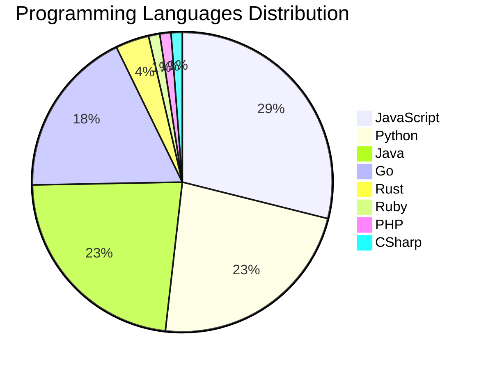

# 🚀 DevTech Auto News - Enhanced Edition


**DevTech Auto News Enhanced** is an advanced automated bot that aggregates trending topics in **AI**, **Web Development**, **Mobile**, **Cloud**, **DevOps**, and more from multiple sources including:

- 📰 [Dev.to](https://dev.to) - Developer community articles
- 🔥 [HackerNews](https://news.ycombinator.com) - Tech news discussions  
- 💻 [GitHub Trending](https://github.com/trending) - Trending repositories
- 🎯 Curated Interview Questions from multiple languages

## ✨ Features

✅ **Multi-Source Aggregation**: Combines articles from Dev.to, HackerNews, and GitHub  
✅ **Smart Categorization**: Automatically categorizes content into 10+ topics  
✅ **Image Support**: Displays cover images for visual appeal  
✅ **Pagination**: Fetches 50+ articles per update with deduplication  
✅ **Language Statistics**: Tracks programming language trends with charts  
✅ **Interview Questions**: Daily coding interview questions in multiple languages  
✅ **GitHub Actions**: Runs every 15 minutes automatically  

---

## 📊 Statistics Dashboard

### 📊 Articles by Category

**AI**: 🟦🟦🟦🟦🟦🟦🟦🟦🟦🟦🟦🟦🟦🟦🟦🟦🟦🟦🟦🟦 59 (56.2%)

**Tools**: 🟦🟦🟦🟦🟦🟦🟦🟦🟦 28 (26.7%)

**JavaScript**: 🟦🟦🟦🟦🟦🟦🟦🟦 24 (22.9%)

**Python**: 🟦🟦🟦🟦🟦🟦 19 (18.1%)

**Cloud**: 🟦🟦 5 (4.8%)

**Security**: 🟦🟦 5 (4.8%)

**WebDev**: 🟦 3 (2.9%)

**Database**: 🟦 3 (2.9%)

**DevOps**:  1 (1.0%)


### 📡 Sources

- **Dev.to**: 60 articles
- **HackerNews**: 30 articles
- **GitHub**: 15 articles


### 💻 Programming Language Trends

```
JavaScript      ██████████████████████████████ 28.9 (28.9%)
Python          ████████████████████████ 22.9 (22.9%)
Java            ████████████████████████ 22.9 (22.9%)
Go              ███████████████████ 18.1 (18.1%)
Rust            ████ 3.6 (3.6%)
Ruby            █ 1.2 (1.2%)
PHP             █ 1.2 (1.2%)
CSharp          █ 1.2 (1.2%)

```




### 🏷️ Trending Tags

               


---

## 🛠️ How It Works

1. **Multi-Source Fetch**: Pulls from Dev.to (2 pages), HackerNews (3 topics), GitHub (3 languages)
2. **Smart Filter**: Uses keyword matching across 10+ categories  
3. **Deduplication**: Removes duplicate URLs  
4. **Image Extraction**: Captures cover images when available  
5. **Statistics**: Generates language trends and category breakdowns  
6. **Update Files**: Regenerates README and appends to comprehensive log  

---

## 📦 Installation & Usage

```bash
# Clone the repository
git clone https://github.com/Derrick-MUGISHA/github-activity-bot.git
cd github-activity-bot

# Install dependencies  
npm install

# Run manually
npm start

# Test mode
npm run test
```

---


# 🚀 DevTech Auto News - Enhanced Edition

## 📅 Latest Updates (2026-04-02 22:00 CAT)


### 🖼️ Featured Articles

<table>
<tr>
  <td align="center" width="33%">
    <a href="https://dev.to/devteam/join-our-april-fools-challenge-for-a-chance-at-tea-rrific-prizes-1ofa">
      
      <br/>
      <b>Join our April Fools Challenge for a chance at TEA...</b>
    </a>
    <br/>
    <sub>Dev.to</sub>
  </td>
  <td align="center" width="33%">
    <a href="https://dev.to/jess/a-year-of-change-and-persistence-19cf">
      
      <br/>
      <b>A Year of Change and Persistence</b>
    </a>
    <br/>
    <sub>Dev.to</sub>
  </td>
  <td align="center" width="33%">
    <a href="https://dev.to/axrisi/brewops-i-built-a-production-grade-htcpcp-server-because-nobody-else-would-3clh">
      
      <br/>
      <b>BrewOps: I built a production-grade HTCPCP server ...</b>
    </a>
    <br/>
    <sub>Dev.to</sub>
  </td>
</tr>
<tr>
  <td align="center" width="33%">
    <a href="https://dev.to/raseiri/we-crammed-a-24gb-ai-3d-generation-pipeline-into-a-completely-offline-desktop-app-and-the-demo-is-12i5">
      
      <br/>
      <b>We crammed a 24GB AI 3D-generation pipeline into a...</b>
    </a>
    <br/>
    <sub>Dev.to</sub>
  </td>
  <td align="center" width="33%">
    <a href="https://dev.to/malik_sohaib_iqbal/proof-of-work-the-to-do-list-of-infinite-regret-48le">
      
      <br/>
      <b>🌪️ Proof of Work: The To-Do List of Infinite Regr...</b>
    </a>
    <br/>
    <sub>Dev.to</sub>
  </td>
  <td align="center" width="33%">
    <a href="https://dev.to/gde/google-workspace-studio-tutorial-auto-organize-your-inbox-with-smart-labels-priority-3493">
      
      <br/>
      <b>Google Workspace Studio Tutorial: Auto-Organize Yo...</b>
    </a>
    <br/>
    <sub>Dev.to</sub>
  </td>
</tr>
</table>


### 📰 Top Headlines

- [Join our April Fools Challenge for a chance at TEA-RRIFIC prizes!!!](https://dev.to/devteam/join-our-april-fools-challenge-for-a-chance-at-tea-rrific-prizes-1ofa) _[Dev.to]_
- [A Year of Change and Persistence](https://dev.to/jess/a-year-of-change-and-persistence-19cf) _[Dev.to]_
- [BrewOps: I built a production-grade HTCPCP server because nobody else would](https://dev.to/axrisi/brewops-i-built-a-production-grade-htcpcp-server-because-nobody-else-would-3clh) _[Dev.to]_
- [We crammed a 24GB AI 3D-generation pipeline into a completely offline desktop app (and the Demo is live)](https://dev.to/raseiri/we-crammed-a-24gb-ai-3d-generation-pipeline-into-a-completely-offline-desktop-app-and-the-demo-is-12i5) _[Dev.to]_
- [🌪️ Proof of Work: The To-Do List of Infinite Regret](https://dev.to/malik_sohaib_iqbal/proof-of-work-the-to-do-list-of-infinite-regret-48le) _[Dev.to]_
- [Google Workspace Studio Tutorial: Auto-Organize Your Inbox with Smart Labels & Priority Notifications](https://dev.to/gde/google-workspace-studio-tutorial-auto-organize-your-inbox-with-smart-labels-priority-3493) _[Dev.to]_
- [“Why Are We Throwing Away Perfectly Good Tech?”](https://dev.to/codebunny20/why-are-we-throwing-away-perfectly-good-tech-1k3) _[Dev.to]_
- [I built a machine-readable UK Chart of Accounts for Python (because one didn't exist)](https://dev.to/billkhiz/i-built-a-machine-readable-uk-chart-of-accounts-for-python-because-one-didnt-exist-30m6) _[Dev.to]_
- [Antigravity: My Approach to Deliver the Most Assured Value for the Least Money](https://dev.to/gdg/antigravity-my-approach-to-deliver-the-most-assured-value-for-the-least-money-3iip) _[Dev.to]_
- [Drizby: An Open Source BI Platform Built on a Semantic Layer (and why I built it)](https://dev.to/cliftonc/drizby-an-open-source-bi-platform-built-on-a-semantic-layer-and-why-i-built-it-2k5p) _[Dev.to]_
- [Recursive Knowledge Crystallization: Enabling Persistent Evolution and Zero-Shot Transfer in AI Agents](https://dev.to/gde/recursive-knowledge-crystallization-enabling-persistent-evolution-and-zero-shot-transfer-in-ai-4fh7) _[Dev.to]_
- [Big performance upgrade in DEV/Forem tag queries shipped yesterday. Breath of fresh air 🙂](https://dev.to/ben/big-performance-upgrade-in-devforem-tag-queries-shipped-yesterday-breath-of-fresh-air-2pp0) _[Dev.to]_
- [What are your goals for the week? #172](https://dev.to/jarvisscript/what-are-your-goals-for-the-week-55nm) _[Dev.to]_
- [The Curated, Automated Open Source Portfolio: How It’s Going](https://dev.to/adiatiayu/the-curated-automated-open-source-portfolio-how-its-going-5f98) _[Dev.to]_
- [I Rebuilt My JavaScript Database From Scratch for the AI Agent Era](https://dev.to/tarekraafat/i-rebuilt-my-javascript-database-from-scratch-for-the-ai-agent-era-h62) _[Dev.to]_
- [Top 7 Featured DEV Posts of the Week](https://dev.to/devteam/top-7-featured-dev-posts-of-the-week-ba0) _[Dev.to]_
- [Cross-Repository Development with Antigravity](https://dev.to/gdg/cross-repository-development-with-antigravity-26be) _[Dev.to]_
- [3 Takeaways from All Things AI: 80/20 Rule, Non-Deterministic Humans, and Why We're Still Early](https://dev.to/thisisryanswift/3-takeaways-from-all-things-ai-8020-rule-non-deterministic-humans-and-why-were-still-early-2mln) _[Dev.to]_
- [What I Learned from Reading Claude Code’s Reconstructed Source](https://dev.to/trknhr/what-i-learned-from-reading-claude-codes-reconstructed-source-1ebf) _[Dev.to]_
- [What is your WPM (Words per Minute)? #1](https://dev.to/francistrdev/what-is-your-wpm-words-per-minute-1af7) _[Dev.to]_

_Last automated update: Thu, 02 Apr 2026 22:33:59 CAT_


## 💡 Daily Interview Questions

_Sharpen your skills with these curated questions_

### 1. Database: What is the difference between SQL and NoSQL databases?

**Difficulty**: Easy | **Topics**: databases, design

<details>
<summary>💡 Hint</summary>

Schema, scalability, ACID vs BASE

</details>

### 2. SystemDesign: How would you design a rate limiter?

**Difficulty**: Medium | **Topics**: system design, algorithms

<details>
<summary>💡 Hint</summary>

Token bucket, sliding window, distributed systems

</details>

### 3. Database: Design a database schema for a social media platform

**Difficulty**: Hard | **Topics**: design, scalability

<details>
<summary>💡 Hint</summary>

Users, posts, relationships, indexes, partitioning

</details>


---

## 📚 Resources

- [Full News Archive](./data/news_log.md) - Complete history of all fetched articles
- [Statistics JSON](./data/stats.json) - Raw statistics data
- [Categorized Data](./data/categorized.json) - Articles organized by category
- [Interview Questions](./data/interview_questions.json) - Complete question bank

---

## 🤝 Contributing

Want to add more sources, categories, or interview questions? Feel free to:

1. Fork this repository
2. Add your improvements
3. Submit a pull request

---

## 📄 License

MIT License - Feel free to use and modify!

---

<p align="center">
  <b>Last automated update: Thu, 02 Apr 2026 20:33:59 GMT</b><br/>
  <sub>Powered by GitHub Actions | Made with ❤️ for developers</sub>
</p>

---

## 🔗 Quick Links

- [View Workflow](https://github.com/Derrick-MUGISHA/github-activity-bot/actions)
- [Report Issue](https://github.com/Derrick-MUGISHA/github-activity-bot/issues)
- [Suggest Feature](https://github.com/Derrick-MUGISHA/github-activity-bot/issues/new)
