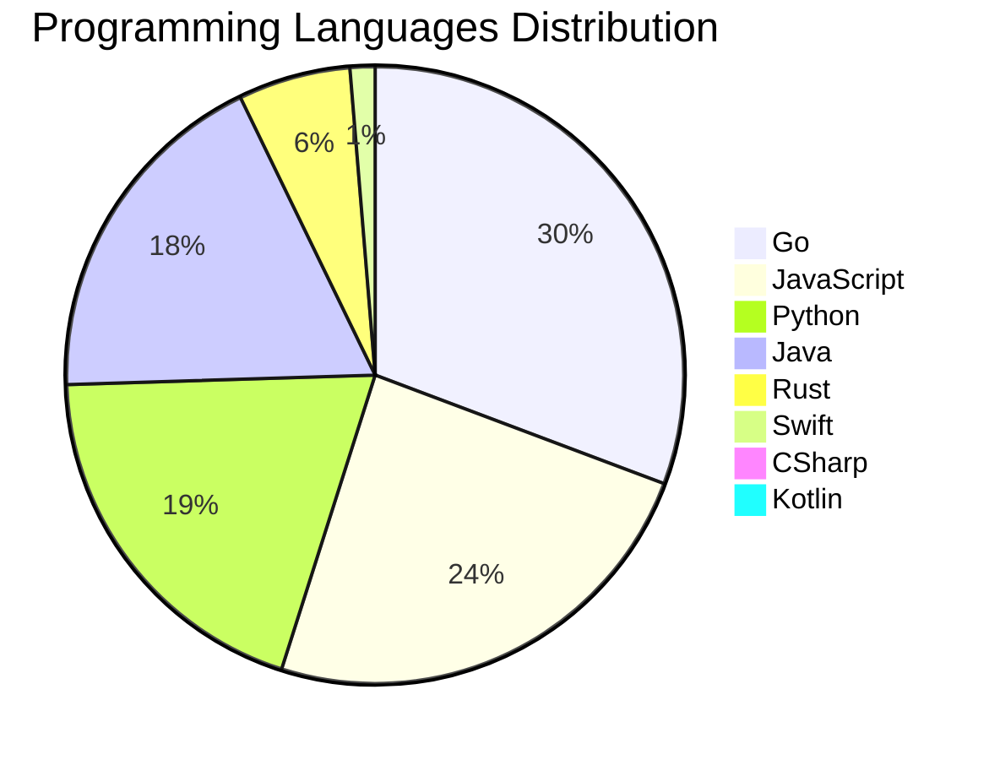

<div align="center">

# 📰 DevTech Auto News

**Your always-fresh digest of developer & AI tech news — curated automatically, around the clock.**


Aggregating [Dev.to](https://dev.to) · [Hacker News](https://news.ycombinator.com) · [GitHub Trending](https://github.com/trending) · [Lobste.rs](https://lobste.rs) · [Stack Overflow](https://stackoverflow.com) · [TechCrunch](https://techcrunch.com) · [freeCodeCamp](https://www.freecodecamp.org/news) — refreshed by GitHub Actions around the clock.

**[📰 Headlines](#-latest-headlines) · [💡 Interview Prep](#-interview-question-of-the-hour) · [📊 Statistics](#-statistics) · [⚙️ How It Works](#%EF%B8%8F-how-it-works)**

</div>

---

## 📰 Latest Headlines

> 🕐 Edition of **2026-07-25 17:00 CAT** — refreshed automatically, all day, every day.

### ✨ Featured Stories

<table>
<tr>
  <td align="center" width="33%">
    <a href="https://dev.to/gde/teaching-google-antigravity-to-paint-a-stateful-image-editing-skill-built-on-geminis-interactions-9g1">
      
      <br/>
      <b>Teaching Google Antigravity to Paint: A Stateful I...</b>
    </a>
    <br/>
    <sub>Dev.to</sub>
  </td>
  <td align="center" width="33%">
    <a href="https://dev.to/googleai/investing-in-multi-agent-ai-safety-research-312l">
      
      <br/>
      <b>Investing in multi-agent AI safety research</b>
    </a>
    <br/>
    <sub>Dev.to</sub>
  </td>
  <td align="center" width="33%">
    <a href="https://dev.to/gde/teaching-antigravity-to-direct-a-stateful-video-editing-skill-built-on-geminis-interactions-api-2ccn">
      
      <br/>
      <b>Teaching Antigravity to Direct: A Stateful Video-E...</b>
    </a>
    <br/>
    <sub>Dev.to</sub>
  </td>
</tr>
<tr>
  <td align="center" width="33%">
    <a href="https://dev.to/gdg/zero-to-multi-region-high-availability-serverless-with-cloud-run-and-cross-region-failover--dcc">
      
      <br/>
      <b>Zero to Multi-Region: High Availability Serverless...</b>
    </a>
    <br/>
    <sub>Dev.to</sub>
  </td>
  <td align="center" width="33%">
    <a href="https://dev.to/gde/teaching-claude-code-to-direct-a-stateful-video-editing-skill-built-on-geminis-interactions-api-1j9a">
      
      <br/>
      <b>Teaching Claude Code to Direct: A Stateful Video-E...</b>
    </a>
    <br/>
    <sub>Dev.to</sub>
  </td>
  <td align="center" width="33%">
    <a href="https://dev.to/francescoxx/better-than-nextjs-is-rust-finally-ready-for-full-stack-web-development-introducing-topcoat-2h09">
      
      <br/>
      <b>Better than Next.js? Is Rust Finally Ready for Ful...</b>
    </a>
    <br/>
    <sub>Dev.to</sub>
  </td>
</tr>
</table>


### 🗞️ Top Stories

| # | Headline | Source |
|---|----------|--------|
| 1 | [Teaching Google Antigravity to Paint: A Stateful Image-Editing Skill Built on Gemini's Interactions API and MCP](https://dev.to/gde/teaching-google-antigravity-to-paint-a-stateful-image-editing-skill-built-on-geminis-interactions-9g1) | Dev.to |
| 2 | [Investing in multi-agent AI safety research](https://dev.to/googleai/investing-in-multi-agent-ai-safety-research-312l) | Dev.to |
| 3 | [Teaching Antigravity to Direct: A Stateful Video-Editing Skill Built on Gemini's Interactions API and MCP](https://dev.to/gde/teaching-antigravity-to-direct-a-stateful-video-editing-skill-built-on-geminis-interactions-api-2ccn) | Dev.to |
| 4 | [Zero to Multi-Region: High Availability Serverless with Cloud Run and Cross-Region Failover & Failback](https://dev.to/gdg/zero-to-multi-region-high-availability-serverless-with-cloud-run-and-cross-region-failover--dcc) | Dev.to |
| 5 | [Teaching Claude Code to Direct: A Stateful Video-Editing Skill Built on Gemini’s Interactions API…](https://dev.to/gde/teaching-claude-code-to-direct-a-stateful-video-editing-skill-built-on-geminis-interactions-api-1j9a) | Dev.to |
| 6 | [Better than Next.js? Is Rust Finally Ready for Full-Stack Web Development? Introducing Topcoat](https://dev.to/francescoxx/better-than-nextjs-is-rust-finally-ready-for-full-stack-web-development-introducing-topcoat-2h09) | Dev.to |
| 7 | [Loop Engineering: How to Stop Your Agent Reward-Hacking Its Own Checks](https://dev.to/reporails/loop-engineering-how-to-stop-your-agent-reward-hacking-its-own-checks-4fpn) | Dev.to |
| 8 | [Teaching Codex to Paint: A Stateful Image-Editing Skill Built on Gemini's Interactions API and MCP](https://dev.to/gde/teaching-codex-to-paint-a-stateful-image-editing-skill-built-on-geminis-interactions-api-and-mcp-26lc) | Dev.to |
| 9 | [I've Spent 10+ Years in Software Engineering. After Sickness, Burnout, and a Layoff, I'm Rebuilding My Career. Ask Me Anything](https://dev.to/canro91/ive-spent-10-years-in-software-engineering-after-sickness-burnout-and-a-layoff-im-rebuilding-efc) | Dev.to |
| 10 | [TPU Deployments with Gemma 31B, v6e-8, and Antigravity CLI](https://dev.to/gde/tpu-deployments-with-gemma-31b-v6e-8-and-antigravity-cli-3e4n) | Dev.to |
| 11 | [New Gemini models dropped

https://blog.google/innovation-and-ai/models-and-research/gemini-models/gemini-3-6-flash-3-5-flash-lite-3-5-flash-cyber/](https://dev.to/ben/new-gemini-models-dropped-59l8) | Dev.to |
| 12 | [What was your win this week??](https://dev.to/devteam/what-was-your-win-this-week-5ak2) | Dev.to |
| 13 | [Why AI Apps Fail in Production (And How Google Solved It)](https://dev.to/googleai/why-ai-apps-fail-in-production-and-how-google-solved-it-5a3m) | Dev.to |
| 14 | [Debugging Deployments with Gemma 2B, TPU v6e-1, MCP, and Antigravity CLI](https://dev.to/gde/debugging-deployments-with-gemma-2b-tpu-v6e-1-mcp-and-antigravity-cli-3hh3) | Dev.to |
| 15 | [[GCP in Action] LINE Business Card Bot Evolution: Dual-Side Recognition and Merging with Gemini](https://dev.to/gde/gcp-in-action-line-business-card-bot-evolution-dual-side-recognition-and-merging-with-gemini-2220) | Dev.to |
| 16 | [Gemini 3.6 Flash & 3.5 Flash-Lite: Developer guide](https://dev.to/googleai/gemini-36-flash-35-flash-lite-developer-guide-268i) | Dev.to |
| 17 | [AI And Code Ownership: Who Is Responsible For Generated Code?](https://dev.to/nazar-boyko/ai-and-code-ownership-who-is-responsible-for-generated-code-1dnj) | Dev.to |
| 18 | [[GCP Billing & Vertex AI] Solving Gemini Cost Allocation in a Single Project: Vertex AI Dynamic Billing Labels in Action](https://dev.to/gde/gcp-billing-vertex-ai-solving-gemini-cost-allocation-in-a-single-project-vertex-ai-dynamic-5aok) | Dev.to |
| 19 | [Should I quit IT or just live through the burnout?](https://dev.to/klaudiagrz/should-i-quit-it-or-just-live-through-the-burnout-1gng) | Dev.to |
| 20 | [Build Firebase AI Logic Application with Antigravity CLI and Stitch MCP Server [GDE]](https://dev.to/gde/build-firebase-ai-logic-application-with-antigravity-cli-and-stitch-mcp-server-gde-g6o) | Dev.to |

<sub>Last fetched: Sat, 25 Jul 2026 17:43:06 CAT</sub>


---

## 💡 Interview Question of the Hour

> Sharpen your skills — new questions selected on every update. Try answering before opening the hint!

**1. `React` — Explain the difference between state and props**

&nbsp;&nbsp;&nbsp;&nbsp;🎯 Easy · 🏷 data flow, components

<details>
<summary>&nbsp;&nbsp;&nbsp;&nbsp;💡 Show hint</summary>

> Ownership, mutability, data flow direction

</details>

**2. `JavaScript` — What are closures and provide a practical example?**

&nbsp;&nbsp;&nbsp;&nbsp;🎯 Medium · 🏷 functions, scope

<details>
<summary>&nbsp;&nbsp;&nbsp;&nbsp;💡 Show hint</summary>

> Function + lexical environment, data privacy, callbacks

</details>

**3. `Database` — What is the difference between SQL and NoSQL databases?**

&nbsp;&nbsp;&nbsp;&nbsp;🎯 Easy · 🏷 databases, design

<details>
<summary>&nbsp;&nbsp;&nbsp;&nbsp;💡 Show hint</summary>

> Schema, scalability, ACID vs BASE

</details>


---

## 📊 Statistics

#### 🗂 Articles by Category

| Category | Articles | Share | |
|----------|---------:|------:|---|
| **AI** | 76 | 41.5% | `████████████████████` |
| **Tools** | 39 | 21.3% | `██████████░░░░░░░░░░` |
| **JavaScript** | 37 | 20.2% | `██████████░░░░░░░░░░` |
| **Python** | 30 | 16.4% | `████████░░░░░░░░░░░░` |
| **Cloud** | 19 | 10.4% | `█████░░░░░░░░░░░░░░░` |
| **Security** | 15 | 8.2% | `████░░░░░░░░░░░░░░░░` |
| **DevOps** | 14 | 7.7% | `████░░░░░░░░░░░░░░░░` |
| **WebDev** | 10 | 5.5% | `███░░░░░░░░░░░░░░░░░` |
| **Database** | 10 | 5.5% | `███░░░░░░░░░░░░░░░░░` |
| **Mobile** | 3 | 1.6% | `█░░░░░░░░░░░░░░░░░░░` |

<sub>Articles can match more than one category, so shares may sum to over 100%.</sub>


#### 📡 Articles by Source

| Source | Articles |
|--------|---------:|
| Dev.to | 60 |
| HackerNews | 49 |
| GitHub | 25 |
| Lobste.rs | 10 |
| StackOverflow | 19 |
| TechCrunch | 10 |
| freeCodeCamp | 10 |


#### 💻 Programming Language Trends

```
Go              ██████████████████████████████ 30.3%
JavaScript      ████████████████████████ 23.9%
Python          ███████████████████ 19.4%
Java            ██████████████████ 18.1%
Rust            ██████ 5.8%
Swift           █ 1.3%
CSharp          █ 0.6%
Kotlin          █ 0.6%

```




#### 🏷 Trending Topics

            


---

## ⚙️ How It Works

This repository is a fully automated news pipeline. On every run, GitHub Actions:

1. **Fetches** the latest articles from seven sources: Dev.to, Hacker News, GitHub Trending, Lobste.rs, Stack Overflow, TechCrunch, and freeCodeCamp
2. **Deduplicates and categorizes** them across 10+ topics using keyword matching
3. **Extracts cover images** and computes language & category statistics
4. **Rebuilds this README** and appends everything to the [full archive](./data/news_log.md)
5. **Commits and pushes** the result — no human intervention needed

<details>
<summary><b>🚀 Run it yourself</b></summary>

```bash
git clone https://github.com/Derrick-MUGISHA/github-activity-bot.git
cd github-activity-bot
npm install
npm start
```

Fork the repo, enable GitHub Actions, and you have your own self-updating news feed.

</details>

<details>
<summary><b>📚 Data & resources</b></summary>

- [Full news archive](./data/news_log.md) — complete history of every fetched article
- [Statistics](./data/stats.json) — raw stats data (JSON)
- [Categorized articles](./data/categorized.json) — articles grouped by topic
- [Interview question bank](./data/interview_questions.json) — the full question set

</details>

---

## 🤝 Contributing

Ideas for new sources, categories, or interview questions are welcome — [open an issue](https://github.com/Derrick-MUGISHA/github-activity-bot/issues/new) or submit a pull request.

## 📄 License

Released under the [MIT License](https://opensource.org/licenses/MIT) — free to use, fork, and modify.

---

<div align="center">
  <sub>🤖 Last automated update: <b>Sat, 25 Jul 2026 15:43:06 GMT</b></sub><br/>
  <sub>Powered by GitHub Actions · Built with ❤️ by <a href="https://github.com/Derrick-MUGISHA">Derrick MUGISHA</a></sub>
</div>
