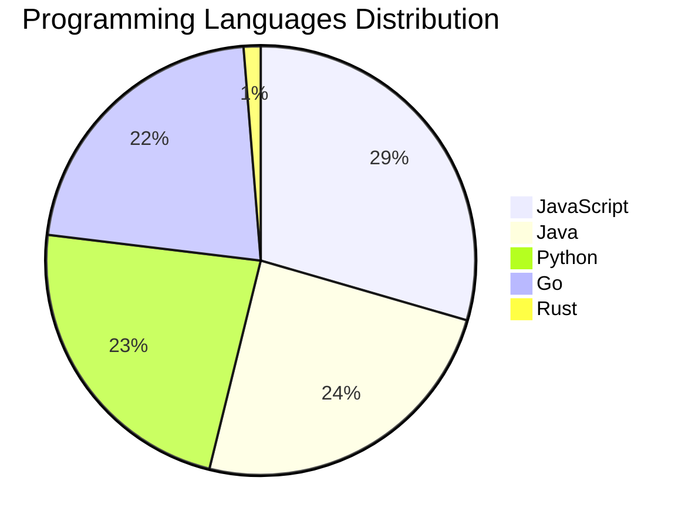

# 🚀 DevTech Auto News - Enhanced Edition


**DevTech Auto News Enhanced** is an advanced automated bot that aggregates trending topics in **AI**, **Web Development**, **Mobile**, **Cloud**, **DevOps**, and more from multiple sources including:

- 📰 [Dev.to](https://dev.to) - Developer community articles
- 🔥 [HackerNews](https://news.ycombinator.com) - Tech news discussions  
- 💻 [GitHub Trending](https://github.com/trending) - Trending repositories
- 🎯 Curated Interview Questions from multiple languages

## ✨ Features

✅ **Multi-Source Aggregation**: Combines articles from Dev.to, HackerNews, and GitHub  
✅ **Smart Categorization**: Automatically categorizes content into 10+ topics  
✅ **Image Support**: Displays cover images for visual appeal  
✅ **Pagination**: Fetches 50+ articles per update with deduplication  
✅ **Language Statistics**: Tracks programming language trends with charts  
✅ **Interview Questions**: Daily coding interview questions in multiple languages  
✅ **GitHub Actions**: Runs every 15 minutes automatically  

---

## 📊 Statistics Dashboard

### 📊 Articles by Category

**AI**: 🟦🟦🟦🟦🟦🟦🟦🟦🟦🟦🟦🟦🟦🟦🟦🟦🟦🟦🟦🟦 51 (48.6%)

**Tools**: 🟦🟦🟦🟦🟦🟦🟦🟦🟦🟦🟦🟦🟦 32 (30.5%)

**JavaScript**: 🟦🟦🟦🟦🟦🟦🟦🟦🟦 23 (21.9%)

**Python**: 🟦🟦🟦🟦🟦🟦🟦 18 (17.1%)

**WebDev**: 🟦🟦🟦 8 (7.6%)

**Cloud**: 🟦🟦 6 (5.7%)

**DevOps**: 🟦🟦 4 (3.8%)

**Database**: 🟦🟦 4 (3.8%)

**Security**: 🟦 2 (1.9%)

**Mobile**:  1 (1.0%)


### 📡 Sources

- **Dev.to**: 60 articles
- **HackerNews**: 30 articles
- **GitHub**: 15 articles


### 💻 Programming Language Trends

```
JavaScript      ██████████████████████████████ 29.5 (29.5%)
Java            █████████████████████████ 24.4 (24.4%)
Python          ███████████████████████ 23.1 (23.1%)
Go              ██████████████████████ 21.8 (21.8%)
Rust            █ 1.3 (1.3%)

```




### 🏷️ Trending Tags

               


---

## 🛠️ How It Works

1. **Multi-Source Fetch**: Pulls from Dev.to (2 pages), HackerNews (3 topics), GitHub (3 languages)
2. **Smart Filter**: Uses keyword matching across 10+ categories  
3. **Deduplication**: Removes duplicate URLs  
4. **Image Extraction**: Captures cover images when available  
5. **Statistics**: Generates language trends and category breakdowns  
6. **Update Files**: Regenerates README and appends to comprehensive log  

---

## 📦 Installation & Usage

```bash
# Clone the repository
git clone https://github.com/Derrick-MUGISHA/github-activity-bot.git
cd github-activity-bot

# Install dependencies  
npm install

# Run manually
npm start

# Test mode
npm run test
```

---


# 🚀 DevTech Auto News - Enhanced Edition

## 📅 Latest Updates (2026-03-09 10:00 CAT)


### 🖼️ Featured Articles

<table>
<tr>
  <td align="center" width="33%">
    <a href="https://dev.to/grahamthedev/3-words-worth-a-billion-dollars-drift-to-determinism-dride-dej">
      
      <br/>
      <b>3 words worth a billion dollars: Drift to Determin...</b>
    </a>
    <br/>
    <sub>Dev.to</sub>
  </td>
  <td align="center" width="33%">
    <a href="https://dev.to/devteam/join-the-2026-wecoded-challenge-and-celebrate-underrepresented-voices-in-tech-through-writing--4828">
      
      <br/>
      <b>Join the 2026 WeCoded Challenge and Celebrate Unde...</b>
    </a>
    <br/>
    <sub>Dev.to</sub>
  </td>
  <td align="center" width="33%">
    <a href="https://dev.to/konark_13/the-women-who-helped-me-grow-as-a-developer-40f6">
      
      <br/>
      <b>The Women Who Helped Me Grow as a Developer</b>
    </a>
    <br/>
    <sub>Dev.to</sub>
  </td>
</tr>
<tr>
  <td align="center" width="33%">
    <a href="https://dev.to/devteam/what-was-your-win-this-week-1m96">
      
      <br/>
      <b>What was your win this week?</b>
    </a>
    <br/>
    <sub>Dev.to</sub>
  </td>
  <td align="center" width="33%">
    <a href="https://dev.to/snowman647/ship-less-measure-more-58m4">
      
      <br/>
      <b>Ship Less, Measure More</b>
    </a>
    <br/>
    <sub>Dev.to</sub>
  </td>
  <td align="center" width="33%">
    <a href="https://dev.to/theoriginalbpc/advice-id-send-back-in-time-technology-in-2026-and-four-lessons-for-my-high-school-self-2elj">
      
      <br/>
      <b>Advice I’d Send Back in Time: Technology in 2026 a...</b>
    </a>
    <br/>
    <sub>Dev.to</sub>
  </td>
</tr>
</table>


### 📰 Top Headlines

- [3 words worth a billion dollars: Drift to Determinism (DriDe)](https://dev.to/grahamthedev/3-words-worth-a-billion-dollars-drift-to-determinism-dride-dej) _[Dev.to]_
- [Join the 2026 WeCoded Challenge and Celebrate Underrepresented Voices in Tech Through Writing & Frontend Art 🎨!](https://dev.to/devteam/join-the-2026-wecoded-challenge-and-celebrate-underrepresented-voices-in-tech-through-writing--4828) _[Dev.to]_
- [The Women Who Helped Me Grow as a Developer](https://dev.to/konark_13/the-women-who-helped-me-grow-as-a-developer-40f6) _[Dev.to]_
- [What was your win this week?](https://dev.to/devteam/what-was-your-win-this-week-1m96) _[Dev.to]_
- [Ship Less, Measure More](https://dev.to/snowman647/ship-less-measure-more-58m4) _[Dev.to]_
- [Advice I’d Send Back in Time: Technology in 2026 and Four Lessons for My High School Self](https://dev.to/theoriginalbpc/advice-id-send-back-in-time-technology-in-2026-and-four-lessons-for-my-high-school-self-2elj) _[Dev.to]_
- [Decisions, Decisions -- Thoughts on making architectural decisions](https://dev.to/alexandermchan/decisions-decisions-thoughts-on-making-architectural-decisions-2bol) _[Dev.to]_
- [I Deleted Pinecone, Redis, and 400 Lines of Python. My RAG Pipeline Still Works.](https://dev.to/zeybek/i-deleted-pinecone-redis-and-400-lines-of-python-my-rag-pipeline-still-works-5dh3) _[Dev.to]_
- [AI Can't Recreate Thrust (But It Can Help You Understand It)](https://dev.to/jamesrandall/ai-cant-recreate-thrust-but-it-can-help-you-understand-it-279d) _[Dev.to]_
- [Why Shift+Enter doesn't work in Claude Code (and how to fix it)](https://dev.to/richardbray/why-shiftenter-doesnt-work-in-claude-code-and-how-to-fix-it-10f7) _[Dev.to]_
- [Supercharging Open Source Projects With Free AI Code Reviews](https://dev.to/googleai/supercharging-open-source-projects-with-free-ai-code-reviews-l2m) _[Dev.to]_
- [The Silent Behavioral Shift: Why GPT-5.4 Exposes the UI's Fragile Dependence on Backend Semantics](https://dev.to/sovereignrevenueguard/the-silent-behavioral-shift-why-gpt-54-exposes-the-uis-fragile-dependence-on-backend-semantics-1lkl) _[Dev.to]_
- [How Do You Actually Know If AI Is Working On Your Team?](https://dev.to/dionysos/how-do-you-actually-know-if-ai-is-working-on-your-team-2b02) _[Dev.to]_
- [I Turned Notion Into a Control Plane for my 18 OpenClaw AI Agents](https://dev.to/aws-heroes/i-turned-notion-into-a-control-plane-for-my-18-openclaw-ai-agents-5624) _[Dev.to]_
- [i built a social platform where everything vanishes after 24 hours](https://dev.to/iamovi/i-built-a-social-platform-where-everything-vanishes-after-24-hours-3imk) _[Dev.to]_
- [Fusing NASA Data with AI: How I Built CosmoDex and Won the MLH Data Hackfest!](https://dev.to/astrodeeptej/fusing-nasa-data-with-ai-how-i-built-cosmodex-and-won-the-mlh-data-hackfest-5fmm) _[Dev.to]_
- [We had a big team offsite and I forgot meme monday yesterday 😭

But here is another post](https://dev.to/ben/we-had-a-big-team-offsite-and-i-forgot-meme-monday-yesterday-but-here-is-another-post-20j3) _[Dev.to]_
- [I built a tiny Linux tool that shouts “FAHH” when I type the wrong command](https://dev.to/hamzatopo/i-built-a-tiny-linux-tool-that-shouts-fahh-when-i-type-the-wrong-command-3fio) _[Dev.to]_
- [🏗️ Building a Clean Architecture API with Go, Ore, and SQLite](https://dev.to/lilury/building-a-clean-architecture-api-with-go-ore-and-sqlite-4ilf) _[Dev.to]_
- [Stop Burning Tokens on Redundant Context: Why your AGENTS.md is failing](https://dev.to/aileenvl/stop-burning-tokens-on-redundant-context-why-your-agentsmd-is-failing-3cpn) _[Dev.to]_

_Last automated update: Mon, 09 Mar 2026 10:25:52 CAT_


## 💡 Daily Interview Questions

_Sharpen your skills with these curated questions_

### 1. SystemDesign: How would you design a rate limiter?

**Difficulty**: Medium | **Topics**: system design, algorithms

<details>
<summary>💡 Hint</summary>

Token bucket, sliding window, distributed systems

</details>

### 2. JavaScript: What is the event loop and how does it work?

**Difficulty**: Hard | **Topics**: async, runtime

<details>
<summary>💡 Hint</summary>

Call stack, callback queue, microtask queue

</details>

### 3. Java: What are Java Streams and how do they work?

**Difficulty**: Medium | **Topics**: functional programming, collections

<details>
<summary>💡 Hint</summary>

Lazy evaluation, pipeline, terminal operations

</details>


---

## 📚 Resources

- [Full News Archive](./data/news_log.md) - Complete history of all fetched articles
- [Statistics JSON](./data/stats.json) - Raw statistics data
- [Categorized Data](./data/categorized.json) - Articles organized by category
- [Interview Questions](./data/interview_questions.json) - Complete question bank

---

## 🤝 Contributing

Want to add more sources, categories, or interview questions? Feel free to:

1. Fork this repository
2. Add your improvements
3. Submit a pull request

---

## 📄 License

MIT License - Feel free to use and modify!

---

<p align="center">
  <b>Last automated update: Mon, 09 Mar 2026 08:25:53 GMT</b><br/>
  <sub>Powered by GitHub Actions | Made with ❤️ for developers</sub>
</p>

---

## 🔗 Quick Links

- [View Workflow](https://github.com/Derrick-MUGISHA/github-activity-bot/actions)
- [Report Issue](https://github.com/Derrick-MUGISHA/github-activity-bot/issues)
- [Suggest Feature](https://github.com/Derrick-MUGISHA/github-activity-bot/issues/new)
