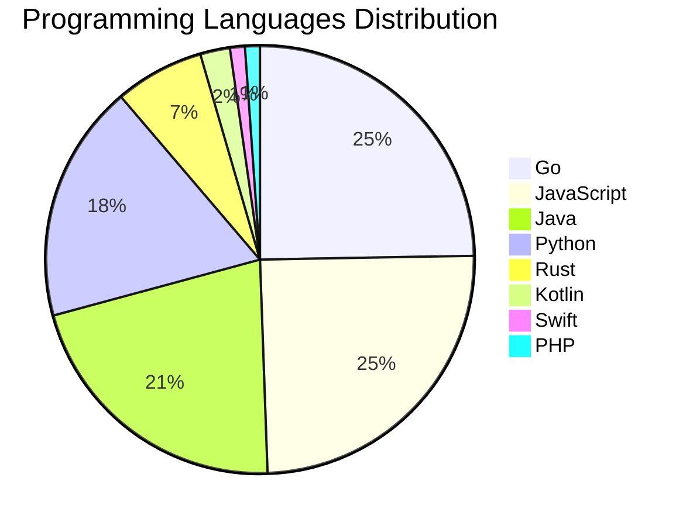

# 🚀 DevTech Auto News - Enhanced Edition


**DevTech Auto News Enhanced** is an advanced automated bot that aggregates trending topics in **AI**, **Web Development**, **Mobile**, **Cloud**, **DevOps**, and more from multiple sources including:

- 📰 [Dev.to](https://dev.to) - Developer community articles
- 🔥 [HackerNews](https://news.ycombinator.com) - Tech news discussions  
- 💻 [GitHub Trending](https://github.com/trending) - Trending repositories
- 🎯 Curated Interview Questions from multiple languages

## ✨ Features

✅ **Multi-Source Aggregation**: Combines articles from Dev.to, HackerNews, and GitHub  
✅ **Smart Categorization**: Automatically categorizes content into 10+ topics  
✅ **Image Support**: Displays cover images for visual appeal  
✅ **Pagination**: Fetches 50+ articles per update with deduplication  
✅ **Language Statistics**: Tracks programming language trends with charts  
✅ **Interview Questions**: Daily coding interview questions in multiple languages  
✅ **GitHub Actions**: Runs every 15 minutes automatically  

---

## 📊 Statistics Dashboard

### 📊 Articles by Category

**AI**: 🟦🟦🟦🟦🟦🟦🟦🟦🟦🟦🟦🟦🟦🟦🟦🟦🟦🟦🟦🟦 43 (41.0%)

**Tools**: 🟦🟦🟦🟦🟦🟦🟦🟦🟦🟦🟦🟦 26 (24.8%)

**JavaScript**: 🟦🟦🟦🟦🟦🟦🟦🟦🟦🟦 22 (21.0%)

**Python**: 🟦🟦🟦🟦🟦🟦🟦 16 (15.2%)

**Cloud**: 🟦🟦🟦🟦🟦 10 (9.5%)

**WebDev**: 🟦🟦 5 (4.8%)

**DevOps**: 🟦🟦 4 (3.8%)

**Security**: 🟦🟦 4 (3.8%)

**Mobile**: 🟦 3 (2.9%)

**Database**: 🟦 2 (1.9%)


### 📡 Sources

- **Dev.to**: 60 articles
- **HackerNews**: 30 articles
- **GitHub**: 15 articles


### 💻 Programming Language Trends

```
Go              ██████████████████████████████ 24.7 (24.7%)
JavaScript      ██████████████████████████████ 24.7 (24.7%)
Java            ██████████████████████████ 21.3 (21.3%)
Python          ██████████████████████ 18.0 (18.0%)
Rust            ████████ 6.7 (6.7%)
Kotlin          ███ 2.2 (2.2%)
Swift           █ 1.1 (1.1%)
PHP             █ 1.1 (1.1%)

```




### 🏷️ Trending Tags

               


---

## 🛠️ How It Works

1. **Multi-Source Fetch**: Pulls from Dev.to (2 pages), HackerNews (3 topics), GitHub (3 languages)
2. **Smart Filter**: Uses keyword matching across 10+ categories  
3. **Deduplication**: Removes duplicate URLs  
4. **Image Extraction**: Captures cover images when available  
5. **Statistics**: Generates language trends and category breakdowns  
6. **Update Files**: Regenerates README and appends to comprehensive log  

---

## 📦 Installation & Usage

```bash
# Clone the repository
git clone https://github.com/Derrick-MUGISHA/github-activity-bot.git
cd github-activity-bot

# Install dependencies  
npm install

# Run manually
npm start

# Test mode
npm run test
```

---


# 🚀 DevTech Auto News - Enhanced Edition

## 📅 Latest Updates (2026-05-26 22:00 CAT)


### 🖼️ Featured Articles

<table>
<tr>
  <td align="center" width="33%">
    <a href="https://dev.to/devteam/top-7-featured-dev-posts-of-the-week-45na">
      
      <br/>
      <b>Top 7 Featured DEV Posts of the Week</b>
    </a>
    <br/>
    <sub>Dev.to</sub>
  </td>
  <td align="center" width="33%">
    <a href="https://dev.to/aws/why-does-ai-forget-what-you-said-and-how-to-fix-it-52f6">
      
      <br/>
      <b>Why does AI forget what you said (and how to fix i...</b>
    </a>
    <br/>
    <sub>Dev.to</sub>
  </td>
  <td align="center" width="33%">
    <a href="https://dev.to/heyitsmarcucu/github-copilot-helped-us-cut-down-50-75-time-in-our-e-commerce-business-10l5">
      
      <br/>
      <b>Github Copilot helped us cut down 50-75% time in o...</b>
    </a>
    <br/>
    <sub>Dev.to</sub>
  </td>
</tr>
<tr>
  <td align="center" width="33%">
    <a href="https://dev.to/gde/vibe-code-all-google-apis-the-zero-trust-autonomous-agent-for-google-apps-script-jcl">
      
      <br/>
      <b>Vibe Code All Google APIs: The Zero-Trust Autonomo...</b>
    </a>
    <br/>
    <sub>Dev.to</sub>
  </td>
  <td align="center" width="33%">
    <a href="https://dev.to/obetomuniz/the-quiet-ai-war-inside-your-browser-22hd">
      
      <br/>
      <b>The Quiet AI War Inside Your Browser</b>
    </a>
    <br/>
    <sub>Dev.to</sub>
  </td>
  <td align="center" width="33%">
    <a href="https://dev.to/tracygjg/the-subtle-impact-of-ai-it-on-jobs-i55">
      
      <br/>
      <b>The subtle impact of AI (& IT) on jobs</b>
    </a>
    <br/>
    <sub>Dev.to</sub>
  </td>
</tr>
</table>


### 📰 Top Headlines

- [Top 7 Featured DEV Posts of the Week](https://dev.to/devteam/top-7-featured-dev-posts-of-the-week-45na) _[Dev.to]_
- [Why does AI forget what you said (and how to fix it)](https://dev.to/aws/why-does-ai-forget-what-you-said-and-how-to-fix-it-52f6) _[Dev.to]_
- [Github Copilot helped us cut down 50-75% time in our e-commerce business](https://dev.to/heyitsmarcucu/github-copilot-helped-us-cut-down-50-75-time-in-our-e-commerce-business-10l5) _[Dev.to]_
- [Vibe Code All Google APIs: The Zero-Trust Autonomous Agent for Google Apps Script](https://dev.to/gde/vibe-code-all-google-apis-the-zero-trust-autonomous-agent-for-google-apps-script-jcl) _[Dev.to]_
- [The Quiet AI War Inside Your Browser](https://dev.to/obetomuniz/the-quiet-ai-war-inside-your-browser-22hd) _[Dev.to]_
- [The subtle impact of AI (& IT) on jobs](https://dev.to/tracygjg/the-subtle-impact-of-ai-it-on-jobs-i55) _[Dev.to]_
- [In Defense of Manual Memory Management](https://dev.to/dayvster/in-defense-of-manual-memory-management-3jpo) _[Dev.to]_
- [How we're using Gemini Embeddings to build a smarter, community-driven feed on DEV](https://dev.to/devteam/how-were-using-gemini-embeddings-to-build-a-smarter-community-driven-feed-on-dev-1b9f) _[Dev.to]_
- [A practitioner's guide to getting more value out of AI coding: agent quality & token optimization](https://dev.to/webmaxru/a-practitioners-guide-to-getting-more-value-out-of-ai-coding-agent-quality-token-optimization-3n7j) _[Dev.to]_
- [AI Agent Governance vs IAM vs DLP vs API Gateways: What Each One Actually Covers](https://dev.to/jwilliamsr/ai-agent-governance-vs-iam-vs-dlp-vs-api-gateways-what-each-one-actually-covers-50i) _[Dev.to]_
- [Meme Monday](https://dev.to/ben/meme-monday-194f) _[Dev.to]_
- [Validating Gemma 4 for Industrial IoT: A Governance Pattern](https://dev.to/gohchunlin/validating-gemma-4-for-industrial-iot-a-governance-pattern-3d6k) _[Dev.to]_
- [Building Real-Time Apps in Node.js with Rivalis: WebSockets, Rooms, Actors, and a Binary Wire](https://dev.to/kalevski/building-real-time-apps-in-nodejs-with-rivalis-websockets-rooms-actors-and-a-binary-wire-ii9) _[Dev.to]_
- [Dual Parameter Thermal FEA Design Optimization with FEATool Multiphysics](https://dev.to/precise-simulation/dual-parameter-thermal-fea-design-optimization-with-featool-multiphysics-m67) _[Dev.to]_
- [Join the GitHub Finish-Up-A-Thon Challenge: $3,000 Prize Pool!](https://dev.to/devteam/join-the-github-finish-up-a-thon-challenge-3000-prize-pool-f41) _[Dev.to]_
- [Google I/O 2026: From Consumer to Builder](https://dev.to/michellebuchiokonicha/google-io-2026-from-consumer-to-builder-dom) _[Dev.to]_
- [jnigen and swiftgen in 2026 - some lessons learned](https://dev.to/orestesgaolin/jnigen-and-swiftgen-in-2026-some-lessons-learned-16ni) _[Dev.to]_
- [Configuring MCP Servers and Skills for Antigravity CLI and IDE](https://dev.to/gde/configuring-mcp-servers-and-skills-for-antigravity-cli-and-ide-2bh0) _[Dev.to]_
- [What was your win this week!?](https://dev.to/devteam/what-was-your-win-this-week-2ohc) _[Dev.to]_
- [OIC: From a Working Toast Watcher to a General "Watch It for Me" Agent](https://dev.to/straightly/oic-from-a-working-toast-watcher-to-a-general-watch-it-for-me-agent-2njm) _[Dev.to]_

_Last automated update: Tue, 26 May 2026 22:36:13 CAT_


## 💡 Daily Interview Questions

_Sharpen your skills with these curated questions_

### 1. SystemDesign: How would you design a rate limiter?

**Difficulty**: Medium | **Topics**: system design, algorithms

<details>
<summary>💡 Hint</summary>

Token bucket, sliding window, distributed systems

</details>

### 2. Java: What is the difference between abstract class and interface?

**Difficulty**: Easy | **Topics**: OOP, design

<details>
<summary>💡 Hint</summary>

Multiple inheritance, method implementation, use cases

</details>

### 3. JavaScript: Explain event delegation and why it's useful

**Difficulty**: Medium | **Topics**: events, DOM

<details>
<summary>💡 Hint</summary>

Event bubbling, single listener for multiple elements

</details>


---

## 📚 Resources

- [Full News Archive](./data/news_log.md) - Complete history of all fetched articles
- [Statistics JSON](./data/stats.json) - Raw statistics data
- [Categorized Data](./data/categorized.json) - Articles organized by category
- [Interview Questions](./data/interview_questions.json) - Complete question bank

---

## 🤝 Contributing

Want to add more sources, categories, or interview questions? Feel free to:

1. Fork this repository
2. Add your improvements
3. Submit a pull request

---

## 📄 License

MIT License - Feel free to use and modify!

---

<p align="center">
  <b>Last automated update: Tue, 26 May 2026 20:36:13 GMT</b><br/>
  <sub>Powered by GitHub Actions | Made with ❤️ for developers</sub>
</p>

---

## 🔗 Quick Links

- [View Workflow](https://github.com/Derrick-MUGISHA/github-activity-bot/actions)
- [Report Issue](https://github.com/Derrick-MUGISHA/github-activity-bot/issues)
- [Suggest Feature](https://github.com/Derrick-MUGISHA/github-activity-bot/issues/new)
