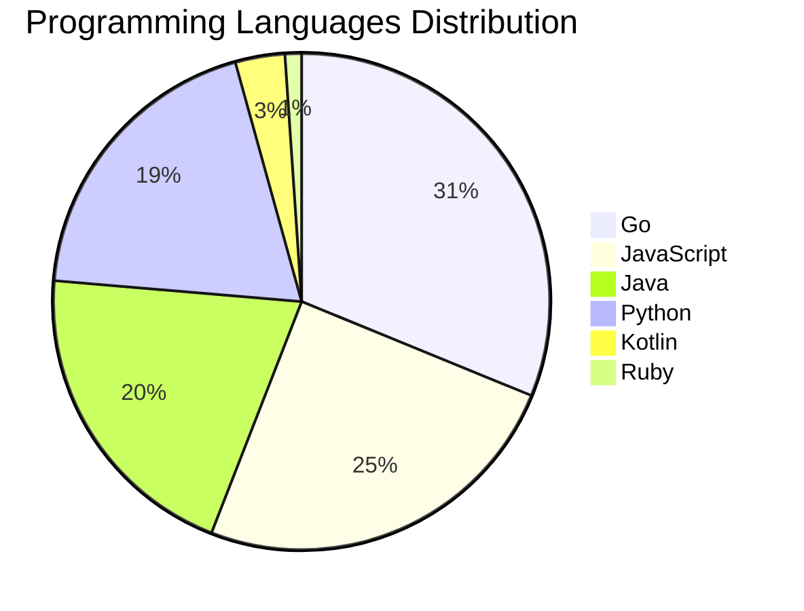

# 🚀 DevTech Auto News - Enhanced Edition


**DevTech Auto News Enhanced** is an advanced automated bot that aggregates trending topics in **AI**, **Web Development**, **Mobile**, **Cloud**, **DevOps**, and more from multiple sources including:

- 📰 [Dev.to](https://dev.to) - Developer community articles
- 🔥 [HackerNews](https://news.ycombinator.com) - Tech news discussions  
- 💻 [GitHub Trending](https://github.com/trending) - Trending repositories
- 🎯 Curated Interview Questions from multiple languages

## ✨ Features

✅ **Multi-Source Aggregation**: Combines articles from Dev.to, HackerNews, and GitHub  
✅ **Smart Categorization**: Automatically categorizes content into 10+ topics  
✅ **Image Support**: Displays cover images for visual appeal  
✅ **Pagination**: Fetches 50+ articles per update with deduplication  
✅ **Language Statistics**: Tracks programming language trends with charts  
✅ **Interview Questions**: Daily coding interview questions in multiple languages  
✅ **GitHub Actions**: Runs every 15 minutes automatically  

---

## 📊 Statistics Dashboard

### 📊 Articles by Category

**AI**: 🟦🟦🟦🟦🟦🟦🟦🟦🟦🟦🟦🟦🟦🟦🟦🟦🟦🟦🟦🟦 50 (47.6%)

**Tools**: 🟦🟦🟦🟦🟦🟦🟦🟦🟦🟦🟦 27 (25.7%)

**JavaScript**: 🟦🟦🟦🟦🟦🟦🟦🟦🟦 23 (21.9%)

**Python**: 🟦🟦🟦🟦🟦🟦🟦 18 (17.1%)

**Cloud**: 🟦🟦🟦🟦🟦🟦 16 (15.2%)

**WebDev**: 🟦🟦 5 (4.8%)

**Mobile**: 🟦🟦 5 (4.8%)

**DevOps**: 🟦🟦 4 (3.8%)

**Security**: 🟦🟦 4 (3.8%)

**Database**:  1 (1.0%)


### 📡 Sources

- **Dev.to**: 60 articles
- **HackerNews**: 30 articles
- **GitHub**: 15 articles


### 💻 Programming Language Trends

```
Go              ██████████████████████████████ 31.2 (31.2%)
JavaScript      ████████████████████████ 24.7 (24.7%)
Java            ████████████████████ 20.4 (20.4%)
Python          ███████████████████ 19.4 (19.4%)
Kotlin          ███ 3.2 (3.2%)
Ruby            █ 1.1 (1.1%)

```




### 🏷️ Trending Tags

               


---

## 🛠️ How It Works

1. **Multi-Source Fetch**: Pulls from Dev.to (2 pages), HackerNews (3 topics), GitHub (3 languages)
2. **Smart Filter**: Uses keyword matching across 10+ categories  
3. **Deduplication**: Removes duplicate URLs  
4. **Image Extraction**: Captures cover images when available  
5. **Statistics**: Generates language trends and category breakdowns  
6. **Update Files**: Regenerates README and appends to comprehensive log  

---

## 📦 Installation & Usage

```bash
# Clone the repository
git clone https://github.com/Derrick-MUGISHA/github-activity-bot.git
cd github-activity-bot

# Install dependencies  
npm install

# Run manually
npm start

# Test mode
npm run test
```

---


# 🚀 DevTech Auto News - Enhanced Edition

## 📅 Latest Updates (2026-05-04 14:00 CAT)


### 🖼️ Featured Articles

<table>
<tr>
  <td align="center" width="33%">
    <a href="https://dev.to/devteam/announcing-the-winners-of-the-dev-weekend-challenge-earth-day-edition-1n4">
      
      <br/>
      <b>Announcing the Winners of the DEV Weekend Challeng...</b>
    </a>
    <br/>
    <sub>Dev.to</sub>
  </td>
  <td align="center" width="33%">
    <a href="https://dev.to/yusukeiwaki/introducing-pytest-style-fixtures-into-ruby-for-smarter-browser-testing-lbi">
      
      <br/>
      <b>Introducing pytest-style fixtures into Ruby for sm...</b>
    </a>
    <br/>
    <sub>Dev.to</sub>
  </td>
  <td align="center" width="33%">
    <a href="https://dev.to/gde/gemini-31-native-tts-for-easier-more-powerful-summary-reading-2ep9">
      
      <br/>
      <b>Gemini 3.1: Native TTS for Easier, More Powerful S...</b>
    </a>
    <br/>
    <sub>Dev.to</sub>
  </td>
</tr>
<tr>
  <td align="center" width="33%">
    <a href="https://dev.to/edmundsparrow/i-accidentally-wrote-a-filesystem-driver-for-a-browser-53cd">
      
      <br/>
      <b>I Accidentally Wrote a Filesystem Driver. For a Br...</b>
    </a>
    <br/>
    <sub>Dev.to</sub>
  </td>
  <td align="center" width="33%">
    <a href="https://dev.to/gde/multi-agent-a2a-with-the-agent-development-kitadk-azure-functions-and-gemini-cli-5di0">
      
      <br/>
      <b>Multi-Agent A2A with the Agent Development Kit(ADK...</b>
    </a>
    <br/>
    <sub>Dev.to</sub>
  </td>
  <td align="center" width="33%">
    <a href="https://dev.to/fbritoferreira/were-shipping-more-code-than-ever-we-understand-less-of-it-93n">
      
      <br/>
      <b>We're Shipping More Code Than Ever. We Understand ...</b>
    </a>
    <br/>
    <sub>Dev.to</sub>
  </td>
</tr>
</table>


### 📰 Top Headlines

- [Announcing the Winners of the DEV Weekend Challenge: Earth Day Edition 🌍](https://dev.to/devteam/announcing-the-winners-of-the-dev-weekend-challenge-earth-day-edition-1n4) _[Dev.to]_
- [Introducing pytest-style fixtures into Ruby for smarter browser testing](https://dev.to/yusukeiwaki/introducing-pytest-style-fixtures-into-ruby-for-smarter-browser-testing-lbi) _[Dev.to]_
- [Gemini 3.1: Native TTS for Easier, More Powerful Summary Reading](https://dev.to/gde/gemini-31-native-tts-for-easier-more-powerful-summary-reading-2ep9) _[Dev.to]_
- [I Accidentally Wrote a Filesystem Driver. For a Browser. 🤔](https://dev.to/edmundsparrow/i-accidentally-wrote-a-filesystem-driver-for-a-browser-53cd) _[Dev.to]_
- [Multi-Agent A2A with the Agent Development Kit(ADK), Azure Functions, and Gemini CLI](https://dev.to/gde/multi-agent-a2a-with-the-agent-development-kitadk-azure-functions-and-gemini-cli-5di0) _[Dev.to]_
- [We're Shipping More Code Than Ever. We Understand Less of It.](https://dev.to/fbritoferreira/were-shipping-more-code-than-ever-we-understand-less-of-it-93n) _[Dev.to]_
- [Migrating from Astro 5 to Astro 6: A Real-World Breakdown 📖](https://dev.to/harshil1712/migrating-from-astro-5-to-astro-6-a-real-world-breakdown-2d0c) _[Dev.to]_
- [How Making a Fountain Pen Made Me a Better Developer](https://dev.to/simplifycomplexity/how-making-a-fountain-pen-made-me-a-better-developer-22e0) _[Dev.to]_
- [GCP in Action: Building a Persistent AI Assistant with GCE, Hermes Agent, and Telegram](https://dev.to/gde/gcp-in-action-building-a-persistent-ai-assistant-with-gce-hermes-agent-and-telegram-1mlg) _[Dev.to]_
- [Porting Libraries to Crystal with AI](https://dev.to/kojix2/porting-libraries-to-crystal-with-ai-1kl) _[Dev.to]_
- [BWAI'2026 @ VTU, Belagavi](https://dev.to/gdg/bwai2026-vtu-belagavi-1p7n) _[Dev.to]_
- [Turning Repository Knowledge Into Usable Agent Context](https://dev.to/airscript/turning-repository-knowledge-into-usable-agent-context-4pe4) _[Dev.to]_
- [Multi-Agent A2A with the Agent Development Kit(ADK), Azure App Service, and Gemini CLI](https://dev.to/gde/multi-agent-a2a-with-the-agent-development-kitadk-azure-app-service-and-gemini-cli-g8) _[Dev.to]_
- [Building Dynamic Audio with Emotion & Pace: Gemini 3.1 Flash TTS, Angular & Firebase Cloud Functions [GDE]](https://dev.to/gde/building-dynamic-audio-with-emotion-pace-gemini-31-flash-tts-angular-firebase-cloud-functions-15f8) _[Dev.to]_
- [Creating a CLI Tool with AI Agents: My Journey with kdn](https://dev.to/feloy/creating-a-cli-tool-with-ai-agents-my-journey-with-kdn-46d8) _[Dev.to]_
- [Using Gemini with OpenClaw: Setup Guide + Real Use Cases](https://dev.to/matthewrevell/using-gemini-with-openclaw-setup-guide-real-use-cases-2i48) _[Dev.to]_
- [OpenAI Tells You What You Spent. Not Where. So I Built a Dashboard.](https://dev.to/alimafana/openai-tells-you-what-you-spent-not-where-so-i-built-a-dashboard-b6) _[Dev.to]_
- [Service-to-Service Calls vs Event-Driven Flows: When to Use Which](https://dev.to/toybz/service-to-service-calls-vs-event-driven-flows-when-to-use-which-1da8) _[Dev.to]_
- [Leadership Micro Katas](https://dev.to/yrizos/leadership-micro-katas-363f) _[Dev.to]_
- [Platform-Neutral AI Tools Are the Safer Long-Term Bet](https://dev.to/mrlarson2007_62/platform-neutral-ai-tools-are-the-safer-long-term-bet-42i1) _[Dev.to]_

_Last automated update: Mon, 04 May 2026 14:05:01 CAT_


## 💡 Daily Interview Questions

_Sharpen your skills with these curated questions_

### 1. Java: What are Java Streams and how do they work?

**Difficulty**: Medium | **Topics**: functional programming, collections

<details>
<summary>💡 Hint</summary>

Lazy evaluation, pipeline, terminal operations

</details>

### 2. SystemDesign: How would you design a rate limiter?

**Difficulty**: Medium | **Topics**: system design, algorithms

<details>
<summary>💡 Hint</summary>

Token bucket, sliding window, distributed systems

</details>

### 3. Database: What is database normalization and denormalization?

**Difficulty**: Medium | **Topics**: design, optimization

<details>
<summary>💡 Hint</summary>

Normal forms, redundancy, performance trade-offs

</details>


---

## 📚 Resources

- [Full News Archive](./data/news_log.md) - Complete history of all fetched articles
- [Statistics JSON](./data/stats.json) - Raw statistics data
- [Categorized Data](./data/categorized.json) - Articles organized by category
- [Interview Questions](./data/interview_questions.json) - Complete question bank

---

## 🤝 Contributing

Want to add more sources, categories, or interview questions? Feel free to:

1. Fork this repository
2. Add your improvements
3. Submit a pull request

---

## 📄 License

MIT License - Feel free to use and modify!

---

<p align="center">
  <b>Last automated update: Mon, 04 May 2026 12:05:01 GMT</b><br/>
  <sub>Powered by GitHub Actions | Made with ❤️ for developers</sub>
</p>

---

## 🔗 Quick Links

- [View Workflow](https://github.com/Derrick-MUGISHA/github-activity-bot/actions)
- [Report Issue](https://github.com/Derrick-MUGISHA/github-activity-bot/issues)
- [Suggest Feature](https://github.com/Derrick-MUGISHA/github-activity-bot/issues/new)
