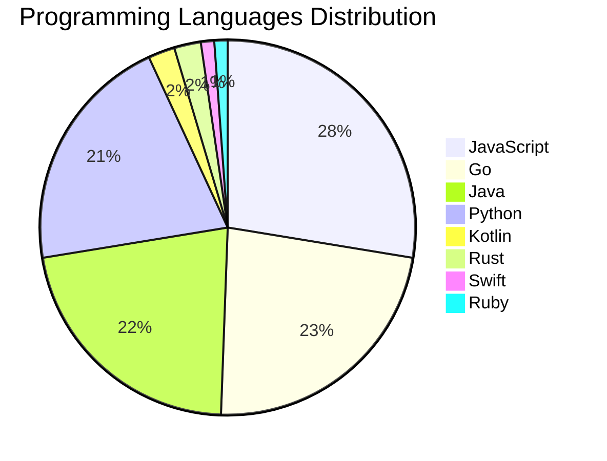

# 🚀 DevTech Auto News - Enhanced Edition


**DevTech Auto News Enhanced** is an advanced automated bot that aggregates trending topics in **AI**, **Web Development**, **Mobile**, **Cloud**, **DevOps**, and more from multiple sources including:

- 📰 [Dev.to](https://dev.to) - Developer community articles
- 🔥 [HackerNews](https://news.ycombinator.com) - Tech news discussions  
- 💻 [GitHub Trending](https://github.com/trending) - Trending repositories
- 🎯 Curated Interview Questions from multiple languages

## ✨ Features

✅ **Multi-Source Aggregation**: Combines articles from Dev.to, HackerNews, and GitHub  
✅ **Smart Categorization**: Automatically categorizes content into 10+ topics  
✅ **Image Support**: Displays cover images for visual appeal  
✅ **Pagination**: Fetches 50+ articles per update with deduplication  
✅ **Language Statistics**: Tracks programming language trends with charts  
✅ **Interview Questions**: Daily coding interview questions in multiple languages  
✅ **GitHub Actions**: Runs every 15 minutes automatically  

---

## 📊 Statistics Dashboard

### 📊 Articles by Category

**AI**: 🟦🟦🟦🟦🟦🟦🟦🟦🟦🟦🟦🟦🟦🟦🟦🟦🟦🟦🟦🟦 56 (54.4%)

**JavaScript**: 🟦🟦🟦🟦🟦🟦🟦🟦🟦 24 (23.3%)

**Tools**: 🟦🟦🟦🟦🟦🟦🟦🟦 21 (20.4%)

**Python**: 🟦🟦🟦🟦🟦🟦 18 (17.5%)

**Cloud**: 🟦🟦🟦🟦 10 (9.7%)

**DevOps**: 🟦🟦 5 (4.9%)

**Security**: 🟦🟦 5 (4.9%)

**WebDev**: 🟦 3 (2.9%)

**Database**: 🟦 3 (2.9%)

**Mobile**: 🟦 2 (1.9%)


### 📡 Sources

- **Dev.to**: 58 articles
- **HackerNews**: 30 articles
- **GitHub**: 15 articles


### 💻 Programming Language Trends

```
JavaScript      ██████████████████████████████ 27.3 (27.3%)
Go              █████████████████████████ 22.7 (22.7%)
Java            ████████████████████████ 21.6 (21.6%)
Python          ███████████████████████ 20.5 (20.5%)
Kotlin          ███ 2.3 (2.3%)
Rust            ███ 2.3 (2.3%)
Swift           █ 1.1 (1.1%)
Ruby            █ 1.1 (1.1%)
PHP             █ 1.1 (1.1%)

```




### 🏷️ Trending Tags

               


---

## 🛠️ How It Works

1. **Multi-Source Fetch**: Pulls from Dev.to (2 pages), HackerNews (3 topics), GitHub (3 languages)
2. **Smart Filter**: Uses keyword matching across 10+ categories  
3. **Deduplication**: Removes duplicate URLs  
4. **Image Extraction**: Captures cover images when available  
5. **Statistics**: Generates language trends and category breakdowns  
6. **Update Files**: Regenerates README and appends to comprehensive log  

---

## 📦 Installation & Usage

```bash
# Clone the repository
git clone https://github.com/Derrick-MUGISHA/github-activity-bot.git
cd github-activity-bot

# Install dependencies  
npm install

# Run manually
npm start

# Test mode
npm run test
```

---


# 🚀 DevTech Auto News - Enhanced Edition

## 📅 Latest Updates (2026-04-10 10:00 CAT)


### 🖼️ Featured Articles

<table>
<tr>
  <td align="center" width="33%">
    <a href="https://dev.to/sylwia-lask/youre-a-real-software-developer-only-if-2mo8">
      
      <br/>
      <b>You’re a Real Software Developer Only If…</b>
    </a>
    <br/>
    <sub>Dev.to</sub>
  </td>
  <td align="center" width="33%">
    <a href="https://dev.to/maria_from_mlh/unlocking-casual-fun-ai-powered-vibe-coding-for-quick-niche-apps-ml5">
      
      <br/>
      <b>Unlocking Casual Fun: AI-Powered 'Vibe Coding' for...</b>
    </a>
    <br/>
    <sub>Dev.to</sub>
  </td>
  <td align="center" width="33%">
    <a href="https://dev.to/devteam/top-7-featured-dev-posts-of-the-week-4idc">
      
      <br/>
      <b>Top 7 Featured DEV Posts of the Week</b>
    </a>
    <br/>
    <sub>Dev.to</sub>
  </td>
</tr>
<tr>
  <td align="center" width="33%">
    <a href="https://dev.to/googleai/on-device-ai-with-the-google-ai-edge-gallery-and-gemma-4-ena">
      
      <br/>
      <b>On-Device AI with the Google AI Edge Gallery and G...</b>
    </a>
    <br/>
    <sub>Dev.to</sub>
  </td>
  <td align="center" width="33%">
    <a href="https://dev.to/helderberto/skills-are-the-new-cli-225e">
      
      <br/>
      <b>Skills Are the New CLI</b>
    </a>
    <br/>
    <sub>Dev.to</sub>
  </td>
  <td align="center" width="33%">
    <a href="https://dev.to/polliog/tigerfs-a-filesystem-backed-by-postgresql-50i">
      
      <br/>
      <b>TigerFS: A Filesystem Backed by PostgreSQL</b>
    </a>
    <br/>
    <sub>Dev.to</sub>
  </td>
</tr>
</table>


### 📰 Top Headlines

- [You’re a Real Software Developer Only If…](https://dev.to/sylwia-lask/youre-a-real-software-developer-only-if-2mo8) _[Dev.to]_
- [Unlocking Casual Fun: AI-Powered 'Vibe Coding' for Quick, Niche Apps](https://dev.to/maria_from_mlh/unlocking-casual-fun-ai-powered-vibe-coding-for-quick-niche-apps-ml5) _[Dev.to]_
- [Top 7 Featured DEV Posts of the Week](https://dev.to/devteam/top-7-featured-dev-posts-of-the-week-4idc) _[Dev.to]_
- [On-Device AI with the Google AI Edge Gallery and Gemma 4](https://dev.to/googleai/on-device-ai-with-the-google-ai-edge-gallery-and-gemma-4-ena) _[Dev.to]_
- [Skills Are the New CLI](https://dev.to/helderberto/skills-are-the-new-cli-225e) _[Dev.to]_
- [TigerFS: A Filesystem Backed by PostgreSQL](https://dev.to/polliog/tigerfs-a-filesystem-backed-by-postgresql-50i) _[Dev.to]_
- [When Your UX Only Fits Two Sizes](https://dev.to/phalkmin/when-your-ux-only-fits-two-sizes-3a1e) _[Dev.to]_
- [The "Stateless" AI Era is a Massive Engineering Tax](https://dev.to/mlh/the-stateless-ai-era-is-a-massive-engineering-tax-49ic) _[Dev.to]_
- [Fine-Tuning Gemma 3 with Cloud Run Jobs: Serverless GPUs (NVIDIA RTX 6000 Pro) for pet breed classification 🐈🐕](https://dev.to/googleai/fine-tuning-gemma-3-with-cloud-run-jobs-serverless-gpus-nvidia-rtx-6000-pro-for-pet-breed-248b) _[Dev.to]_
- [Forem (Dev.to) is slow, so I del...optimized it.](https://dev.to/francistrdev/forem-is-slow-so-i-deleti-mean-optimized-it-bln) _[Dev.to]_
- [Master-Class: Understanding Database Replication (Single, Multi, and Leaderless)](https://dev.to/piyush6348/master-class-understanding-database-replication-single-multi-and-leaderless-hhm) _[Dev.to]_
- [Converting old home movie DVDs into a private streaming site](https://dev.to/peter/converting-old-home-movie-dvds-into-a-private-streaming-site-5bmb) _[Dev.to]_
- [Building a Multimodal Cross Cloud Live Agent with ADK, Azure AKS, and Gemini CLI](https://dev.to/gde/building-a-multimodal-cross-cloud-live-agent-with-adk-azure-aks-and-gemini-cli-5g9j) _[Dev.to]_
- [Mastering Error Handling in Go](https://dev.to/adi73/mastering-error-handling-in-go-400g) _[Dev.to]_
- [I Built a 1.6M-Parameter Offline Text-to-Speech Engine for Node.js — Here's How](https://dev.to/tronghieuit/i-built-a-16m-parameter-offline-text-to-speech-engine-for-nodejs-heres-how-3dp8) _[Dev.to]_
- [Handling missing dict keys, revisited](https://dev.to/wangonya/handling-missing-dict-keys-revisited-4n53) _[Dev.to]_
- [EU Compliance, Programmable: The API That Turns 19 EU Regulations Into JSON](https://dev.to/sofianehamlaoui/eu-compliance-programmable-the-api-that-turns-19-eu-regulations-into-json-21m) _[Dev.to]_
- [Who's Al and Where's Webfont Legibility?](https://dev.to/ingosteinke/whos-al-and-wheres-webfont-legibility-4h7n) _[Dev.to]_
- [How I Save $1,463 per Month Using Claude Code as My Server Admin](https://dev.to/bennycode/how-i-save-1463-per-month-using-claude-code-as-my-server-admin-1pdb) _[Dev.to]_
- [Clawshier OpenClaw Skill](https://dev.to/fdocr/clawshier-openclaw-skill-l1n) _[Dev.to]_

_Last automated update: Fri, 10 Apr 2026 10:25:00 CAT_


## 💡 Daily Interview Questions

_Sharpen your skills with these curated questions_

### 1. Python: What are generators and when would you use them?

**Difficulty**: Medium | **Topics**: iterators, memory

<details>
<summary>💡 Hint</summary>

yield keyword, lazy evaluation, memory efficiency

</details>

### 2. React: What is the Virtual DOM and how does React use it?

**Difficulty**: Easy | **Topics**: rendering, performance

<details>
<summary>💡 Hint</summary>

Diffing algorithm, reconciliation, efficiency

</details>

### 3. NodeJS: Explain middleware in Express.js

**Difficulty**: Easy | **Topics**: express, architecture

<details>
<summary>💡 Hint</summary>

Request/response cycle, next(), chain of functions

</details>


---

## 📚 Resources

- [Full News Archive](./data/news_log.md) - Complete history of all fetched articles
- [Statistics JSON](./data/stats.json) - Raw statistics data
- [Categorized Data](./data/categorized.json) - Articles organized by category
- [Interview Questions](./data/interview_questions.json) - Complete question bank

---

## 🤝 Contributing

Want to add more sources, categories, or interview questions? Feel free to:

1. Fork this repository
2. Add your improvements
3. Submit a pull request

---

## 📄 License

MIT License - Feel free to use and modify!

---

<p align="center">
  <b>Last automated update: Fri, 10 Apr 2026 08:25:00 GMT</b><br/>
  <sub>Powered by GitHub Actions | Made with ❤️ for developers</sub>
</p>

---

## 🔗 Quick Links

- [View Workflow](https://github.com/Derrick-MUGISHA/github-activity-bot/actions)
- [Report Issue](https://github.com/Derrick-MUGISHA/github-activity-bot/issues)
- [Suggest Feature](https://github.com/Derrick-MUGISHA/github-activity-bot/issues/new)
