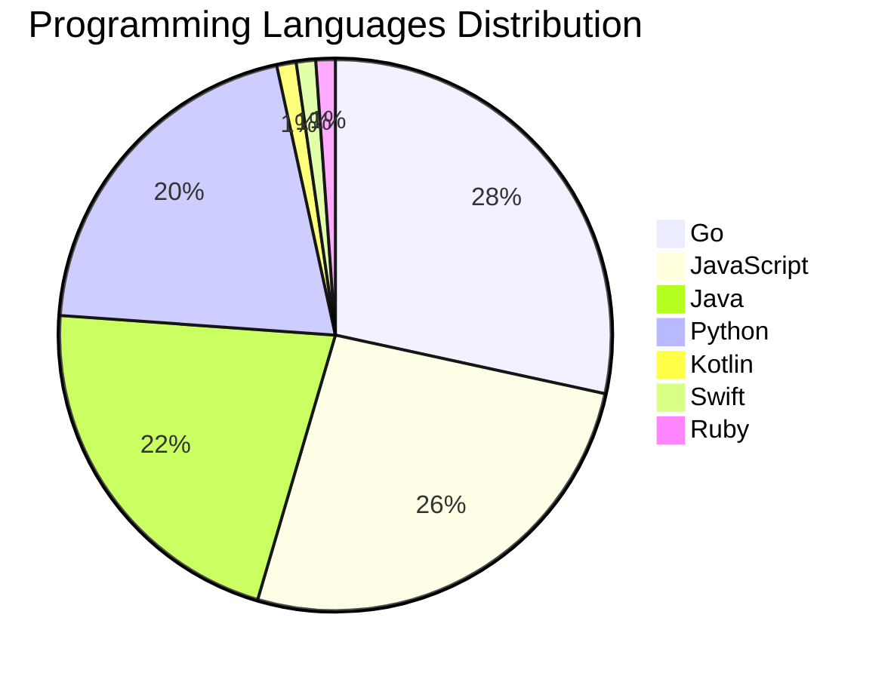

# 🚀 DevTech Auto News - Enhanced Edition


**DevTech Auto News Enhanced** is an advanced automated bot that aggregates trending topics in **AI**, **Web Development**, **Mobile**, **Cloud**, **DevOps**, and more from multiple sources including:

- 📰 [Dev.to](https://dev.to) - Developer community articles
- 🔥 [HackerNews](https://news.ycombinator.com) - Tech news discussions  
- 💻 [GitHub Trending](https://github.com/trending) - Trending repositories
- 🎯 Curated Interview Questions from multiple languages

## ✨ Features

✅ **Multi-Source Aggregation**: Combines articles from Dev.to, HackerNews, and GitHub  
✅ **Smart Categorization**: Automatically categorizes content into 10+ topics  
✅ **Image Support**: Displays cover images for visual appeal  
✅ **Pagination**: Fetches 50+ articles per update with deduplication  
✅ **Language Statistics**: Tracks programming language trends with charts  
✅ **Interview Questions**: Daily coding interview questions in multiple languages  
✅ **GitHub Actions**: Runs every 15 minutes automatically  

---

## 📊 Statistics Dashboard

### 📊 Articles by Category

**AI**: 🟦🟦🟦🟦🟦🟦🟦🟦🟦🟦🟦🟦🟦🟦🟦🟦🟦🟦🟦🟦 53 (50.5%)

**Tools**: 🟦🟦🟦🟦🟦🟦🟦🟦🟦 24 (22.9%)

**JavaScript**: 🟦🟦🟦🟦🟦🟦🟦🟦🟦 23 (21.9%)

**Python**: 🟦🟦🟦🟦🟦🟦🟦 18 (17.1%)

**Cloud**: 🟦🟦🟦🟦🟦🟦 17 (16.2%)

**Security**: 🟦🟦🟦 7 (6.7%)

**DevOps**: 🟦🟦 5 (4.8%)

**WebDev**: 🟦🟦 5 (4.8%)

**Mobile**: 🟦 2 (1.9%)

**Database**:  1 (1.0%)


### 📡 Sources

- **Dev.to**: 60 articles
- **HackerNews**: 30 articles
- **GitHub**: 15 articles


### 💻 Programming Language Trends

```
Go              ██████████████████████████████ 28.4 (28.4%)
JavaScript      ████████████████████████████ 26.1 (26.1%)
Java            ███████████████████████ 21.6 (21.6%)
Python          ██████████████████████ 20.5 (20.5%)
Kotlin          █ 1.1 (1.1%)
Swift           █ 1.1 (1.1%)
Ruby            █ 1.1 (1.1%)

```




### 🏷️ Trending Tags

               


---

## 🛠️ How It Works

1. **Multi-Source Fetch**: Pulls from Dev.to (2 pages), HackerNews (3 topics), GitHub (3 languages)
2. **Smart Filter**: Uses keyword matching across 10+ categories  
3. **Deduplication**: Removes duplicate URLs  
4. **Image Extraction**: Captures cover images when available  
5. **Statistics**: Generates language trends and category breakdowns  
6. **Update Files**: Regenerates README and appends to comprehensive log  

---

## 📦 Installation & Usage

```bash
# Clone the repository
git clone https://github.com/Derrick-MUGISHA/github-activity-bot.git
cd github-activity-bot

# Install dependencies  
npm install

# Run manually
npm start

# Test mode
npm run test
```

---


# 🚀 DevTech Auto News - Enhanced Edition

## 📅 Latest Updates (2026-04-18 23:00 CAT)


### 🖼️ Featured Articles

<table>
<tr>
  <td align="center" width="33%">
    <a href="https://dev.to/devteam/what-was-your-win-this-week-28fb">
      
      <br/>
      <b>What was your win this week?!</b>
    </a>
    <br/>
    <sub>Dev.to</sub>
  </td>
  <td align="center" width="33%">
    <a href="https://dev.to/devteam/join-our-dev-weekend-challenge-1000-in-prizes-across-ten-winners-submissions-due-april-20-at-47i1">
      
      <br/>
      <b>Join our DEV Weekend Challenge — $1,000 in Prizes ...</b>
    </a>
    <br/>
    <sub>Dev.to</sub>
  </td>
  <td align="center" width="33%">
    <a href="https://dev.to/devteam/congrats-to-the-notion-mcp-challenge-winners-28ab">
      
      <br/>
      <b>Congrats to the Notion MCP Challenge Winners!</b>
    </a>
    <br/>
    <sub>Dev.to</sub>
  </td>
</tr>
<tr>
  <td align="center" width="33%">
    <a href="https://dev.to/devteam/congrats-to-the-2026-wecoded-challenge-winners-2pee">
      
      <br/>
      <b>Congrats to the 2026 WeCoded Challenge Winners!</b>
    </a>
    <br/>
    <sub>Dev.to</sub>
  </td>
  <td align="center" width="33%">
    <a href="https://dev.to/missamarakay/what-brings-you-by-a-conference-booth-43e3">
      
      <br/>
      <b>What brings you by a conference booth?</b>
    </a>
    <br/>
    <sub>Dev.to</sub>
  </td>
  <td align="center" width="33%">
    <a href="https://dev.to/maxmoffa/android-desktop-mode-features-device-support-and-the-oled-screen-burn-in-problem-5a40">
      
      <br/>
      <b>Android desktop mode: features, device support, an...</b>
    </a>
    <br/>
    <sub>Dev.to</sub>
  </td>
</tr>
</table>


### 📰 Top Headlines

- [What was your win this week?!](https://dev.to/devteam/what-was-your-win-this-week-28fb) _[Dev.to]_
- [Join our DEV Weekend Challenge — $1,000 in Prizes Across TEN winners! Submissions Due April 20 at 6:59 AM UTC.](https://dev.to/devteam/join-our-dev-weekend-challenge-1000-in-prizes-across-ten-winners-submissions-due-april-20-at-47i1) _[Dev.to]_
- [Congrats to the Notion MCP Challenge Winners!](https://dev.to/devteam/congrats-to-the-notion-mcp-challenge-winners-28ab) _[Dev.to]_
- [Congrats to the 2026 WeCoded Challenge Winners!](https://dev.to/devteam/congrats-to-the-2026-wecoded-challenge-winners-2pee) _[Dev.to]_
- [What brings you by a conference booth?](https://dev.to/missamarakay/what-brings-you-by-a-conference-booth-43e3) _[Dev.to]_
- [Android desktop mode: features, device support, and the OLED screen burn-in problem](https://dev.to/maxmoffa/android-desktop-mode-features-device-support-and-the-oled-screen-burn-in-problem-5a40) _[Dev.to]_
- [AI Doesn't Fix Weak Engineering. It Just Speeds It Up.](https://dev.to/jonoherrington/ai-doesnt-fix-weak-engineering-it-just-speeds-it-up-5bak) _[Dev.to]_
- [Join the OpenClaw Challenge: $1,200 Prize Pool!](https://dev.to/devteam/join-the-openclaw-challenge-1200-prize-pool-5682) _[Dev.to]_
- [GheiaGrid: Reimagining Decentralized Urban Farming & Carbon Mining](https://dev.to/kheai/gheiagrid-reimagining-decentralized-urban-farming-carbon-mining-934) _[Dev.to]_
- [Intro to tc Cloud Functors: A Graph-First Mental Model for the Modern Cloud](https://dev.to/functors/intro-to-tc-cloud-functors-a-graph-first-mental-model-for-the-modern-cloud-3o17) _[Dev.to]_
- [🌍 Deep-Time Mirror: An AI Lens into Our Ecological Soul For Earth Day Edition.](https://dev.to/sushan_shetty_5ebec41a67d/deep-time-mirror-an-ai-lens-into-our-ecological-soul-for-earth-day-edition-1846) _[Dev.to]_
- [Less Than Six Hours From Idea to Dev Release: Building a new Drupal Canvas SDC Module With AI, Deliberately](https://dev.to/jcandan/i-built-a-new-drupal-canvas-sdc-module-with-ai-in-under-6-hours-and-the-review-process-still-59b8) _[Dev.to]_
- [Multi-Agent A2A with the Agent Development Kit(ADK), Amazon ECS Express, and Gemini CLI](https://dev.to/gde/multi-agent-a2a-with-the-agent-development-kitadk-amazon-ecs-express-and-gemini-cli-1gcl) _[Dev.to]_
- [Multi-Agent A2A with the Agent Development Kit(ADK), Azure ACA, and Gemini CLI](https://dev.to/gde/multi-agent-a2a-with-the-agent-development-kitadk-azure-aca-and-gemini-cli-m15) _[Dev.to]_
- [Don't be mad, BMAD instead](https://dev.to/basteez/dont-be-mad-bmad-instead-3d4i) _[Dev.to]_
- [Embarrassment is cheap. Token spend isn't.](https://dev.to/jon_at_backboardio/embarrassment-is-cheap-token-spend-isnt-40b3) _[Dev.to]_
- [Our SwiftUI snapshot tests passed locally but failed on CI. Here's the actual fix.](https://dev.to/d4g4/our-swiftui-snapshot-tests-passed-locally-but-failed-on-ci-heres-the-actual-fix-5fhd) _[Dev.to]_
- [Display and test openapi.yaml file](https://dev.to/gabrielweidmann/display-and-test-openapiyaml-file-53h9) _[Dev.to]_
- [Schrödinger's Backup: If You Haven't Tested a Restore, You Don't Have a Backup](https://dev.to/hugovalters/schrodingers-backup-if-you-havent-tested-a-restore-you-dont-have-a-backup-1d53) _[Dev.to]_
- [Claude skills vs Commands](https://dev.to/hellonehha/claude-skills-vs-commands-1dcm) _[Dev.to]_

_Last automated update: Sat, 18 Apr 2026 23:17:42 CAT_


## 💡 Daily Interview Questions

_Sharpen your skills with these curated questions_

### 1. React: What are hooks and why were they introduced?

**Difficulty**: Medium | **Topics**: hooks, functional components

<details>
<summary>💡 Hint</summary>

State in functional components, reusable logic, cleaner code

</details>

### 2. React: Explain the difference between state and props

**Difficulty**: Easy | **Topics**: data flow, components

<details>
<summary>💡 Hint</summary>

Ownership, mutability, data flow direction

</details>

### 3. DataStructures: Implement a function to reverse a linked list

**Difficulty**: Medium | **Topics**: linked lists, pointers

<details>
<summary>💡 Hint</summary>

Iterative or recursive, three pointers

</details>


---

## 📚 Resources

- [Full News Archive](./data/news_log.md) - Complete history of all fetched articles
- [Statistics JSON](./data/stats.json) - Raw statistics data
- [Categorized Data](./data/categorized.json) - Articles organized by category
- [Interview Questions](./data/interview_questions.json) - Complete question bank

---

## 🤝 Contributing

Want to add more sources, categories, or interview questions? Feel free to:

1. Fork this repository
2. Add your improvements
3. Submit a pull request

---

## 📄 License

MIT License - Feel free to use and modify!

---

<p align="center">
  <b>Last automated update: Sat, 18 Apr 2026 21:17:42 GMT</b><br/>
  <sub>Powered by GitHub Actions | Made with ❤️ for developers</sub>
</p>

---

## 🔗 Quick Links

- [View Workflow](https://github.com/Derrick-MUGISHA/github-activity-bot/actions)
- [Report Issue](https://github.com/Derrick-MUGISHA/github-activity-bot/issues)
- [Suggest Feature](https://github.com/Derrick-MUGISHA/github-activity-bot/issues/new)
