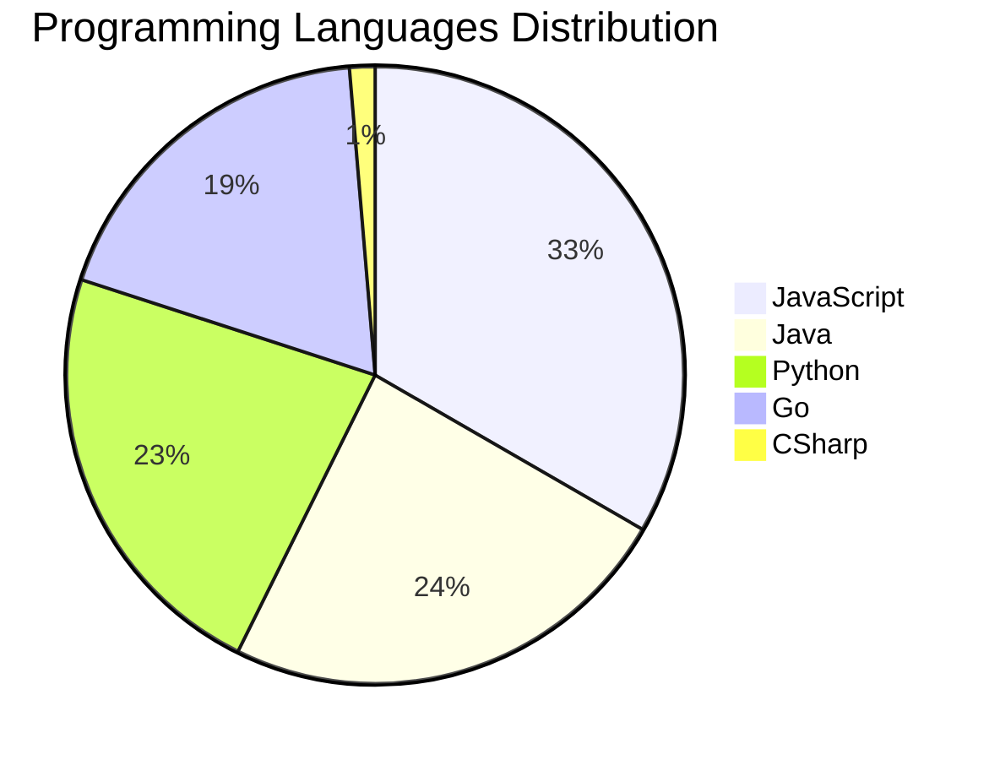

# 🚀 DevTech Auto News - Enhanced Edition


**DevTech Auto News Enhanced** is an advanced automated bot that aggregates trending topics in **AI**, **Web Development**, **Mobile**, **Cloud**, **DevOps**, and more from multiple sources including:

- 📰 [Dev.to](https://dev.to) - Developer community articles
- 🔥 [HackerNews](https://news.ycombinator.com) - Tech news discussions  
- 💻 [GitHub Trending](https://github.com/trending) - Trending repositories
- 🎯 Curated Interview Questions from multiple languages

## ✨ Features

✅ **Multi-Source Aggregation**: Combines articles from Dev.to, HackerNews, and GitHub  
✅ **Smart Categorization**: Automatically categorizes content into 10+ topics  
✅ **Image Support**: Displays cover images for visual appeal  
✅ **Pagination**: Fetches 50+ articles per update with deduplication  
✅ **Language Statistics**: Tracks programming language trends with charts  
✅ **Interview Questions**: Daily coding interview questions in multiple languages  
✅ **GitHub Actions**: Runs every 15 minutes automatically  

---

## 📊 Statistics Dashboard

### 📊 Articles by Category

**AI**: 🟦🟦🟦🟦🟦🟦🟦🟦🟦🟦🟦🟦🟦🟦🟦🟦🟦🟦🟦🟦 47 (44.8%)

**Tools**: 🟦🟦🟦🟦🟦🟦🟦🟦🟦🟦🟦🟦🟦🟦 33 (31.4%)

**JavaScript**: 🟦🟦🟦🟦🟦🟦🟦🟦🟦🟦🟦 25 (23.8%)

**Python**: 🟦🟦🟦🟦🟦🟦🟦 17 (16.2%)

**WebDev**: 🟦🟦🟦🟦 10 (9.5%)

**Database**: 🟦🟦 5 (4.8%)

**DevOps**: 🟦🟦 4 (3.8%)

**Cloud**: 🟦 3 (2.9%)

**Security**: 🟦 2 (1.9%)

**Mobile**:  1 (1.0%)


### 📡 Sources

- **Dev.to**: 60 articles
- **HackerNews**: 30 articles
- **GitHub**: 15 articles


### 💻 Programming Language Trends

```
JavaScript      ██████████████████████████████ 33.3 (33.3%)
Java            ██████████████████████ 24.0 (24.0%)
Python          ████████████████████ 22.7 (22.7%)
Go              █████████████████ 18.7 (18.7%)
CSharp          █ 1.3 (1.3%)

```




### 🏷️ Trending Tags

               


---

## 🛠️ How It Works

1. **Multi-Source Fetch**: Pulls from Dev.to (2 pages), HackerNews (3 topics), GitHub (3 languages)
2. **Smart Filter**: Uses keyword matching across 10+ categories  
3. **Deduplication**: Removes duplicate URLs  
4. **Image Extraction**: Captures cover images when available  
5. **Statistics**: Generates language trends and category breakdowns  
6. **Update Files**: Regenerates README and appends to comprehensive log  

---

## 📦 Installation & Usage

```bash
# Clone the repository
git clone https://github.com/Derrick-MUGISHA/github-activity-bot.git
cd github-activity-bot

# Install dependencies  
npm install

# Run manually
npm start

# Test mode
npm run test
```

---


# 🚀 DevTech Auto News - Enhanced Edition

## 📅 Latest Updates (2026-03-09 19:00 CAT)


### 🖼️ Featured Articles

<table>
<tr>
  <td align="center" width="33%">
    <a href="https://dev.to/devteam/join-the-2026-wecoded-challenge-and-celebrate-underrepresented-voices-in-tech-through-writing--4828">
      
      <br/>
      <b>Join the 2026 WeCoded Challenge and Celebrate Unde...</b>
    </a>
    <br/>
    <sub>Dev.to</sub>
  </td>
  <td align="center" width="33%">
    <a href="https://dev.to/nickytonline/let-dependabot-merge-its-own-prs-27pc">
      
      <br/>
      <b>Let Dependabot Merge Its Own PRs</b>
    </a>
    <br/>
    <sub>Dev.to</sub>
  </td>
  <td align="center" width="33%">
    <a href="https://dev.to/devteam/revamped-rss-feed-imports-3j1e">
      
      <br/>
      <b>Revamped RSS Feed Imports</b>
    </a>
    <br/>
    <sub>Dev.to</sub>
  </td>
</tr>
<tr>
  <td align="center" width="33%">
    <a href="https://dev.to/grahamthedev/3-words-worth-a-billion-dollars-drift-to-determinism-dride-dej">
      
      <br/>
      <b>3 words worth a billion dollars: Drift to Determin...</b>
    </a>
    <br/>
    <sub>Dev.to</sub>
  </td>
  <td align="center" width="33%">
    <a href="https://dev.to/konark_13/the-women-who-helped-me-grow-as-a-developer-40f6">
      
      <br/>
      <b>The Women Who Helped Me Grow as a Developer</b>
    </a>
    <br/>
    <sub>Dev.to</sub>
  </td>
  <td align="center" width="33%">
    <a href="https://dev.to/ben/meme-monday-2676">
      
      <br/>
      <b>Meme Monday</b>
    </a>
    <br/>
    <sub>Dev.to</sub>
  </td>
</tr>
</table>


### 📰 Top Headlines

- [Join the 2026 WeCoded Challenge and Celebrate Underrepresented Voices in Tech Through Writing & Frontend Art 🎨!](https://dev.to/devteam/join-the-2026-wecoded-challenge-and-celebrate-underrepresented-voices-in-tech-through-writing--4828) _[Dev.to]_
- [Let Dependabot Merge Its Own PRs](https://dev.to/nickytonline/let-dependabot-merge-its-own-prs-27pc) _[Dev.to]_
- [Revamped RSS Feed Imports](https://dev.to/devteam/revamped-rss-feed-imports-3j1e) _[Dev.to]_
- [3 words worth a billion dollars: Drift to Determinism (DriDe)](https://dev.to/grahamthedev/3-words-worth-a-billion-dollars-drift-to-determinism-dride-dej) _[Dev.to]_
- [The Women Who Helped Me Grow as a Developer](https://dev.to/konark_13/the-women-who-helped-me-grow-as-a-developer-40f6) _[Dev.to]_
- [Meme Monday](https://dev.to/ben/meme-monday-2676) _[Dev.to]_
- [Native TypeScript with Node](https://dev.to/timoschinkel/native-typescript-with-node-4d93) _[Dev.to]_
- [I Planned an Exit Strategy. I Stayed the Whole Time.](https://dev.to/earlgreyhot1701d/i-planned-an-exit-strategy-i-stayed-the-whole-time-4ejh) _[Dev.to]_
- [AI Regression Tests Written in Markdown, Not Code](https://dev.to/hybridtechie/ai-regression-tests-written-in-markdown-not-code-5b09) _[Dev.to]_
- [What was your win this week?](https://dev.to/devteam/what-was-your-win-this-week-1m96) _[Dev.to]_
- [Can AI Generate Binary Directly? Is It Feasible? Does It Make Sense?](https://dev.to/georgekobaidze/can-ai-generate-binary-directly-is-it-feasible-does-it-make-sense-b62) _[Dev.to]_
- [Ship Less, Measure More](https://dev.to/snowman647/ship-less-measure-more-58m4) _[Dev.to]_
- [Breaking Free from the Render Cycle: Event-Driven Frontend Architecture](https://dev.to/ishanbagchi/breaking-free-from-the-render-cycle-event-driven-frontend-architecture-2a8e) _[Dev.to]_
- [From Overwhelmed Team Lead to AI Orchestrator: How I Took Back Control of My Dev Life](https://dev.to/themeticulist/from-overwhelmed-team-lead-to-ai-orchestrator-how-i-took-back-control-of-my-dev-life-16gj) _[Dev.to]_
- [Recently Played: bringing back my Last.fm component](https://dev.to/martinhicks/recently-played-bringing-back-my-lastfm-component-2ank) _[Dev.to]_
- [Decisions, Decisions -- Thoughts on making architectural decisions](https://dev.to/alexandermchan/decisions-decisions-thoughts-on-making-architectural-decisions-2bol) _[Dev.to]_
- [I Deleted Pinecone, Redis, and 400 Lines of Python. My RAG Pipeline Still Works.](https://dev.to/zeybek/i-deleted-pinecone-redis-and-400-lines-of-python-my-rag-pipeline-still-works-5dh3) _[Dev.to]_
- [Why Shift+Enter doesn't work in Claude Code (and how to fix it)](https://dev.to/richardbray/why-shiftenter-doesnt-work-in-claude-code-and-how-to-fix-it-10f7) _[Dev.to]_
- [The Silent Behavioral Shift: Why GPT-5.4 Exposes the UI's Fragile Dependence on Backend Semantics](https://dev.to/sovereignrevenueguard/the-silent-behavioral-shift-why-gpt-54-exposes-the-uis-fragile-dependence-on-backend-semantics-1lkl) _[Dev.to]_
- [How Do You Actually Know If AI Is Working On Your Team?](https://dev.to/dionysos/how-do-you-actually-know-if-ai-is-working-on-your-team-2b02) _[Dev.to]_

_Last automated update: Mon, 09 Mar 2026 19:10:00 CAT_


## 💡 Daily Interview Questions

_Sharpen your skills with these curated questions_

### 1. DataStructures: Implement LRU Cache

**Difficulty**: Hard | **Topics**: design, hash map, linked list

<details>
<summary>💡 Hint</summary>

Doubly linked list + hash map, O(1) operations

</details>

### 2. JavaScript: Implement a debounce function from scratch

**Difficulty**: Hard | **Topics**: functions, timing

<details>
<summary>💡 Hint</summary>

setTimeout, clearTimeout, wrapper function

</details>

### 3. DataStructures: Implement a function to reverse a linked list

**Difficulty**: Medium | **Topics**: linked lists, pointers

<details>
<summary>💡 Hint</summary>

Iterative or recursive, three pointers

</details>


---

## 📚 Resources

- [Full News Archive](./data/news_log.md) - Complete history of all fetched articles
- [Statistics JSON](./data/stats.json) - Raw statistics data
- [Categorized Data](./data/categorized.json) - Articles organized by category
- [Interview Questions](./data/interview_questions.json) - Complete question bank

---

## 🤝 Contributing

Want to add more sources, categories, or interview questions? Feel free to:

1. Fork this repository
2. Add your improvements
3. Submit a pull request

---

## 📄 License

MIT License - Feel free to use and modify!

---

<p align="center">
  <b>Last automated update: Mon, 09 Mar 2026 17:10:00 GMT</b><br/>
  <sub>Powered by GitHub Actions | Made with ❤️ for developers</sub>
</p>

---

## 🔗 Quick Links

- [View Workflow](https://github.com/Derrick-MUGISHA/github-activity-bot/actions)
- [Report Issue](https://github.com/Derrick-MUGISHA/github-activity-bot/issues)
- [Suggest Feature](https://github.com/Derrick-MUGISHA/github-activity-bot/issues/new)
