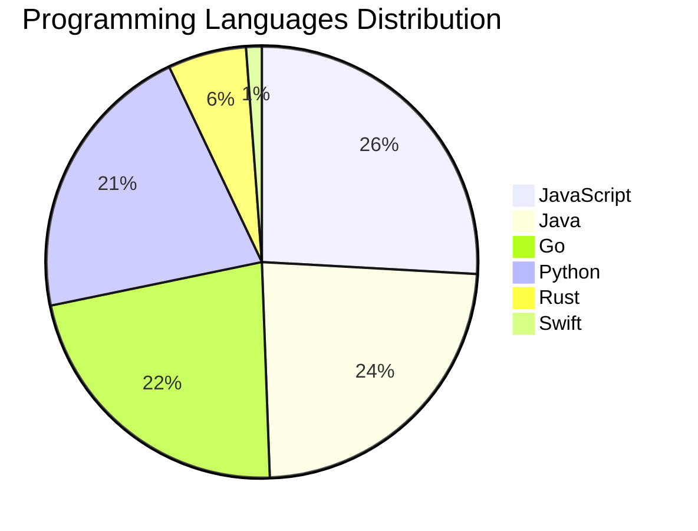

# 🚀 DevTech Auto News - Enhanced Edition


**DevTech Auto News Enhanced** is an advanced automated bot that aggregates trending topics in **AI**, **Web Development**, **Mobile**, **Cloud**, **DevOps**, and more from multiple sources including:

- 📰 [Dev.to](https://dev.to) - Developer community articles
- 🔥 [HackerNews](https://news.ycombinator.com) - Tech news discussions  
- 💻 [GitHub Trending](https://github.com/trending) - Trending repositories
- 🎯 Curated Interview Questions from multiple languages

## ✨ Features

✅ **Multi-Source Aggregation**: Combines articles from Dev.to, HackerNews, and GitHub  
✅ **Smart Categorization**: Automatically categorizes content into 10+ topics  
✅ **Image Support**: Displays cover images for visual appeal  
✅ **Pagination**: Fetches 50+ articles per update with deduplication  
✅ **Language Statistics**: Tracks programming language trends with charts  
✅ **Interview Questions**: Daily coding interview questions in multiple languages  
✅ **GitHub Actions**: Runs every 15 minutes automatically  

---

## 📊 Statistics Dashboard

### 📊 Articles by Category

**AI**: 🟦🟦🟦🟦🟦🟦🟦🟦🟦🟦🟦🟦🟦🟦🟦🟦🟦🟦🟦🟦 62 (59.0%)

**Tools**: 🟦🟦🟦🟦🟦🟦🟦🟦 26 (24.8%)

**JavaScript**: 🟦🟦🟦🟦🟦🟦🟦 22 (21.0%)

**Python**: 🟦🟦🟦🟦🟦🟦 18 (17.1%)

**Cloud**: 🟦🟦🟦🟦 11 (10.5%)

**Security**: 🟦🟦🟦 8 (7.6%)

**DevOps**: 🟦🟦 5 (4.8%)

**WebDev**: 🟦 3 (2.9%)

**Database**: 🟦 2 (1.9%)

**Mobile**:  1 (1.0%)


### 📡 Sources

- **Dev.to**: 60 articles
- **HackerNews**: 30 articles
- **GitHub**: 15 articles


### 💻 Programming Language Trends

```
JavaScript      ██████████████████████████████ 25.9 (25.9%)
Java            ███████████████████████████ 23.5 (23.5%)
Go              ██████████████████████████ 22.4 (22.4%)
Python          █████████████████████████ 21.2 (21.2%)
Rust            ███████ 5.9 (5.9%)
Swift           █ 1.2 (1.2%)

```




### 🏷️ Trending Tags

               


---

## 🛠️ How It Works

1. **Multi-Source Fetch**: Pulls from Dev.to (2 pages), HackerNews (3 topics), GitHub (3 languages)
2. **Smart Filter**: Uses keyword matching across 10+ categories  
3. **Deduplication**: Removes duplicate URLs  
4. **Image Extraction**: Captures cover images when available  
5. **Statistics**: Generates language trends and category breakdowns  
6. **Update Files**: Regenerates README and appends to comprehensive log  

---

## 📦 Installation & Usage

```bash
# Clone the repository
git clone https://github.com/Derrick-MUGISHA/github-activity-bot.git
cd github-activity-bot

# Install dependencies  
npm install

# Run manually
npm start

# Test mode
npm run test
```

---


# 🚀 DevTech Auto News - Enhanced Edition

## 📅 Latest Updates (2026-07-01 20:00 CAT)


### 🖼️ Featured Articles

<table>
<tr>
  <td align="center" width="33%">
    <a href="https://dev.to/devteam/need-a-break-play-todays-game-from-the-daily-context-1fli">
      
      <br/>
      <b>Need a break? Play today's game from The Daily Con...</b>
    </a>
    <br/>
    <sub>Dev.to</sub>
  </td>
  <td align="center" width="33%">
    <a href="https://dev.to/dailycontext/from-harness-engineering-to-evals-4212">
      
      <br/>
      <b>From Harness Engineering to Evals: What’s Trending...</b>
    </a>
    <br/>
    <sub>Dev.to</sub>
  </td>
  <td align="center" width="33%">
    <a href="https://dev.to/sylwia-lask/whats-next-for-ai-219i">
      
      <br/>
      <b>What's Next for AI?</b>
    </a>
    <br/>
    <sub>Dev.to</sub>
  </td>
</tr>
<tr>
  <td align="center" width="33%">
    <a href="https://dev.to/devteam/top-7-featured-dev-posts-of-the-week-18mk">
      
      <br/>
      <b>Top 7 Featured DEV Posts of the Week</b>
    </a>
    <br/>
    <sub>Dev.to</sub>
  </td>
  <td align="center" width="33%">
    <a href="https://dev.to/dannwaneri/someone-else-pays-for-your-ai-access-5149">
      
      <br/>
      <b>Someone Else Pays for Your AI Access</b>
    </a>
    <br/>
    <sub>Dev.to</sub>
  </td>
  <td align="center" width="33%">
    <a href="https://dev.to/dailycontext/its-time-to-put-humans-back-in-the-software-factories-3cjh">
      
      <br/>
      <b>It’s Time To Put Humans Back In The Software</b>
    </a>
    <br/>
    <sub>Dev.to</sub>
  </td>
</tr>
</table>


### 📰 Top Headlines

- [Need a break? Play today's game from The Daily Context.](https://dev.to/devteam/need-a-break-play-todays-game-from-the-daily-context-1fli) _[Dev.to]_
- [From Harness Engineering to Evals: What’s Trending at AI Engineer](https://dev.to/dailycontext/from-harness-engineering-to-evals-4212) _[Dev.to]_
- [What's Next for AI?](https://dev.to/sylwia-lask/whats-next-for-ai-219i) _[Dev.to]_
- [Top 7 Featured DEV Posts of the Week](https://dev.to/devteam/top-7-featured-dev-posts-of-the-week-18mk) _[Dev.to]_
- [Someone Else Pays for Your AI Access](https://dev.to/dannwaneri/someone-else-pays-for-your-ai-access-5149) _[Dev.to]_
- [It’s Time To Put Humans Back In The Software](https://dev.to/dailycontext/its-time-to-put-humans-back-in-the-software-factories-3cjh) _[Dev.to]_
- [AI Engineer Meets AI Engineer](https://dev.to/dailycontext/ai-engineer-meets-ai-engineer-1klj) _[Dev.to]_
- [Play today’s game from Issue #2 of The Daily Context!](https://dev.to/devteam/play-todays-game-from-issue-2-of-the-daily-context-epf) _[Dev.to]_
- [Gemma and sandboxing cause a stir at the World's Fair](https://dev.to/dailycontext/gemma-the-epstein-files-and-sandboxing-cause-a-stir-at-the-worlds-fair-2a7p) _[Dev.to]_
- [The Log Is the Agent](https://dev.to/dailycontext/the-log-is-the-agent-5096) _[Dev.to]_
- [Bottleneck Resolution is, In Fact, All the Rage in AI Engineering](https://dev.to/dailycontext/bottleneck-resolution-is-in-fact-all-the-rage-in-ai-engineering-21cj) _[Dev.to]_
- [Token Town](https://dev.to/dailycontext/token-town-1c45) _[Dev.to]_
- [The Agentic, Ironclad Onion](https://dev.to/dailycontext/the-agentic-ironclad-onion-2na9) _[Dev.to]_
- [Welcome to AI Engineer World’s Fair 2026](https://dev.to/dailycontext/welcome-to-ai-engineer-worlds-fair-2026-2o09) _[Dev.to]_
- [You Don’t Always Need The Frontier](https://dev.to/dailycontext/you-dont-always-need-the-frontier-1k8o) _[Dev.to]_
- [Optimizing for Agents with llms.txt](https://dev.to/dailycontext/optimizing-for-agents-with-llmstxt-14l0) _[Dev.to]_
- [Computer Use Is Still The Best Demo In AI. That’s A Problem.](https://dev.to/dailycontext/computer-use-is-still-the-best-demo-in-ai-thats-a-problem-1bep) _[Dev.to]_
- [AI is going loopy, but in a good way](https://dev.to/dailycontext/ai-is-going-loopy-but-in-a-good-way-3mi) _[Dev.to]_
- [DevRel in the Age of AI Is A Search for Meaning](https://dev.to/dailycontext/devrel-in-the-age-of-ai-is-a-search-for-meaning-2j91) _[Dev.to]_
- [AI Isn't Ready to Build Complex Software](https://dev.to/dailycontext/ai-isnt-ready-to-build-complex-software-3jho) _[Dev.to]_

_Last automated update: Wed, 01 Jul 2026 20:23:07 CAT_


## 💡 Daily Interview Questions

_Sharpen your skills with these curated questions_

### 1. React: How would you optimize a React app's performance?

**Difficulty**: Hard | **Topics**: optimization, performance

<details>
<summary>💡 Hint</summary>

React.memo, useMemo, useCallback, code splitting, lazy loading

</details>

### 2. DataStructures: Find the longest substring without repeating characters

**Difficulty**: Medium | **Topics**: strings, sliding window

<details>
<summary>💡 Hint</summary>

Sliding window, hash map, two pointers

</details>

### 3. React: How would you optimize a React app's performance?

**Difficulty**: Hard | **Topics**: optimization, performance

<details>
<summary>💡 Hint</summary>

React.memo, useMemo, useCallback, code splitting, lazy loading

</details>


---

## 📚 Resources

- [Full News Archive](./data/news_log.md) - Complete history of all fetched articles
- [Statistics JSON](./data/stats.json) - Raw statistics data
- [Categorized Data](./data/categorized.json) - Articles organized by category
- [Interview Questions](./data/interview_questions.json) - Complete question bank

---

## 🤝 Contributing

Want to add more sources, categories, or interview questions? Feel free to:

1. Fork this repository
2. Add your improvements
3. Submit a pull request

---

## 📄 License

MIT License - Feel free to use and modify!

---

<p align="center">
  <b>Last automated update: Wed, 01 Jul 2026 18:23:07 GMT</b><br/>
  <sub>Powered by GitHub Actions | Made with ❤️ for developers</sub>
</p>

---

## 🔗 Quick Links

- [View Workflow](https://github.com/Derrick-MUGISHA/github-activity-bot/actions)
- [Report Issue](https://github.com/Derrick-MUGISHA/github-activity-bot/issues)
- [Suggest Feature](https://github.com/Derrick-MUGISHA/github-activity-bot/issues/new)
