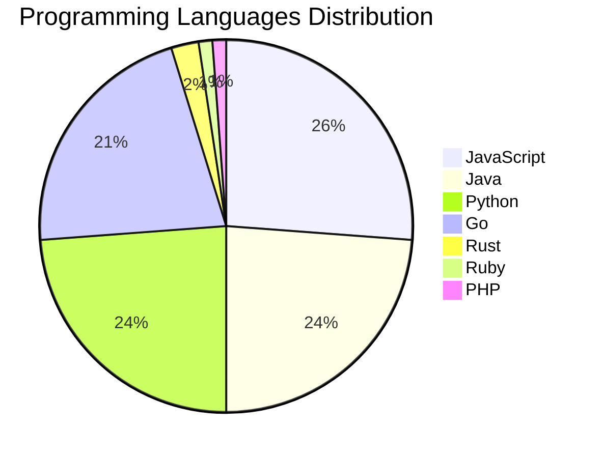

# 🚀 DevTech Auto News - Enhanced Edition


**DevTech Auto News Enhanced** is an advanced automated bot that aggregates trending topics in **AI**, **Web Development**, **Mobile**, **Cloud**, **DevOps**, and more from multiple sources including:

- 📰 [Dev.to](https://dev.to) - Developer community articles
- 🔥 [HackerNews](https://news.ycombinator.com) - Tech news discussions  
- 💻 [GitHub Trending](https://github.com/trending) - Trending repositories
- 🎯 Curated Interview Questions from multiple languages

## ✨ Features

✅ **Multi-Source Aggregation**: Combines articles from Dev.to, HackerNews, and GitHub  
✅ **Smart Categorization**: Automatically categorizes content into 10+ topics  
✅ **Image Support**: Displays cover images for visual appeal  
✅ **Pagination**: Fetches 50+ articles per update with deduplication  
✅ **Language Statistics**: Tracks programming language trends with charts  
✅ **Interview Questions**: Daily coding interview questions in multiple languages  
✅ **GitHub Actions**: Runs every 15 minutes automatically  

---

## 📊 Statistics Dashboard

### 📊 Articles by Category

**AI**: 🟦🟦🟦🟦🟦🟦🟦🟦🟦🟦🟦🟦🟦🟦🟦🟦🟦🟦🟦🟦 56 (53.3%)

**Tools**: 🟦🟦🟦🟦🟦🟦🟦🟦🟦 24 (22.9%)

**JavaScript**: 🟦🟦🟦🟦🟦🟦🟦🟦 22 (21.0%)

**Python**: 🟦🟦🟦🟦🟦🟦🟦 20 (19.0%)

**Cloud**: 🟦🟦🟦🟦 10 (9.5%)

**DevOps**: 🟦🟦 5 (4.8%)

**Security**: 🟦🟦 5 (4.8%)

**WebDev**: 🟦 4 (3.8%)

**Database**: 🟦 2 (1.9%)


### 📡 Sources

- **Dev.to**: 60 articles
- **HackerNews**: 30 articles
- **GitHub**: 15 articles


### 💻 Programming Language Trends

```
JavaScript      ██████████████████████████████ 26.2 (26.2%)
Java            ███████████████████████████ 23.8 (23.8%)
Python          ███████████████████████████ 23.8 (23.8%)
Go              █████████████████████████ 21.4 (21.4%)
Rust            ███ 2.4 (2.4%)
Ruby            █ 1.2 (1.2%)
PHP             █ 1.2 (1.2%)

```




### 🏷️ Trending Tags

               


---

## 🛠️ How It Works

1. **Multi-Source Fetch**: Pulls from Dev.to (2 pages), HackerNews (3 topics), GitHub (3 languages)
2. **Smart Filter**: Uses keyword matching across 10+ categories  
3. **Deduplication**: Removes duplicate URLs  
4. **Image Extraction**: Captures cover images when available  
5. **Statistics**: Generates language trends and category breakdowns  
6. **Update Files**: Regenerates README and appends to comprehensive log  

---

## 📦 Installation & Usage

```bash
# Clone the repository
git clone https://github.com/Derrick-MUGISHA/github-activity-bot.git
cd github-activity-bot

# Install dependencies  
npm install

# Run manually
npm start

# Test mode
npm run test
```

---


# 🚀 DevTech Auto News - Enhanced Edition

## 📅 Latest Updates (2026-04-09 15:00 CAT)


### 🖼️ Featured Articles

<table>
<tr>
  <td align="center" width="33%">
    <a href="https://dev.to/peter/converting-old-home-movie-dvds-into-a-private-streaming-site-5bmb">
      
      <br/>
      <b>Converting old home movie DVDs into a private stre...</b>
    </a>
    <br/>
    <sub>Dev.to</sub>
  </td>
  <td align="center" width="33%">
    <a href="https://dev.to/ingosteinke/whos-al-and-wheres-webfont-legibility-4h7n">
      
      <br/>
      <b>Who's Al and Where's Webfont Legibility?</b>
    </a>
    <br/>
    <sub>Dev.to</sub>
  </td>
  <td align="center" width="33%">
    <a href="https://dev.to/devteam/top-7-featured-dev-posts-of-the-week-4idc">
      
      <br/>
      <b>Top 7 Featured DEV Posts of the Week</b>
    </a>
    <br/>
    <sub>Dev.to</sub>
  </td>
</tr>
<tr>
  <td align="center" width="33%">
    <a href="https://dev.to/fdocr/clawshier-openclaw-skill-l1n">
      
      <br/>
      <b>Clawshier OpenClaw Skill</b>
    </a>
    <br/>
    <sub>Dev.to</sub>
  </td>
  <td align="center" width="33%">
    <a href="https://dev.to/francistrdev/forem-is-slow-so-i-deleti-mean-optimized-it-bln">
      
      <br/>
      <b>Forem (Dev.to) is slow, so I del...optimized it.</b>
    </a>
    <br/>
    <sub>Dev.to</sub>
  </td>
  <td align="center" width="33%">
    <a href="https://dev.to/gde/running-agentic-ai-at-scale-on-google-kubernetes-engine-2540">
      
      <br/>
      <b>Running Agentic AI at Scale on Google Kubernetes E...</b>
    </a>
    <br/>
    <sub>Dev.to</sub>
  </td>
</tr>
</table>


### 📰 Top Headlines

- [Converting old home movie DVDs into a private streaming site](https://dev.to/peter/converting-old-home-movie-dvds-into-a-private-streaming-site-5bmb) _[Dev.to]_
- [Who's Al and Where's Webfont Legibility?](https://dev.to/ingosteinke/whos-al-and-wheres-webfont-legibility-4h7n) _[Dev.to]_
- [Top 7 Featured DEV Posts of the Week](https://dev.to/devteam/top-7-featured-dev-posts-of-the-week-4idc) _[Dev.to]_
- [Clawshier OpenClaw Skill](https://dev.to/fdocr/clawshier-openclaw-skill-l1n) _[Dev.to]_
- [Forem (Dev.to) is slow, so I del...optimized it.](https://dev.to/francistrdev/forem-is-slow-so-i-deleti-mean-optimized-it-bln) _[Dev.to]_
- [Running Agentic AI at Scale on Google Kubernetes Engine](https://dev.to/gde/running-agentic-ai-at-scale-on-google-kubernetes-engine-2540) _[Dev.to]_
- [Master-Class: Understanding Database Replication (Single, Multi, and Leaderless)](https://dev.to/piyush6348/master-class-understanding-database-replication-single-multi-and-leaderless-hhm) _[Dev.to]_
- [Building a Multimodal Cross Cloud Live Agent with ADK, Azure AKS, and Gemini CLI](https://dev.to/gde/building-a-multimodal-cross-cloud-live-agent-with-adk-azure-aks-and-gemini-cli-5g9j) _[Dev.to]_
- [How I Save $1,463 per Month Using Claude Code as My Server Admin](https://dev.to/bennycode/how-i-save-1463-per-month-using-claude-code-as-my-server-admin-1pdb) _[Dev.to]_
- [Monitoring Sheet Changes with SHEET and SHEETS Functions on Google Sheets](https://dev.to/gde/monitoring-sheet-changes-with-sheet-and-sheets-functions-on-google-sheets-19dc) _[Dev.to]_
- [AS’ HTCPCP AI Butler™ — The AI That Brews Chaos, Not Coffee 418% Chaos: Your Useless AI Butler](https://dev.to/asamaes/as-htcpcp-ai-butler-the-ai-that-brews-chaos-not-coffee-418-chaos-your-useless-ai-butler-18m0) _[Dev.to]_
- [Deploying ADK Agents on Azure Kubernates Service (AKS)](https://dev.to/gde/deploying-adk-agents-on-azure-kubernates-service-aks-1lpf) _[Dev.to]_
- [I Analyzed AI Coding Mistakes and Built an ESLint Plugin to Catch Them](https://dev.to/pertrai1/i-analyzed-500-ai-coding-mistakes-and-built-an-eslint-plugin-to-catch-them-jme) _[Dev.to]_
- [What are your goals for the week? #173](https://dev.to/jarvisscript/what-are-your-goals-for-the-week-173-597n) _[Dev.to]_
- [Join our April Fools Challenge for a chance at TEA-RRIFIC prizes!!!](https://dev.to/devteam/join-our-april-fools-challenge-for-a-chance-at-tea-rrific-prizes-1ofa) _[Dev.to]_
- [Beyond Pixels: How Modern Emails Embed the Same Identifier Everywhere](https://dev.to/wadco/beyond-pixels-how-modern-emails-embed-the-same-identifier-everywhere-4228) _[Dev.to]_
- [Sharing CodePen 2.0 demos on DEV](https://dev.to/alvaromontoro/sharing-codepen-20-demos-on-dev-273) _[Dev.to]_
- [New Site, Who Dis?](https://dev.to/robearlam/new-site-who-dis-592h) _[Dev.to]_
- [Using AI Agents to Debug Distributed Systems in Under a Minute](https://dev.to/tomasmaiorino/using-ai-agents-to-debug-distributed-systems-in-under-a-minute-4j20) _[Dev.to]_
- [How to start self-hosting with Coolify 4 on a VPS](https://dev.to/serpapi/how-to-start-self-hosting-with-coolify-4-on-a-vps-44ob) _[Dev.to]_

_Last automated update: Thu, 09 Apr 2026 15:18:54 CAT_


## 💡 Daily Interview Questions

_Sharpen your skills with these curated questions_

### 1. JavaScript: Explain event delegation and why it's useful

**Difficulty**: Medium | **Topics**: events, DOM

<details>
<summary>💡 Hint</summary>

Event bubbling, single listener for multiple elements

</details>

### 2. DataStructures: Find the longest substring without repeating characters

**Difficulty**: Medium | **Topics**: strings, sliding window

<details>
<summary>💡 Hint</summary>

Sliding window, hash map, two pointers

</details>

### 3. Database: Explain database indexing and when to use it

**Difficulty**: Medium | **Topics**: optimization, performance

<details>
<summary>💡 Hint</summary>

B-tree, trade-offs, query performance

</details>


---

## 📚 Resources

- [Full News Archive](./data/news_log.md) - Complete history of all fetched articles
- [Statistics JSON](./data/stats.json) - Raw statistics data
- [Categorized Data](./data/categorized.json) - Articles organized by category
- [Interview Questions](./data/interview_questions.json) - Complete question bank

---

## 🤝 Contributing

Want to add more sources, categories, or interview questions? Feel free to:

1. Fork this repository
2. Add your improvements
3. Submit a pull request

---

## 📄 License

MIT License - Feel free to use and modify!

---

<p align="center">
  <b>Last automated update: Thu, 09 Apr 2026 13:18:54 GMT</b><br/>
  <sub>Powered by GitHub Actions | Made with ❤️ for developers</sub>
</p>

---

## 🔗 Quick Links

- [View Workflow](https://github.com/Derrick-MUGISHA/github-activity-bot/actions)
- [Report Issue](https://github.com/Derrick-MUGISHA/github-activity-bot/issues)
- [Suggest Feature](https://github.com/Derrick-MUGISHA/github-activity-bot/issues/new)
