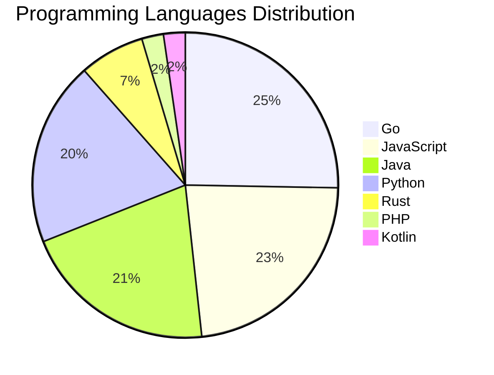

# 🚀 DevTech Auto News - Enhanced Edition


**DevTech Auto News Enhanced** is an advanced automated bot that aggregates trending topics in **AI**, **Web Development**, **Mobile**, **Cloud**, **DevOps**, and more from multiple sources including:

- 📰 [Dev.to](https://dev.to) - Developer community articles
- 🔥 [HackerNews](https://news.ycombinator.com) - Tech news discussions  
- 💻 [GitHub Trending](https://github.com/trending) - Trending repositories
- 🎯 Curated Interview Questions from multiple languages

## ✨ Features

✅ **Multi-Source Aggregation**: Combines articles from Dev.to, HackerNews, and GitHub  
✅ **Smart Categorization**: Automatically categorizes content into 10+ topics  
✅ **Image Support**: Displays cover images for visual appeal  
✅ **Pagination**: Fetches 50+ articles per update with deduplication  
✅ **Language Statistics**: Tracks programming language trends with charts  
✅ **Interview Questions**: Daily coding interview questions in multiple languages  
✅ **GitHub Actions**: Runs every 15 minutes automatically  

---

## 📊 Statistics Dashboard

### 📊 Articles by Category

**AI**: 🟦🟦🟦🟦🟦🟦🟦🟦🟦🟦🟦🟦🟦🟦🟦🟦🟦🟦🟦🟦 47 (44.8%)

**Tools**: 🟦🟦🟦🟦🟦🟦🟦🟦🟦🟦 24 (22.9%)

**JavaScript**: 🟦🟦🟦🟦🟦🟦🟦🟦🟦 20 (19.0%)

**Python**: 🟦🟦🟦🟦🟦🟦🟦 17 (16.2%)

**Cloud**: 🟦🟦🟦🟦 10 (9.5%)

**DevOps**: 🟦🟦 4 (3.8%)

**WebDev**: 🟦🟦 4 (3.8%)

**Mobile**: 🟦 2 (1.9%)

**Database**: 🟦 2 (1.9%)

**Security**: 🟦 2 (1.9%)


### 📡 Sources

- **Dev.to**: 60 articles
- **HackerNews**: 30 articles
- **GitHub**: 15 articles


### 💻 Programming Language Trends

```
Go              ██████████████████████████████ 25.3 (25.3%)
JavaScript      ███████████████████████████ 23.0 (23.0%)
Java            █████████████████████████ 20.7 (20.7%)
Python          ███████████████████████ 19.5 (19.5%)
Rust            ████████ 6.9 (6.9%)
PHP             ███ 2.3 (2.3%)
Kotlin          ███ 2.3 (2.3%)

```




### 🏷️ Trending Tags

               


---

## 🛠️ How It Works

1. **Multi-Source Fetch**: Pulls from Dev.to (2 pages), HackerNews (3 topics), GitHub (3 languages)
2. **Smart Filter**: Uses keyword matching across 10+ categories  
3. **Deduplication**: Removes duplicate URLs  
4. **Image Extraction**: Captures cover images when available  
5. **Statistics**: Generates language trends and category breakdowns  
6. **Update Files**: Regenerates README and appends to comprehensive log  

---

## 📦 Installation & Usage

```bash
# Clone the repository
git clone https://github.com/Derrick-MUGISHA/github-activity-bot.git
cd github-activity-bot

# Install dependencies  
npm install

# Run manually
npm start

# Test mode
npm run test
```

---


# 🚀 DevTech Auto News - Enhanced Edition

## 📅 Latest Updates (2026-05-21 10:00 CAT)


### 🖼️ Featured Articles

<table>
<tr>
  <td align="center" width="33%">
    <a href="https://dev.to/gde/google-io-2026-day-1-live-from-the-front-row-52ji">
      
      <br/>
      <b>Google I/O 2026 - Day 1 - Live from the Front Row</b>
    </a>
    <br/>
    <sub>Dev.to</sub>
  </td>
  <td align="center" width="33%">
    <a href="https://dev.to/denerfernandes/i-decided-to-build-a-kubernetes-alternative-yes-i-know-im-crazy-21b5">
      
      <br/>
      <b>I decided to build a Kubernetes alternative. Yes, ...</b>
    </a>
    <br/>
    <sub>Dev.to</sub>
  </td>
  <td align="center" width="33%">
    <a href="https://dev.to/valeriavg/great-little-software-rackula-1pa1">
      
      <br/>
      <b>Great Little Software: Rackula</b>
    </a>
    <br/>
    <sub>Dev.to</sub>
  </td>
</tr>
<tr>
  <td align="center" width="33%">
    <a href="https://dev.to/michellebuchiokonicha/google-io-2026-from-consumer-to-builder-dom">
      
      <br/>
      <b>Google I/O 2026: From Consumer to Builder</b>
    </a>
    <br/>
    <sub>Dev.to</sub>
  </td>
  <td align="center" width="33%">
    <a href="https://dev.to/sann3/my-6-year-old-asks-400-questions-a-day-so-i-built-him-a-gemma-4-ai-tutor-1e13">
      
      <br/>
      <b>My 6-year-old asks 400 questions a day. So I built...</b>
    </a>
    <br/>
    <sub>Dev.to</sub>
  </td>
  <td align="center" width="33%">
    <a href="https://dev.to/1412601/your-story-local-gemma-4-interactive-fiction-that-remembers-your-choices-43d5">
      
      <br/>
      <b>Your Story: Local Gemma 4 Interactive Fiction That...</b>
    </a>
    <br/>
    <sub>Dev.to</sub>
  </td>
</tr>
</table>


### 📰 Top Headlines

- [Google I/O 2026 - Day 1 - Live from the Front Row](https://dev.to/gde/google-io-2026-day-1-live-from-the-front-row-52ji) _[Dev.to]_
- [I decided to build a Kubernetes alternative. Yes, I know I'm crazy](https://dev.to/denerfernandes/i-decided-to-build-a-kubernetes-alternative-yes-i-know-im-crazy-21b5) _[Dev.to]_
- [Great Little Software: Rackula](https://dev.to/valeriavg/great-little-software-rackula-1pa1) _[Dev.to]_
- [Google I/O 2026: From Consumer to Builder](https://dev.to/michellebuchiokonicha/google-io-2026-from-consumer-to-builder-dom) _[Dev.to]_
- [My 6-year-old asks 400 questions a day. So I built him a Gemma 4 AI tutor.](https://dev.to/sann3/my-6-year-old-asks-400-questions-a-day-so-i-built-him-a-gemma-4-ai-tutor-1e13) _[Dev.to]_
- [Your Story: Local Gemma 4 Interactive Fiction That Remembers Your Choices](https://dev.to/1412601/your-story-local-gemma-4-interactive-fiction-that-remembers-your-choices-43d5) _[Dev.to]_
- [Building a Rust A2A Agent](https://dev.to/gde/building-a-rust-a2a-agent-4626) _[Dev.to]_
- [Drow.js: A Practical Look at the Tiny Web Components Library](https://dev.to/johnfacey/drowjs-a-practical-look-at-the-tiny-web-components-library-3mb9) _[Dev.to]_
- [Found a Coordinated GitHub Follow Botnet Hiding in My Followers?](https://dev.to/gnomeman4201/i-found-a-coordinated-github-follow-botnet-hiding-in-my-followers-kgl) _[Dev.to]_
- [Scaling Intelligence Workshop: Google NYC, Thursday, May 28th 🚀](https://dev.to/googleai/scaling-intelligence-workshop-google-nyc-thursday-may-28th-5cpk) _[Dev.to]_
- [3 takeaways from the IO '26 developer keynote](https://dev.to/googleai/3-takeaways-from-the-io-26-developer-keynote-11b2) _[Dev.to]_
- [Understanding Correlation in PHP: Pearson vs Spearman vs Kendall Tau](https://dev.to/robertobutti/understanding-correlation-in-php-pearson-vs-spearman-vs-kendall-tau-28m1) _[Dev.to]_
- [Google Cloud & Claude Code workshop - 5/29 in SF, CA.](https://dev.to/googleai/google-cloud-claude-code-workshop-529-in-sf-ca-4k87) _[Dev.to]_
- [Some Notes on OMO Orchestrator Claude Alternatives](https://dev.to/tythos/some-notes-on-omo-orchestrator-claude-alternatives-1a7c) _[Dev.to]_
- [Building a Local-First Hotel Receptionist with Gemma 4, GGUF, and llama.cpp](https://dev.to/chuanman2707/building-a-local-first-hotel-receptionist-with-gemma-4-gguf-and-llamacpp-51a4) _[Dev.to]_
- [Genkit Middleware: Intercept, Extend and Harden your Gen AI Pipelines](https://dev.to/gde/genkit-middleware-intercept-extend-and-harden-your-gen-ai-pipelines-4k03) _[Dev.to]_
- [I built a free debugger because Next.js 16 'use cache' was completely invisible during development](https://dev.to/shubhradev/i-built-a-free-debugger-because-nextjs-16-use-cache-was-completely-invisible-during-development-4a8) _[Dev.to]_
- [Giving AI agents knowledge they were never trained on](https://dev.to/jgauffin/giving-ai-agents-knowledge-they-were-never-trained-on-5fd7) _[Dev.to]_
- [vLLM Gemma4 26B Tuning on v6e-4](https://dev.to/gde/vllm-gemma4-26b-tuning-on-v6e-4-79o) _[Dev.to]_
- [Deploying a Rust MCP Server to Amazon Lambda with Gemini CLI](https://dev.to/gde/deploying-a-rust-mcp-server-to-amazon-lambda-with-gemini-cli-41hd) _[Dev.to]_

_Last automated update: Thu, 21 May 2026 10:21:09 CAT_


## 💡 Daily Interview Questions

_Sharpen your skills with these curated questions_

### 1. Database: Explain database indexing and when to use it

**Difficulty**: Medium | **Topics**: optimization, performance

<details>
<summary>💡 Hint</summary>

B-tree, trade-offs, query performance

</details>

### 2. NodeJS: What is the difference between process.nextTick() and setImmediate()?

**Difficulty**: Medium | **Topics**: event loop, async

<details>
<summary>💡 Hint</summary>

Execution timing, event loop phases

</details>

### 3. JavaScript: Explain event delegation and why it's useful

**Difficulty**: Medium | **Topics**: events, DOM

<details>
<summary>💡 Hint</summary>

Event bubbling, single listener for multiple elements

</details>


---

## 📚 Resources

- [Full News Archive](./data/news_log.md) - Complete history of all fetched articles
- [Statistics JSON](./data/stats.json) - Raw statistics data
- [Categorized Data](./data/categorized.json) - Articles organized by category
- [Interview Questions](./data/interview_questions.json) - Complete question bank

---

## 🤝 Contributing

Want to add more sources, categories, or interview questions? Feel free to:

1. Fork this repository
2. Add your improvements
3. Submit a pull request

---

## 📄 License

MIT License - Feel free to use and modify!

---

<p align="center">
  <b>Last automated update: Thu, 21 May 2026 08:21:09 GMT</b><br/>
  <sub>Powered by GitHub Actions | Made with ❤️ for developers</sub>
</p>

---

## 🔗 Quick Links

- [View Workflow](https://github.com/Derrick-MUGISHA/github-activity-bot/actions)
- [Report Issue](https://github.com/Derrick-MUGISHA/github-activity-bot/issues)
- [Suggest Feature](https://github.com/Derrick-MUGISHA/github-activity-bot/issues/new)
