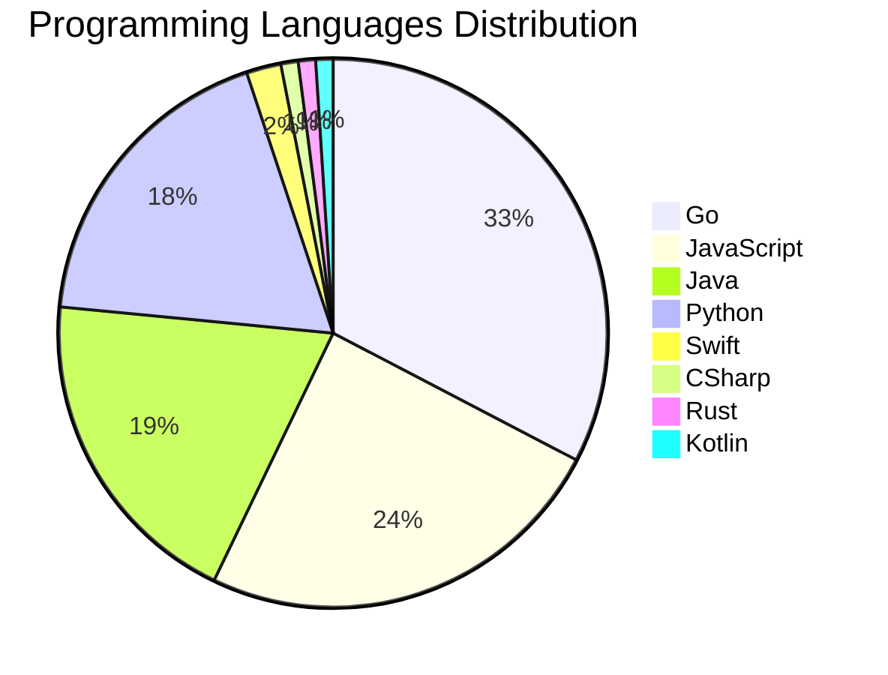

# 🚀 DevTech Auto News - Enhanced Edition


**DevTech Auto News Enhanced** is an advanced automated bot that aggregates trending topics in **AI**, **Web Development**, **Mobile**, **Cloud**, **DevOps**, and more from multiple sources including:

- 📰 [Dev.to](https://dev.to) - Developer community articles
- 🔥 [HackerNews](https://news.ycombinator.com) - Tech news discussions  
- 💻 [GitHub Trending](https://github.com/trending) - Trending repositories
- 🎯 Curated Interview Questions from multiple languages

## ✨ Features

✅ **Multi-Source Aggregation**: Combines articles from Dev.to, HackerNews, and GitHub  
✅ **Smart Categorization**: Automatically categorizes content into 10+ topics  
✅ **Image Support**: Displays cover images for visual appeal  
✅ **Pagination**: Fetches 50+ articles per update with deduplication  
✅ **Language Statistics**: Tracks programming language trends with charts  
✅ **Interview Questions**: Daily coding interview questions in multiple languages  
✅ **GitHub Actions**: Runs every 15 minutes automatically  

---

## 📊 Statistics Dashboard

### 📊 Articles by Category

**AI**: 🟦🟦🟦🟦🟦🟦🟦🟦🟦🟦🟦🟦🟦🟦🟦🟦🟦🟦🟦🟦 53 (50.5%)

**JavaScript**: 🟦🟦🟦🟦🟦🟦🟦🟦🟦 24 (22.9%)

**Tools**: 🟦🟦🟦🟦🟦🟦🟦🟦🟦 23 (21.9%)

**Python**: 🟦🟦🟦🟦🟦🟦🟦 18 (17.1%)

**Cloud**: 🟦🟦🟦 9 (8.6%)

**WebDev**: 🟦🟦🟦 7 (6.7%)

**DevOps**: 🟦🟦 4 (3.8%)

**Security**: 🟦🟦 4 (3.8%)

**Mobile**: 🟦 3 (2.9%)

**Database**: 🟦 2 (1.9%)


### 📡 Sources

- **Dev.to**: 60 articles
- **HackerNews**: 30 articles
- **GitHub**: 15 articles


### 💻 Programming Language Trends

```
Go              ██████████████████████████████ 32.7 (32.7%)
JavaScript      ██████████████████████ 24.5 (24.5%)
Java            ██████████████████ 19.4 (19.4%)
Python          █████████████████ 18.4 (18.4%)
Swift           ██ 2.0 (2.0%)
CSharp          █ 1.0 (1.0%)
Rust            █ 1.0 (1.0%)
Kotlin          █ 1.0 (1.0%)

```




### 🏷️ Trending Tags

               


---

## 🛠️ How It Works

1. **Multi-Source Fetch**: Pulls from Dev.to (2 pages), HackerNews (3 topics), GitHub (3 languages)
2. **Smart Filter**: Uses keyword matching across 10+ categories  
3. **Deduplication**: Removes duplicate URLs  
4. **Image Extraction**: Captures cover images when available  
5. **Statistics**: Generates language trends and category breakdowns  
6. **Update Files**: Regenerates README and appends to comprehensive log  

---

## 📦 Installation & Usage

```bash
# Clone the repository
git clone https://github.com/Derrick-MUGISHA/github-activity-bot.git
cd github-activity-bot

# Install dependencies  
npm install

# Run manually
npm start

# Test mode
npm run test
```

---


# 🚀 DevTech Auto News - Enhanced Edition

## 📅 Latest Updates (2026-06-17 4:00 CAT)


### 🖼️ Featured Articles

<table>
<tr>
  <td align="center" width="33%">
    <a href="https://dev.to/devteam/top-7-featured-dev-posts-of-the-week-1h65">
      
      <br/>
      <b>Top 7 Featured DEV Posts of the Week</b>
    </a>
    <br/>
    <sub>Dev.to</sub>
  </td>
  <td align="center" width="33%">
    <a href="https://dev.to/devteam/how-we-saved-big-and-simplified-our-image-pipeline-adopting-bunnynet-on-dev-3d53">
      
      <br/>
      <b>How We Saved Big and Simplified Our Image Pipeline...</b>
    </a>
    <br/>
    <sub>Dev.to</sub>
  </td>
  <td align="center" width="33%">
    <a href="https://dev.to/francistrdev/ask-a-dev-community-mod-50hk">
      
      <br/>
      <b>Ask a DEV Community Mod! 🚀</b>
    </a>
    <br/>
    <sub>Dev.to</sub>
  </td>
</tr>
<tr>
  <td align="center" width="33%">
    <a href="https://dev.to/jon_at_backboardio/why-the-fable-5-crisis-proves-your-ai-context-layer-cant-live-inside-the-model-2n6d">
      
      <br/>
      <b>Why the Fable 5 Crisis Proves Your AI Context Laye...</b>
    </a>
    <br/>
    <sub>Dev.to</sub>
  </td>
  <td align="center" width="33%">
    <a href="https://dev.to/javz/building-a-chrome-extension-to-make-ai-use-more-intentional-20k0">
      
      <br/>
      <b>Building a Chrome Extension to Make AI Use More In...</b>
    </a>
    <br/>
    <sub>Dev.to</sub>
  </td>
  <td align="center" width="33%">
    <a href="https://dev.to/hemapriya_kanagala/letters-to-tomorrow-a-june-solstice-game-about-the-things-we-carry-into-tomorrow-1lnf">
      
      <br/>
      <b>Letters to Tomorrow: A June Solstice Game About th...</b>
    </a>
    <br/>
    <sub>Dev.to</sub>
  </td>
</tr>
</table>


### 📰 Top Headlines

- [Top 7 Featured DEV Posts of the Week](https://dev.to/devteam/top-7-featured-dev-posts-of-the-week-1h65) _[Dev.to]_
- [How We Saved Big and Simplified Our Image Pipeline: Adopting bunny.net on DEV](https://dev.to/devteam/how-we-saved-big-and-simplified-our-image-pipeline-adopting-bunnynet-on-dev-3d53) _[Dev.to]_
- [Ask a DEV Community Mod! 🚀](https://dev.to/francistrdev/ask-a-dev-community-mod-50hk) _[Dev.to]_
- [Why the Fable 5 Crisis Proves Your AI Context Layer Can't Live Inside the Model](https://dev.to/jon_at_backboardio/why-the-fable-5-crisis-proves-your-ai-context-layer-cant-live-inside-the-model-2n6d) _[Dev.to]_
- [Building a Chrome Extension to Make AI Use More Intentional](https://dev.to/javz/building-a-chrome-extension-to-make-ai-use-more-intentional-20k0) _[Dev.to]_
- [Letters to Tomorrow: A June Solstice Game About the Things We Carry Into Tomorrow](https://dev.to/hemapriya_kanagala/letters-to-tomorrow-a-june-solstice-game-about-the-things-we-carry-into-tomorrow-1lnf) _[Dev.to]_
- [Deploying Gemma 12B to AWS EC2 with NVIDIA L4 and Antigravity CLI](https://dev.to/gde/deploying-gemma-12b-to-aws-ec2-with-nvidia-l4-and-antigravity-cli-463p) _[Dev.to]_
- [12B Gemma 4 QAT Deployment with GCE, NVIDIA L4, MCP, and Antigravity CLI](https://dev.to/gde/12b-gemma-4-qat-deployment-with-gce-nvidia-l4-mcp-and-antigravity-cli-49d8) _[Dev.to]_
- [Turning Gemma 4 into an Old Korean Translator](https://dev.to/googleai/turning-gemma-4-into-an-old-korean-translator-hop) _[Dev.to]_
- [Google Workspace Studio Tutorial: The New 'Notify by Email' Action](https://dev.to/gde/google-workspace-studio-tutorial-the-new-notify-by-email-action-2400) _[Dev.to]_
- [Why I still teach Singleton even though modules make it redundant](https://dev.to/dsheiko/why-i-still-teach-singleton-even-though-modules-make-it-redundant-1a7m) _[Dev.to]_
- [Congrats to the Google I/O 2026 Writing Challenge Winners!](https://dev.to/devteam/congrats-to-the-google-io-writing-challenge-winners-1364) _[Dev.to]_
- [The AI Addiction Nobody Is Talking About](https://dev.to/znsstudio/the-ai-addiction-nobody-is-talking-about-2of8) _[Dev.to]_
- [Lessons Learned: Deployment Trade-offs with Gemma4, NVIDIA L4, Cloud Run, and Antigravity CLI](https://dev.to/gde/lessons-learned-deployment-trade-offs-with-gemma4-nvidia-l4-cloud-run-and-antigravity-cli-lnl) _[Dev.to]_
- [Mastering Self-Hosted Convex: A Complete Deployment Guide](https://dev.to/jookllo/mastering-self-hosted-convex-a-complete-deployment-guide-3mp5) _[Dev.to]_
- [I tried to make an AI agent answer more. It answered less.](https://dev.to/ankushchadha/i-tried-to-make-an-ai-agent-answer-more-it-answered-less-3d7a) _[Dev.to]_
- [Deployment Planning with Gemma 26B, NVIDIA L4, MCP, Cloud Run, and Antigravity CLI](https://dev.to/gde/deployment-planning-with-gemma-26b-nvidia-l4-mcp-cloud-run-and-antigravity-cli-kn0) _[Dev.to]_
- [Understanding DNS](https://dev.to/gde/understanding-dns-2a3j) _[Dev.to]_
- [Migrate to Firebase Server Prompt Template in Angular using Dependency Injection [GDE]](https://dev.to/gde/migrate-to-firebase-server-prompt-template-in-angular-using-dependency-injection-gde-4mj) _[Dev.to]_
- [[Hands-on Gemini 3.5 Live](https://dev.to/gde/hands-on-gemini-35-live-3dh6) _[Dev.to]_

_Last automated update: Wed, 17 Jun 2026 04:00:02 CAT_


## 💡 Daily Interview Questions

_Sharpen your skills with these curated questions_

### 1. Java: What are Java Streams and how do they work?

**Difficulty**: Medium | **Topics**: functional programming, collections

<details>
<summary>💡 Hint</summary>

Lazy evaluation, pipeline, terminal operations

</details>

### 2. NodeJS: Implement rate limiting for an API

**Difficulty**: Hard | **Topics**: security, middleware

<details>
<summary>💡 Hint</summary>

Token bucket, sliding window, Redis

</details>

### 3. DataStructures: Find the median of two sorted arrays

**Difficulty**: Hard | **Topics**: arrays, binary search

<details>
<summary>💡 Hint</summary>

Binary search, partition, time complexity O(log(min(m,n)))

</details>


---

## 📚 Resources

- [Full News Archive](./data/news_log.md) - Complete history of all fetched articles
- [Statistics JSON](./data/stats.json) - Raw statistics data
- [Categorized Data](./data/categorized.json) - Articles organized by category
- [Interview Questions](./data/interview_questions.json) - Complete question bank

---

## 🤝 Contributing

Want to add more sources, categories, or interview questions? Feel free to:

1. Fork this repository
2. Add your improvements
3. Submit a pull request

---

## 📄 License

MIT License - Feel free to use and modify!

---

<p align="center">
  <b>Last automated update: Wed, 17 Jun 2026 02:00:02 GMT</b><br/>
  <sub>Powered by GitHub Actions | Made with ❤️ for developers</sub>
</p>

---

## 🔗 Quick Links

- [View Workflow](https://github.com/Derrick-MUGISHA/github-activity-bot/actions)
- [Report Issue](https://github.com/Derrick-MUGISHA/github-activity-bot/issues)
- [Suggest Feature](https://github.com/Derrick-MUGISHA/github-activity-bot/issues/new)
