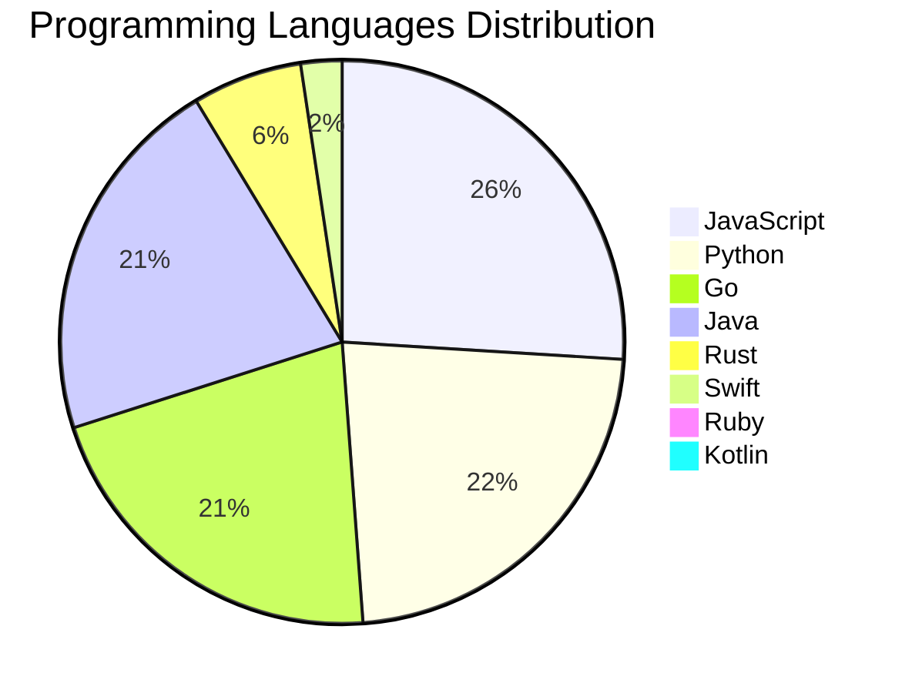

<div align="center">

# 📰 DevTech Auto News

**Your always-fresh digest of developer & AI tech news — curated automatically, around the clock.**


Aggregating [Dev.to](https://dev.to) · [Hacker News](https://news.ycombinator.com) · [GitHub Trending](https://github.com/trending) · [Lobste.rs](https://lobste.rs) · [Stack Overflow](https://stackoverflow.com) · [TechCrunch](https://techcrunch.com) · [freeCodeCamp](https://www.freecodecamp.org/news) — refreshed by GitHub Actions around the clock.

**[📰 Headlines](#-latest-headlines) · [💡 Interview Prep](#-interview-question-of-the-hour) · [📊 Statistics](#-statistics) · [⚙️ How It Works](#%EF%B8%8F-how-it-works)**

</div>

---

## 📰 Latest Headlines

> 🕐 Edition of **2026-09-03 17:00 CAT** — refreshed automatically, all day, every day.

### ✨ Featured Stories

<table>
<tr>
  <td align="center" width="33%">
    <a href="https://dev.to/devteam/introducing-community-gems-celebrating-human-curation-and-the-best-of-our-community-58c8">
      
      <br/>
      <b>💎 Introducing Community Gems: Celebrating Human C...</b>
    </a>
    <br/>
    <sub>Dev.to</sub>
  </td>
  <td align="center" width="33%">
    <a href="https://dev.to/googleai/how-to-write-reliable-rubrics-for-llm-as-a-judge-evaluations-ndp">
      
      <br/>
      <b>How to Write Reliable Rubrics for LLM-as-a-Judge E...</b>
    </a>
    <br/>
    <sub>Dev.to</sub>
  </td>
  <td align="center" width="33%">
    <a href="https://dev.to/googleai/what-is-harness-engineering-and-why-should-i-care-8n0">
      
      <br/>
      <b>What is harness engineering and why should I care?</b>
    </a>
    <br/>
    <sub>Dev.to</sub>
  </td>
</tr>
<tr>
  <td align="center" width="33%">
    <a href="https://dev.to/gde/overcoming-darts-single-inheritance-wall-composable-cubitsignalmixin-blocsignalmixin-in-flutter-43bf">
      
      <br/>
      <b>Overcoming Dart's Single Inheritance Wall: Composa...</b>
    </a>
    <br/>
    <sub>Dev.to</sub>
  </td>
  <td align="center" width="33%">
    <a href="https://dev.to/sloan/welcome-thread-v391-13l0">
      
      <br/>
      <b>Welcome Thread - v391</b>
    </a>
    <br/>
    <sub>Dev.to</sub>
  </td>
  <td align="center" width="33%">
    <a href="https://dev.to/gde/streamline-publishing-with-a-claude-code-skill-1bdn">
      
      <br/>
      <b>Streamline Publishing with a Claude Code Skill</b>
    </a>
    <br/>
    <sub>Dev.to</sub>
  </td>
</tr>
</table>


### 🗞️ Top Stories

| # | Headline | Source |
|---|----------|--------|
| 1 | [💎 Introducing Community Gems: Celebrating Human Curation and the Best of Our Community](https://dev.to/devteam/introducing-community-gems-celebrating-human-curation-and-the-best-of-our-community-58c8) | Dev.to |
| 2 | [How to Write Reliable Rubrics for LLM-as-a-Judge Evaluations](https://dev.to/googleai/how-to-write-reliable-rubrics-for-llm-as-a-judge-evaluations-ndp) | Dev.to |
| 3 | [What is harness engineering and why should I care?](https://dev.to/googleai/what-is-harness-engineering-and-why-should-i-care-8n0) | Dev.to |
| 4 | [Overcoming Dart's Single Inheritance Wall: Composable CubitSignalMixin & BlocSignalMixin in Flutter](https://dev.to/gde/overcoming-darts-single-inheritance-wall-composable-cubitsignalmixin-blocsignalmixin-in-flutter-43bf) | Dev.to |
| 5 | [Welcome Thread - v391](https://dev.to/sloan/welcome-thread-v391-13l0) | Dev.to |
| 6 | [Streamline Publishing with a Claude Code Skill](https://dev.to/gde/streamline-publishing-with-a-claude-code-skill-1bdn) | Dev.to |
| 7 | [Kubeflow Without Kubernetes? Deploy a Complete MLOps Suite in 60 Seconds with Gubernator](https://dev.to/gde/kubeflow-without-kubernetes-deploy-a-complete-mlops-suite-in-60-seconds-with-gubernator-3moo) | Dev.to |
| 8 | [Three Gemma 4 Deployments on One T4G for Under $3: What the Runtime Changes, and What It Doesn't](https://dev.to/gde/three-gemma-4-deployments-on-one-t4g-for-under-3-what-the-runtime-changes-and-what-it-doesnt-jo3) | Dev.to |
| 9 | [Two-step control plane upgrades in GKE: How minor version rollbacks work under the hood](https://dev.to/googlecloud/two-step-control-plane-upgrades-in-gke-how-minor-version-rollbacks-work-under-the-hood-i1l) | Dev.to |
| 10 | [Cross Cloud A2A Agent Card Field Comparison](https://dev.to/gde/cross-cloud-a2a-agent-card-field-comparison-2hod) | Dev.to |
| 11 | [Build Real-Time Client-Side TTS in Angular Using Firebase AI Logic and Gemini](https://dev.to/gde/build-real-time-client-side-tts-in-angular-using-firebase-ai-logic-and-gemini-37hc) | Dev.to |
| 12 | [The job description already changed. We're not coders anymore, but couriers.](https://dev.to/canro91/the-job-description-already-changed-were-not-coders-anymore-but-couriers-40eg) | Dev.to |
| 13 | [Preptember is here!! Plan a Fest for your local community.](https://blog.mlh.com/preptember-is-here-plan-a-fest-for-your-local-community-5ce3) | Dev.to |
| 14 | [Hearing the Mountain's Roar: How Antigravity CLI's AI Agents & IoT Data Track Volcanic Shockwaves](https://dev.to/gde/hearing-the-mountains-roar-how-antigravity-clis-ai-agents-iot-data-track-volcanic-shockwaves-13hp) | Dev.to |
| 15 | [How to Design AI Evaluations You Can Actually Trust](https://dev.to/googleai/how-to-design-ai-evaluations-you-can-actually-trust-41c3) | Dev.to |
| 16 | [Top 7 Featured DEV Posts of the Week](https://dev.to/devteam/top-7-featured-dev-posts-of-the-week-2aic) | Dev.to |
| 17 | [Step up to the Sheets: AI Eval Export and Illustrating Data](https://dev.to/googleai/step-up-to-the-sheets-ai-eval-export-and-illustrating-data-bak) | Dev.to |
| 18 | [Automate Flutter's New Split Package Migration with AI Agent Skills](https://dev.to/gde/automate-flutters-new-split-package-migration-with-ai-agent-skills-bn2) | Dev.to |
| 19 | [What Do You Do While AI Codes?](https://dev.to/anchildress1/what-do-you-do-while-ai-codes-k8k) | Dev.to |
| 20 | [Claude Fable 5.1 is now available on Agent Platform!](https://dev.to/googleai/claude-fable-51-is-now-available-on-agent-platform-1b16) | Dev.to |

<sub>Last fetched: Thu, 03 Sep 2026 17:01:03 CAT</sub>


---

## 💡 Interview Question of the Hour

> Sharpen your skills — new questions selected on every update. Try answering before opening the hint!

**1. `Python` — What is the difference between list and tuple in Python?**

&nbsp;&nbsp;&nbsp;&nbsp;🎯 Easy · 🏷 data structures, mutability

<details>
<summary>&nbsp;&nbsp;&nbsp;&nbsp;💡 Show hint</summary>

> Mutability, performance, use cases

</details>

**2. `Java` — What is the difference between abstract class and interface?**

&nbsp;&nbsp;&nbsp;&nbsp;🎯 Easy · 🏷 OOP, design

<details>
<summary>&nbsp;&nbsp;&nbsp;&nbsp;💡 Show hint</summary>

> Multiple inheritance, method implementation, use cases

</details>

**3. `SystemDesign` — How would you design a rate limiter?**

&nbsp;&nbsp;&nbsp;&nbsp;🎯 Medium · 🏷 system design, algorithms

<details>
<summary>&nbsp;&nbsp;&nbsp;&nbsp;💡 Show hint</summary>

> Token bucket, sliding window, distributed systems

</details>


---

## 📊 Statistics

#### 🗂 Articles by Category

| Category | Articles | Share | |
|----------|---------:|------:|---|
| **AI** | 65 | 42.2% | `████████████████████` |
| **Tools** | 35 | 22.7% | `███████████░░░░░░░░░` |
| **JavaScript** | 33 | 21.4% | `██████████░░░░░░░░░░` |
| **Python** | 29 | 18.8% | `█████████░░░░░░░░░░░` |
| **DevOps** | 16 | 10.4% | `█████░░░░░░░░░░░░░░░` |
| **Security** | 14 | 9.1% | `████░░░░░░░░░░░░░░░░` |
| **Cloud** | 12 | 7.8% | `████░░░░░░░░░░░░░░░░` |
| **WebDev** | 8 | 5.2% | `██░░░░░░░░░░░░░░░░░░` |
| **Mobile** | 8 | 5.2% | `██░░░░░░░░░░░░░░░░░░` |
| **Database** | 2 | 1.3% | `█░░░░░░░░░░░░░░░░░░░` |

<sub>Articles can match more than one category, so shares may sum to over 100%.</sub>


#### 📡 Articles by Source

| Source | Articles |
|--------|---------:|
| Dev.to | 30 |
| HackerNews | 49 |
| GitHub | 25 |
| Lobste.rs | 10 |
| StackOverflow | 20 |
| TechCrunch | 10 |
| freeCodeCamp | 10 |


#### 💻 Programming Language Trends

```
JavaScript      ██████████████████████████████ 25.6%
Python          ██████████████████████████ 22.5%
Go              ████████████████████████ 20.9%
Java            ████████████████████████ 20.9%
Rust            ███████ 6.2%
Swift           ███ 2.3%
Ruby            █ 0.8%
Kotlin          █ 0.8%

```




#### 🏷 Trending Topics

            


---

## ⚙️ How It Works

This repository is a fully automated news pipeline. On every run, GitHub Actions:

1. **Fetches** the latest articles from seven sources: Dev.to, Hacker News, GitHub Trending, Lobste.rs, Stack Overflow, TechCrunch, and freeCodeCamp
2. **Deduplicates and categorizes** them across 10+ topics using keyword matching
3. **Extracts cover images** and computes language & category statistics
4. **Rebuilds this README** and appends everything to the [full archive](./data/news_log.md)
5. **Commits and pushes** the result — no human intervention needed

<details>
<summary><b>🚀 Run it yourself</b></summary>

```bash
git clone https://github.com/Derrick-MUGISHA/github-activity-bot.git
cd github-activity-bot
npm install
npm start
```

Fork the repo, enable GitHub Actions, and you have your own self-updating news feed.

</details>

<details>
<summary><b>📚 Data & resources</b></summary>

- [Full news archive](./data/news_log.md) — complete history of every fetched article
- [Statistics](./data/stats.json) — raw stats data (JSON)
- [Categorized articles](./data/categorized.json) — articles grouped by topic
- [Interview question bank](./data/interview_questions.json) — the full question set

</details>

---

## 🤝 Contributing

Ideas for new sources, categories, or interview questions are welcome — [open an issue](https://github.com/Derrick-MUGISHA/github-activity-bot/issues/new) or submit a pull request.

## 📄 License

Released under the [MIT License](https://opensource.org/licenses/MIT) — free to use, fork, and modify.

---

<div align="center">
  <sub>🤖 Last automated update: <b>Thu, 03 Sep 2026 15:01:03 GMT</b></sub><br/>
  <sub>Powered by GitHub Actions · Built with ❤️ by <a href="https://github.com/Derrick-MUGISHA">Derrick MUGISHA</a></sub>
</div>
