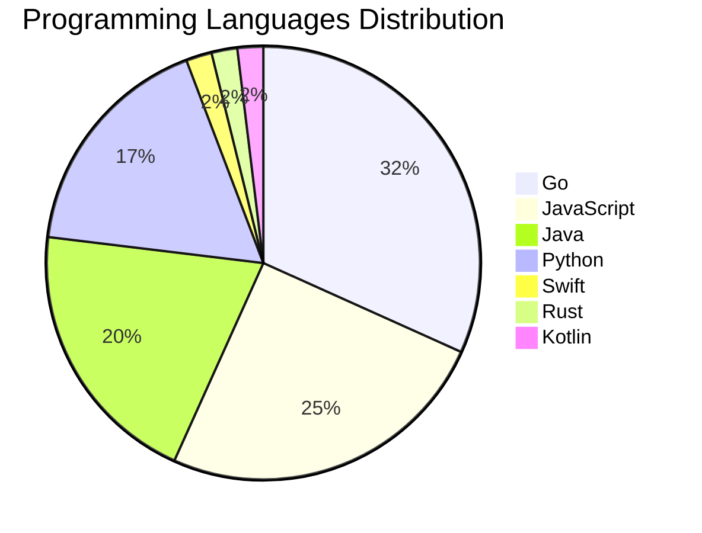

# 🚀 DevTech Auto News - Enhanced Edition


**DevTech Auto News Enhanced** is an advanced automated bot that aggregates trending topics in **AI**, **Web Development**, **Mobile**, **Cloud**, **DevOps**, and more from multiple sources including:

- 📰 [Dev.to](https://dev.to) - Developer community articles
- 🔥 [HackerNews](https://news.ycombinator.com) - Tech news discussions  
- 💻 [GitHub Trending](https://github.com/trending) - Trending repositories
- 🎯 Curated Interview Questions from multiple languages

## ✨ Features

✅ **Multi-Source Aggregation**: Combines articles from Dev.to, HackerNews, and GitHub  
✅ **Smart Categorization**: Automatically categorizes content into 10+ topics  
✅ **Image Support**: Displays cover images for visual appeal  
✅ **Pagination**: Fetches 50+ articles per update with deduplication  
✅ **Language Statistics**: Tracks programming language trends with charts  
✅ **Interview Questions**: Daily coding interview questions in multiple languages  
✅ **GitHub Actions**: Runs every 15 minutes automatically  

---

## 📊 Statistics Dashboard

### 📊 Articles by Category

**AI**: 🟦🟦🟦🟦🟦🟦🟦🟦🟦🟦🟦🟦🟦🟦🟦🟦🟦🟦🟦🟦 54 (51.9%)

**JavaScript**: 🟦🟦🟦🟦🟦🟦🟦🟦🟦🟦 26 (25.0%)

**Tools**: 🟦🟦🟦🟦🟦🟦🟦🟦 21 (20.2%)

**Python**: 🟦🟦🟦🟦🟦🟦🟦 18 (17.3%)

**Cloud**: 🟦🟦🟦🟦 12 (11.5%)

**WebDev**: 🟦🟦🟦 8 (7.7%)

**DevOps**: 🟦🟦 6 (5.8%)

**Mobile**: 🟦🟦 5 (4.8%)

**Security**: 🟦 4 (3.8%)

**Database**: 🟦 2 (1.9%)


### 📡 Sources

- **Dev.to**: 59 articles
- **HackerNews**: 30 articles
- **GitHub**: 15 articles


### 💻 Programming Language Trends

```
Go              ██████████████████████████████ 31.7 (31.7%)
JavaScript      ████████████████████████ 25.0 (25.0%)
Java            ███████████████████ 20.2 (20.2%)
Python          ████████████████ 17.3 (17.3%)
Swift           ██ 1.9 (1.9%)
Rust            ██ 1.9 (1.9%)
Kotlin          ██ 1.9 (1.9%)

```




### 🏷️ Trending Tags

               


---

## 🛠️ How It Works

1. **Multi-Source Fetch**: Pulls from Dev.to (2 pages), HackerNews (3 topics), GitHub (3 languages)
2. **Smart Filter**: Uses keyword matching across 10+ categories  
3. **Deduplication**: Removes duplicate URLs  
4. **Image Extraction**: Captures cover images when available  
5. **Statistics**: Generates language trends and category breakdowns  
6. **Update Files**: Regenerates README and appends to comprehensive log  

---

## 📦 Installation & Usage

```bash
# Clone the repository
git clone https://github.com/Derrick-MUGISHA/github-activity-bot.git
cd github-activity-bot

# Install dependencies  
npm install

# Run manually
npm start

# Test mode
npm run test
```

---


# 🚀 DevTech Auto News - Enhanced Edition

## 📅 Latest Updates (2026-06-13 12:00 CAT)


### 🖼️ Featured Articles

<table>
<tr>
  <td align="center" width="33%">
    <a href="https://dev.to/devteam/congrats-to-the-google-io-writing-challenge-winners-1364">
      
      <br/>
      <b>Congrats to the Google I/O 2026 Writing Challenge ...</b>
    </a>
    <br/>
    <sub>Dev.to</sub>
  </td>
  <td align="center" width="33%">
    <a href="https://dev.to/devteam/what-was-your-win-this-week-4k11">
      
      <br/>
      <b>What was your win this week?</b>
    </a>
    <br/>
    <sub>Dev.to</sub>
  </td>
  <td align="center" width="33%">
    <a href="https://dev.to/virtualcoffee/virtual-coffee-needs-your-help-46ih">
      
      <br/>
      <b>Virtual Coffee Needs Your Help</b>
    </a>
    <br/>
    <sub>Dev.to</sub>
  </td>
</tr>
<tr>
  <td align="center" width="33%">
    <a href="https://dev.to/devengers/dev-opportunity-radar-3-neo-scholars-a-2m-ai-challenge-and-an-85k-ai-fellowship-cjf">
      
      <br/>
      <b>Dev Opportunity Radar #3: Neo Scholars, a $2M AI C...</b>
    </a>
    <br/>
    <sub>Dev.to</sub>
  </td>
  <td align="center" width="33%">
    <a href="https://dev.to/klaudiagrz/celebrate-june-rituals-with-solstice-bingo-1al6">
      
      <br/>
      <b>Celebrate June rituals with Solstice Bingo!</b>
    </a>
    <br/>
    <sub>Dev.to</sub>
  </td>
  <td align="center" width="33%">
    <a href="https://dev.to/googleai/my-daughter-asked-if-developers-used-to-write-code-by-hand-but-it-was-the-follow-up-question-that-1bh8">
      
      <br/>
      <b>My daughter asked if developers used to write code...</b>
    </a>
    <br/>
    <sub>Dev.to</sub>
  </td>
</tr>
</table>


### 📰 Top Headlines

- [Congrats to the Google I/O 2026 Writing Challenge Winners!](https://dev.to/devteam/congrats-to-the-google-io-writing-challenge-winners-1364) _[Dev.to]_
- [What was your win this week?](https://dev.to/devteam/what-was-your-win-this-week-4k11) _[Dev.to]_
- [Virtual Coffee Needs Your Help](https://dev.to/virtualcoffee/virtual-coffee-needs-your-help-46ih) _[Dev.to]_
- [Dev Opportunity Radar #3: Neo Scholars, a $2M AI Challenge, and an $85K AI Fellowship](https://dev.to/devengers/dev-opportunity-radar-3-neo-scholars-a-2m-ai-challenge-and-an-85k-ai-fellowship-cjf) _[Dev.to]_
- [Celebrate June rituals with Solstice Bingo!](https://dev.to/klaudiagrz/celebrate-june-rituals-with-solstice-bingo-1al6) _[Dev.to]_
- [My daughter asked if developers used to write code by hand, but it was the follow-up question that surprised me.](https://dev.to/googleai/my-daughter-asked-if-developers-used-to-write-code-by-hand-but-it-was-the-follow-up-question-that-1bh8) _[Dev.to]_
- [IOS Midsommer Madness](https://dev.to/gde/ios-midsommer-madness-5h4) _[Dev.to]_
- [Why I still teach Singleton even though modules make it redundant](https://dev.to/dsheiko/why-i-still-teach-singleton-even-though-modules-make-it-redundant-1a7m) _[Dev.to]_
- [Resolving WSL Friction with Google Antigravity: the Agy 2.0 and Agy IDE Edition](https://dev.to/gde/resolving-wsl-friction-with-google-antigravity-the-agy-20-and-agy-ide-edition-59im) _[Dev.to]_
- [CSS 'overscroll-behavior' rubber banding: the right color behind the page when you pull it](https://dev.to/a-dev/css-overscroll-behavior-rubber-banding-the-right-color-behind-the-page-when-you-pull-it-47mj) _[Dev.to]_
- [Parallel AI Coding with Git Worktrees: Run Multiple Agents Without Conflicts](https://dev.to/jsmanifest/parallel-ai-coding-with-git-worktrees-run-multiple-agents-without-conflicts-11na) _[Dev.to]_
- [CSS – only a Nerdy Hobby?](https://dev.to/ingosteinke/css-only-a-nerdy-hobby-17hf) _[Dev.to]_
- [Aligning images to a baseline grid with modern CSS](https://dev.to/simoncoudeville/aligning-images-to-a-baseline-grid-with-modern-css-5fi4) _[Dev.to]_
- [Building Knowledge Graphs with Gemini](https://dev.to/googleai/building-knowledge-graphs-with-gemini-3ail) _[Dev.to]_
- [Designing an Expiring-Points System on an RDBMS (with Benchmarks)](https://dev.to/matsubo/designing-an-expiring-points-system-on-an-rdbms-with-benchmarks-5hk1) _[Dev.to]_
- [Strict CSP Meets Prerendered HTML: A Next.js App Router Deep Dive](https://dev.to/tonalmathew/strict-csp-meets-prerendered-html-a-nextjs-app-router-deep-dive-18b9) _[Dev.to]_
- [The AI Addiction Nobody Is Talking About](https://dev.to/znsstudio/the-ai-addiction-nobody-is-talking-about-2of8) _[Dev.to]_
- [Lessons Learned: Deployment Trade-offs with Gemma4, NVIDIA L4, Cloud Run, and Antigravity CLI](https://dev.to/gde/lessons-learned-deployment-trade-offs-with-gemma4-nvidia-l4-cloud-run-and-antigravity-cli-lnl) _[Dev.to]_
- [Your Vibe-Coded App Works. Is It Any Good?](https://dev.to/mlh/your-vibe-coded-app-works-is-it-any-good-28co) _[Dev.to]_
- [Connecting GCP Budget Alerts to AppSheet: A Step-by-Step Guide](https://dev.to/gde/connecting-gcp-budget-alerts-to-appsheet-a-step-by-step-guide-4pda) _[Dev.to]_

_Last automated update: Sat, 13 Jun 2026 12:56:35 CAT_


## 💡 Daily Interview Questions

_Sharpen your skills with these curated questions_

### 1. React: How would you optimize a React app's performance?

**Difficulty**: Hard | **Topics**: optimization, performance

<details>
<summary>💡 Hint</summary>

React.memo, useMemo, useCallback, code splitting, lazy loading

</details>

### 2. DataStructures: Find the median of two sorted arrays

**Difficulty**: Hard | **Topics**: arrays, binary search

<details>
<summary>💡 Hint</summary>

Binary search, partition, time complexity O(log(min(m,n)))

</details>

### 3. DataStructures: Implement a function to reverse a linked list

**Difficulty**: Medium | **Topics**: linked lists, pointers

<details>
<summary>💡 Hint</summary>

Iterative or recursive, three pointers

</details>


---

## 📚 Resources

- [Full News Archive](./data/news_log.md) - Complete history of all fetched articles
- [Statistics JSON](./data/stats.json) - Raw statistics data
- [Categorized Data](./data/categorized.json) - Articles organized by category
- [Interview Questions](./data/interview_questions.json) - Complete question bank

---

## 🤝 Contributing

Want to add more sources, categories, or interview questions? Feel free to:

1. Fork this repository
2. Add your improvements
3. Submit a pull request

---

## 📄 License

MIT License - Feel free to use and modify!

---

<p align="center">
  <b>Last automated update: Sat, 13 Jun 2026 10:56:35 GMT</b><br/>
  <sub>Powered by GitHub Actions | Made with ❤️ for developers</sub>
</p>

---

## 🔗 Quick Links

- [View Workflow](https://github.com/Derrick-MUGISHA/github-activity-bot/actions)
- [Report Issue](https://github.com/Derrick-MUGISHA/github-activity-bot/issues)
- [Suggest Feature](https://github.com/Derrick-MUGISHA/github-activity-bot/issues/new)
